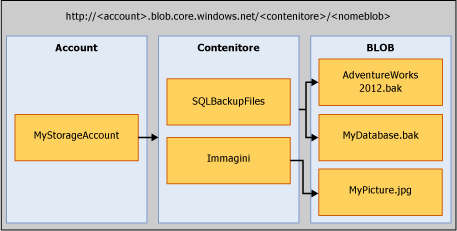

# <a name="sql-server-backup-to-url"></a>Backup di SQL Server nell'URL
[!INCLUDE[tsql-appliesto-ss2016-xxxx-xxxx-xxx_md](../../includes/tsql-appliesto-ss2016-xxxx-xxxx-xxx-md.md)]

  Questo argomento illustra i concetti, i requisiti e i componenti necessari per usare il servizio di archiviazione BLOB di Microsoft Azure come destinazione backup. La funzionalità di backup e ripristino è uguale o simile a quella delle opzioni DISK e TAPE, con alcune differenze. Nell'argomento sono descritte le differenze e sono inclusi alcuni esempi di codice.  
  
## <a name="requirements-components-and-concepts"></a>Requisiti, componenti e concetti  
 **Contenuto della sezione:**  
  
-   [Sicurezza](#security)  
  
-   [Introduzione ai componenti e ai concetti chiave](#intorkeyconcepts)  
  
-   [Servizio di archiviazione BLOB di Microsoft Azure](#Blob)  
  
-   [Componenti di SQL Server](#sqlserver)  
  
-   [Limitazioni](#limitations)  
  
-   [Supporto per le istruzioni di backup/ripristino](#Support)  
  
-   [Utilizzo dell'attività di backup in SQL Server Management Studio](../../relational-databases/backup-restore/sql-server-backup-to-url.md#BackupTaskSSMS)  
  
-   [Backup di SQL Server nell'URL tramite la Creazione guidata piano di manutenzione](../../relational-databases/backup-restore/sql-server-backup-to-url.md#MaintenanceWiz)  
  
-   [Ripristino dal servizio di archiviazione Windows Azure mediante SQL Server Management Studio](../../relational-databases/backup-restore/sql-server-backup-to-url.md#RestoreSSMS)  
  
###  <a name="security"></a> Sicurezza  
 Di seguito sono riportati requisiti e considerazioni sulla sicurezza per l'esecuzione del backup o del ripristino nel servizio di archiviazione BLOB di Microsoft Azure.  
  
-   Quando si crea un contenitore per il servizio di archiviazione BLOB di Microsoft Azure, è consigliabile impostare l'accesso su **privato**. In questo modo si limita l'accesso agli utenti o account in grado di fornire le informazioni necessarie per l'autenticazione per l'account di Windows Azure.  
  
    > [!IMPORTANT]  
    >  [!INCLUDE[ssNoVersion](../../includes/ssnoversion-md.md)] è necessario un nome account e l'autenticazione della chiave di accesso di Microsoft Azure, oppure una firma di accesso condiviso e un token di accesso siano archiviati nelle credenziali di [!INCLUDE[ssNoVersion](../../includes/ssnoversion-md.md)] . Queste informazioni servono per eseguire l'autenticazione all'account Microsoft Azure per operazioni di backup o ripristino.  
  
-   All'account utente usato per eseguire i comandi BACKUP o RESTORE deve essere associato il ruolo del database **db_backup operator** con autorizzazioni **Modifica qualsiasi credenziale** .  
  
###  <a name="intorkeyconcepts"></a> Introduzione ai componenti e ai concetti chiave  
 Nelle due sezioni seguenti vengono illustrati il servizio di archiviazione BLOB di Microsoft Azure e i componenti di [!INCLUDE[ssNoVersion](../../includes/ssnoversion-md.md)] usati durante l'esecuzione di operazioni di backup o ripristino nel servizio di archiviazione BLOB di Microsoft Azure. È importante comprendere i componenti e la loro interazione per eseguire operazioni di backup o ripristino nel servizio di archiviazione BLOB di Microsoft Azure.  
  
 Il primo passo in questo processo consiste nella creazione di un account di archiviazione di Microsoft Azure nella sottoscrizione di Azure. Questo account di archiviazione è un account amministrativo con autorizzazioni amministrative complete per tutti i contenitori e gli oggetti creati con tale account. [!INCLUDE[ssNoVersion](../../includes/ssnoversion-md.md)] può usare il nome dell'account di archiviazione di Microsoft Azure e il relativo valore della chiave di accesso per eseguire l'autenticazione, scrivere e leggere i BLOB nel servizio di archiviazione BLOB di Microsoft Azure oppure usare un token di firma di accesso condiviso generato per contenitori specifici che conceda diritti di lettura e scrittura. Per altre informazioni sugli account di archiviazione di Azure, vedere [Informazioni sugli account di archiviazione di Azure](http://azure.microsoft.com/en-us/documentation/articles/storage-create-storage-account/) . Per altre informazioni sulle firme di accesso condiviso, vedere [Firme di accesso condiviso, parte 1: conoscere il modello di firma di accesso condiviso](http://azure.microsoft.com/en-us/documentation/articles/storage-dotnet-shared-access-signature-part-1/). Le credenziali di [!INCLUDE[ssNoVersion](../../includes/ssnoversion-md.md)] , tramite cui vengono archiviate queste informazioni di autenticazione, vengono utilizzate durante le operazioni di backup o ripristino.  
  
###  <a name="Blob"></a> Servizio di archiviazione BLOB di Microsoft Azure  
 **Account di archiviazione:** questo account è il punto di partenza per tutti i servizi di archiviazione. Per accedere al servizio di archiviazione BLOB di Microsoft Azure, creare prima un account di archiviazione di Microsoft Azure. Per altre informazioni, vedere la pagina relativa alla [creazione degli account di archiviazione](http://azure.microsoft.com/en-us/documentation/articles/storage-create-storage-account/).  
  
 **Contenitore:** un contenitore raggruppa un set di BLOB e può archiviare un numero illimitato di BLOB. Per scrivere un backup di [!INCLUDE[ssNoVersion](../../includes/ssnoversion-md.md)] nel servizio di archiviazione BLOB di Microsoft Azure, è necessario aver creato almeno il contenitore radice. È possibile generare un token di firma di accesso condiviso in un contenitore e concedere l'accesso agli oggetti in un solo contenitore specifico.  
  
 **BLOB:** file di qualsiasi tipo e dimensioni. Esistono due tipi di BLOB che è possibile archiviare nel servizio di archiviazione BLOB di Microsoft Azure: BLOB in blocchi e di pagine. [!INCLUDE[ssNoVersion](../../includes/ssnoversion-md.md)] il backup può usare l'uno o l'altro dei tipi di BLOB, a seconda della sintassi Transact-SQL usata. I BLOB sono indirizzabili tramite questo formato di URL: https://\<account di archiviazione>.blob.core.windows.net/\<contenitore>/\<blob>. Per altre informazioni sul servizio di archiviazione BLOB di Microsoft Azure, vedere [Introduzione all'archivio BLOB di Azure con .NET](http://www.windowsazure.com/develop/net/how-to-guides/blob-storage/). Per altre informazioni sui BLOB di pagine e in blocco, vedere [Informazioni sui Blob in blocchi, sui BLOB di aggiunta e sui BLOB di pagine](http://msdn.microsoft.com/library/windowsazure/ee691964.aspx).  
  
   
  
 **Snapshot di Azure:** uno snapshot di un BLOB di Azure acquisito in un momento preciso. Per altre informazioni, vedere [Creazione di uno snapshot di un BLOB](https://msdn.microsoft.com/library/azure/hh488361.aspx). [!INCLUDE[ssNoVersion](../../includes/ssnoversion-md.md)] ore supporta i backup di Azure degli snapshot dei file di database archiviati nel servizio di archiviazione BLOB di Microsoft Azure. Per altre informazioni, vedere [Backup di snapshot di file per i file di database in Azure](../../relational-databases/backup-restore/file-snapshot-backups-for-database-files-in-azure.md).  
  
###  <a name="sqlserver"></a> [!INCLUDE[ssNoVersion](../../includes/ssnoversion-md.md)] Components  
 **URL:** tramite un URL viene specificato un URI (Uniform Resource Identifier) in un file di backup univoco. L'URL viene utilizzato per specificare il percorso e il nome del file di backup di [!INCLUDE[ssNoVersion](../../includes/ssnoversion-md.md)] . L'URL deve puntare a un BLOB effettivo, non solo a un contenitore. Se il BLOB non è disponibile, viene creato. Se viene specificato un BLOB esistente, l'operazione di backup non viene completata, a meno che non sia stata specificata l'opzione "WITH FORMAT" per sovrascrivere il file di backup esistente nel BLOB.  
  
 Questo è un valore URL di esempio: http[s]://NOMEACCOUNT.blob.core.windows.net/\<CONTENITORE>/\<NOMEFILE.bak>. Anche se non richiesto, è consigliabile utilizzare HTTPS.  
  
 **Credenziale:** una credenziale di [!INCLUDE[ssNoVersion](../../includes/ssnoversion-md.md)] è un oggetto utilizzato per archiviare le informazioni di autenticazione necessarie per connettersi a una risorsa all'esterno di SQL Server. In questo caso, nei processi di backup e ripristino di [!INCLUDE[ssNoVersion](../../includes/ssnoversion-md.md)] vengono usate le credenziali per l'autenticazione al servizio di archiviazione BLOB di Microsoft Azure, nonché ai contenitori e agli oggetti dei BLOB relativi. Nelle credenziali sono archiviati il nome dell'account di archiviazione e i valori della **chiave di accesso** dell'account di archiviazione, o l'URL del contenitore e il relativo token di firma di accesso condiviso. Una volta create le credenziali, la sintassi delle istruzioni BACKUP/RESTORE determina il tipo di BLOB e le credenziali necessarie.  
  
 Per un esempio di come creare una firma di accesso condiviso, vedere gli esempi in [Creare una firma di accesso condiviso](../../relational-databases/backup-restore/sql-server-backup-to-url.md#SAS) , più avanti in questo argomento e per creare le credenziali di [!INCLUDE[ssNoVersion](../../includes/ssnoversion-md.md)] , vedere gli esempi in [Creare credenziali](../../relational-databases/backup-restore/sql-server-backup-to-url.md#credential) , più avanti in questo argomento.  
  
 Per informazioni generali sulle credenziali, vedere [Credenziali](http://msdn.microsoft.com/library/ms161950.aspx)  
  
 Per informazioni su altri esempi in cui vengono usate le credenziali, vedere [Creazione di un proxy di SQL Server Agent](http://msdn.microsoft.com/library/ms175834.aspx).  
  
###  <a name="limitations"></a> Limitazioni  
  
-   Il backup in Archiviazione Premium non è supportato.  
  
-   Le dimensioni massime di backup supportate usando un BLOB di pagine sono limitate dalle dimensioni massime di un BLOB di pagina singolo, ossia 1 TB. Le dimensioni massime di backup supportate tramite i BLOB in blocchi non sono limitate dalle dimensioni massime di un BLOB in blocchi, pari a 200 GB, poiché questo tipo di backup supporta lo striping che consente backup di notevoli dimensioni.  
  
-   È possibile eseguire istruzioni di backup o ripristino tramite TSQL, SMO, cmdlet PowerShell, SQL Server Management Studio Backup o Ripristino guidato.   
  
-   La creazione di un nome di dispositivo logico non è supportata. Di conseguenza, non è supportata neanche l'aggiunta di un URL come dispositivo di backup tramite sp_dumpdevice o SQL Server Management Studio.  
  
-   L'accodamento ai BLOB di backup esistenti non è supportato. I backup in un BLOB esistente possono essere sovrascritti solo tramite l'opzione **WITH FORMAT** . Quando si usano i backup con snapshot di file (usando l'argomento **WITH FILE_SNAPSHOT** ) tuttavia, l'argomento **WITH FORMAT** non è consentito per evitare di lasciare snapshot di file orfani creati con il backup con snapshot di file originale.  
  
-   Il backup in più BLOB in un'unica operazione è supportato solo tramite i BLOB in blocchi e un token di firma di accesso condiviso, anziché con la chiave dell'account di archiviazione per le credenziali SQL.  
  
-   L'impostazione di **BLOCKSIZE** non è supportata per i BLOB di pagine. 
  
-   L'impostazione di **MAXTRANSFERSIZE** non è supportata per i BLOB di pagine. 
  
-   La specifica delle opzioni del set di backup, **RETAINDAYS** ed **EXPIREDATE** , non è supportata.  
  
-   [!INCLUDE[ssNoVersion](../../includes/ssnoversion-md.md)] è previsto un limite massimo di 259 caratteri per il nome di un dispositivo di backup. BACKUP TO URL usa 36 caratteri per gli elementi necessari usati per specificare l'URL 'https://.blob.core.windows.net//.bak', lasciando 223 caratteri per l'account, il contenitore e i nomi BLOB insieme.  
  
###  <a name="Support"></a> Supporto per le istruzioni di backup/ripristino  
  
|Istruzione di backup/ripristino|Supportato|Eccezioni|Commenti|
|-|-|-|-|
|BACKUP|√|BLOCKSIZE e MAXTRANSFERSIZE sono supportati per i BLOB in blocchi. Non sono supportati per i BLOB di pagine. | Per usare BACKUP per un BLOB in blocchi è necessaria una firma di accesso condiviso salvata in una credenziale di SQL Server. Per usare BACKUP per un BLOB di pagine è necessaria la chiave dell'account di archiviazione salvata in una credenziale di [!INCLUDE[ssNoVersion](../../includes/ssnoversion-md.md)] e occorre che sia specificato l'argomento WITH CREDENTIAL.|  
|RESTORE|√||Richiede che siano state definite credenziali [!INCLUDE[ssNoVersion](../../includes/ssnoversion-md.md)] nelle quali venga specificato l'argomento WITH CREDENTIAL se le credenziali [!INCLUDE[ssNoVersion](../../includes/ssnoversion-md.md)] sono state definite tramite la chiave dell'account di archiviazione come segreto|  
|RESTORE FILELISTONLY|√||Richiede che siano state definite credenziali [!INCLUDE[ssNoVersion](../../includes/ssnoversion-md.md)] nelle quali venga specificato l'argomento WITH CREDENTIAL se le credenziali [!INCLUDE[ssNoVersion](../../includes/ssnoversion-md.md)] sono state definite tramite la chiave dell'account di archiviazione come segreto|  
|RESTORE HEADERONLY|√||Richiede che siano state definite credenziali [!INCLUDE[ssNoVersion](../../includes/ssnoversion-md.md)] nelle quali venga specificato l'argomento WITH CREDENTIAL se le credenziali [!INCLUDE[ssNoVersion](../../includes/ssnoversion-md.md)] sono state definite tramite la chiave dell'account di archiviazione come segreto|  
|RESTORE LABELONLY|√||Richiede che siano state definite credenziali [!INCLUDE[ssNoVersion](../../includes/ssnoversion-md.md)] nelle quali venga specificato l'argomento WITH CREDENTIAL se le credenziali [!INCLUDE[ssNoVersion](../../includes/ssnoversion-md.md)] sono state definite tramite la chiave dell'account di archiviazione come segreto|  
|RESTORE VERIFYONLY|√||Richiede che siano state definite credenziali [!INCLUDE[ssNoVersion](../../includes/ssnoversion-md.md)] nelle quali venga specificato l'argomento WITH CREDENTIAL se le credenziali [!INCLUDE[ssNoVersion](../../includes/ssnoversion-md.md)] sono state definite tramite la chiave dell'account di archiviazione come segreto|  
|RESTORE REWINDONLY|−|||  
  
 Per la sintassi e informazioni generali sulle istruzioni di backup, vedere [BACKUP &#40;Transact-SQL&#41;](../../t-sql/statements/backup-transact-sql.md).  
  
 Per la sintassi e informazioni generali sulle istruzioni di ripristino, vedere [RESTORE &#40;Transact-SQL&#41;](../../t-sql/statements/restore-statements-transact-sql.md).  
  
### <a name="support-for-backup-arguments"></a>Supporto per gli argomenti dell'istruzione BACKUP  

|Argomento|Supportato|Eccezione|Commenti|  
|-|-|-|-|  
|DATABASE|√|||  
|LOG|√|||  
||  
|TO (URL)|√|Diversamente da DISK e TAPE, l'URL non supporta la specifica o la creazione di un nome logico.|Questo argomento viene utilizzato per specificare il percorso URL del file di backup.|  
|MIRROR TO|√|||  
|**OPZIONI WITH:**||||  
|CREDENTIAL|√||WITH CREDENTIAL è supportato solo quando si usa l'opzione BACKUP TO URL per il backup nel servizio di archiviazione BLOB di Microsoft Azure e solo se le credenziali [!INCLUDE[ssNoVersion](../../includes/ssnoversion-md.md)] sono state definite tramite la chiave dell'account di archiviazione come segreto|  
|FILE_SNAPSHOT|√|||  
|ENCRYPTION|√||Quando è specificato l'argomento **WITH ENCRYPTION** , il backup con snapshot di file di [!INCLUDE[ssNoVersion](../../includes/ssnoversion-md.md)] verifica che l'intero database sia stato crittografato con TDE prima dell'esecuzione del backup e, in caso affermativo, crittografa il file di backup con snapshot di file stesso usando l'algoritmo specificato per TDE sul database. Se tutti i dati del database, in tutto il database, non sono stati crittografati, il backup non verrà completato (ad esempio, se il processo di crittografia non è ancora stato completato).|  
|DIFFERENTIAL|√|||  
|COPY_ONLY|√|||  
|COMPRESSION&#124;NO_COMPRESSION|√|Non supportato per il backup con snapshot di file||  
|DESCRIPTION|√|||  
|NAME|√|||  
|EXPIREDATE &#124; RETAINDAYS|−|||  
|NOINIT &#124; INIT|−||L'accodamento ai BLOB non è consentito. Per sovrascrivere un backup, usare l'argomento **WITH FORMAT** . Quando si usano i backup con snapshot di file (usando l'argomento **WITH FILE_SNAPSHOT** ) tuttavia, l'argomento **WITH FORMAT** non è consentito per evitare di lasciare snapshot di file orfani creati con il backup originale.|  
|NOSKIP &#124; SKIP|−|||  
|NOFORMAT &#124; FORMAT|√||Un backup eseguito in un BLOB esistente non viene completato a meno che non venga specificato **WITH FORMAT** . Il BLOB esistente viene sovrascritto quando viene specificato **WITH FORMAT** . Quando si usano i backup con snapshot di file (usando l'argomento **WITH FILE_SNAPSHOT** ) tuttavia, l'argomento FORMAT non è consentito per evitare di lasciare snapshot di file orfani creati con il backup con snapshot di file originale. Quando si usano i backup con snapshot di file (usando l'argomento **WITH FILE_SNAPSHOT** ) tuttavia, l'argomento **WITH FORMAT** non è consentito per evitare di lasciare snapshot di file orfani creati con il backup originale.|  
|MEDIADESCRIPTION|√|||  
|MEDIANAME|√|||  
|BLOCKSIZE|√|Non supportati per i BLOB di pagine. Supportati per i BLOB in blocchi.| Si consiglia BLOCKSIZE=65536 per ottimizzare l'uso dei 50.000 blocchi consentiti in un BLOB in blocchi. |  
|BUFFERCOUNT|√|||  
|MAXTRANSFERSIZE|√|Non supportati per i BLOB di pagine. Supportati per i BLOB in blocchi.| Il valore predefinito è 1048576. Il valore può arrivare fino a 4 MB con incrementi di 65536 byte.</br> Si consiglia MAXTRANSFERSIZE=4194304 per ottimizzare l'uso dei 50.000 blocchi consentiti in un BLOB in blocchi. |  
|NO_CHECKSUM &#124; CHECKSUM|√|||  
|STOP_ON_ERROR &#124; CONTINUE_AFTER_ERROR|√|||  
|STATS|√|||  
|REWIND &#124; NOREWIND|−|||  
|UNLOAD &#124; NOUNLOAD|−|||  
|NORECOVERY &#124; STANDBY|√|||  
|NO_TRUNCATE|√|||  
  
 Per altre informazioni sugli argomenti di backup, vedere [BACKUP &#40;Transact-SQL&#41;](../../t-sql/statements/backup-transact-sql.md).  
  
### <a name="support-for-restore-arguments"></a>Supporto per gli argomenti dell'istruzione RESTORE  
  
|Argomento|Supportato|Eccezioni|Commenti|  
|-|-|-|-|  
|DATABASE|√|||  
|LOG|√|||  
|FROM (URL)|√||L'argomento FROM URL viene utilizzato per specificare il percorso URL del file di backup.|  
|**WITH Options:**||||  
|CREDENTIAL|√||WITH CREDENTIAL è supportato solo quando si usa l'opzione RESTORE FROM URL per eseguire il ripristino dal servizio di archiviazione BLOB di Microsoft Azure.|  
|PARTIAL|√|||  
|RECOVERY &#124; NORECOVERY &#124; STANDBY|√|||  
|LOADHISTORY|√|||  
|MOVE|√|||  
|REPLACE|√|||  
|RESTART|√|||  
|RESTRICTED_USER|√|||  
|FILE|−|||  
|PASSWORD|√|||  
|MEDIANAME|√|||  
|MEDIAPASSWORD|√|||  
|BLOCKSIZE|√|||  
|BUFFERCOUNT|−|||  
|MAXTRANSFERSIZE|−|||  
|CHECKSUM &#124; NO_CHECKSUM|√|||  
|STOP_ON_ERROR &#124; CONTINUE_AFTER_ERROR|√|||  
|FILESTREAM|√|Non supportato per il backup con snapshot di file||  
|STATS|√|||  
|REWIND &#124; NOREWIND|−|||  
|UNLOAD &#124; NOUNLOAD|−|||  
|KEEP_REPLICATION|√|||  
|KEEP_CDC|√|||  
|ENABLE_BROKER &#124; ERROR_BROKER_CONVERSATIONS &#124; NEW_BROKER|√|||  
|STOPAT &#124; STOPATMARK &#124; STOPBEFOREMARK|√|||  
  
 Per altre informazioni sugli argomenti di ripristino, vedere [Argomenti dell'istruzione RESTORE &#40;Transact-SQL&#41;](../../t-sql/statements/restore-statements-arguments-transact-sql.md).  
  
##  <a name="BackupTaskSSMS"></a> Uso dell'attività di backup in SQL Server Management Studio  
È possibile eseguire il backup di un database in un URL tramite l'attività di backup in SQL Server Management Studio e credenziali SQL Server.  
  
> [!NOTE]  
>  Per creare un backup con snapshot di file di [!INCLUDE[ssNoVersion](../../includes/ssnoversion-md.md)] o sovrascrivere un set di supporti esistente, è necessario usare Transact-SQL, PowerShell o C# anziché l'attività di backup in SQL Server Management Studio.  
  
 Nei passaggi seguenti vengono descritte le modifiche apportate all'attività di backup di database in SQL Server Management Studio per consentire il backup nel servizio di archiviazione di Microsoft Azure:  
  
1.  In **Esplora oggetti**connettersi a un'istanza del motore di database di SQL Server e, successivamente, espanderla.

2.  Espandere **Database**, fare clic con il pulsante destro del mouse sul database desiderato, scegliere **Attività**e quindi fare clic su **Copia database**.
  
3.  Nella pagina **Generale** nella sezione **Destinazione** è disponibile l'opzione **URL** nell'elenco a discesa **Backup in:** .  L'opzione **URL** è usata per creare un backup nel servizio di archiviazione Microsoft Azure. Fare clic su **Aggiungi** Verrà aperta la finestra di dialogo **Selezionare la destinazione di backup**
   
    1.  **Contenitore di Archiviazione di Azure:** nome del contenitore del servizio di archiviazione Microsoft Azure in cui archiviare i file di backup.  Selezionare un contenitore esistente nell'elenco a discesa o immetterlo manualmente. 
  
    2.  **Criteri di accesso condiviso:** immettere la firma di accesso condiviso per un contenitore immesso manualmente.  Questo campo non è disponibile se è stato scelto un contenitore esistente. 
  
    3.  **File di backup** : nome del file di backup.
    
    4.  **Nuovo contenitore:** usato per registrare un contenitore esistente per il quale non si ha una firma di accesso condiviso.  Vedere [Connettersi a una sottoscrizione di Microsoft Azure](../../relational-databases/backup-restore/connect-to-a-microsoft-azure-subscription.md).
  
> [!NOTE] 
>  **Aggiungi** supporta più file di backup e i contenitori di archiviazione per un singolo set di supporti.
  
 Quando si seleziona un **URL** come destinazione, alcune opzioni nella pagina **Opzioni supporti** vengono disabilitate.  Negli argomenti seguenti vengono fornite ulteriori informazioni sulla finestra di dialogo Backup database:  
  
 [Backup database &#40;pagina Generale&#41;](../../relational-databases/backup-restore/back-up-database-general-page.md)  
  
 [Back Up Database &#40;pagina Opzioni supporti&#41;](../../relational-databases/backup-restore/back-up-database-media-options-page.md)  
  
 [Backup database &#40;pagina Opzioni di backup&#41;](../../relational-databases/backup-restore/back-up-database-backup-options-page.md)  
  
 [Creare le credenziali - Eseguire l'autenticazione nel servizio di archiviazione Azure](../../relational-databases/backup-restore/create-credential-authenticate-to-azure-storage.md)  
  
##  <a name="MaintenanceWiz"></a> Backup di SQL Server nell'URL tramite la Creazione guidata piano di manutenzione  
 Analogamente all'attività di backup descritta in precedenza, la Creazione guidata piano di manutenzione in SQL Server Management Studio include l' **URL** come una delle opzioni di destinazione e altri oggetti di supporto necessari per eseguire il backup nel servizio di archiviazione di Microsoft Azure, ad esempio le credenziali SQL. Per altre informazioni, vedere la sezione sulla **definizione delle attività di backup** in [Using Maintenance Plan Wizard](../../relational-databases/maintenance-plans/use-the-maintenance-plan-wizard.md#SSMSProcedure).  
  
> [!NOTE]  
>  Per creare un set di backup con striping, un backup con snapshot di file di [!INCLUDE[ssNoVersion](../../includes/ssnoversion-md.md)] o credenziali SQL tramite un token di accesso condiviso, è necessario usare Transact-SQL, PowerShell o C# anziché l'attività di backup in Creazione guidata piano di manutenzione.  
  
##  <a name="RestoreSSMS"></a> Ripristino dal servizio di archiviazione Microsoft Azure tramite SQL Server Management Studio  
L'attività Ripristina database include **URL** come dispositivo da cui eseguire il ripristino.  I passaggi seguenti descrivono come usare l'attività di ripristino per eseguire il ripristino dal servizio di archiviazione BLOB di Microsoft Azure: 
  
1.  Fare clic con il pulsante destro del mouse su **Database** e scegliere **Ripristina database....**. 
  
2.  Nella pagina **Generale** selezionare **Dispositivo** nella sezione **Origine** .
  
3.  Fare clic sul pulsante Sfoglia (...) per aprire la finestra di dialogo **Seleziona dispositivi di backup** . 

4.  Selezionare **URL** dall'elenco a discesa **Tipo di supporti di backup:** .  Fare clic su **Aggiungi** per aprire la finestra di dialogo **Selezionare un percorso del file di backup** .

    1.  **Contenitore di Archiviazione di Azure:** nome completo del contenitore del servizio di archiviazione Microsoft Azure che contiene i file di backup.  Selezionare un contenitore esistente nell'elenco a discesa o immettere manualmente il nome completo del contenitore.
      
    2.  **Firma di accesso condiviso:**  usata per immettere la firma di accesso condiviso per il contenitore designato.
      
    3.  **Aggiungi:**  usato per registrare un contenitore esistente per il quale non si ha una firma di accesso condiviso.  Vedere [Connettersi a una sottoscrizione di Microsoft Azure](../../relational-databases/backup-restore/connect-to-a-microsoft-azure-subscription.md).
      
    4.  **OK:** SQL Server si connette al servizio di archiviazione Microsoft Azure tramite le credenziali SQL specificate e apre la finestra di dialogo **Trova file di backup in Microsoft Azure**. In questa pagina vengono visualizzati i file di backup che si trovano nel contenitore di archiviazione. Selezionare il file che si desidera ripristinare, quindi fare clic su **OK**. Viene visualizzata di nuovo la finestra di dialogo **Seleziona dispositivi di backup** . Se si fa clic su **OK** in questa finestra di dialogo, viene visualizzata di nuovo la finestra di dialogo principale **Ripristina** in cui sarà possibile completare il ripristino. 
  
     [Ripristina database &#40;pagina Generale&#41;](../../relational-databases/backup-restore/restore-database-general-page.md)  
  
     [Ripristina database &#40;pagina File&#41;](../../relational-databases/backup-restore/restore-database-files-page.md)  
  
     [Ripristina database &#40;pagina Opzioni&#41;](../../relational-databases/backup-restore/restore-database-options-page.md)  
  
##  <a name="Examples"></a> Esempi di codice  
 In questa sezione sono disponibili gli esempi riportati di seguito.  
  
-   [Creare credenziali](#credential)  
  
-   [Backup di un database completo](#complete)  
    
-   [Ripristino temporizzato tramite STOPAT](#PITR)  
  
> [!NOTE]  
>  Per un'esercitazione sull'uso di SQL Server 2016 con il servizio di archiviazione BLOB di Microsoft Azure, vedere [Esercitazione: Uso del servizio di archiviazione BLOB di Windows Azure con i database di SQL Server 2016](../tutorial-use-azure-blob-storage-service-with-sql-server-2016.md)  
  
###  <a name="SAS"></a> Creare una firma di accesso condiviso  
 Nell'esempio seguente vengono create firme di accesso condiviso che possono essere usate per creare credenziali di [!INCLUDE[ssNoVersion](../../includes/ssnoversion-md.md)] in un nuovo contenitore. Questo script crea una firma di accesso condiviso associata ai criteri di accesso archiviati. Per altre informazioni, vedere [Firme di accesso condiviso, parte 1: conoscere il modello di firma di accesso condiviso](http://azure.microsoft.com/en-us/documentation/articles/storage-dotnet-shared-access-signature-part-1/). Questo esempio richiede Microsoft Azure PowerShell. Per altre informazioni sull'installazione e l'uso di PowerShell, vedere [Come installare e configurare Azure PowerShell](https://azure.microsoft.com/documentation/articles/powershell-install-configure/).  

> [!NOTE] 
>  Questi script sono stati scritti con Azure PowerShell 5.0.10586.

**Firma di accesso condiviso associata a un criterio di accesso archiviato**  
  
```Powershell  
# Define global variables for the script  
$prefixName = '<a prefix name>'  # used as the prefix for the name for various objects  
$subscriptionName='<your subscription name>'   # the name of subscription name you will use  
$locationName = '<a data center location>'  # the data center region you will use  
$storageAccountName= $prefixName + 'storage' # the storage account name you will create or use  
$containerName= $prefixName + 'container'  # the storage container name to which you will attach the SAS policy with its SAS token  
$policyName = $prefixName + 'policy' # the name of the SAS policy  


# Set a variable for the name of the resource group you will create or use  
$resourceGroupName=$prefixName + 'rg'   

# adds an authenticated Azure account for use in the session   
Login-AzureRmAccount

# set the tenant, subscription and environment for use in the rest of   
Set-AzureRmContext -SubscriptionName $subscriptionName   

# create a new resource group - comment out this line to use an existing resource group  
New-AzureRmResourceGroup -Name $resourceGroupName -Location $locationName   

# Create a new ARM storage account - comment out this line to use an existing ARM storage account  
New-AzureRmStorageAccount -Name $storageAccountName -ResourceGroupName $resourceGroupName -Type Standard_RAGRS -Location $locationName   

# Get the access keys for the ARM storage account  
$accountKeys = Get-AzureRmStorageAccountKey -ResourceGroupName $resourceGroupName -Name $storageAccountName  

# Create a new storage account context using an ARM storage account  
$storageContext = New-AzureStorageContext -StorageAccountName $storageAccountName -StorageAccountKey $accountKeys[0].Key1 

# Creates a new container in blob storage  
$container = New-AzureStorageContainer -Context $storageContext -Name $containerName  
$cbc = $container.CloudBlobContainer  

# Sets up a Stored Access Policy and a Shared Access Signature for the new container  
$permissions = $cbc.GetPermissions();  
$policyName = $policyName  
$policy = new-object 'Microsoft.WindowsAzure.Storage.Blob.SharedAccessBlobPolicy'  
$policy.SharedAccessStartTime = $(Get-Date).ToUniversalTime().AddMinutes(-5)  
$policy.SharedAccessExpiryTime = $(Get-Date).ToUniversalTime().AddYears(10)  
$policy.Permissions = "Read,Write,List,Delete"  
$permissions.SharedAccessPolicies.Add($policyName, $policy)  
$cbc.SetPermissions($permissions);  

# Gets the Shared Access Signature for the policy  
$policy = new-object 'Microsoft.WindowsAzure.Storage.Blob.SharedAccessBlobPolicy'  
$sas = $cbc.GetSharedAccessSignature($policy, $policyName)  
Write-Host 'Shared Access Signature= '$($sas.Substring(1))''  

# Outputs the Transact SQL to the clipboard and to the screen to create the credential using the Shared Access Signature  
Write-Host 'Credential T-SQL'  
$tSql = "CREATE CREDENTIAL [{0}] WITH IDENTITY='Shared Access Signature', SECRET='{1}'" -f $cbc.Uri,$sas.Substring(1)   
$tSql | clip  
Write-Host $tSql  
```  
  
###  <a name="credential"></a> Creare credenziali  
 Nei seguenti esempi vengono create le credenziali di [!INCLUDE[ssNoVersion](../../includes/ssnoversion-md.md)] per l'autenticazione al servizio di archiviazione BLOB di Microsoft Azure.  
  
1.  **Uso della chiave di identità e di accesso dell'account di archiviazione**  
  
    ```Transact-sql  
    IF NOT EXISTS  
    (SELECT * FROM sys.credentials   
    WHERE name = '<mycredentialname>')  
    CREATE CREDENTIAL [<mycredentialname>] WITH IDENTITY = '<mystorageaccountname>'  
    ,SECRET = '<mystorageaccountaccesskey>';  
    ```  
  
2.  **Uso della firma di accesso condiviso**  
  
    ```Transact-sql  
    IF NOT EXISTS  
    (SELECT * FROM sys.credentials   
    WHERE name = 'https://<mystorageaccountname>.blob.core.windows.net/<mystorageaccountcontainername>')  
    CREATE CREDENTIAL [https://<mystorageaccountname>.blob.core.windows.net/<mystorageaccountcontainername>] WITH IDENTITY = 'SHARED ACCESS SIGNATURE'  
    ,SECRET = '<SAS_TOKEN>';  
    ```  
  
###  <a name="complete"></a> Eseguire un backup completo del database  
 Negli esempi seguenti viene eseguito un backup completo del database AdventureWorks2016 nel servizio di archiviazione BLOB di Microsoft Azure.  
  
1.  **Nell'URL tramite la chiave di identità e di accesso dell'account di archiviazione**  
  
    ```Transact-SQL
    BACKUP DATABASE AdventureWorks2016  
    TO URL = 'https://<mystorageaccountname>.blob.core.windows.net/<mycontainername>/AdventureWorks2016.bak'   
          WITH CREDENTIAL = '<mycredentialname>'   
         ,COMPRESSION  
         ,STATS = 5;  
    GO   
    ```  
  
2.  **Nell'URL tramite una firma di accesso condiviso**  
  
    ```Transact-SQL  
    BACKUP DATABASE AdventureWorks2016   
    TO URL = 'https://<mystorageaccountname>.blob.core.windows.net/<mycontainername>/AdventureWorks2016.bak';  
    GO   
    ```  
  

  
  
###  <a name="PITR"></a> Ripristino temporizzato tramite STOPAT  
 Nell'esempio seguente viene ripristinato lo stato di un database di esempio AdventureWorks2016 in un momento preciso e viene illustrata l'operazione di ripristino.  
  
1.  **Dall'URL tramite una firma di accesso condiviso**  
  
    ```Transact-SQL
    RESTORE DATABASE AdventureWorks2016 FROM URL = 'https://<mystorageaccountname>.blob.core.windows.net/<mycontainername>/AdventureWorks2016_2015_05_18_16_00_00.bak'   
    WITH MOVE 'AdventureWorks2016_data' to 'C:\Program Files\Microsoft SQL Server\<myinstancename>\MSSQL\DATA\AdventureWorks2016.mdf'  
    ,MOVE 'AdventureWorks2016_log' to 'C:\Program Files\Microsoft SQL Server\<myinstancename>\MSSQL\DATA\AdventureWorks2016.ldf'  
    ,NORECOVERY  
    ,REPLACE  
    ,STATS = 5;  
    GO   
  
    RESTORE LOG AdventureWorks2016 FROM URL = 'https://<mystorageaccountname>.blob.core.windows.net/<mycontainername>/AdventureWorks2016_2015_05_18_18_00_00.trn'   
    WITH   
    RECOVERY   
    ,STOPAT = 'May 18, 2015 5:35 PM'   
    GO  
    ```  
  
## <a name="see-also"></a>Vedere anche  
 [Procedure consigliate e risoluzione dei problemi per il backup di SQL Server nell'URL](../../relational-databases/backup-restore/sql-server-backup-to-url-best-practices-and-troubleshooting.md)   
 [Backup e ripristino di database di sistema &#40;SQL Server&#41;](../../relational-databases/backup-restore/back-up-and-restore-of-system-databases-sql-server.md)   
 [Esercitazione: Uso del servizio di archiviazione BLOB di Windows Azure con i database di SQL Server 2016](../tutorial-use-azure-blob-storage-service-with-sql-server-2016.md)  
  
  

