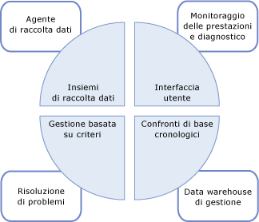
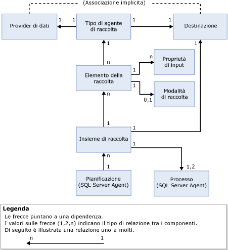

# Raccolta dati
[!INCLUDE[appliesto-ss-xxxx-xxxx-xxx-md](../../includes/appliesto-ss-xxxx-xxxx-xxx-md.md)]
L'agente di raccolta dati è un componente di [!INCLUDE[ssCurrent](../../includes/sscurrent-md.md)] che consente di raccogliere set diversi di dati. La raccolta dati viene eseguita costantemente o in base a una pianificazione definita dall'utente. L'agente di raccolta dati archivia quindi i dati raccolti in un database relazionale noto come data warehouse di gestione.  
  
## Che cos'è l'agente di raccolta dati 
 L'agente di raccolta dati è un componente chiave della piattaforma di raccolta dati per [!INCLUDE[ssCurrent](../../includes/sscurrent-md.md)] e gli strumenti forniti da [!INCLUDE[ssNoVersion](../../includes/ssnoversion-md.md)]. L'agente di raccolta dati fornisce un punto centrale per la raccolta dati attraverso le applicazioni e i server di database. In questo punto di raccolta si possono ottenere dati da diverse origini e non esclusivamente relativi alle prestazioni, a differenza di Traccia SQL.  
  
 L'agente di raccolta dati consente di regolare l'ambito della raccolta dati per adattarlo agli ambienti di prova e di produzione. Utilizza inoltre un data warehouse, ovvero un database relazionale che consente di gestire i dati raccolti impostando diversi periodi di mantenimento.  
  
 L'agente di raccolta dati supporta l'ottimizzazione dinamica per la raccolta di dati ed è estensibile tramite l'API. Per altre informazioni, vedere [Programmazione dell'agente di raccolta dati](http://msdn.microsoft.com/library/53b4752b-055d-4716-b2bc-75b4cce84101).  
  
 Nella figura seguente viene illustrato come si colloca l'agente di raccolta dati nella strategia complessiva per la raccolta e la gestione dei dati in [!INCLUDE[ssCurrent](../../includes/sscurrent-md.md)].  
  
   
  
## Concetti  
 L'agente di raccolta dati è integrato con [!INCLUDE[ssNoVersion](../../includes/ssnoversion-md.md)] Agent e [!INCLUDE[ssISnoversion](../../includes/ssisnoversion-md.md)]e fa ampio uso di entrambi. Pertanto, prima di utilizzare l'agente di raccolta dati è necessario comprendere alcuni concetti relativi a ognuno di questi componenti di [!INCLUDE[ssNoVersion](../../includes/ssnoversion-md.md)] .  
  
 [!INCLUDE[ssNoVersion](../../includes/ssnoversion-md.md)] Agent viene usato per pianificare ed eseguire i processi di raccolta. È necessario comprendere i seguenti concetti:  
  
-   Processo  
  
-   Passaggio processo  
  
-   Pianificazioni processo  
  
-   Sottosistema  
  
-   Account proxy  
  
 Per altre informazioni, vedere [Automatizzazione delle attività amministrative &#40;SQL Server Agent&#41;](http://msdn.microsoft.com/library/541ee5ac-2c9f-4b74-b4f0-13b7bd5920b0).  
  
 [!INCLUDE[ssISnoversion](../../includes/ssisnoversion-md.md)] ([!INCLUDE[ssIS](../../includes/ssis-md.md)]) viene usato per eseguire pacchetti che raccolgono dati da singoli provider di dati. È necessario conoscere i seguenti strumenti e concetti di [!INCLUDE[ssIS](../../includes/ssis-md.md)] .  
  
-   [!INCLUDE[ssIS](../../includes/ssis-md.md)] pacchetto  
  
-   [!INCLUDE[ssIS](../../includes/ssis-md.md)] configurazione di pacchetto  
  
 Per altre informazioni, vedere [Pacchetti di Integration Services &#40;SSIS&#41;](../../integration-services/integration-services-ssis-packages.md).  
  
## Terminologia  
 **destinazione**  
 Istanza del [!INCLUDE[ssDE](../../includes/ssde-md.md)] in un'edizione di [!INCLUDE[ssNoVersion](../../includes/ssnoversion-md.md)] che supporta la raccolta dati. Per altre informazioni sulle edizioni supportate, vedere la sezione sulla gestibilità in [Funzionalità supportate dalle edizioni di SQL Server 2016](~/sql-server/editions-and-supported-features-for-sql-server-2016.md).  
  
 Una *radice di destinazione* definisce un sottoalbero nella gerarchia di destinazione. Un *set di destinazioni* è il gruppo di destinazioni risultante dell'applicazione di un filtro a un sottoalbero definito da una radice di destinazione. Una radice di destinazione può essere un database, un'istanza di [!INCLUDE[ssNoVersion](../../includes/ssnoversion-md.md)]o un'istanza del computer.  
  
**tipo di destinazione**  
 Tipo della destinazione che presenta caratteristiche e comportamento determinati. Ad esempio, una destinazione dell'istanza [!INCLUDE[ssNoVersion](../../includes/ssnoversion-md.md)] ha caratteristiche diverse rispetto a una destinazione di database [!INCLUDE[ssNoVersion](../../includes/ssnoversion-md.md)] .  
  
 **provider di dati**  
 Origine dati nota, specifica di un tipo di destinazione che fornisce dati ad un tipo di agente di raccolta.  
  
**tipo di agente di raccolta**  
 Wrapper logico intorno ai pacchetti [!INCLUDE[ssIS](../../includes/ssis-md.md)] che fornisce il meccanismo effettivo per raccogliere dati e caricarli nel data warehouse di gestione.  
  
 **elemento della raccolta**  
 Istanza di un tipo di agente di raccolta. Un elemento della raccolta viene creato con uno specifico set di proprietà di input e con una frequenza di raccolta.  
  
 **set di raccolta**  
 Gruppo di elementi della raccolta. Un set di raccolta è un'unità di raccolta di dati con cui un utente può interagire tramite l'interfaccia utente.  
  
 **modalità di raccolta**  
 Modo in cui i dati vengono raccolti e archiviati. La modalità di raccolta può essere cache o in cache. La modalità cache supporta una raccolta continua, mentre la modalità non in cache è destinata alla raccolta su richiesta o a uno snapshot di raccolta.  
  
 **data warehouse di gestione**  
 Database relazionale utilizzato per archiviare i dati raccolti.  
  
 Nell'illustrazione seguente sono mostrate le dipendenze e le relazioni tra i componenti dell'agente di raccolta dati.  
  
   
  
 Come mostrato nell'illustrazione, il provider di dati è esterno all'agente di raccolta dati e per definizione ha una relazione implicita con la destinazione. Il provider di dati appartiene specificamente a una particolare destinazione (ad esempio, un servizio [!INCLUDE[ssNoVersion](../../includes/ssnoversion-md.md)] come il motore relazionale) e fornisce dati come le viste di sistema in [!INCLUDE[ssNoVersion](../../includes/ssnoversion-md.md)], i contatori di Performance Monitor e i provider WMI che possono essere utilizzati dall'agente di raccolta dati.  
  
 Il tipo di agente di raccolta è specifico di un tipo di destinazione in base all'associazione logica di un provider di dati ad un tipo di destinazione. Il tipo di agente di raccolta definisce il modo in cui i dati vengono raccolti da un provider di dati specifico (utilizzando parametri schematizzati) e specifica lo schema di archiviazione dei dati. Lo schema del provider di dati e lo schema di archiviazione sono necessari per archiviare i dati raccolti. Il tipo di agente di raccolta fornisce inoltre il percorso del data warehouse di gestione, che può risiedere sul computer che esegue la raccolta di dati o su un computer diverso.  
  
 Un elemento della raccolta, mostrato nell'illustrazione, è un'istanza di un tipo di agente di raccolta specifico con parametri di input, ad esempio XML Schema per il tipo di agente di raccolta. Tutti gli elementi della raccolta devono operare sulla stessa radice di destinazione o su una radice di destinazione vuota. Ciò consente all'agente di raccolta dati di combinare tipi di agente di raccolta dal sistema operativo o da una radice di destinazione specifica, ma non da radici di destinazione diverse.  
  
 Un elemento della raccolta ha una frequenza di raccolta definita che determina ogni quanto vengono acquisiti gli snapshot di valori. Sebbene sia un elemento fondamentale per un set di raccolta, un elemento della raccolta non può esistere autonomamente.  
  
 I set di raccolta vengono definiti e distribuiti su un'istanza del server e possono essere eseguiti indipendentemente l'uno dall'altro. Ogni set di raccolta può essere applicato ad una destinazione che corrisponde ai tipi di destinazione di tutti i tipi di agente di raccolta appartenenti ad un set di raccolta. Il set di raccolta viene eseguito da uno o più processi agente [!INCLUDE[ssNoVersion](../../includes/ssnoversion-md.md)] ed i dati vengono caricati nel data warehouse di gestione in base ad una pianificazione predefinita.  
  
 Tutti i dati raccolti da istanze diverse all'interno del set di raccolta vengono caricati nel data warehouse di gestione sulla base della stessa pianificazione. Tale pianificazione viene definita come pianificazione agente [!INCLUDE[ssNoVersion](../../includes/ssnoversion-md.md)] condivisa e può essere utilizzata da più di un set di raccolta. Un set di raccolta viene attivato o disattivato come singola entità; gli elementi della raccolta non possono essere attivati o disattivati individualmente.  
  
 Quando si crea o si aggiorna un set di raccolta è possibile configurare la modalità di raccolta per raccogliere dati e caricarli nel data warehouse di gestione. Il tipo di pianificazione viene determinato dal tipo di raccolta: memorizzato nella cache oppure on memorizzato nella cache. Se la raccolta è memorizzata nella cache, la raccolta e il caricamento di dati vengono eseguiti ciascuno su un processo separato. La raccolta viene eseguita sulla base di una pianificazione che inizia quando l'agente [!INCLUDE[ssNoVersion](../../includes/ssnoversion-md.md)] si avvia e in base alla frequenza specificata nell'elemento della raccolta. Il caricamento viene eseguito in base alla pianificazione specificata dall'utente.  
  
 In una raccolta in modalità non in cache, la raccolta e il caricamento dei dati vengono entrambi eseguiti in un solo processo, ma in due passaggi. Il primo passaggio è la raccolta, il secondo è il caricamento. Per la raccolta su richiesta non è necessaria alcuna pianificazione.  
  
 Dopo l'abilitazione di un set di raccolta, la raccolta di dati può avviarsi, secondo una pianificazione o su richiesta. Quando la raccolta di dati si avvia, l'agente [!INCLUDE[ssNoVersion](../../includes/ssnoversion-md.md)] genera un processo per l'agente di raccolta dati, che a sua volta carica i pacchetti [!INCLUDE[ssISnoversion](../../includes/ssisnoversion-md.md)] per il set di raccolta. Gli elementi della raccolta che rappresentano tipi di raccolta raggruppano dati provenienti dai provider di dati adeguati sulle destinazioni specificate. Quando il ciclo di raccolta termina, tali dati vengono caricati nel data warehouse di gestione.  
  
## Operazioni possibili  
  
|Description|Argomento|  
|----------------------|-----------|  
|Gestire aspetti diversi della raccolta dati, ad esempio l'abilitazione o la disabilitazione della raccolta dati, la modifica della configurazione di un set di raccolta o la visualizzazione di dati nel data warehouse di gestione.|[Gestire la raccolta dati](../../relational-databases/data-collection/manage-data-collection.md)|  
|Usare questi report per ottenere informazioni per il monitoraggio della capacità del sistema e la risoluzione dei problemi relativi alle prestazioni.|[Report per i set di raccolta dati di sistema](../../relational-databases/data-collection/system-data-collection-set-reports.md)|  
|Usare il data warehouse di gestione per la raccolta di dati da un server che costituisce una destinazione di raccolta dati.|[Data warehouse di gestione](../../relational-databases/data-collection/management-data-warehouse.md)| 
|Sfruttare le funzionalità di traccia sul lato server di SQL Server Profiler per esportare una definizione della traccia da usare per creare un set di raccolta che usa il tipo di agente di raccolta Traccia SQL generico.| [Usare SQL Server Profiler per creare un set di raccolta Traccia SQL (SQL Server Management Studio)](https://msdn.microsoft.com/library/cc645955(v=sql.130).aspx)
  
  

