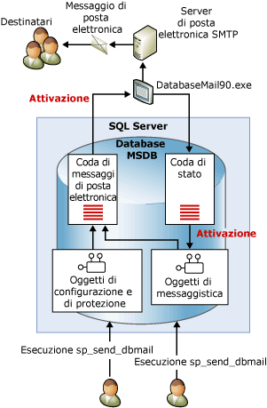

# Posta elettronica database
[!INCLUDE[appliesto-ss-xxxx-xxxx-xxx-md](../../includes/appliesto-ss-xxxx-xxxx-xxx-md.md)]
  Posta elettronica database è una soluzione aziendale per l'invio di messaggi di posta elettronica dal [!INCLUDE[ssDEnoversion](../../includes/ssdenoversion-md.md)]. Posta elettronica database consente alle applicazioni di database di inviare messaggi di posta elettronica agli utenti. I messaggi possono includere risultati di query e file provenienti da qualunque risorsa disponibile in rete.  
  
  
##   Vantaggi dell'uso di Posta elettronica database  
 Posta elettronica database è caratterizzata da affidabilità, scalabilità, sicurezza e facilità di supporto.  
  
### Affidabilità  
  
-   Posta elettronica database utilizza il protocollo SMTP (Simple Mail Transfer Protocol) standard per l'invio della posta. È possibile utilizzare Posta elettronica database senza installare un client MAPI estesa nel computer che esegue [!INCLUDE[ssNoVersion](../../includes/ssnoversion-md.md)].  
  
-   Isolamento dei processi. Per ridurre al minimo l'impatto su [!INCLUDE[ssNoVersion](../../includes/ssnoversion-md.md)], il componente che fornisce la posta elettronica viene eseguito esternamente a [!INCLUDE[ssNoVersion](../../includes/ssnoversion-md.md)], in un processo separato. [!INCLUDE[ssNoVersion](../../includes/ssnoversion-md.md)] continuerà a mettere in coda i messaggi di posta elettronica anche se il processo esterno si arresta o non riesce. I messaggi accodati verranno inviati nel momento in cui il processo esterno o il server SMTP torna online.  
  
-   Account di failover. Un profilo di Posta elettronica database consente di specificare più di un server SMTP. Nel caso in cui un server SMTP non sia disponibile, sarà comunque possibile recapitare la posta a un altro server SMTP.  
  
-   Supporto dei cluster. Posta elettronica database è in grado di interagire con i cluster ed è pienamente supportato in un cluster.  
  
### Scalabilità  
  
-   Recapito in background: Posta elettronica database consente il recapito in background o asincrono. Quando si chiama **sp_send_dbmail** per inviare un messaggio, Posta elettronica database aggiunge una richiesta a una coda di [!INCLUDE[ssSB](../../includes/sssb-md.md)] . La stored procedure restituisce immediatamente un risultato. Il componente esterno di posta elettronica riceve la richiesta e recapita i messaggi.  
  
-   Più profili: Posta elettronica database consente di creare più profili in un'istanza di [!INCLUDE[ssNoVersion](../../includes/ssnoversion-md.md)] . Facoltativamente, è possibile scegliere il profilo utilizzato da Posta elettronica database quando viene inviato un messaggio.  
  
-   Più account: ogni profilo può contenere più account di failover. È possibile configurare profili diversi con account diversi, per distribuire la posta elettronica su più server di posta.  
  
-   Compatibilità con installazione a 64 bit: Posta elettronica database è pienamente supportato nelle installazioni a 64 bit di [!INCLUDE[ssNoVersion](../../includes/ssnoversion-md.md)].  
  
### Security  
  
-   Disabilitazione per impostazione predefinita: per ridurre la superficie di attacco di [!INCLUDE[ssNoVersion](../../includes/ssnoversion-md.md)], le stored procedure di Posta elettronica database sono disabilitate per impostazione predefinita.  
  
-   Protezione posta elettronica: per inviare Posta elettronica database, è necessario essere un membro del ruolo del database **DatabaseMailUserRole** nel database **msdb** .  
  
-   Sicurezza del profilo: Posta elettronica database impone la sicurezza per i profili di posta. È possibile scegliere gli utenti o i gruppi del database **msdb** autorizzati ad accedere a un profilo di Posta elettronica database. È possibile concedere l'accesso a utenti specifici o a tutti gli utenti in **msdb**. Un profilo privato consente di limitare l'accesso a un elenco specificato di utenti. Un profilo pubblico risulta disponibile per tutti gli utenti di un database.  
  
-   Governor della dimensione dell'allegato: Posta elettronica database impone un limite configurabile per la dimensione dei file allegati. È possibile modificare tale limite usando la stored procedure [sysmail_configure_sp](../../relational-databases/system-stored-procedures/sysmail-configure-sp-transact-sql.md) .  
  
-   Estensioni dei file allegati non consentite: Posta elettronica database gestisce un elenco di estensioni di file allegati non consentite. Gli utenti non possono allegare file la cui estensione è inclusa in tale elenco. È possibile modificare questo elenco utilizzando sysmail_configure_sp.  
  
-   Posta elettronica database è in esecuzione nell'account di servizio [!INCLUDE[ssNoVersion](../../includes/ssnoversion-md.md)] Engine. Per allegare un file da una cartella a un'e-mail, l'account del motore di [!INCLUDE[ssNoVersion](../../includes/ssnoversion-md.md)] deve disporre delle autorizzazioni necessarie per accedere alla cartella in cui è contenuto il file.  
  
### Facilità di supporto  
  
-   Configurazione integrata: Posta elettronica database mantiene le informazioni relative agli account di posta elettronica in [!INCLUDE[ssDEnoversion](../../includes/ssdenoversion-md.md)]. Non è necessario gestire un profilo di posta in un'applicazione client esterna. In Configurazione guidata posta elettronica database è disponibile un'interfaccia di facile utilizzo per la configurazione di Posta elettronica database. È inoltre possibile creare e mantenere configurazioni di Posta elettronica database tramite [!INCLUDE[tsql](../../includes/tsql-md.md)].  
  
-   Registrazione. Posta elettronica database registra l'attività di posta elettronica in [!INCLUDE[ssNoVersion](../../includes/ssnoversion-md.md)], nel log eventi dell'applicazione di Microsoft Windows e nelle tabelle del database **msdb** .  
  
-   Controllo: Posta elettronica database mantiene le copie dei messaggi e degli allegati inviati nel database **msdb** . È possibile controllare con facilità l'utilizzo di Posta elettronica database ed esaminare i messaggi conservati.  
  
-   Supporto per HTML: Posta elettronica database consente di inviare messaggi di posta elettronica in formato HTML.  
  
  
##   Architettura di Posta elettronica database  
 Posta elettronica database è basato su un'architettura a code che impiega tecnologie service broker. Quando gli utenti eseguono **sp_send_dbmail**, la stored procedure inserisce un elemento nella coda della posta elettronica e crea un record contenente il messaggio di posta elettronica. L'inserimento della nuova voce nella coda della posta elettronica avvia il processo esterno di Posta elettronica database (DatabaseMail.exe). Il processo esterno legge le informazioni relative alla posta elettronica e invia il messaggio al server o ai server di posta elettronica appropriati. Il processo esterno inserisce un elemento nella coda di stato per il risultato dell'operazione di invio. L'inserimento della nuova voce nella coda di stato avvia una stored procedure interna che aggiorna lo stato del messaggio di posta elettronica. Oltre ad archiviare il messaggio di posta elettronica inviato o non inviato, Posta elettronica database registra eventuali allegati di posta elettronica nelle tabelle di sistema. Le viste di Posta elettronica database specificano lo stato dei messaggi per la risoluzione dei problemi, mentre le stored procedure consentono l'amministrazione della coda di Posta elettronica database.  
  
   
  
  
##   Introduzione ai componenti di Posta elettronica database  
 Il programma Posta elettronica database è costituito dai componenti principali seguenti:  
  
-   Componenti di configurazione e di sicurezza  
  
     Posta elettronica database archivia le informazioni di configurazione e di sicurezza nel database **msdb** . Gli oggetti di configurazione e di sicurezza creano profili e account utilizzati da Posta elettronica database.  
  
-   Componenti di messaggistica  
  
     Il database **msdb** funge da database host della posta elettronica contenente gli oggetti di messaggistica usati da Posta elettronica database per inviare i messaggi. Questi oggetti includono la stored procedure **sp_send_dbmail** e le strutture dei dati contenenti le informazioni relative ai messaggi.  
  
-   File eseguibile di Posta elettronica database  
  
     Il file eseguibile di Posta elettronica database è un programma esterno che legge i dati da una coda nel database **msdb** e invia i messaggi ai server di posta elettronica.  
  
-   Componenti di registrazione e controllo  
  
     Posta elettronica database registra le informazioni di registrazione nel database **msdb** e nel log eventi dell'applicazione di [!INCLUDE[msCoName](../../includes/msconame-md.md)] Windows.  
  
 **Configurazione di SQL Server Agent per l'uso di Posta elettronica database:**  
  
 SQL Server Agent può essere configurato per l'utilizzo di Posta elettronica database. Ciò è necessario per le notifiche degli avvisi e per la notifica automatica del completamento di un processo.  
  
> [!WARNING]  
>  I singoli passaggi all'interno di un processo possono inoltre inviare posta elettronica senza configurare [!INCLUDE[ssNoVersion](../../includes/ssnoversion-md.md)] Agent per l'utilizzo di Posta elettronica database. Ad esempio, un passaggio del processo [!INCLUDE[tsql](../../includes/tsql-md.md)] può utilizzare Posta elettronica database per inviare i risultati di una query a un elenco di destinatari.  
  
 È possibile configurare [!INCLUDE[ssNoVersion](../../includes/ssnoversion-md.md)] Agent per inviare messaggi di posta elettronica a operatori predefiniti nelle condizioni riportate di seguito.  
  
-   È stato attivato un avviso. È possibile configurare gli avvisi in modo da inviare notifiche tramite posta elettronica quando vengono generati eventi specifici, ad esempio per segnalare a un operatore un evento di database o una condizione del sistema operativo che richiede un intervento tempestivo. Per altre informazioni sulla configurazione degli avvisi, vedere [Avvisi](../../ssms/agent/alerts.md).  
  
-   Quando un'attività pianificata, ad esempio il backup di un database o un evento di replica, viene completata o non riesce. È possibile ad esempio utilizzare [!INCLUDE[ssNoVersion](../../includes/ssnoversion-md.md)] Agent Mail per notificare agli operatori il verificarsi di un errore durante l'elaborazione alla fine del mese.  
  
  
##   Argomenti del componente Posta elettronica database  
  
-   [Oggetti di configurazione di Posta elettronica database](../../relational-databases/database-mail/database-mail-configuration-objects.md)  
  
-   [Oggetti di messaggistica di Posta elettronica database](../../relational-databases/database-mail/database-mail-messaging-objects.md)  
  
-   [Programma esterno di Posta elettronica database](../../relational-databases/database-mail/database-mail-external-program.md)  
  
-   [Controlli e registrazione di Posta elettronica database](../../relational-databases/database-mail/database-mail-log-and-audits.md)  
  
-   [Configurare Posta elettronica di SQL Server Agent per l'uso di Posta elettronica database](../../relational-databases/database-mail/configure-sql-server-agent-mail-to-use-database-mail.md)  
  
  
  
