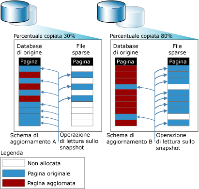

# Snapshot del database (SQL Server)
  Uno snapshot del database è una vista statica di sola lettura di un database [!INCLUDE[ssNoVersion](../../includes/ssnoversion-md.md)] , ovvero il *database di origine*. Lo snapshot del database è consistente dal punto di vista transazionale con il database di origine al momento della creazione dello snapshot. Lo snapshot di un database deve risiedere sempre nella stessa istanza del server dove si trova il relativo database di origine. Con l'aggiornamento del database di origine, viene aggiornato anche lo snapshot del database. Pertanto, più a lungo viene conservato uno snapshot del database, più è probabile che utilizzi tutto il proprio spazio disponibile su disco.  
  
 È possibile generare più snapshot di uno stesso database di origine. Ogni snapshot del database viene mantenuto finché non viene eliminato esplicitamente dal proprietario del database.  
  
> [!NOTE]  
>  Gli snapshot del database non sono correlati a backup di snapshot, transazioni di isolamento dello snapshot o replica snapshot.  
  
 **Contenuto dell'argomento:**  
  
-   [Panoramica delle caratteristiche](#FeatureOverview)  
  
-   [Vantaggi degli snapshot del database](#Benefits)  
  
-   [Termini e definizioni](#TermsAndDefinitions)  
  
-   [Prerequisiti e limitazioni per gli snapshot del database](#LimitationsRequirements)  
  
-   [Attività correlate](#RelatedTasks)  
  
##   Panoramica delle caratteristiche  
 Gli snapshot del database operano a livello di pagine di dati. Prima che una pagina del database di origine venga modificata per la prima volta, la pagina originale viene copiata dal database di origine allo snapshot. Nello snapshot viene archiviata la pagina originale, mantenendo i record di dati nello stato corrispondente al momento in cui è stato creato lo snapshot. Lo stesso processo viene ripetuto per ogni pagina modificata per la prima volta. All'utente uno snapshot del database appare sempre come non modificato, in quanto le operazioni di lettura nello snapshot del database accedono sempre alle pagine di dati originali, indipendentemente dalla posizione.  
  
 Per archiviare le pagine originali copiate, lo snapshot utilizza uno o più *file sparse*. All'inizio un file sparse è un file essenzialmente vuoto che non contiene alcun dato utente e in cui non è stato allocato spazio su disco per i dati utente. Man mano che una sempre maggiore quantità di pagine viene aggiornata nel database di origine, la dimensione del file aumenta. Nella figura seguente vengono illustrati gli effetti di due modelli di aggiornamento diversi sulle dimensioni di uno snapshot. Il modello di aggiornamento A rappresenta un ambiente in cui solo il 30% delle pagine originali è stato aggiornato durante la vita dello snapshot. Il modello di aggiornamento B rappresenta un ambiente in cui durante la vita dello snapshot è stato aggiornato l'80% delle pagine originali.  
  
   
  
##   Vantaggi degli snapshot del database  
  
-   È possibile utilizzare gli snapshot per la generazione di report.  
  
     I client possono eseguire query in uno snapshot del database. Questa operazione risulta utile per la scrittura di report basati sui dati disponibili al momento della creazione dello snapshot.  
  
-   Mantenimento dei dati cronologici per la generazione di report.  
  
     Uno snapshot consente di estendere l'accesso utente ai dati relativi a un momento determinato. Ad esempio, è possibile creare uno snapshot del database al termine di un determinato periodo di tempo, quale un trimestre fiscale, per consentire la creazione successiva di report ed eseguire report di fine periodo sullo snapshot. Se lo spazio su disco è sufficiente, è inoltre possibile mantenere gli snapshot di fine periodo a tempo indeterminato, consentendo l'esecuzione di query sui risultati relativi a tali periodi, ad esempio per esaminare le prestazioni aziendali.  
  
-   Utilizzo di un database mirror mantenuto per assicurare la disponibilità in modo da ripartire il carico di lavoro dei report.  
  
     L'utilizzo degli snapshot del database con il mirroring del database consente di rendere disponibili per la creazione di report i dati archiviati nel server mirror. L'esecuzione di query sul database mirror consente inoltre di liberare risorse sul server principale. Per altre informazioni , vedere [Mirroring e snapshot del database &#40;SQL Server&#41;](../../database-engine/database-mirroring/database-mirroring-and-database-snapshots-sql-server.md).  
  
-   Salvaguardia dei dati da errori amministrativi.  
  
-   In caso di errore da parte di un utente in un database di origine, è possibile ripristinare lo stato in cui si trovava il database al momento della creazione di un determinato snapshot. La perdita di dati è limitata agli aggiornamenti del database eseguiti dopo la creazione dello snapshot.  
  
     Prima dell'esecuzione di aggiornamenti importanti quale un aggiornamento bulk o una modifica dello schema, ad esempio, la creazione di uno snapshot del database consente di proteggere i dati. In caso di errore è possibile utilizzare lo snapshot per il recupero, riportando il database allo stato memorizzato nello snapshot. L'operazione di ripristino da snapshot risulta potenzialmente più rapida, in questo caso, rispetto al ripristino da un backup, ma non consente l'esecuzione successiva del rollforward.  
  
    > [!IMPORTANT]  
    >  Non è possibile eseguire il ripristino di un database offline o danneggiato. Per proteggere un database è pertanto necessario eseguire backup regolari e testare il piano di ripristino.  
  
    > [!NOTE]  
    >  Gli snapshot del database dipendono dal database di origine. L'utilizzo di snapshot per il ripristino di un database, pertanto, non rappresenta una soluzione alternativa alla strategia di backup e ripristino. L'esecuzione di tutti i backup pianificati rimane comunque essenziale. Se è necessario ripristinare il database di origine al punto nel tempo in cui è stato creato uno snapshot del database, implementare criteri di backup che consentano di eseguire tale operazione.  
  
-   Salvaguardia dei dati da errori degli utenti.  
  
     La creazione su base regolare di snapshot del database consente di ridurre l'impatto di un errore grave da parte degli utenti, ad esempio l'eliminazione di una tabella. Per assicurare un livello elevato di protezione, è possibile creare una serie di snapshot del database, relativi a un intervallo di tempo sufficiente per riconoscere e rispondere alla maggior parte degli errori da parte degli utenti. Ad esempio, è possibile mantenere da 6 a 12 snapshot in sequenza relativi a un intervallo di 24 ore, a seconda delle risorse del disco. Ogni volta che viene creato un nuovo snapshot è possibile eliminare lo snapshot meno recente.  
  
    -   Per il recupero dopo un errore da parte degli utenti, è possibile riportare il database allo stato registrato nello snapshot immediatamente precedente l'errore. L'operazione di ripristino da snapshot risulta potenzialmente più rapida, in questo caso, rispetto al ripristino da un backup, ma non consente l'esecuzione successiva del rollforward.  
  
    -   In alternativa, è possibile ricostruire manualmente una tabella eliminata o altri dati persi, basandosi sulle informazioni disponibili in uno snapshot. Ad esempio, è possibile eseguire una copia bulk dei dati dallo snapshot al database, quindi integrare manualmente i dati nel database.  
  
    > [!NOTE]  
    >  Il numero di snapshot simultanei necessari in un database, la frequenza per la creazione di un nuovo snapshot e il tempo di memorizzazione degli snapshot dipendono dalle ragioni per cui si decide di utilizzare gli snapshot del database.  
  
-   Gestione di un database di prova  
  
     In un ambiente di testing, può essere utile, durante l'esecuzione ripetuta di un protocollo di test, che il database contenga dati identici all'inizio di ogni sessione di test. Prima di eseguire la prima sessione, uno sviluppatore o un tester di applicazioni può creare uno snapshot del database nel database di prova. Dopo ogni test, sarà possibile ripristinare rapidamente lo stato precedente del database ripristinando il relativo snapshot.  
  
##   Termini e definizioni  
 database snapshot  
 Vista statica, di sola lettura e consistente dal punto di vista transazionale di un database (di origine).  
  
 database di origine  
 Per uno snapshot del database, il database del quale è stato creato lo snapshot. Gli snapshot del database dipendono dal database di origine. Gli snapshot di un database devono essere inclusi nella stessa istanza del server del database. Inoltre, se un database diventa non disponibile per qualsiasi motivo, tutti i relativi snapshot diventano anch'essi non disponibili.  
  
 file sparse  
 File fornito dal file system NTFS che richiede molto meno spazio su disco rispetto allo spazio necessario per una modalità di gestione diversa. Un file di tipo sparse viene utilizzato per archiviare pagine copiate in uno snapshot del database. Un file di tipo sparse appena creato richiede poco spazio su disco. Man mano che i dati vengono scritti in uno snapshot del database, lo spazio su disco viene allocato gradualmente dal file system NTFS nel file di tipo sparse corrispondente.  
  
##   Prerequisiti e limitazioni per gli snapshot del database  
 **Contenuto della sezione**  
  
-   [Prerequisiti](#Prerequisites)  
  
-   [Limitazioni del database di origine](#LimitsOnSourceDb)  
  
-   [Limitazioni degli snapshot del database](#LimitsOnDbSS)  
  
-   [Requisiti relativi allo spazio su disco](#DiskSpace)  
  
-   [Snapshot del database con filegroup offline](#OfflineFGs)  
  
###   Prerequisiti  
 Il database di origine, in cui può essere utilizzato qualsiasi modello di recupero, deve soddisfare i prerequisiti seguenti:  
  
-   L'istanza del server deve essere in esecuzione in un'edizione di [!INCLUDE[ssNoVersion](../../includes/ssnoversion-md.md)] in cui sono supportati gli snapshot del database. Per altre informazioni, vedere [Funzionalità supportate dalle edizioni di SQL Server 2016](~/sql-server/editions-and-supported-features-for-sql-server-2016.md).  
  
-   Il database di origine deve essere online, a meno che non si tratti di un database mirror nell'ambito di una sessione di mirroring del database.  
  
-   È possibile creare uno snapshot del database in qualsiasi database primario o secondario in un gruppo di disponibilità. Il ruolo di replica deve essere PRIMARY o SECONDARY, non nello stato di RESOLVING.  
  
     È consigliabile uno stato di sincronizzazione del database corrispondente a SYNCHRONIZING o SYNCHRONIZED quando si crea uno snapshot del database. È tuttavia possibile creare gli snapshot del database anche se lo stato della sincronizzazione del database è NOT SYNCHRONIZING.  
  
     Per altre informazioni, vedere [Snapshot del database con gruppi di disponibilità Always On (SQL Server)](../../database-engine/availability-groups/windows/database-snapshots-with-always-on-availability-groups-sql-server.md).  
  
-   Per creare uno snapshot del database in un database mirror, è necessario che il database si trovi nello stato di mirroring SYNCHRONIZED.  
  
-   Non è possibile configurare il database di origine come un database condiviso scalabile.  

-   Il database di origine non deve contenere un filegroup MEMORY_OPTIMIZED_DATA.  Per altre informazioni sulla funzionalità, vedere [Funzionalità di SQL Server non supportate per OLTP in memoria](../../relational-databases/in-memory-oltp/unsupported-sql-server-features-for-in-memory-oltp.md).
  
> [!NOTE]  
>  Tutti i modelli di recupero supportano gli snapshot del database.  
  
###   Limitazioni del database di origine  
 In presenza di snapshot del database, al database di origine dello snapshot si applicano le limitazioni seguenti:  
  
-   Non è possibile eliminare, scollegare o ripristinare il database.  
  
    > [!NOTE]  
    >  Il backup del database di origine funziona normalmente e non viene influenzato dagli snapshot del database.  
  
-   Le prestazioni sono ridotte a causa del numero maggiore di operazioni I/O sul database di origine derivanti da un'operazione di copia in scrittura per lo snapshot eseguita a ogni aggiornamento di una pagina.  
  
-   Non è possibile eliminare file dal database di origine o da uno snapshot.  
  
###   Limitazioni degli snapshot del database  
 Agli snapshot del database si applicano le limitazioni seguenti:  
  
-   È necessario creare e mantenere uno snapshot del database sulla stessa istanza del server in cui si trova il database di origine.  
  
-   Gli snapshot del database includono sempre un intero database.  
  
-   Gli snapshot del database dipendono dal database di origine e non fungono da archivi ridondanti. Non proteggono da errori del disco o da altri tipi di danno. L'utilizzo di snapshot per il ripristino di un database, pertanto, non rappresenta una soluzione alternativa alla strategia di backup e ripristino. L'esecuzione di tutti i backup pianificati rimane comunque essenziale. Se è necessario ripristinare il database di origine al punto nel tempo in cui è stato creato uno snapshot del database, implementare criteri di backup che consentano di eseguire tale operazione.  
  
-   Quando una pagina in fase di aggiornamento nel database di origine viene inserita in uno snapshot, se questo esaurisce lo spazio su disco oppure si verifica un altro errore, lo snapshot diventa sospetto e deve essere eliminato.  
  
-   Gli snapshot sono di sola lettura. Poiché sono di sola lettura, non possono essere aggiornati. Pertanto, dopo un aggiornamento gli snapshot di database non possono essere usati.  
  
-   Gli snapshot dei database **model**, **master**e **temp** non sono consentiti.  
  
-   Non è possibile modificare le specifiche dei file degli snapshot del database.  
  
-   Non è possibile eliminare file da uno snapshot del database.  
  
-   Non è possibile eseguire il backup o il ripristino degli snapshot del database.  
  
-   Non è possibile collegare o scollegare snapshot del database.  
  
-   Non è possibile creare snapshot del database con file system FAT32 o partizioni RAW. I file sparse utilizzati dagli snapshot del database vengono forniti dal file system NTFS.  
  
-   L'indicizzazione full-text non è supportata negli snapshot del database. I cataloghi full-text non vengono propagati dal database di origine.  
  
-   Uno snapshot del database eredita i vincoli di sicurezza del proprio database di origine esistenti al momento della creazione dello snapshot. Poiché gli snapshot sono di sola lettura, non è possibile modificare le autorizzazioni ereditate e le modifiche alle autorizzazioni effettuate sul database di origine non verranno riportate negli snapshot esistenti.  
  
-   Uno snapshot riflette sempre lo stato dei filegroup al momento della sua creazione. I filegroup online e quelli offline non modificano il proprio stato. Per ulteriori informazioni, vedere la sezione dedicata agli snapshot del database con filegroup offline più avanti in questo argomento.  
  
-   Se un database di origine acquisisce lo stato di RECOVERY_PENDING, potrebbe non essere possibile accedere ai relativi snapshot del database. Dopo aver risolto il problema sul database di origine, tuttavia, i relativi snapshot dovrebbero ridiventare disponibili.  
  
-   Il ripristino non è supportato per qualsiasi file NTFS di sola lettura o compresso nel database.  I tentativi di ripristinare un database contenente filegroup di questo tipo non riusciranno.  
  
-   In una configurazione per il log shipping, è possibile creare snapshot del database solo nel database primario. Se si cambiano i ruoli tra l'istanza del server primario e un'istanza del server secondario, è necessario eliminare tutti gli snapshot del database per poter impostare il database primario come database secondario.  
  
-   Non è possibile configurare uno snapshot del database come database condiviso scalabile.  
  
-   I filegroup FILESTREAM non sono supportati dagli snapshot del database. Se in un database di origine sono presenti filegroup FILESTREAM, questi ultimi vengono contrassegnati come offline nei relativi snapshot del database e gli snapshot del database non possono essere utilizzati per ripristinare il database.  
  
    > [!NOTE]  
    >  Un'istruzione SELECT eseguita in uno snapshot del database non deve specificare una colonna FILESTREAM. In caso contrario, verrà restituito il seguente messaggio di errore: `Could not continue scan with NOLOCK due to data movement.`  
  
-   Se le statistiche relative a uno snapshot di sola lettura mancano o non sono aggiornate, il [!INCLUDE[ssDE](../../includes/ssde-md.md)] crea e gestisce statistiche temporanee in tempdb. Per altre informazioni, vedere [Statistics](../../relational-databases/statistics/statistics.md).  
  
###   Requisiti relativi allo spazio su disco  
 Gli snapshot del database richiedono spazio su disco. Se uno snapshot del database esaurisce lo spazio su disco, viene contrassegnato come sospetto e deve essere eliminato. Il database di origine, tuttavia, non viene influenzato e continua a funzionare normalmente. Gli snapshot tuttavia utilizzano lo spazio su disco in maniera molto più efficiente rispetto a una copia completa di un database. Uno snapshot richiede esclusivamente lo spazio necessario per le pagine che vengono modificate durante la sua durata. Poiché in genere gli snapshot vengono conservati per periodi di tempo limitati, le loro dimensioni non rappresentano un problema.  
  
 Più a lungo viene conservato uno snapshot, più è probabile che utilizzi tutto lo spazio disponibile. Le dimensioni massime cui un file sparse può arrivare sono quelle del file del database di origine corrispondente al momento della creazione dello snapshot. Se uno snapshot del database esaurisce lo spazio su disco, deve essere eliminato.  
  
> [!NOTE]  
>  Tranne che per lo spazio del file, uno snapshot del database utilizza approssimativamente le stesse risorse di un database.  
  
###   Snapshot del database con filegroup offline  
 I filegroup offline nel database di origine influenzano gli snapshot del database quando si tenta di eseguire una delle operazioni seguenti:  
  
-   Creare uno snapshot  
  
     Quando nel database di origine sono presenti uno o più filegroup offline, la creazione degli snapshot ha esito positivo con i filegroup offline. Per i filegroup offline non vengono creati file sparse.  
  
-   Portare un filegroup offline  
  
     È possibile portare un file offline nel database di origine. Tuttavia, il filegroup rimane online negli snapshot del database se era tale alla creazione dello snapshot. Se i dati per i quali viene eseguita una query sono stati modificati dal momento della creazione dello snapshot, la pagina di dati originale sarà accessibile nello snapshot. Tuttavia, è possibile che, per le query che utilizzano lo snapshot per l'accesso ai dati non modificati nel filegroup, si verifichino errori di input/output (I/O).  
  
-   Portare un filegroup online  
  
     Non è possibile portare un filegroup online in un database che presenti snapshot del database. Se un filegroup è offline al momento della creazione dello snapshot o viene portato offline in presenza di uno snapshot del database, il filegroup rimane offline. Per riportare un file online è infatti necessario ripristinarlo, operazione impossibile se è presente uno snapshot nel database.  
  
-   Ripristinare lo snapshot come database di origine  
  
     Il ripristino di uno snapshot del database come database di origine richiede che tutti i filegroup siano online, fatta eccezione per quelli offline al momento della creazione dello snapshot.  
  
##   Attività correlate  
  
-   [Creare uno snapshot del database &#40;Transact-SQL&#41;](../../relational-databases/databases/create-a-database-snapshot-transact-sql.md)  
  
-   [Visualizzazione di uno snapshot del database &#40;SQL Server&#41;](../../relational-databases/databases/view-a-database-snapshot-sql-server.md)  
  
-   [Visualizzare le dimensioni del file sparse di uno snapshot del database &#40;Transact-SQL&#41;](../../relational-databases/databases/view-the-size-of-the-sparse-file-of-a-database-snapshot-transact-sql.md)  
  
-   [Ripristinare un database a uno snapshot del database](../../relational-databases/databases/revert-a-database-to-a-database-snapshot.md)  
  
-   [Eliminare uno snapshot del database &#40;Transact-SQL&#41;](../../relational-databases/databases/drop-a-database-snapshot-transact-sql.md)  
  
## Vedere anche  
 [Mirroring e snapshot del database &#40;SQL Server&#41;](../../database-engine/database-mirroring/database-mirroring-and-database-snapshots-sql-server.md)  
  
  

