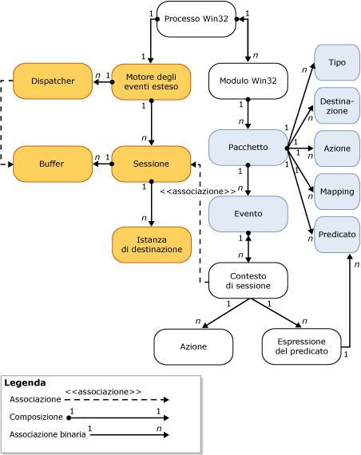

# Motore degli eventi estesi di SQL Server
[!INCLUDE[tsql-appliesto-ss2014-asdb-xxxx-xxx_md](../../includes/tsql-appliesto-ss2014-asdb-xxxx-xxx-md.md)]

  Il motore degli eventi estesi di [!INCLUDE[ssNoVersion](../../includes/ssnoversion-md.md)] è una raccolta di servizi e oggetti che:  
  
-   Abilitano la definizione degli eventi.  
  
-   Abilitano l'elaborazione dei dati degli eventi.  
  
-   Gestiscono i servizi e gli oggetti degli eventi estesi nel sistema.  
  
-   Mantengono un elenco di sessioni degli eventi estesi e gestiscono l'accesso a tale elenco.  
  
 Il motore degli eventi estesi stesso non fornisce alcun evento o azione da intraprendere quando viene generato un evento. I processi che utilizzano il motore degli eventi estesi definiscono l'interazione con il motore. Questi processi aggiungono dei punti evento e forniscono le azioni da intraprendere in risposta alla generazione dell'evento.  
  
 Nell'illustrazione seguente è mostrata una vista semplificata di una sessione degli eventi estesi. Per altre informazioni, vedere [Sessioni degli eventi estesi di SQL Server](../../relational-databases/extended-events/sql-server-extended-events-sessions.md).  
  
   
  
 Si noti quanto segue:  
  
-   Ogni processo di Windows può avere uno o più moduli (**processo Win32**, **modulo Win32**). Questi sono anche noti come *binari* o *moduli eseguibili*.  
  
-   Ciascun modulo del processo di Windows può contenere uno o più pacchetti di eventi estesi (**Pacchetto**) contenenti uno o più oggetti eventi estesi (**Tipo**, **Destinazione**, **Azione**, **Mappa**, **Predicato**ed **Evento**).  
  
-   In un processo host può esservi solo un'istanza del motore degli eventi estesi (**motore degli eventi estesi**) che:  
  
    -   Gestisce alcuni aspetti della sessione (ad esempio, l'enumerazione delle sessioni).  
  
    -   Gestisce la distribuzione (**Dispatcher**). Ciò è simile a un pool di thread.  
  
    -   Gestisce buffer di memoria (**Buffer**) per gli eventi. Quando i buffer sono riempiti, vengono inviati alle destinazioni.  
  
-   Dopo che una sessione è stata creata e gli eventi sono associati facoltativamente alla sessione (**Contesto della sessione**):  
  
    -   È possibile creare anche istanze di destinazioni (**Istanza di destinazione**) e aggiungerle alla sessione.  
  
    -   Quando i buffer sono riempiti, questi buffer vengono inviati alle destinazioni.  
  
## Vedere anche  
 [Eventi estesi](../../relational-databases/extended-events/extended-events.md)  
  
  

