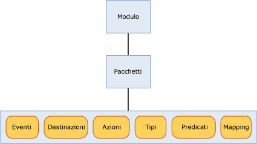

# <a name="sql-server-extended-events-packages"></a>Pacchetti degli eventi estesi di SQL Server
[!INCLUDE[appliesto-ss-asdb-xxxx-xxx-md](../../includes/appliesto-ss-asdb-xxxx-xxx-md.md)]

  Un pacchetto è un contenitore per oggetti eventi estesi di [!INCLUDE[ssNoVersion](../../includes/ssnoversion-md.md)] . Di seguito vengono indicati i tre tipi di pacchetti di eventi estesi:  
  
-   package0 – Oggetti di sistema Eventi estesi. Questo è il pacchetto predefinito.  
  
-   sqlserver: oggetti correlati a [!INCLUDE[ssNoVersion](../../includes/ssnoversion-md.md)] .  
  
-   sqlos: oggetti correlati al sistema operativo di [!INCLUDE[ssNoVersion](../../includes/ssnoversion-md.md)] (SQLOS).  
  
> [!NOTE]  
>  Il pacchetto SecAudit viene utilizzato da [!INCLUDE[ssNoVersion](../../includes/ssnoversion-md.md)] Audit. Nessuno degli oggetti nel pacchetto è disponibile tramite DDL (Data Definition Language) di eventi estesi.  
  
 I pacchetti sono identificati da un nome, da un GUID e dal modulo binario che contiene il pacchetto. Per altre informazioni, vedere [sys.dm_xe_packages &#40;Transact-SQL&#41;](../../relational-databases/system-dynamic-management-views/sys-dm-xe-packages-transact-sql.md).  
  
 Un pacchetto può contenere alcuni o tutti gli oggetti seguenti, che vengono discussi in maggior dettaglio più avanti in questo argomento:  
  
-   Eventi  
  
-   Server di destinazione  
  
-   Azioni  
  
-   Tipi  
  
-   Predicati  
  
-   Mappe  
  
 Oggetti da pacchetti diversi possono essere combinati in una sessione dell'evento. Per altre informazioni, vedere [Sessioni Eventi estesi di SQL Server](../../relational-databases/extended-events/sql-server-extended-events-sessions.md).  
  
## <a name="package-contents"></a>Contenuti del pacchetto  
 Nella figura seguente si illustrano gli oggetti che possono essere presenti nei pacchetti, che sono contenuti in un modulo. Un modulo può essere un file eseguibile o una libreria a collegamento dinamico (DLL).  
  
   
  
### <a name="events"></a>Eventi  
 Gli eventi monitorano i punti di interesse nel percorso di esecuzione di un programma, ad esempio [!INCLUDE[ssNoVersion](../../includes/ssnoversion-md.md)]. La generazione di un evento implica che il punto di interesse è stato raggiunto e fornisce informazioni sullo stato derivanti dall'ora in cui l'evento è stato generato.  
  
 Gli eventi possono essere utilizzati solamente per scopi di traccia o per azioni di trigger. Queste azioni possono essere sincrone o asincrone.  
  
> [!NOTE]  
>  Un evento non ha alcuna conoscenza delle azioni che possono essere lanciate in risposta all'attivazione di eventi.  
  
 Un set di eventi in un pacchetto non può essere modificato dopo che il pacchetto viene registrato con gli eventi estesi.  
  
 A tutti gli eventi è associato uno schema con versione che ne definisce il contenuto. Questo schema è costituito da colonne di evento con tipi ben definiti. Un evento di un tipo specifico deve sempre fornire i propri dati nell'ordine esatto specificato nello schema. Una destinazione dell'evento non deve tuttavia utilizzare tutti i dati forniti.  
  
#### <a name="event-categorization"></a>Categorizzazione dell'evento  
 Negli eventi estesi viene utilizzato un modello di categorizzazione dell'evento simile a Analisi eventi per Windows (ETW). Due proprietà dell'evento sono utilizzate per categorizzazione, canale e parola chiave. L'utilizzo di queste proprietà supporta l'integrazione degli eventi estesi con ETW e i suoi strumenti.  
  
 **Channel**  
  
 Un canale identifica il pubblico per un evento. Questi canali sono descritti nella tabella seguente.  
  
|Nome|Definizione|  
|----------|----------------|  
|Amministrativi|Gli eventi amministrativi sono indirizzati principalmente agli utenti finali, agli 'amministratori e al supporto. Gli eventi trovati nei canali amministrativi indicano un problema con una soluzione ben definita sul quale può agire un amministratore. Un esempio di evento amministrativo è quando un'applicazione non riesce a connettersi a una stampante. Questi eventi sono ben documentati oppure hanno un messaggio ad essi associato che comunica a chi legge che cosa fare per risolvere il problema.|  
|Operativo|Gli eventi operativi sono utilizzati per l'analisi e la diagnostica di un problema o di un'occorrenza. Possono essere utilizzati per attivare strumenti o attività basate su un problema o un'occorrenza. Un esempio di un evento operativo è quando una stampante viene aggiunta o rimossa da un sistema.|  
|Analitici|Gli eventi analitici sono pubblicati in volumi elevati. Descrivono il funzionamento del programma e sono in genere utilizzati nell'analisi delle prestazioni.|  
|Debug|Gli eventi di debug sono utilizzati solamente dagli sviluppatori per diagnosticare un problema nelle operazioni di debug.<br /><br /> Gli eventi nel canale di debug restituiscono dati interni, specifici dell'implementazione, relativi allo stato. Gli schemi e i dati restituiti dagli eventi potrebbero cambiare o non essere più validi nelle versioni future di SQL Server. Pertanto, gli eventi nel canale di debug potrebbero cambiare o essere rimossi senza preavviso nelle versioni future di SQL Server.|  
  
 **Parola chiave**  
  
 Una parola chiave è un'applicazione specifica e abilita un raggruppamento più preciso di eventi correlati, ciò rende più facile specificare e recuperare un evento che si desidera utilizzare in una sessione. È possibile utilizzare la seguente query ottenere informazioni sulla parola chiave:  
  
```  
select map_value Keyword from sys.dm_xe_map_values  
where name = 'keyword_map'  
```  
  
> [!NOTE]  
>  Le parole chiave eseguono il mapping ravvicinato degli eventi Traccia SQL.  
  
### <a name="targets"></a>Server di destinazione  
 Le destinazioni sono consumer di eventi. Le destinazioni elaborano gli eventi, in modo sincrono nel thread che genera l'evento o in modo asincrono in un thread fornito dal sistema. Gli eventi estesi forniscono diverse destinazioni che è possibile utilizzare in base alle proprie esigenze per indirizzare l'output dell'evento. Per ulteriori informazioni, vedere [SQL Server Extended Events Targets](http://msdn.microsoft.com/library/e281684c-40d1-4cf9-a0d4-7ea1ecffa384).  
  
### <a name="actions"></a>Azioni  
 Un'azione è una risposta o una serie di risposte a un evento a livello di programmazione. Le azioni sono associate a un evento e a ogni evento può essere associato un set univoco di azioni.  
  
> [!NOTE]  
>  Le azioni destinate a un set specifico di eventi non possono essere associate a eventi sconosciuti.  
  
 Un'azione associata a un evento viene richiamata in modo sincrono sul thread che ha attivato l'evento. Vi sono molti tipi di azioni e hanno un'ampia gamma di funzionalità. Le azioni possono:  
  
-   Acquisire un dump dello stack e verificare dati.  
  
-   Archiviare informazioni sullo stato in un contesto locale utilizzando l'archiviazione variabile.  
  
-   Aggregare dati dell'evento.  
  
-   Accodare dati ai dati dell'evento.  
  
 Di seguito vengono riportati alcuni esempi tipici e noti di azioni:  
  
-   Dumper dello stack  
  
-   Rilevamento del piano di esecuzione (solo[!INCLUDE[ssNoVersion](../../includes/ssnoversion-md.md)] )  
  
-   [!INCLUDE[tsql](../../includes/tsql-md.md)] raccolta di stack (solo[!INCLUDE[ssNoVersion](../../includes/ssnoversion-md.md)] )  
  
-   Esecuzione di calcoli di statistiche temporali  
  
-   Raccolta di input utente in caso di eccezione  
  
### <a name="predicates"></a>Predicati  
 I predicati rappresentano un set di regole logiche utilizzate per valutare gli eventi quando vengono elaborati. In questo modo l'utente degli eventi estesi è in grado di acquisire selettivamente i dati dell'evento in base a criteri specifici.  
  
 I predicati possono archiviare i dati in un contesto locale che può essere usato per la creazione di predicati che restituiscono True ogni *n* minuti o ogni *n* volte che un evento viene generato. Questa archiviazione del contesto locale può essere utilizzata anche per aggiornare dinamicamente il predicato, sopprimendo con ciò le generazioni future dell'evento se l'evento contiene dati simili.  
  
 I predicati hanno la possibilità di recuperare informazioni sul contesto, ad esempio l'ID del thread, così come dati specifici sull'evento. I predicati sono valutati come espressioni booleane complete e supportano operazioni di corto circuito nel primo punto dove viene individuato che l'intera l'espressione è falsa.  
  
> [!NOTE]  
>  I predicati con effetti collaterali non possono essere valutati se una precedente verifica del predicato non riesce.  
  
### <a name="types"></a>Tipi  
 Poiché i dati sono una raccolta di byte, la lunghezza e le funzionalità della raccolta dei byte sono necessarie per interpretarli. Queste informazioni sono incapsulate nell'oggetto Tipo. I tipi seguenti sono forniti per gli oggetti del pacchetto:  
  
-   evento  
  
-   action  
  
-   target  
  
-   pred_source  
  
-   pred_compare  
  
-   Tipo  
  
 Per altre informazioni, vedere [sys.dm_xe_objects &#40;Transact-SQL&#41;](../../relational-databases/system-dynamic-management-views/sys-dm-xe-objects-transact-sql.md).  
  
### <a name="maps"></a>Mappe  
 Una tabella della mappa esegue il mapping di un valore interno a una stringa e ciò consente a un utente di conoscere ciò che rappresenta il valore. Anziché essere in grado di ottenere solo un valore numerico, un utente può ottenere una descrizione significativa del valore interno. Nella query seguente si illustra come ottenere valori della mappa.  
  
```  
select map_key, map_value from sys.dm_xe_map_values  
where name = 'lock_mode'  
```  
  
 La query precedente produce l'output seguente:  
  
 `map_key     map_value`  
  
 `---------------------`  
  
 `0           NL`  
  
 `1           SCH_S`  
  
 `2           SCH_M`  
  
 `3           S`  
  
 `4           U`  
  
 `5           X`  
  
 `6           IS`  
  
 `7           IU`  
  
 `8           IX`  
  
 `9           SIU`  
  
 `10          SIX`  
  
 `11          UIX`  
  
 `12          BU`  
  
 `13          RS_S`  
  
 `14          RS_U`  
  
 `15          RI_NL`  
  
 `16          RI_S`  
  
 `17          RI_U`  
  
 `18          RI_X`  
  
 `19          RX_S`  
  
 `20          RX_U`  
  
 `21          RX_X`  
  
 `21          RX_X`  
  
 Utilizzare tabella come esempio, supponendo di avere una modalità di colonna denominata il cui valore è 5. La tabella indica che è stato eseguito il mapping di 5 a X, ovvero il tipo di blocco è Esclusivo.  
  
## <a name="see-also"></a>Vedere anche  
 [Sessioni Eventi estesi di SQL Server](../../relational-databases/extended-events/sql-server-extended-events-sessions.md)   
 [Motore degli eventi estesi di SQL Server](../../relational-databases/extended-events/sql-server-extended-events-engine.md)   
 [SQL Server Extended Events Targets](http://msdn.microsoft.com/library/e281684c-40d1-4cf9-a0d4-7ea1ecffa384)  
  
  
