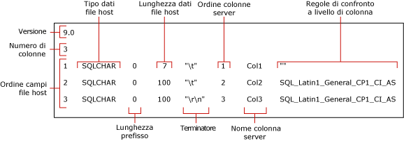

# <a name="use-a-format-file-to-skip-a-table-column-sql-server"></a>Utilizzo di un file di formato per ignorare una colonna di una tabella (SQL Server)
[!INCLUDE[appliesto-ss-asdb-asdw-pdw-md](../../includes/appliesto-ss-asdb-asdw-pdw-md.md)]

Questo articolo descrive come usare un file di formato per evitare di importare la colonna di una tabella quando il dati per la colonna ignorata non esistono nel file di dati di origine. Un file di dati può contenere un numero di campi inferiore rispetto al numero di colonne nella tabella di destinazione, ovvero è possibile ignorare l'importazione di una colonna, solo se viene soddisfatta almeno una delle due condizioni seguenti nella tabella di destinazione:
-   La colonna ignorata ammette i valori Null.
-   La colonna ignorata ha un valore predefinito.  
  
## <a name="sample-table-and-data-file"></a>Tabella e file di dati di esempio  
 Gli esempi in questo articolo prevedono una tabella denominata `myTestSkipCol` nello schema **dbo**. È possibile creare questa tabella in un database di esempio, ad esempio *WideWorldImporters* o *AdventureWorks*, o in qualsiasi altro database. Per creare la tabella, utilizzare il codice seguente:  
  
```sql
USE WideWorldImporters;  
GO  
CREATE TABLE myTestSkipCol   
   (  
   Col1 smallint,  
   Col2 nvarchar(50) NULL,  
   Col3 nvarchar(50) not NULL  
   );  
GO  
```  
  
Gli esempi in questo articolo usano anche un file di dati di esempio, `myTestSkipCol2.dat`. Questo file di dati contiene solo due campi sebbene la tabella di destinazione contenga tre colonne.

```  
1,DataForColumn3  
1,DataForColumn3  
1,DataForColumn3  
```  
  
## <a name="basic-steps"></a>Passaggi principali

È possibile usare un file di formato non XML o un file in formato XML per ignorare una colonna di tabella. In entrambi i casi, sono previsti due passaggi:

1.   Usare l'utilità della riga di comando **bcp** per creare un file di formato predefinito.

2.   Modificare il file di formato predefinito in un editor di testo.

Il file di formato modificato deve eseguire il mapping di ogni campo esistente alla colonna corrispondente nella tabella di destinazione. IL file deve indicare anche la colonna o le colonne della tabella da ignorare. 

Ad esempio, per eseguire l'importazione in blocco dei dati da `myTestSkipCol2.dat` nella tabella `myTestSkipCol`, è necessario che il file di formato esegua il mapping del primo campo di dati a `Col1`, che ignori `Col2` e che esegua il mapping del secondo campo a `Col3`.  
 
## <a name="option-1---use-a-non-xml-format-file"></a>Opzione 1 - Usare un file di formato non XML  
  
### <a name="step-1---create-a-default-non-xml-format-file"></a>Passaggio 1 - Creare un file di formato non XML predefinito  
Creare un file di formato non XML predefinito per la tabella di esempio `myTestSkipCol` eseguendo il comando **bcp** seguente al prompt dei comandi:  
  
```cmd
bcp WideWorldImporters..myTestSkipCol format nul -f myTestSkipCol_Default.fmt -c -T  
```  

> [!IMPORTANT]  
>  Potrebbe essere necessario specificare il nome dell'istanza del server a cui ci si connette usando l'argomento `-S`. Potrebbe anche essere necessario specificare il nome utente e la password con gli argomenti `-U` e `-P`. Per altre informazioni, vedere [bcp Utility](../../tools/bcp-utility.md).  

Il comando precedente crea un file di formato non XML, `myTestSkipCol_Default.fmt`. Questo file di formato è chiamato *file di formato predefinito* perché è generato da **bcp**. Un file di formato predefinito descrive una corrispondenza uno-a-uno tra i campi del file di dati e le colonne di tabella.  
  
 La figura seguente illustra i valori nei file di formato predefiniti di esempio. 
  
   
  
> [!NOTE]  
>  Per altre informazioni sui campi dei file di formato, vedere [File in formato non XML &#40;SQL Server&#41;](../../relational-databases/import-export/non-xml-format-files-sql-server.md).  
  
### <a name="step-2---modify-a-non-xml-format-file"></a>Passaggio 2 - Modificare un file di formato non XML  
Per modificare un file di formato non XML predefinito, esistono due alternative. Entrambe consentono di indicare che il campo dati non esiste nel file di dati e che non devono essere inseriti dati nella colonna della tabella corrispondente.

Per ignorare una colonna di tabella, modificare il file di formato non XML predefinito, utilizzando una delle modalità alternative seguenti:  

#### <a name="option-1---remove-the-row"></a>Opzione 1 - Rimuovere la riga
Il metodo preferito per ignorare una colonna prevede i tre passaggi seguenti:

1.   Eliminare innanzitutto eventuali righe del file di formato che descrivono un campo non presente nel file di dati di origine.
2.   Ridurre quindi il valore "Ordine dei campi nel file host" di ogni riga del file di formato che segue una riga eliminata. L'obiettivo sono i valori sequenziali "Ordine dei campi nel file host", da 1 a *n*, che riflettono l'effettiva posizione di ogni campo nel file di dati.
3.   Ridurre infine il valore nel campo "Numero di colonne" in modo da riflettere il numero effettivo di campi nel file di dati.  
  
L'esempio seguente si basa sul file di formato predefinito per la tabella `myTestSkipCol`. Questo file di formato modificato esegue il mapping tra il primo campo dati e `Col1`, ignora `Col2`ed esegue il mapping tra il secondo campo dati e `Col3`. La riga per `Col2` è stata eliminata. Anche il delimitatore dopo il primo campo è stato modificato da `\t` a `,`.
  
```  
14.0  
2  
1       SQLCHAR       0       7       ","      1     Col1         ""  
2       SQLCHAR       0       100     "\r\n"   3     Col3         SQL_Latin1_General_CP1_CI_AS  
```  
  
#### <a name="option-2---modify-the-row-definition"></a>Opzione 2 - Modificare la definizione di riga

In alternativa, per ignorare una colonna di tabella, è possibile modificare la definizione della riga del file di formato che corrisponde alla colonna di tabella. In questa riga del file di formato, i valori "lunghezza del prefisso," "lunghezza dei dati del file host" e "ordine delle colonne nel server" devono essere impostati su 0. Inoltre, i campi "terminatore" e "regole di confronto a livello di colonna" devono essere impostati su "" (ovvero un valore vuoto o NULL). Il valore "nome colonna server" richiede una stringa non vuota, sebbene il nome di colonna effettivo non sia necessario. Per i campi di formato restanti sono necessari i relativi valori predefiniti.  
  
L'esempio seguente deriva inoltre dal file di formato predefinito per la tabella `myTestSkipCol` .  
  
```  
14.0  
3  
1       SQLCHAR       0       7       ","      1     Col1         ""  
2       SQLCHAR       0       0       ""       0     Col2         ""  
3       SQLCHAR       0       100     "\r\n"   3     Col3         SQL_Latin1_General_CP1_CI_AS  
```  
  
### <a name="examples-with-a-non-xml-format-file"></a>Esempi con un file di formato non XML 
Gli esempi seguenti sono basati sulla tabella di esempio `myTestSkipCol` e sul file di dati di esempio `myTestSkipCol2.dat` precedentemente descritti in questo articolo.  
  
#### <a name="using-bulk-insert"></a>Utilizzo di BULK INSERT  
Questo esempio funziona usando uno dei file di formato non XML modificati creati come descritto nella sezione precedente. In questo esempio, il file di formato modificato è denominato `myTestSkipCol2.fmt`. Per usare `BULK INSERT` per importare in blocco il file di dati `myTestSkipCol2.dat`, in SSMS, eseguire il codice seguente. Aggiornare i percorsi di file system per il percorso dei file di esempio nel computer in uso.
  
```sql  
USE WideWorldImporters;  
GO  
BULK INSERT myTestSkipCol   
   FROM 'C:\myTestSkipCol2.dat'   
   WITH (FORMATFILE = 'C:\myTestSkipCol2.fmt');  
GO  
SELECT * FROM myTestSkipCol;  
GO  
```  
  
## <a name="option-2---use-an-xml-format-file"></a>Opzione 2 - Usare un file di formato XML  
  
### <a name="step-1---create-a-default-xml-format-file"></a>Passaggio 1 - Creare un file di formato XML predefinito   

Creare un file di formato XML predefinito per la tabella di esempio `myTestSkipCol` eseguendo il comando **bcp** seguente al prompt dei comandi:  
  
```cmd
bcp WideWorldImporters..myTestSkipCol format nul -f myTestSkipCol_Default.xml -c -x -T  
```  
  
> [!IMPORTANT]  
>  Potrebbe essere necessario specificare il nome dell'istanza del server a cui ci si connette usando l'argomento `-S`. Potrebbe anche essere necessario specificare il nome utente e la password con gli argomenti `-U` e `-P`. Per altre informazioni, vedere [bcp Utility](../../tools/bcp-utility.md).  
 
Il comando precedente crea un file di formato XML, `myTestSkipCol_Default.xml`. Questo file di formato è chiamato *file di formato predefinito* perché è generato da **bcp**. Un file di formato predefinito descrive una corrispondenza uno-a-uno tra i campi del file di dati e le colonne di tabella.  
  
```xml
<?xml version="1.0"?>  
<BCPFORMAT xmlns="http://schemas.microsoft.com/sqlserver/2004/bulkload/format" xmlns:xsi="http://www.w3.org/2001/XMLSchema-instance">  
 <RECORD>  
  <FIELD ID="1" xsi:type="CharTerm" TERMINATOR="\t" MAX_LENGTH="7"/>  
  <FIELD ID="2" xsi:type="CharTerm" TERMINATOR="\t" MAX_LENGTH="100" COLLATION="SQL_Latin1_General_CP1_CI_AS"/>  
  <FIELD ID="3" xsi:type="CharTerm" TERMINATOR="\r\n" MAX_LENGTH="100" COLLATION="SQL_Latin1_General_CP1_CI_AS"/>  
 </RECORD>  
 <ROW>  
  <COLUMN SOURCE="1" NAME="Col1" xsi:type="SQLSMALLINT"/>  
  <COLUMN SOURCE="2" NAME="Col2" xsi:type="SQLNVARCHAR"/>  
  <COLUMN SOURCE="3" NAME="Col3" xsi:type="SQLNVARCHAR"/>  
 </ROW>  
</BCPFORMAT>  
```  
  
> [!NOTE]  
>  Per informazioni sulla struttura dei file di formato XML, vedere [File in formato XML &#40;SQL Server&#41;](../../relational-databases/import-export/xml-format-files-sql-server.md).  

### <a name="step-2---modify-an-xml-format-file"></a>Passaggio 2 - Modificare un file di formato XML

Di seguito è riportato il file di formato XML modificato `myTestSkipCol2.xml` che ignora `Col2`. Le voci `FIELD` e `ROW` per `Col2` sono state rimosse e le altre voci sono state rinumerate. Anche il delimitatore dopo il primo campo è stato modificato da `\t` a `,`.

```xml
<?xml version="1.0"?>  
<BCPFORMAT xmlns="http://schemas.microsoft.com/sqlserver/2004/bulkload/format" xmlns:xsi="http://www.w3.org/2001/XMLSchema-instance">  
 <RECORD>  
  <FIELD ID="1" xsi:type="CharTerm" TERMINATOR="," MAX_LENGTH="7"/>  
  <FIELD ID="2" xsi:type="CharTerm" TERMINATOR="\r\n" MAX_LENGTH="100" COLLATION="SQL_Latin1_General_CP1_CI_AS"/>  
 </RECORD>  
 <ROW>  
  <COLUMN SOURCE="1" NAME="Col1" xsi:type="SQLSMALLINT"/>  
  <COLUMN SOURCE="2" NAME="Col3" xsi:type="SQLNVARCHAR"/>  
 </ROW>  
</BCPFORMAT>  
```  
 
### <a name="examples-with-an-xml-format-file"></a>Esempi con un file di formato XML   
Gli esempi seguenti sono basati sulla tabella di esempio `myTestSkipCol` e sul file di dati di esempio `myTestSkipCol2.dat` precedentemente descritti in questo articolo.

Per importare i dati da `myTestSkipCol2.dat` nella tabella `myTestSkipCol`, gli esempi usano il file di formato XML modificato, `myTestSkipCol2.xml`.   
  
#### <a name="using-bulk-insert-with-a-view"></a>Uso di BULK INSERT con una vista  

Con un file di formato XML non è possibile ignorare una colonna quando si sta eseguendo l'importazione diretta in una tabella usando un comando **bcp** o un'istruzione `BULK INSERT`. È tuttavia possibile importare un'intera tabella a eccezione dell'ultima colonna. Se si vuole ignorare qualsiasi colonna diversa dall'ultima, è necessario creare una vista della tabella di destinazione che contiene solo le colonne contenute nel file di dati. In seguito sarà possibile eseguire un'importazione bulk dei dati da tale file nella vista.  
  
L'esempio seguente crea la visualizzazione `v_myTestSkipCol` nella tabella `myTestSkipCol`. Questa vista ignora la seconda colonna della tabella, `Col2`. Nell'esempio viene quindi utilizzato `BULK INSERT` per importare il file di dati `myTestSkipCol2.dat` in questa vista.  
  
In SSMS eseguire il codice seguente. Aggiornare i percorsi di file system per il percorso dei file di esempio nel computer in uso. 
  
```sql  
USE WideWorldImporters;  
GO  

CREATE VIEW v_myTestSkipCol AS  
    SELECT Col1,Col3  
    FROM myTestSkipCol;  
GO  
  
BULK INSERT v_myTestSkipCol  
FROM 'C:\myTestSkipCol2.dat'  
WITH (FORMATFILE='C:\myTestSkipCol2.xml');  
GO  
```  

#### <a name="using-openrowsetbulk"></a>Utilizzo di OPENROWSET(BULK...)  

Per usare un file di formato XML per ignorare una colonna di tabella usando `OPENROWSET(BULK...)`, è necessario specificare un elenco esplicito di colonne nell'elenco di selezione e anche nella tabella di destinazione, come illustrato di seguito:  
  
    ```sql
    INSERT ...<column_list> SELECT <column_list> FROM OPENROWSET(BULK...) 
    ```

Nell'esempio seguente viene utilizzato il provider di set di righe con lettura bulk `OPENROWSET` e il file di formato `myTestSkipCol2.xml` . Nell'esempio viene eseguita l'importazione bulk del file di dati `myTestSkipCol2.dat` nella tabella `myTestSkipCol` . L'istruzione contiene un elenco esplicito di colonne nell'elenco selezionato e nella tabella di destinazione, come richiesto.  
  
In SSMS eseguire il codice seguente. Aggiornare i percorsi di file system per il percorso dei file di esempio nel computer in uso.
  
```sql  
USE WideWorldImporters;  
GO  
INSERT INTO myTestSkipCol  
  (Col1,Col3)  
    SELECT Col1,Col3  
      FROM  OPENROWSET(BULK  'C:\myTestSkipCol2.Dat',  
      FORMATFILE='C:\myTestSkipCol2.Xml'    
       ) as t1 ;  
GO  
```

## <a name="see-also"></a>Vedere anche  
 [bcp Utility](../../tools/bcp-utility.md)   
 [BULK INSERT &#40;Transact-SQL&#41;](../../t-sql/statements/bulk-insert-transact-sql.md)   
 [OPENROWSET &#40;Transact-SQL&#41;](../../t-sql/functions/openrowset-transact-sql.md)   
 [Utilizzo di un file di formato per ignorare una colonna di una tabella &#40;SQL Server&#41;](../../relational-databases/import-export/use-a-format-file-to-skip-a-data-field-sql-server.md)   
 [Utilizzo di un file di formato per eseguire il mapping tra le colonne della tabella e i campi del file di dati &#40;SQL Server&#41;](../../relational-databases/import-export/use-a-format-file-to-map-table-columns-to-data-file-fields-sql-server.md)   
 [Utilizzo di un file di formato per l'importazione bulk dei dati &#40;SQL Server&#41;](../../relational-databases/import-export/use-a-format-file-to-bulk-import-data-sql-server.md)  
  
  
