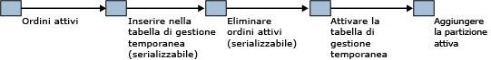

# <a name="application-pattern-for-partitioning-memory-optimized-tables"></a>Modello di applicazione per il partizionamento di tabelle con ottimizzazione per la memoria
[!INCLUDE[appliesto-ss-asdb-xxxx-xxx-md](../../includes/appliesto-ss-asdb-xxxx-xxx-md.md)]

  [!INCLUDE[hek_2](../../includes/hek-2-md.md)] supporta un modello in cui una quantità limitata di dati attivi viene mantenuta in una tabella ottimizzata per la memoria, mentre i dati usati meno di frequente vengono elaborati su disco. In genere, si tratta di uno scenario in cui i dati vengono archiviati in base a una chiave **datetime** .  
  
 È possibile emulare tabelle partizionate con tabelle ottimizzate per la memoria mantenendo una tabella partizionata e una tabella ottimizzata per la memoria con uno schema comune. I dati correnti verranno inseriti e aggiornati nella tabella ottimizzata per la memoria, mentre i dati utilizzati meno frequentemente verranno gestiti nella tabella partizionata tradizionale.  
  
 Un'applicazione che riconosce i dati attivi in una tabella ottimizzata per la memoria può utilizzare le stored procedure compilate in modo nativo per accedere ai dati. Le operazioni che devono accedere all'intero intervallo di dati, o che non sono in grado di riconoscere quale tabella contiene i dati rilevanti, utilizzano codice [!INCLUDE[tsql](../../includes/tsql-md.md)] interpretato per creare un join tra la tabella ottimizzata per la memoria e la tabella partizionata.  
  
 Questo cambio di partizione è descritto di seguito:  
  
-   Inserire i dati dalla tabella di OLTP in memoria in una tabella di staging, eventualmente utilizzando una data limite.  
  
-   Eliminare gli stessi dati dalla tabella ottimizzata per la memoria.  
  
-   Passare alla tabella di staging.  
  
-   Aggiungere la partizione attiva.  
  
   
Manutenzione dei dati attivi  
  
 Le azioni che iniziano con Deleting ActiveOrders devono essere eseguite durante una sessione di manutenzione per evitare che le query non rilevino i dati durante il periodo tra l'eliminazione dei dati e il passaggio alla tabella di staging.  
  
 Per un esempio correlato, vedere [Partizionamento a livello di applicazione](../../relational-databases/in-memory-oltp/application-level-partitioning.md).  
  
## <a name="code-sample"></a>Codice di esempio  
 Nell'esempio seguente viene illustrato come utilizzare una tabella ottimizzata per la memoria con una tabella basata su disco partizionata. I dati utilizzati frequentemente vengono archiviati in memoria. Per salvare i dati su disco, creare una nuova partizione e copiare i dati nella tabella partizionata.  
  
 Nella prima parte di questo esempio vengono creati il database e gli oggetti necessari. Nella seconda parte di questo esempio viene illustrato come spostare i dati da una tabella ottimizzata per la memoria in una tabella partizionata.  
  
```sql  
CREATE DATABASE partitionsample;  
GO  
  
-- enable for In-Memory OLTP - change file path as needed  
ALTER DATABASE partitionsample ADD FILEGROUP partitionsample_mod CONTAINS MEMORY_OPTIMIZED_DATA  
ALTER DATABASE partitionsample ADD FILE( NAME = 'partitionsample_mod' , FILENAME = 'c:\data\partitionsample_mod') TO FILEGROUP partitionsample_mod;  
GO  
  
USE partitionsample;  
GO  
  
-- frequently used portion of the SalesOrders - memory-optimized  
  
CREATE TABLE dbo.SalesOrders_hot (  
   so_id INT IDENTITY PRIMARY KEY NONCLUSTERED,  
   cust_id INT NOT NULL,  
   so_date DATETIME2 NOT NULL INDEX ix_date NONCLUSTERED,  
   so_total MONEY NOT NULL,  
   INDEX ix_date_total NONCLUSTERED (so_date desc, so_total desc)  
) WITH (MEMORY_OPTIMIZED=ON)  
GO  
  
-- cold portion of the SalesOrders - partitioned disk-based table  
CREATE PARTITION FUNCTION [ByDatePF](datetime2) AS RANGE RIGHT   
   FOR VALUES();  
GO  
  
CREATE PARTITION SCHEME [ByDateRange]   
   AS PARTITION [ByDatePF]   
   ALL TO ([PRIMARY]);  
GO  
  
CREATE TABLE dbo.SalesOrders_cold (  
   so_id INT NOT NULL,  
   cust_id INT NOT NULL,  
   so_date DATETIME2 NOT NULL,  
   so_total MONEY NOT NULL,  
   CONSTRAINT PK_SalesOrders_cold PRIMARY KEY (so_id, so_date),  
   INDEX ix_date_total NONCLUSTERED (so_date desc, so_total desc)  
) ON [ByDateRange](so_date)  
GO  
  
-- table for temporary partitions  
CREATE TABLE dbo.SalesOrders_cold_staging (  
   so_id INT NOT NULL,  
   cust_id INT NOT NULL,  
   so_date datetime2 NOT NULL,  
   so_total MONEY NOT NULL,  
   CONSTRAINT PK_SalesOrders_cold_staging PRIMARY KEY (so_id, so_date),  
   INDEX ix_date_total NONCLUSTERED (so_date desc, so_total desc),  
   CONSTRAINT CHK_SalesOrders_cold_staging CHECK (so_date >= '1900-01-01')  
)  
GO  
  
-- aggregate view of the hot and cold data  
CREATE VIEW dbo.SalesOrders  
AS SELECT so_id,  
   cust_id,  
   so_date,  
   so_total,  
   1 AS 'is_hot'  
   FROM dbo.SalesOrders_hot  
   UNION ALL  
   SELECT so_id,  
          cust_id,  
          so_date,  
          so_total,  
          0 AS 'is_hot'  
          FROM dbo.SalesOrders_cold;  
GO  
  
-- move all sales orders up to the split date to cold storage  
CREATE PROCEDURE dbo.usp_SalesOrdersOffloadToCold @splitdate datetime2  
   AS  
   BEGIN  
      BEGIN TRANSACTION;  
      -- create new heap based on the hot data to be moved to cold storage  
      INSERT INTO dbo.SalesOrders_cold_staging WITH( TABLOCKX)  
      SELECT so_id , cust_id , so_date , so_total  
         FROM dbo.SalesOrders_hot WITH ( serializable)  
         WHERE so_date <= @splitdate;  
  
      -- remove moved data  
      DELETE FROM dbo.SalesOrders_hot WITH( SERIALIZABLE)  
         WHERE so_date <= @splitdate;  
  
      -- update partition function, and switch in new partition  
      ALTER PARTITION SCHEME [ByDateRange] NEXT USED [PRIMARY];  
  
      DECLARE @p INT = ( SELECT MAX( partition_number) FROM sys.partitions WHERE object_id = OBJECT_ID( 'dbo.SalesOrders_cold'));  
      EXEC sp_executesql N'alter table dbo.SalesOrders_cold_staging  
         SWITCH TO dbo.SalesOrders_cold partition @i' , N'@i int' , @i = @p;  
  
      ALTER PARTITION FUNCTION [ByDatePF]()  
      SPLIT RANGE( @splitdate);  
  
      -- modify constraint on staging table to align with new partition  
      ALTER TABLE dbo.SalesOrders_cold_staging DROP CONSTRAINT CHK_SalesOrders_cold_staging;  
  
      DECLARE @s nvarchar( 100) = CONVERT( nvarchar( 100) , @splitdate , 121);  
      DECLARE @sql nvarchar( 1000) = N'alter table dbo.SalesOrders_cold_staging   
         add constraint CHK_SalesOrders_cold_staging check (so_date > ''' + @s + ''')';  
      PRINT @sql;  
      EXEC sp_executesql @sql;  
  
      COMMIT;  
END;  
GO  
  
-- insert sample values in the hot table  
INSERT INTO dbo.SalesOrders_hot VALUES(1,SYSDATETIME(), 1);   
GO  
  
INSERT INTO dbo.SalesOrders_hot VALUES(1, SYSDATETIME(), 1);  
GO  
  
INSERT INTO dbo.SalesOrders_hot VALUES(1, SYSDATETIME(), 1);  
GO  
  
-- verify contents of the table  
SELECT *  FROM dbo.SalesOrders;  
GO  
  
-- offload all sales orders to date to cold storage  
DECLARE  @t datetime2 = SYSDATETIME();  
EXEC dbo.usp_SalesOrdersOffloadToCold @t;  
  
-- verify contents of the tables  
SELECT * FROM dbo.SalesOrders;  
GO  
  
-- verify partitions  
SELECT OBJECT_NAME( object_id) , * FROM sys.dm_db_partition_stats ps  
   WHERE object_id = OBJECT_ID( 'dbo.SalesOrders_cold');  
  
-- insert more rows in the hot table  
INSERT INTO dbo.SalesOrders_hot VALUES(2, SYSDATETIME(), 1);  
GO  
  
INSERT INTO dbo.SalesOrders_hot VALUES(2, SYSDATETIME(), 1);  
GO  
  
INSERT INTO dbo.SalesOrders_hot VALUES(2, SYSDATETIME(), 1);  
GO  
  
-- verify contents of the tables  
SELECT * FROM dbo.SalesOrders;  
GO  
  
-- offload all sales orders to date to cold storage  
DECLARE @t datetime2 = SYSDATETIME();  
EXEC dbo.usp_SalesOrdersOffloadToCold @t;  
  
-- verify contents of the tables  
SELECT * FROM dbo.SalesOrders;  
GO  
  
-- verify partitions  
SELECT OBJECT_NAME( object_id) , partition_number , row_count  FROM sys.dm_db_partition_stats ps  
  WHERE object_id = OBJECT_ID( 'dbo.SalesOrders_cold') AND index_id = 1;  
```  
  
## <a name="see-also"></a>Vedere anche  
 [Tabelle con ottimizzazione per la memoria](../../relational-databases/in-memory-oltp/memory-optimized-tables.md)  
  
  
