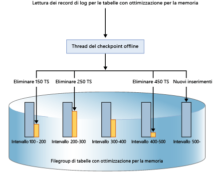
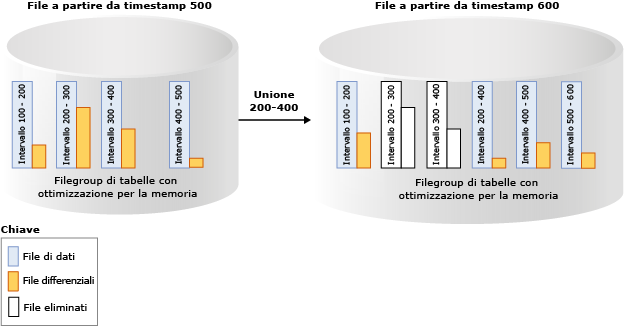

# Durabilità per tabelle con ottimizzazione per la memoria
[!INCLUDE[appliesto-ss-xxxx-xxxx-xxx-md](../../includes/appliesto-ss-xxxx-xxxx-xxx-md.md)]

  [!INCLUDE[hek_2](../../includes/hek-2-md.md)] fornisce durabilità completa per le tabelle ottimizzate per la memoria. Quando viene eseguito il commit di una transazione che ha modificato una tabella ottimizzata per la memoria, [!INCLUDE[ssNoVersion](../../includes/ssnoversion-md.md)], come avviene per le tabelle basate su disco, garantisce che le modifiche vengano rese permanenti, ovvero che saranno mantenute in seguito a un riavvio del database, a condizione che lo spazio di archiviazione sottostante sia disponibile. I componenti chiave della durabilità sono due: registrazione delle transazioni e salvataggio in modo permanente delle modifiche ai dati nell'archiviazione su disco.  
  
 Per informazioni dettagliate su qualsiasi limitazione di dimensioni per le tabelle durevoli, vedere [Stimare i requisiti di memoria delle tabelle con ottimizzazione per la memoria](../../relational-databases/in-memory-oltp/estimate-memory-requirements-for-memory-optimized-tables.md). 
  
## Log delle transazioni  
 Tutte le modifiche apportate alle tabelle basate su disco o alle tabelle ottimizzate per la memoria durevoli vengono acquisite in uno o più record di log delle transazioni. In corrispondenza del commit di una transazione, tramite [!INCLUDE[ssNoVersion](../../includes/ssnoversion-md.md)] vengono scritti sul disco i record di log associati alla transazione prima di comunicare all'applicazione o alla sessione utente che è stato eseguito il commit della transazione. In questo modo viene garantita la durabilità delle modifiche apportate dalla transazione. Il log delle transazioni per le tabelle ottimizzate per la memoria è completamente integrato con lo stesso flusso del log utilizzato dalle tabelle basate su disco. Grazie a questa integrazione è possibile far continuare le operazioni di backup, recupero e ripristino del log delle transazioni esistente senza la necessità di altri passaggi aggiuntivi. Tuttavia, poiché tramite [!INCLUDE[hek_2](../../includes/hek-2-md.md)] è possibile aumentare notevolmente la velocità effettiva delle transazioni del carico di lavoro, le operazioni di I/O sui logo possono diventare un collo di bottiglia per le prestazioni. Per sostenere questa maggiore velocità effettiva, verificare che il sottosistema delle operazioni di I/O sui log sia in grado di gestire l'aumento del carico.  
  
## File di dati e differenziali  
 I dati nelle tabelle ottimizzate per la memoria vengono archiviati come righe di dati in formato libero in una struttura di dati di heap in memoria e collegati tramite uno o più indici in memoria. Non esistono strutture per le righe di dati, quali quelle utilizzate per le tabelle basate su disco. Per la persistenza a lungo termine e per consentire il troncamento del log delle transazioni, le operazioni sulle tabelle ottimizzate per la memoria sono persistenti in un set di file di dati e differenziali. Questi file vengono generati in base al log delle transazioni, tramite un processo in background asincrono. I file di dati e differenziali si trovano in uno o più contenitori, che utilizzano lo stesso meccanismo utilizzato per i dati FILESTREAM. Questi contenitori fanno parte di un filegroup ottimizzato per la memoria.  
  
 I dati vengono scritti in tali file in un modo strettamente sequenziale riducendo la latenza del disco per la rotazione dei supporti. È possibile utilizzare più contenitori in dischi diversi per distribuire l'attività di I/O. I file di dati e differenziali in più contenitori su dischi diversi migliorano le prestazioni di recupero/ripristino del database quando i dati vengono letti dai file di dati e differenziali su disco in memoria.  
  
 Le transazioni utente non accedono direttamente ai file di dati e differenziali. Tutte le letture e scritture di dati usano strutture di dati in memoria.  
  
### File di dati  
 Un file di dati contiene righe di una o più tabelle ottimizzate per la memoria inserite da più transazioni come parte di operazioni INSERT o UPDATE. Ad esempio, una riga può provenire dalla tabella ottimizzata per la memoria T1 e la riga successiva può provenire dalla tabella ottimizzata per la memoria T2. Le righe vengono accodate al file di dati nell'ordine delle transazioni nel log delle transazioni, in modo da rendere sequenziale l'accesso ai dati. Ciò consente una velocità effettiva delle operazioni di I/O decisamente maggiore rispetto alle operazioni di I/O casuali.  
  
 Quando il file di dati è pieno, le righe inserite dalle nuove transazioni vengono archiviate in un altro file di dati. Nel corso del tempo, le righe delle tabelle durevoli ottimizzate per la memoria vengono archiviate in uno o più file di dati, ciascuno dei quali contiene le righe da un intervallo di transazioni disgiunto, ma contiguo. Ad esempio un file di dati con un timestamp di commit della transazione nell'intervallo (100, 200) include tutte le righe inserite dalle transazioni con un timestamp di commit maggiore di 100 e minore di o uguale a 200. Il timestamp di commit è un contatore a incremento progressivo costante assegnato a una transazione quando è pronta per il commit. Ogni transazione ha un timestamp di commit univoco.  
  
 Quando una riga viene eliminata o aggiornata, non viene rimossa o modificata sul posto nel file di dati, ma le righe eliminate vengono rilevate in un altro tipo di file: il file differenziale. Le operazioni di aggiornamento sono elaborate come una tupla di operazioni di eliminazione e inserimento per ogni riga. Ciò consente di eliminare le operazioni di I/O casuali nel file di dati.  
 
   Dimensioni: ogni file di dati viene ridimensionato approssimativamente a 128 MB per i computer con memoria superiore a 16 GB e a 16 MB per i computer con memoria minore o uguale a 16 GB. In [!INCLUDE[ssSQL15](../../includes/sssql15-md.md)] SQL Server può usare la modalità di checkpoint di grandi dimensioni se ritiene che il sottosistema di archiviazione sia sufficientemente veloce. In modalità di checkpoint di grandi dimensioni, i file di dati vengono ridimensionati a 1GB. In questo modo è possibile migliorare l'efficienza del sottosistema di archiviazione per i carichi di lavoro con velocità effettiva elevata.  
   
### File differenziale  
 Ogni file di dati è associato a un file differenziale con lo stesso intervallo di transazione che tiene traccia delle righe eliminate inserite dalle transazioni nell'intervallo di transazione. Questo file di dati e differenziale è spesso indicato come coppia di file di checkpoint (CFP, Checkpoint File Pair) e corrisponde all'unità di allocazione e deallocazione, oltre che all'unità per le operazioni di unione. Ad esempio, in un file differenziale che corrisponde all'intervallo di transazione (100, 200) verranno archiviate le righe eliminate inserite dalle transazioni nell'intervallo (100, 200). Come per i file di dati, l'accesso al file differenziale avviene in ordine sequenziale.  
  
 Quando una riga viene eliminata, la riga non viene rimossa dal file di dati ma viene aggiunto un riferimento alla riga nel file differenziale associato all'intervallo di transazione in cui è stata inserita la riga di dati. Poiché la riga da eliminare esiste già nel file di dati, nel file differenziale sono archiviate solo le informazioni di riferimento `{inserting_tx_id, row_id, deleting_tx_id }` seguendo l'ordine del log delle transazioni delle operazioni originali di eliminazione o aggiornamento.  
  

 Dimensioni: ogni file differenziale viene ridimensionato approssimativamente a 16 MB per i computer con memoria superiore a 16 GB e a 1 MB per i computer con memoria minore o uguale a 16 GB. All'avvio di [!INCLUDE[ssSQL15](../../includes/sssql15-md.md)] SQL Server può usare la modalità di checkpoint di grandi dimensioni se ritiene che il sottosistema di archiviazione sia sufficientemente veloce. In modalità di checkpoint di grandi dimensioni, i file differenziali vengono ridimensionati a 128MB.  
 
## Popolamento dei file di dati e differenziali  
 I file di dati e differenziali vengono popolati in base ai record del log delle transazioni generati dalle transazioni di cui è stato eseguito il commit nelle tabelle ottimizzate per la memoria e aggiungono le informazioni relative alle righe inserite o eliminate nei file di dati e differenziali appropriati. A differenza delle tabelle basate su disco in cui le pagine di dati e indice vengono scaricate con I/O casuale al completamento del checkpoint, la persistenza della tabella ottimizzata per la memoria è un'operazione in background continua. Si accede a più file differenziali poiché una transazione può eliminare o aggiornare qualsiasi riga inserita da una transazione precedente. Le informazioni di eliminazione vengono sempre aggiunte alla fine del file differenziale. Ad esempio, una transazione con un timestamp del commit pari a 600 inserisce una nuova riga ed elimina le righe inserite dalle transazioni con un timestamp del commit pari a 150, 250 e 450, come illustrato nell'immagine seguente. Tutte e quattro le operazioni di I/O dei file (tre per le righe eliminate e una per le righe appena inserite) sono operazioni solo di accodamento ai corrispondenti file di dati e differenziali.  
  
   
  
## Accesso ai file di dati e differenziali  
 L'accesso alle coppie di file di dati e differenziali viene effettuato nei casi seguenti.  
  
 Thread di lavoro del checkpoint offline  
 Il thread accoda inserimenti ed eliminazioni effettuati nelle righe di dati ottimizzati per la memoria alle coppie di file di dati e differenziali corrispondenti. In [!INCLUDE[ssSQL14](../../includes/sssql14-md.md)] esiste un solo thread di lavoro del checkpoint offline; all'avvio di [!INCLUDE[ssSQL15](../../includes/sssql15-md.md)] esistono più thread di lavoro del checkpoint.  
  
 Operazione Merge  
 L'operazione unisce una o più coppie di file di dati e differenziali e crea una nuova coppia.  
  
 Durante il recupero a seguito dell'arresto anomalo del sistema  
 Quando [!INCLUDE[ssNoVersion](../../includes/ssnoversion-md.md)] viene riavviato o il database viene riportato online, i dati ottimizzati per la memoria vengono popolati utilizzando le coppie di file di dati e differenziali. Il file differenziale svolge la funzione di filtro per le righe eliminate durante la lettura delle righe dal file di dati corrispondente. Poiché ogni coppia di file di dati e differenziale è indipendente, questi file vengono caricati in parallelo per ridurre il tempo necessario per popolare i dati in memoria. Una volta che i dati sono stati caricati in memoria, il motore di OLTP in memoria applica i record del log delle transazioni attivi non ancora coperti dai file di checkpoint in modo da completare i dati ottimizzati per la memoria.  
  
 Durante l'operazione di ripristino  
 I file di checkpoint di OLTP in memoria vengono creati dal backup del database, quindi vengono applicati uno o più backup del log delle transazioni. Analogamente al recupero a seguito dell'arresto anomalo del sistema, il motore di OLTP in memoria carica i dati in memoria in parallelo, per ridurre al minimo l'impatto sul tempo di recupero.  
  
## Unione dei file di dati e differenziali  
 I dati per le tabelle con ottimizzazione per la memoria vengono archiviati in uno o più coppie di file di dati e differenziali, anche dette coppie di file di checkpoint o CFP. I file di dati archiviano le righe inserite e i file differenziali fanno riferimento alle righe eliminate. Durante l'esecuzione di un carico di lavoro OLTP, mentre le righe vengono aggiornate, inserite ed eliminate dalle operazioni DML, vengono create nuove coppie di file di checkpoint per rendere persistenti le nuove righe e il riferimento alle righe eliminate viene aggiunto ai file differenziali.  
  
 Nel tempo, con le operazioni DML, il numero di file di dati e differenziali aumenta, aumentando l'utilizzo dello spazio su disco e il tempo di recupero.  
  
 Per evitare queste inefficienze, i file di dati e differenziali chiusi meno recenti vengono uniti in base ai criteri di unione illustrati di seguito, in modo da comprimere la matrice di archiviazione per rappresentare lo stesso set di dati, con un numero ridotto di file.  
  
 L'operazione di unione utilizza come input una o più coppie di file di checkpoint chiuse adiacenti, che sono coppie di file di dati e differenziali, denominate origine dell'unione, in base a criteri di unione definiti internamente e produce una coppia di file di checkpoint risultante, denominata destinazione dell'unione. Le voci di ogni file differenziale delle coppie di file di checkpoint di origine vengono utilizzate per filtrare le righe dal file di dati corrispondente per rimuovere le righe di dati non necessari. Le righe rimanenti nelle coppie di file di checkpoint di origine vengono consolidate in una coppia di file di checkpoint di destinazione. Al completamento dell'unione, la coppia di file di checkpoint di destinazione risultante dall'unione sostituisce quelle di origine (origini dell'unione). Le coppie di file di checkpoint di origine dell'unione attraversano una fase di transizione prima di essere rimosse dall'archiviazione.  
  
 Nell'esempio seguente il filegroup della tabella ottimizzata per la memoria dispone di quattro coppie di file di dati e differenziali in corrispondenza del timestamp 500, che contengono i dati delle transazioni precedenti. Ad esempio, le righe del primo file di dati corrispondono alle transazioni con timestamp maggiore di 100 e minore di o uguale a 200; in alternativa sono rappresentate come (100, 200]. La percentuale di completamento del secondo e terzo file di dati è inferiore al 50% dopo aver considerato le righe contrassegnate come eliminate. L'operazione di unione combina le due coppie di file di checkpoint e crea una nuova coppia di file di checkpoint contenente le transazioni con timestamp maggiore di 200 e minore o uguale a 400, ovvero l'intervallo combinato di queste due coppie di file di checkpoint. È presente un'altra coppia di file di checkpoint con intervallo (500, 600] e il file differenziale non vuoto per l'intervallo della transazione (200, 400] indica che l'operazione di unione può essere eseguita contemporaneamente all'attività transazionale, inclusa l'eliminazione di più righe dalle coppie di file di checkpoint di origine.  
  
   
  
 Un thread in background valuta tutte le coppie di file di checkpoint chiuse utilizzando un criterio di unione, quindi avvia una o più richieste di unione per le coppie di file di checkpoint qualificate. Queste richieste di unione vengono elaborate dal thread del checkpoint offline. La valutazione dei criteri di unione viene eseguita periodicamente, anche quando un checkpoint viene chiuso.  
  
### [!INCLUDE[ssNoVersion](../../includes/ssnoversion-md.md)] Criteri di unione  
 [!INCLUDE[ssNoVersion](../../includes/ssnoversion-md.md)] implementa i criteri di unione seguenti:  
  
-   Un'unione è pianificata se 2 o più coppie di file di checkpoint consecutive possono essere consolidate, dopo aver tenuto conto delle righe eliminate, in modo che le righe risultanti rientrino in una coppia di file di checkpoint di dimensioni di destinazione. Le dimensioni di destinazione dei file di dati e differenziali corrispondono alle dimensioni originali, come descritto in precedenza.  
  
-   Un singola coppia di file di checkpoint può essere unita automaticamente se il file di dati è due volte più grande delle dimensioni di destinazione ed è maggiore della metà delle righe eliminate. Le dimensioni di un file di dati possono essere maggiori delle dimensioni di destinazione se, ad esempio, tramite una singola transazione o più transazioni simultanee viene inserita o aggiornata una grande quantità di dati, forzando la crescita del file di dati oltre le relative dimensioni di destinazione poiché tramite una transazione non è possibile estendere più coppie di file di checkpoint.  
  
 Di seguito sono riportati alcuni esempi che illustrano le coppie di file di checkpoint che vengono unite in base ai criteri di unione:  
  
|File di origine di coppie di file di checkpoint adiacenti (percentuale di completamento)|Selezione del tipo di unione|  
|-------------------------------------------|---------------------|  
|CFP0 (30%), CFP1 (50%), CFP2 (50%), CFP3 (90%)|(CFP0, CFP1)   La coppia CFP2 non viene scelta in quanto il file di dati risultante sarà maggiore del 100% delle dimensioni ideali.|  
|CFP0 (30%), CFP1 (20%), CFP2 (50%), CFP3 (10%)|(CFP0, CFP1, CFP2). I file vengono scelti a partire da sinistra.   La coppia CFP3 non viene scelta in quanto il file di dati risultante sarà maggiore del 100% delle dimensioni ideali.|  
|CFP0 (80%), CFP1 (30%), CFP2 (10%), CFP3 (40%)|(CFP1, CFP2, CFP3). I file vengono scelti a partire da sinistra.   CFP0 viene ignorato perché se in combinazione con CFP1, il file di dati risultante sarà maggiore del 100% delle dimensioni ideali.|  
  
 Non tutte le coppie di file di checkpoint con spazio disponibile sono qualificate per l'unione. Ad esempio, se due coppie di file di checkpoint adiacenti sono piene al 60%, non si qualificano per l'unione e ciascuna coppia di file di checkpoint rimane con il 40% dello spazio di archiviazione inutilizzato. Nel peggiore dei casi, tutte le coppie di file di checkpoint saranno piene al 50%, con un utilizzo dello spazio di archiviazione solo del 50%. Mentre le righe eliminate possono essere presenti nello spazio di archiviazione perché le coppie di file di checkpoint non si qualificano per l'unione, le righe eliminate possono essere già state rimosse dalla memoria dal processo di Garbage Collection in memoria. La gestione dello spazio di archiviazione e della memoria è indipendente da Garbage Collection. Lo spazio di archiviazione utilizzato da coppie di file di checkpoint attive (non tutte le coppie di file di checkpoint vengono aggiornate) può essere fino a due volte maggiore delle dimensioni delle tabelle durevoli in memoria.  
  
### Ciclo di vita di una coppia di file di checkpoint  
 Le coppie di file di checkpoint attraversano diversi stati prima di poter essere deallocate. I checkpoint del database e i backup del log devono essere eseguiti per la transizione dei file attraverso le fasi e infine per pulire i file che non sono più necessari. Per una descrizione di queste fasi, vedere [sys.dm_db_xtp_checkpoint_files &#40;Transact-SQL&#41;](../../relational-databases/system-dynamic-management-views/sys-dm-db-xtp-checkpoint-files-transact-sql.md).  
  
 È possibile forzare manualmente il checkpoint seguito dal backup del log per velocizzare l'operazione di garbage collection. Negli scenari di produzione, i checkpoint e i backup del log automatici eseguiti come parte della strategia di backup effettuano la transazione delle coppie di file di checkpoint attraverso queste fasi senza richiedere alcun intervento manuale. La conseguenza del processo di Garbage Collection è il fatto che i database con tabelle ottimizzate per la memoria possono avere dimensioni di archiviazione maggiori rispetto alle dimensioni in memoria. Se i checkpoint e i backup del log non vengono eseguiti, il footprint su disco dei file del checkpoint continua a crescere.  
  
## Vedere anche  
 [Creazione e gestione dell'archiviazione per gli oggetti con ottimizzazione per la memoria](../../relational-databases/in-memory-oltp/creating-and-managing-storage-for-memory-optimized-objects.md)  
  
  
