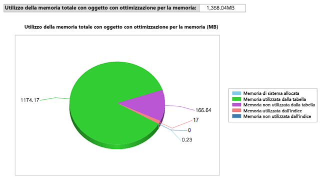

# <a name="monitor-and-troubleshoot-memory-usage"></a>Monitorare e risolvere i problemi relativi all'utilizzo della memoria
  [!INCLUDE[hek_1](../../includes/hek-1-md.md)] utilizza la memoria in modi diversi rispetto alle tabelle basate su disco. È possibile monitorare la quantità di memoria allocata e utilizzata dagli indici e dalle tabelle con ottimizzazione per la memoria nel database tramite DMV o contatori delle prestazioni forniti per il sottosistema di Garbage Collection e memoria.  Ciò offre visibilità a livello di sistema e di database e consente di evitare problemi dovuti all'esaurimento della memoria.  
  
 In questo argomento viene illustrato il monitoraggio dell'utilizzo della memoria di [!INCLUDE[hek_2](../../includes/hek-2-md.md)] .  
  
## <a name="sections-in-this-topic"></a>Sezioni dell'argomento  
  
-   [Creare un database di esempio con tabelle con ottimizzazione per la memoria](../../relational-databases/in-memory-oltp/monitor-and-troubleshoot-memory-usage.md#bkmk_CreateDB)  
  
-   [Monitoraggio dell'utilizzo della memoria](../../relational-databases/in-memory-oltp/monitor-and-troubleshoot-memory-usage.md#bkmk_Monitoring)  
  
    -   [Utilizzo di SQL Server Management Studio](../../relational-databases/in-memory-oltp/monitor-and-troubleshoot-memory-usage.md#bkmk_UsingSSMS)  
  
    -   [Utilizzo di DMVs](../../relational-databases/in-memory-oltp/monitor-and-troubleshoot-memory-usage.md#bkmk_UsingDMVs)  
  
-   [Gestione della memoria utilizzata dagli oggetti con ottimizzazione per la memoria](../../relational-databases/in-memory-oltp/monitor-and-troubleshoot-memory-usage.md#bkmk_MemOptObjects)  
  
-   [Risoluzione dei problemi relativi alla memoria](../../relational-databases/in-memory-oltp/monitor-and-troubleshoot-memory-usage.md#bkmk_Troubleshooting)  
  
##  <a name="bkmk_CreateDB"></a> Creare un database di esempio con tabelle con ottimizzazione per la memoria  
 Se si dispone già di un database con tabelle con ottimizzazione per la memoria è possibile saltare questa sezione.  
  
 Con i passaggi seguenti si crea un database con tre tabelle con ottimizzazione per la memoria che è possibile utilizzare nelle sezioni rimanenti di questo argomento. Nell'esempio è stato eseguito il mapping del database a un pool di risorse, in modo da poter controllare la quantità di memoria utilizzata dalle tabelle con ottimizzazione per la memoria.  
  
1.  Avviare [!INCLUDE[ssManStudioFull](../../includes/ssmanstudiofull-md.md)].  
  
2.  Fare clic su **Nuova query**.  
  
3.  Incollare il codice nella finestra della nuova query ed eseguire ogni sezione.  
  
    ```  
    -- create a database to be used  
    CREATE DATABASE IMOLTP_DB  
    GO  
  
    ALTER DATABASE IMOLTP_DB ADD FILEGROUP IMOLTP_DB_xtp_fg CONTAINS MEMORY_OPTIMIZED_DATA  
    ALTER DATABASE IMOLTP_DB ADD FILE( NAME = 'IMOLTP_DB_xtp' , FILENAME = 'C:\Data\IMOLTP_DB_xtp') TO FILEGROUP IMOLTP_DB_xtp_fg;  
    GO  
  
    USE IMOLTP_DB  
    GO  
  
    -- create the resoure pool  
    CREATE RESOURCE POOL PoolIMOLTP WITH (MAX_MEMORY_PERCENT = 60);  
    ALTER RESOURCE GOVERNOR RECONFIGURE;  
    GO  
  
    -- bind the database to a resource pool  
    EXEC sp_xtp_bind_db_resource_pool 'IMOLTP_DB', 'PoolIMOLTP'  
  
    -- you can query the binding using the catalog view as described here  
    SELECT d.database_id  
         , d.name  
         , d.resource_pool_id  
    FROM sys.databases d  
    GO  
  
    -- take database offline/online to finalize the binding to the resource pool  
    USE master  
    GO  
  
    ALTER DATABASE IMOLTP_DB SET OFFLINE  
    GO  
    ALTER DATABASE IMOLTP_DB SET ONLINE  
    GO  
  
    -- create some tables  
    USE IMOLTP_DB  
    GO  
  
    -- create table t1  
    CREATE TABLE dbo.t1 (  
           c1 int NOT NULL CONSTRAINT [pk_t1_c1] PRIMARY KEY NONCLUSTERED  
         , c2 char(40) NOT NULL  
         , c3 char(8000) NOT NULL  
         ) WITH (MEMORY_OPTIMIZED = ON, DURABILITY = SCHEMA_AND_DATA)  
    GO  
  
    -- load t1 150K rows  
    DECLARE @i int = 0  
    BEGIN TRAN  
    WHILE (@i <= 150000)  
       BEGIN  
          INSERT t1 VALUES (@i, 'a', replicate ('b', 8000))  
          SET @i += 1;  
       END  
    Commit  
    GO  
  
    -- Create another table, t2  
    CREATE TABLE dbo.t2 (  
           c1 int NOT NULL CONSTRAINT [pk_t2_c1] PRIMARY KEY NONCLUSTERED  
         , c2 char(40) NOT NULL  
         , c3 char(8000) NOT NULL  
         ) WITH (MEMORY_OPTIMIZED = ON, DURABILITY = SCHEMA_AND_DATA)  
    GO  
  
    -- Create another table, t3   
    CREATE TABLE dbo.t3 (  
           c1 int NOT NULL CONSTRAINT [pk_t3_c1] PRIMARY KEY NONCLUSTERED HASH (c1) WITH (BUCKET_COUNT = 1000000)  
         , c2 char(40) NOT NULL  
         , c3 char(8000) NOT NULL  
         ) WITH (MEMORY_OPTIMIZED = ON, DURABILITY = SCHEMA_AND_DATA)  
    GO  
    ```  
  
##  <a name="bkmk_Monitoring"></a> Monitoraggio dell'utilizzo della memoria  
  
###  <a name="bkmk_UsingSSMS"></a> Uso [!INCLUDE[ssManStudioFull](../../includes/ssmanstudiofull-md.md)]  
 [!INCLUDE[ssSQL14](../../includes/sssql14-md.md)] viene fornito con report standard predefiniti per monitorare la memoria utilizzata dalle tabelle in memoria. È possibile accedere a questi report utilizzando Esplora oggetti come descritto [qui](http://blogs.msdn.com/b/managingsql/archive/2006/05/16/ssms-reports-1.aspx). È inoltre possibile utilizzare Esplora oggetti per monitorare la memoria utilizzata dalle singole tabelle con ottimizzazione per la memoria.  
  
#### <a name="consumption-at-the-database-level"></a>Utilizzo a livello di database  
 È possibile monitorare l'utilizzo della memoria a livello di database nel modo seguente.  
  
1.  Avviare [!INCLUDE[ssManStudioFull](../../includes/ssmanstudiofull-md.md)] e connettersi a un server.  
  
2.  In Esplora oggetti fare clic con il pulsante destro del mouse sul database in cui si desidera creare i report.  
  
3.  Dal menu di scelta rapida scegliere **Report** -> **Standard Report** -> **Utilizzo memoria da parte di oggetti con ottimizzazione per la memoria**.  
  
   
  
 In questo report viene indicato l'utilizzo della memoria da parte del database creato in precedenza.  
  
   
  
###  <a name="bkmk_UsingDMVs"></a> Utilizzo di DMVs  
 Sono disponibili alcune DMV per monitorare la memoria utilizzata da tabelle con ottimizzazione per la memoria, indici, oggetti di sistema e strutture di runtime.  
  
#### <a name="memory-consumption-by-memory-optimized-tables-and-indexes"></a>Utilizzo della memoria da parte di indici e tabelle con ottimizzazione per la memoria  
 Per conoscere l'utilizzo della memoria da parte di tutte le tabelle utente, gli indici e gli oggetti di sistema, eseguire una query su `sys.dm_db_xtp_table_memory_stats` come illustrato di seguito.  
  
```tsql  
SELECT object_name(object_id) AS Name  
     , *  
   FROM sys.dm_db_xtp_table_memory_stats  
```  
  
 **Esempio di output**  
  
```  
Name       object_id   memory_allocated_for_table_kb memory_used_by_table_kb memory_allocated_for_indexes_kb memory_used_by_indexes_kb  
---------- ----------- ----------------------------- ----------------------- ------------------------------- -------------------------  
t3         629577281   0                             0                       128                             0  
t1         565577053   1372928                       1200008                 7872                            1942  
t2         597577167   0                             0                       128                             0  
NULL       -6          0                             0                       2                               2  
NULL       -5          0                             0                       24                              24  
NULL       -4          0                             0                       2                               2  
NULL       -3          0                             0                       2                               2  
NULL       -2          192                           25                      16                              16  
```  
  
 Per altre informazioni, vedere [sys.dm_db_xtp_table_memory_stats](../../relational-databases/system-dynamic-management-views/sys-dm-db-xtp-table-memory-stats-transact-sql.md).  
  
#### <a name="memory-consumption-by-internal-system-structures"></a>Utilizzo della memoria da parte delle strutture di sistema interne  
 La memoria viene utilizzata anche dagli oggetti di sistema, ad esempio le strutture transazionali, i buffer per file di dati e differenziali, le strutture di Garbage Collection e altro ancora. Per conoscere la memoria utilizzata da parte di questi oggetti di sistema, eseguire una query su `sys.dm_xtp_system_memory_consumers` come illustrato di seguito.  
  
```tsql  
SELECT memory_consumer_desc  
     , allocated_bytes/1024 AS allocated_bytes_kb  
     , used_bytes/1024 AS used_bytes_kb  
     , allocation_count  
   FROM sys.dm_xtp_system_memory_consumers  
```  
  
 **Esempio di output**  
  
```  
memory_consumer_ desc allocated_bytes_kb   used_bytes_kb        allocation_count  
------------------------- -------------------- -------------------- ----------------  
VARHEAP                   0                    0                    0  
VARHEAP                   384                  0                    0  
DBG_GC_OUTSTANDING_T      64                   64                   910  
ACTIVE_TX_MAP_LOOKAS      0                    0                    0  
RECOVERY_TABLE_CACHE      0                    0                    0  
RECENTLY_USED_ROWS_L      192                  192                  261  
RANGE_CURSOR_LOOKSID      0                    0                    0  
HASH_CURSOR_LOOKASID      128                  128                  455  
SAVEPOINT_LOOKASIDE       0                    0                    0  
PARTIAL_INSERT_SET_L      192                  192                  351  
CONSTRAINT_SET_LOOKA      192                  192                  646  
SAVEPOINT_SET_LOOKAS      0                    0                    0  
WRITE_SET_LOOKASIDE       192                  192                  183  
SCAN_SET_LOOKASIDE        64                   64                   31  
READ_SET_LOOKASIDE        0                    0                    0  
TRANSACTION_LOOKASID      448                  448                  156  
PGPOOL:256K               768                  768                  3  
PGPOOL: 64K               0                    0                    0  
PGPOOL:  4K               0                    0                    0  
```  
  
 Per altre informazioni, vedere [sys.dm_xtp_system_memory_consumers &#40;Transact-SQL&#41;](../../relational-databases/system-dynamic-management-views/sys-dm-xtp-system-memory-consumers-transact-sql.md).  
  
#### <a name="memory-consumption-at-run-time-when-accessing-memory-optimized-tables"></a>Utilizzo della memoria in fase di esecuzione quando si accede alle tabelle con ottimizzazione per la memoria  
 Per determinare la memoria utilizzata dalle strutture di runtime, ad esempio la cache delle procedure, eseguire la query riportata di seguito. Tutte le strutture di runtime sono contrassegnate con XTP.  
  
```tsql  
SELECT memory_object_address  
     , pages_in_bytes  
     , bytes_used  
     , type  
   FROM sys.dm_os_memory_objects WHERE type LIKE '%xtp%'  
```  
  
 **Esempio di output**  
  
```  
memory_object_address pages_ in_bytes bytes_used type  
--------------------- ------------------- ---------- ----  
0x00000001F1EA8040    507904              NULL       MEMOBJ_XTPDB  
0x00000001F1EAA040    68337664            NULL       MEMOBJ_XTPDB  
0x00000001FD67A040    16384               NULL       MEMOBJ_XTPPROCCACHE  
0x00000001FD68C040    16384               NULL       MEMOBJ_XTPPROCPARTITIONEDHEAP  
0x00000001FD284040    16384               NULL       MEMOBJ_XTPPROCPARTITIONEDHEAP  
0x00000001FD302040    16384               NULL       MEMOBJ_XTPPROCPARTITIONEDHEAP  
0x00000001FD382040    16384               NULL       MEMOBJ_XTPPROCPARTITIONEDHEAP  
0x00000001FD402040    16384               NULL       MEMOBJ_XTPPROCPARTITIONEDHEAP  
0x00000001FD482040    16384               NULL       MEMOBJ_XTPPROCPARTITIONEDHEAP  
0x00000001FD502040    16384               NULL       MEMOBJ_XTPPROCPARTITIONEDHEAP  
0x00000001FD67E040    16384               NULL       MEMOBJ_XTPPROCPARTITIONEDHEAP  
0x00000001F813C040    8192                NULL       MEMOBJ_XTPBLOCKALLOC  
0x00000001F813E040    16842752            NULL       MEMOBJ_XTPBLOCKALLOC  
```  
  
 Per altre informazioni, vedere [sys.dm_os_memory_objects (Transact-SQL)](../../relational-databases/system-dynamic-management-views/sys-dm-os-memory-objects-transact-sql.md).  
  
#### <a name="memory-consumed-by-includehek2includeshek-2-mdmd-engine-across-the-instance"></a>Memoria utilizzata dal motore [!INCLUDE[hek_2](../../includes/hek-2-md.md)] nell'istanza  
 La memoria allocata al motore [!INCLUDE[hek_2](../../includes/hek-2-md.md)] e agli oggetti con ottimizzazione per la memoria viene gestita in modo analogo a qualsiasi altro consumer di memoria all'interno dell'istanza di [!INCLUDE[ssNoVersion](../../includes/ssnoversion-md.md)] . I clerk di tipo MEMORYCLERK_XTP tengono conto di tutta la memoria allocata al motore [!INCLUDE[hek_2](../../includes/hek-2-md.md)] . Utilizzare la query seguente per trovare tutta la memoria utilizzata dal motore [!INCLUDE[hek_2](../../includes/hek-2-md.md)] .  
  
```tsql  
-- this DMV accounts for all memory used by the hek_2 engine  
SELECT type  
     , name  
     , memory_node_id  
     , pages_kb/1024 AS pages_MB   
   FROM sys.dm_os_memory_clerks WHERE type LIKE '%xtp%'  
```  
  
 Nell'output campione viene mostrato che la memoria totale allocata corrisponde all'utilizzo di memoria a livello di sistema pari a 18 MB e 1358 MB allocati a un ID 5 del database. Poiché viene eseguito il mapping di questo database a un pool di risorse dedicato, questa memoria incide sul pool di risorse in questione.  
  
 **Esempio di output**  
  
```  
type                 name       memory_node_id pages_MB  
-------------------- ---------- -------------- --------------------  
MEMORYCLERK_XTP      Default    0              18  
MEMORYCLERK_XTP      DB_ID_5    0              1358  
MEMORYCLERK_XTP      Default    64             0  
```  
  
 Per altre informazioni, vedere [sys.dm_os_memory_clerks (Transact-SQL)](../../relational-databases/system-dynamic-management-views/sys-dm-os-memory-clerks-transact-sql.md).  
  
##  <a name="bkmk_MemOptObjects"></a> Gestione della memoria utilizzata dagli oggetti con ottimizzazione per la memoria  
 È possibile controllare la memoria totale utilizzata dalle tabelle con ottimizzazione per la memoria mediante l'associazione a un pool di risorse denominato, come descritto nell'argomento [Associare un database con tabelle con ottimizzazione per la memoria a un pool di risorse](../../relational-databases/in-memory-oltp/bind-a-database-with-memory-optimized-tables-to-a-resource-pool.md).  
  
##  <a name="bkmk_Troubleshooting"></a> Risoluzione dei problemi relativi alla memoria  
 La risoluzione dei problemi relativi alla memoria è un processo in tre passaggi:  
  
1.  Identificare la quantità di memoria utilizzata dagli oggetti nel database o nell'istanza. È possibile utilizzare un'ampia gamma di strumenti di monitoraggio disponibili per le tabelle con ottimizzazione per la memoria, come indicato in precedenza.  Ad esempio, le DMV `sys.dm_db_xtp_table_memory_stats` o `sys.dm_os_memory_clerks`.  
  
2.  Determinare la crescita dell'utilizzo della memoria e quanto spazio disponibile rimane. Attraverso il monitoraggio periodico dell'utilizzo della memoria è possibile capire la relativa modalità di crescita. Ad esempio, se è stato eseguito il mapping del database a un pool di risorse denominato, è possibile monitorare il contatore delle prestazioni Memoria utilizzata (KB) per capire come cresce la memoria.  
  
3.  Adottare misure adeguate per contenere i potenziali problemi di memoria. Per altre informazioni, vedere [Risolvere i problemi di memoria insufficiente](../../relational-databases/in-memory-oltp/resolve-out-of-memory-issues.md).  
  
## <a name="see-also"></a>Vedere anche  
 [Associare un database con tabelle con ottimizzazione per la memoria a un pool di risorse](../../relational-databases/in-memory-oltp/bind-a-database-with-memory-optimized-tables-to-a-resource-pool.md)   
 [Modificare il valore di MIN_MEMORY_PERCENT e MAX_MEMORY_PERCENT in un pool esistente](../../relational-databases/in-memory-oltp/bind-a-database-with-memory-optimized-tables-to-a-resource-pool.md#bkmk_ChangeAllocation)  
  
  
