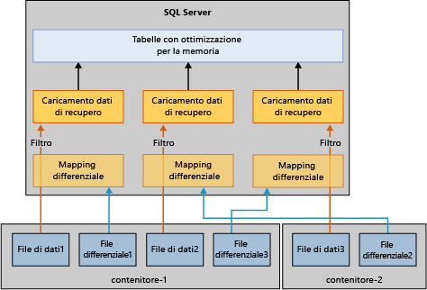

# Ripristinare e recuperare tabelle con ottimizzazione per la memoria
[!INCLUDE[tsql-appliesto-ss2016-xxxx-xxxx-xxx_md](../../includes/tsql-appliesto-ss2016-xxxx-xxxx-xxx-md.md)]

  Il meccanismo di base per recuperare o ripristinare un database con tabelle con ottimizzazione per la memoria è simile a quello per i database che hanno solo tabelle basate su disco. A differenza delle tabelle basate su disco, le tabelle con ottimizzazione per la memoria devono essere caricate in memoria prima di rendere disponibile il database per l'accesso utente. Si tratta di un nuovo passaggio nel processo di recupero del database.  
  
 Durante le operazioni di recupero o ripristino, il motore di OLTP in memoria legge i file di dati e differenziali per il caricamento nella memoria fisica. Il tempo di caricamento viene determinato dai seguenti fattori:  
  
-   Quantità di dati da caricare.  
  
-   Larghezza di banda per operazioni di I/O sequenziali.  
  
-   Grado di parallelismo, determinato dal numero di file contenitori e di core del processore.  
  
-   Quantità di record di log nella parte attiva del log che devono essere ripetuti.  
  
 Al riavvio di [!INCLUDE[ssNoVersion](../../includes/ssnoversion-md.md)] , ogni database attraversa una fase di recupero suddivisa in tre parti:  
  
1.  Fase di analisi. Durante questa fase, viene eseguito un passaggio nei log delle transazioni attivi per rilevare le transazioni di cui è stato eseguito il commit e di cui non è stato eseguito il commit. Il motore OLTP in memoria identifica il checkpoint per caricare e precaricare le voci di log della tabella di sistema. Elabora inoltre alcuni record di log delle allocazioni di file.  
  
2.  Fase di rollforward. Questa fase viene eseguita contemporaneamente sia nelle tabelle basate su disco sia in quelle con ottimizzazione per la memoria.  
  
     Per le tabelle basate su disco, il database viene spostato al momento corrente e acquisisce i blocchi utilizzati dalle transazioni di cui non è stato eseguito il commit.  
  
     Per le tabelle con ottimizzazione per la memoria, i dati dalle coppie di file di dati e differenziali vengono caricati in memoria e aggiornati con il log delle transazioni attivo basato sull'ultimo checkpoint durevole.  
  
     Quando vengono completate le operazioni riportate sopra per le tabelle basate su disco e le tabelle con ottimizzazione per la memoria, il database è disponibile per l'accesso.  
  
3.  Fase di rollback. In questa fase, viene effettuato il rollback delle transazioni di cui non è stato eseguito il commit.  
  
 Il caricamento delle tabelle con ottimizzazione per la memoria può influire sul tempo necessario per il pieno recupero dell'operatività (RTO, Recovery Time Objective). Per migliorare il tempo di caricamento dei dati con ottimizzazione per la memoria dai file di dati e differenziali, il motore OLTP in memoria carica i file di dati e differenziali in parallelo nel modo seguente:  
  
-   Creazione di un filtro mappa differenziale. I file differenziali archiviano i riferimenti alle righe eliminate. Un thread per contenitore legge i file differenziali e crea un filtro mappa differenziale. In un filegroup di dati con ottimizzazione per la memoria possono essere presenti più contenitori.  
  
-   Flusso dei file di dati.  Alla creazione del filtro mappa differenziale, i file di dati vengono letti utilizzando un numero di thread equivalente al numero di CPU logiche. Ogni thread che legge il file di dati legge le righe di dati, controlla la mappa differenziale associata e inserisce la riga nella tabella solo se tale riga non è stata contrassegnata come eliminata. Questa parte del recupero può essere associata alla CPU in alcuni casi riportati di seguito.  
  
   
  
 Le tabelle con ottimizzazione per la memoria possono in genere essere caricate in memoria alla velocità di I/O, ma in alcuni casi il caricamento delle righe di dati in memoria è più lento. Alcuni casi specifici sono i seguenti:  
  
-   Un numero di bucket basso per l'indice hash può portare a conflitti eccessivi rallentando gli inserimenti delle righe di dati. Ciò comporta in genere un utilizzo elevato della CPU per l'intero processo, in particolare verso la fine del recupero. Se l'indice hash è stato configurato correttamente, non dovrebbe influire sul tempo di recupero.  
  
-   L'utilizzo della CPU può risultare elevato per le tabelle con ottimizzazione per la memoria di grandi dimensioni con uno o più indici non cluster in quanto, a differenza di un indice hash in cui il numero di bucket è stabilito al momento della creazione, gli indici non cluster aumentano in modo dinamico.  
  
## Vedere anche  
 [Eseguire il backup, ripristinare e recuperare tabelle con ottimizzazione per la memoria](http://msdn.microsoft.com/library/3f083347-0fbb-4b19-a6fb-1818d545e281)  
  
  
