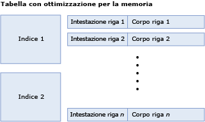
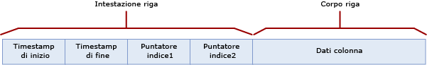
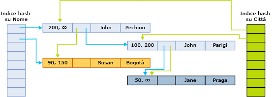

# Dimensioni di tabelle e righe per le tabelle con ottimizzazione per la memoria
[!INCLUDE[tsql-appliesto-ss2016-asdb-xxxx-xxx_md](../../includes/tsql-appliesto-ss2016-asdb-xxxx-xxx-md.md)]

  Una tabella con ottimizzazione per la memoria è costituita da una raccolta di righe e di indici contenenti i puntatori alle righe. In una tabella con ottimizzazione per la memoria i dati all'interno di righe non possono essere più lunghi di 8.060 byte. Tuttavia, a partire da [!INCLUDE[ssSQL15](../../includes/sssql15-md.md)] è possibile creare una tabella con più colonne di grandi dimensioni, ad esempio, più colonne varbinary(8000), e colonne LOB, ad esempio, varbinary(max), varchar(max) e nvarchar(max). Le colonne che superano le dimensioni massime per i dati all'interno di righe vengono inserite all'esterno delle righe, in speciali tabelle interne. Per informazioni dettagliate su queste tabelle interne, vedere [sys.memory_optimized_tables_internal_attributes &#40;Transact-SQL&#41;](../../relational-databases/system-catalog-views/sys-memory-optimized-tables-internal-attributes-transact-sql.md).
  
 Esistono due motivi per calcolare le dimensioni di righe e tabelle:  
  
-   Quanta memoria viene utilizzata da una tabella?  
  
    -   La quantità di memoria utilizzata dalla tabella non può essere calcolata esattamente. Molti fattori influiscono su tale quantità, ad esempio l'allocazione della memoria basata sul paging, la località, la memorizzazione nella cache e il riempimento. Un altro fattore può essere la presenza di più versioni delle righe a cui sono associate transazioni attive o che sono in attesa di Garbage Collection.  
  
    -   Le dimensioni minime richieste per i dati e gli indici nella tabella si ottengono con il calcolo di [table size] descritto di seguito.  
  
    -   Il calcolo dell'utilizzo della memoria è nella migliore delle ipotesi un'approssimazione ed è consigliabile includere la pianificazione della capacità nei piani di distribuzione.  
  
-   Quali sono le dimensioni dei dati di una riga? Tali dimensioni rientrano nel limite di 8.060 byte? Per rispondere a queste domande, utilizzare il calcolo di [row body size] descritto di seguito.  

Le colonne che superano le dimensioni massime delle righe di 8060 byte vengono inserite all'esterno delle righe, in una tabella interna separata. Ogni colonna all'esterno delle righe ha una corrispondente tabella interna, che a sua volta ha un indice non cluster. Per informazioni dettagliate sulle tabelle interne usate per le colonne all'esterno delle righe, vedere [sys.memory_optimized_tables_internal_attributes &#40;Transact-SQL&#41;](../../relational-databases/system-catalog-views/sys-memory-optimized-tables-internal-attributes-transact-sql.md). 
  
 Nella figura seguente viene illustrata una tabella con indici e righe, che a loro volta contengono intestazioni e corpi di riga:  
  
   
Tabella con ottimizzazione per la memoria, costituita da indici e righe.  
  
 Le dimensioni in memoria di una tabella, in byte, vengono calcolate come segue:  
  
```  
[table size] = [size of index 1] + … + [size of index n] + ([row size] * [row count])  
```  
  
 Le dimensioni di un indice hash vengono fissate al momento della creazione della tabella e dipendono dal numero effettivo di bucket. Il valore di bucket_count specificato con la specifica dell'indice viene arrotondato per eccesso alla più vicina potenza di 2 per ottenere il valore [actual bucket count]. Ad esempio, se il valore di bucket_count specificato è 100.000, il valore di [actual bucket count] per l'indice è 131.072.  
  
```  
[hash index size] = 8 * [actual bucket count]  
```  

 Le dimensioni di un indice non cluster corrispondono a `[row count] * [index key size]`.
  
 Le dimensioni delle righe vengono calcolate aggiungendo l'intestazione e il corpo:  
  
```  
[row size] = [row header size] + [actual row body size]  
[row header size] = 24 + 8 * [number of indices]  
```  
  
 **Dimensioni del corpo delle righe**  
  
 Il calcolo di [row body size] viene descritto nella tabella seguente.  
  
 Le dimensioni del corpo delle righe possono essere considerate da due punti di vista diversi, le dimensioni calcolate e le dimensioni effettive, come illustrato di seguito.  
  
-   Le dimensioni calcolate, indicate con [computed row body size], vengono utilizzate per determinare se il limite di dimensione di 8.060 byte viene superato.  
  
-   Le dimensioni effettive, indicate con [actual row body size], rappresentano le dimensioni di archiviazione effettive del corpo delle righe in memoria e nei file del checkpoint.  
  
 Entrambi i valori di [computed row body size] e [actual row body size] vengono calcolati in modo analogo. L'unica differenza è il calcolo delle dimensioni delle colonne (n)varchar(i) e varbinary(i), come evidenziato nella parte inferiore della tabella seguente. Per le dimensioni calcolate del corpo delle righe viene usata la dimensione dichiarata *i* come dimensione della colonna, mentre per le dimensioni effettive del corpo delle righe viene usata la dimensione effettiva dei dati.  
  
 Nella tabella seguente viene descritto il calcolo delle dimensioni del corpo delle righe, fornito come [actual row body size] = SUM ([size of shallow types) + 2 + 2 * [number of deep type columns].  
  
|Sezione|Dimensione|Commenti|  
|-------------|----------|--------------|  
|Colonne di tipo superficiale|SUM([size of shallow types]). Le dimensioni in byte dei singoli tipi sono le seguenti:<br /><br /> **Bit**: 1<br /><br /> **Tinyint**: 1<br /><br /> **Smallint**: 2<br /><br /> **Int**: 4<br /><br /> **Real**: 4<br /><br /> **Smalldatetime**: 4<br /><br /> **Smallmoney**: 4<br /><br /> **Bigint**: 8<br /><br /> **Datetime**: 8<br /><br /> **Datetime2**: 8<br /><br /> **Float**: 8<br /><br /> **Money**: 8<br /><br /> **Numeric** (precisione <=18): 8<br /><br /> **Time**: 8<br /><br /> **Numeric**(precisione >18): 16<br /><br /> **Uniqueidentifier**: 16||  
|Riempimento delle colonne superficiali|I valori possibili sono:<br /><br /> 1 se esistono colonne di tipo approfondito e le dimensioni totali dei dati delle colonne superficiali sono un numero dispari.<br /><br /> In caso contrario, 0|I tipi approfonditi sono i tipi (var)binary e (n)(var)char.|  
|Matrice di offset delle colonne di tipo approfondito|I valori possibili sono:<br /><br /> 0 se non sono disponibili colonne di tipo approfondito<br /><br /> 2 + 2 * [number of deep type columns] in caso contrario|I tipi approfonditi sono i tipi (var)binary e (n)(var)char.|  
|Matrice NULL|[number of nullable columns] / 8, arrotondato per eccesso ai byte completi.|La matrice dispone di un bit per ogni colonna che ammette i valori Null. Il valore viene arrotondato per eccesso ai byte completi.|  
|Riempimento della matrice NULL|I valori possibili sono:<br /><br /> 1 se esistono colonne di tipo approfondito e le dimensioni della matrice NULL sono un numero dispari di byte.<br /><br /> In caso contrario, 0|I tipi approfonditi sono i tipi (var)binary e (n)(var)char.|  
|Spaziatura interna|0 se non sono disponibili colonne di tipo approfondito<br /><br /> Se sono disponibili colonne di tipo approfondito, vengono aggiunti 0-7 byte di riempimento, in base al maggiore allineamento richiesto da una colonna superficiale. Ogni colonna superficiale richiede un allineamento uguale alle sue dimensioni, come descritto in precedenza, ad eccezione delle colonne GUID che richiedono l'allineamento di 1 byte (non 16) e delle colonne numeriche che richiedono sempre l'allineamento di 8 byte (mai 16). Viene utilizzato il requisito di maggiore allineamento tra tutte le colonne superficiali e vengono aggiunti 0-7 byte di riempimento in modo tale che le dimensioni totali fino a questo punto (senza le colonne di tipo approfondito) siano un multiplo dell'allineamento richiesto.|I tipi approfonditi sono i tipi (var)binary e (n)(var)char.|  
|Colonne di tipo approfondito a lunghezza fissa|SUM([size of fixed length deep type columns])<br /><br /> Le dimensioni di ogni colonna sono le seguenti:<br /><br /> i per char(i) e binary(i).<br /><br /> 2 * i per nchar(i)|Le colonne di tipo approfondito a lunghezza fissa sono le colonne di tipo char(i), nchar(i) o binary(i).|  
|Colonne di tipo approfondito a lunghezza variabile [computed size]|SUM([computed size of variable length deep type columns])<br /><br /> Le dimensioni calcolate di ogni colonna sono le seguenti:<br /><br /> i per varchar(i) e varbinary(i)<br /><br /> 2 * i per nvarchar(i)|Questa riga si riferiva solo a [computed row body size].<br /><br /> Le colonne di tipo approfondito a lunghezza variabile sono le colonne di tipo varchar(i), nvarchar(i) o varbinary(i). Le dimensioni calcolate sono determinate dalla lunghezza massima (i) della colonna.|  
|Colonne di tipo approfondito a lunghezza variabile [actual size]|SUM([actual size of variable length deep type columns])<br /><br /> Le dimensioni effettive di ogni colonna sono le seguenti:<br /><br /> n, dove n è il numero di caratteri archiviato nella colonna, per varchar(i).<br /><br /> 2 * n, dove n è il numero di caratteri archiviato nella colonna, per nvarchar(i).<br /><br /> n, dove n è il numero di byte archiviato nella colonna, per varbinary(i).|Questa riga si riferiva solo a [actual row body size].<br /><br /> Le dimensioni effettive sono determinate dai dati archiviati nelle colonne della riga.|  
  
##  <a name="bkmk_RowStructure"></a> Struttura di righe  
 Le righe di una tabella con ottimizzazione per la memoria includono i componenti seguenti:  
  
-   L'intestazione di riga contiene il timestamp necessario per implementare il controllo delle versioni delle righe. L'intestazione di riga contiene inoltre il puntatore dell'indice per implementare il concatenamento di righe nei bucket di hash (descritti in precedenza).  
  
-   Il corpo della riga contiene i dati effettivi della colonna, che includono le informazioni ausiliarie come la matrice Null per le colonne che ammettono i valori Null e la matrice di offset per i tipi di dati a lunghezza variabile.  
  
 Nella figura seguente viene illustrata la struttura di righe per una tabella con due indici:  
  
   
  
 I timestamp di inizio e fine indicano il periodo in cui è valida una versione di riga specifica. Le transazioni che iniziano in questo intervallo possono rilevare questa versione di riga. Per altri dettagli, vedere [Transactions in Memory-Optimized Tables](../../relational-databases/in-memory-oltp/transactions-with-memory-optimized-tables.md) (Transazioni con tabelle con ottimizzazione per la memoria).  
  
 I puntatori dell'indice puntano alla riga successiva della catena che appartiene al bucket di hash. Nella figura seguente viene illustrata la struttura di una tabella con due colonne (nome, città) e con due indici, uno per il nome della colonna e uno per la città.  
  
   
  
 Nella figura, per i nomi John e Jane viene eseguito l'hashing al primo bucket. Per Susan viene eseguito l'hashing al secondo bucket. Per le città Pechino e Bogotà viene eseguito l'hashing al primo bucket. Per Parigi e Praga viene eseguito l'hashing al secondo bucket.  
  
 Le catene per l'indice hash sul nome sono pertanto le seguenti:  
  
-   Primo bucket: (John, Pechino); (John, Parigi); (Jane, Praga)  
  
-   Secondo bucket: (Susan, Bogotà)  
  
 Le catene per l'indice sulla città sono le seguenti:  
  
-   Primo bucket: (John, Pechino), (Susan, Bogotà)  
  
-   Secondo bucket: (John, Parigi), (Jane, Praga)  
  
 Un timestamp di fine ∞ (infinito) indica che si tratta della versione attualmente valida per le righe. La riga non è stata aggiornata o eliminata dopo la scrittura di questa versione di riga.  
  
 Per un'ora maggiore di 200, la tabella contiene le righe seguenti:  
  
|Nome|City|  
|----------|----------|  
|John|Pechino|  
|Jane|Praga|  
  
 Tuttavia, le eventuali transazioni attive con un'ora di inizio 100 rileveranno la seguente versione della tabella:  
  
|Nome|City|  
|----------|----------|  
|John|Parigi|  
|Jane|Praga|  
|Susan|Bogotà|  
  
##  <a name="bkmk_ExampleComputation"></a> Esempio: calcolo delle dimensioni della tabella e delle righe  
 Per gli indici hash il numero effettivo di bucket viene arrotondato alla più vicina potenza di 2. Ad esempio, se il valore di bucket_count specificato è 100.000, il numero effettivo di bucket per l'indice è 131.072.  
  
 Si consideri una tabella Orders con la definizione seguente:  
  
```tsql  
CREATE TABLE dbo.Orders (  
     OrderID int NOT NULL   
           PRIMARY KEY NONCLUSTERED,  
     CustomerID int NOT NULL   
           INDEX IX_CustomerID HASH WITH (BUCKET_COUNT=10000),  
     OrderDate datetime NOT NULL,  
     OrderDescription nvarchar(1000)  
) WITH (MEMORY_OPTIMIZED=ON)  
GO  
```  
  
 Si noti che questa tabella include un indice hash e un indice non cluster (chiave primaria). Dispone inoltre di tre colonne a lunghezza fissa e una colonna a lunghezza variabile; una delle colonne ammette i valori Null (OrderDescription). Si supponga che la tabella Orders contenga 8379 righe e che la lunghezza media dei valori della colonna OrderDescription sia 78 caratteri.  
  
 Per determinare le dimensioni della tabella, è innanzitutto necessario determinare le dimensioni degli indici. Il valore di bucket_count per entrambi gli indici è specificato come 10.000. Questo valore viene arrotondato per eccesso alla più vicina potenza di 2: 16.384. Pertanto, le dimensioni totali degli indici della tabella Orders sono:  
  
```  
8 * 16384 = 131072 bytes  
```  
  
 Il valore restante corrisponde alle dimensioni dei dati della tabella, ovvero:  
  
```  
[row size] * [row count] = [row size] * 8379  
```  
  
 (La tabella di esempio contiene 8.379 righe). A questo punto:  
  
```  
[row size] = [row header size] + [actual row body size]  
[row header size] = 24 + 8 * [number of indices] = 24 + 8 * 1 = 32 bytes  
```  
  
 Si calcoli quindi [actual row body size]:  
  
-   Colonne di tipo superficiale:  
  
    ```  
    SUM([size of shallow types]) = 4 [int] + 4 [int] + 8 [datetime] = 16  
    ```  
  
-   Il riempimento delle colonne superficiali è 0, in quanto le dimensioni totali delle colonne superficiali sono un numero pari.  
  
-   Matrice di offset delle colonne di tipo approfondito:  
  
    ```  
    2 + 2 * [number of deep type columns] = 2 + 2 * 1 = 4  
    ```  
  
-   Matrice NULL = 1  
  
-   Riempimento matrice NULL = 1, in quanto le dimensioni della matrice NULL sono un numero dispari ed è presente una colonna di tipo approfondito.  
  
-   Spaziatura interna  
  
    -   8 è il requisito di allineamento maggiore.  
  
    -   Fino a questo punto le dimensioni corrispondono a 16 + 0 + 4 + 1 + 1 = 22.  
  
    -   Il multiplo più vicino di 8 è 24.  
  
    -   Il riempimento totale è 24 - 22 = 2 byte.  
  
-   Non sono presenti colonne di tipo approfondito a lunghezza fissa (colonne di tipo approfondito a lunghezza fissa: 0).  
  
-   Le dimensioni effettive della colonna di tipo approfondito sono 2 * 78 = 156. La sola colonna di tipo approfondito OrderDescription è di tipo nvarchar.  
  
```  
[actual row body size] = 24 + 156 = 180 bytes  
```  
  
 Per completare il calcolo:  
  
```  
[row size] = 32 + 180 = 212 bytes  
[table size] = 8 * 16384 + 212 * 8379 = 131072 + 1776348 = 1907420  
```  
  
 Le dimensioni totali in memoria della tabella sono quindi 2 MB circa. Questo calcolo non tiene conto del potenziale overhead sostenuto dall'allocazione di memoria nonché dell'eventuale controllo delle versioni delle righe richiesto per le transazioni che accedono a questa tabella.  
  
 L'effettiva memoria allocata e utilizzata dalla tabella e dai relativi indici può essere ottenuta tramite la query seguente:  
  
```tsql  
select * from sys.dm_db_xtp_table_memory_stats  
where object_id = object_id('dbo.Orders')  
```  
  
## Vedere anche  
 [Tabelle con ottimizzazione per la memoria](../../relational-databases/in-memory-oltp/memory-optimized-tables.md)  
  
  