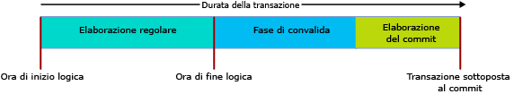

# Transactions with Memory-Optimized Tables
[!INCLUDE[tsql-appliesto-ss2016-asdb-xxxx-xxx_md](../../includes/tsql-appliesto-ss2016-asdb-xxxx-xxx-md.md)]

  
Questo articolo descrive tutti gli aspetti delle transazioni specifici per le tabelle con ottimizzazione per la memoria e le stored procedure compilate in modo nativo.  
  
I livelli di isolamento delle transazioni in SQL Server si applicano in modo diverso alle tabelle con ottimizzazione per la memoria e alle tabelle basate su disco rigido e i meccanismi sottostanti sono diversi. Capire le differenze consente al programmatore di progettare un sistema con velocità effettiva elevata. L'obiettivo di integrità delle transazioni è condiviso in tutti i casi.  

Per le condizioni di errore specifiche per le transazioni nelle tabelle con ottimizzazione per la memoria, passare alla sezione [Rilevamento dei conflitti e logica di ripetizione dei tentativi](#confdetretry34ni).
  
Per informazioni generali, vedere [SET TRANSACTION ISOLATION LEVEL (Transact-SQL)](../../t-sql/statements/set-transaction-isolation-level-transact-sql.md).  
  
  
  
#### Sezioni dell'articolo:  
  
- [Approccio pessimistico e approccio ottimistico](#pessvoptim22ni)  
- [Modalità di avvio della transazione](#txninitmodes24ni)  
  - [Esempio di codice con modalità esplicita](#codeexamexpmode25ni)  
- [Controllo delle versioni delle righe](#rowver28ni)  
- [Livelli di isolamento delle transazioni](#confdegreeiso30ni)  
- [Fasi e durata delle transazioni](#txnphaslife32ni)  
- [Rilevamento dei conflitti e logica di ripetizione dei tentativi](#confdetretry34ni)  
  - [Esempio di codice di ripetizione T-SQL](#retrytsqlcodeexam35ni)  
- [Transazione tra contenitori](#crossconttxn38ni)  
- [Limitazioni](#limitations40ni)  
- [Stored procedure compilate in modo nativo](#natcompstorprocs42ni)  
- [Altri collegamenti relativi alle transazioni](#othertxnlinks44ni)  
  
  
  
<a name="pessvoptim22ni"/>  
  
## Approccio pessimistico e approccio ottimistico  
  
Le differenze funzionali sono dovute a un diverso approccio, ottimistico o pessimistico, all'integrità delle transazioni. Le tabelle con ottimizzazione per la memoria usano l'approccio ottimistico:  
  
- L'approccio pessimistico usa i blocchi per fermare i potenziali conflitti prima che si verifichino. I blocchi vengono acquisiti quando l'istruzione viene eseguita e vengono rilasciati quando viene eseguito il commit della transazione.  
  
- L'approccio ottimistico rileva i conflitti nel momento in cui si verificano ed esegue i controlli di convalida in fase di commit.  
  - L'errore 1205, un deadlock, non può verificarsi per una tabella con ottimizzazione per la memoria.  
  
L'approccio ottimistico implica un sovraccarico minore ed è in genere più efficiente, in parte perché i conflitti di transazioni non sono comuni nella maggior parte delle applicazioni. La principale differenza funzionale tra l'approccio ottimistico e quello pessimistico è il fatto che, in caso di conflitto, con l'approccio pessimistico si attende, mentre con l'approccio ottimistico una delle transazioni ha esito negativo e deve essere riprovata dal client. Le differenze funzionali sono maggiori quando è attivato il livello di isolamento REPEATABLE READ e raggiungono il massimo grado per il livello SERIALIZABLE.  
  
<a name="txninitmodes24ni"/>  
  
## Modalità di avvio della transazione  
  
SQL può avviare le transazioni con le modalità seguenti:  
  
- **Commit automatico** : l'inizio di una semplice query o istruzione DML apre in modo implicito una transazione e la fine di questa istruzione esegue implicitamente il commit della transazione stessa. Impostazione predefinita.  
  - In modalità autocommit non è di solito necessario codificare un hint di tabella sul livello di isolamento delle transazioni nella tabella con ottimizzazione per la memoria nella clausola FROM.  
  
- **Esplicita** : Transact-SQL contiene il codice BEGIN TRANSACTION, insieme a un eventuale COMMIT TRANSACTION. Due o più istruzioni possono essere riunite nella stessa transazione.  
  - In modalità esplicita è necessario usare l'opzione di database MEMORY_OPTIMIZED_ELEVATE_TO_SNAPSHOT o codificare un hint di tabella sul livello di isolamento della transazione nella tabella con ottimizzazione per la memoria nella clausola FROM.  
  
- **Implicita** : quando è attiva SET IMPLICIT_TRANSACTION ON. Probabilmente IMPLICIT_BEGIN_TRANSACTION sarebbe un nome migliore, poiché questa opzione non fa altro che eseguire in modo implicito l'equivalente di un'istruzione BEGIN TRANSACTION esplicita prima di ogni istruzione UPDATE se 0 = @@trancount. Quindi dipende dal codice T-SQL se viene inviata un'istruzione COMMIT TRANSACTION esplicita.   
  
- **ATOMIC BLOCK** tutte le istruzioni nei blocchi ATOMIC, necessari con le stored procedure compilate in modo nativo, vengono eseguite sempre come parte di una singola transazione: commit di tutte le azioni del blocco atomico oppure rollback di tutte in caso di errore.  
  
<a name="codeexamexpmode25ni"/>  
  
### Esempio di codice con modalità esplicita  
  
Il seguente script Transact-SQL interpretato usa:  
  
- Una transazione esplicita.  
  
- Una tabella con ottimizzazione per la memoria, denominata dbo. Order_mo.  
  
- Il contesto del livello di isolamento delle transazioni READ COMMITTED.  
  
È quindi necessario avere un hint di tabella per la tabella con ottimizzazione per la memoria. L'hint deve essere per SNAPSHOT o per un livello di isolamento ancora maggiore. Nel caso dell'esempio di codice l'hint è WITH (SNAPSHOT). Se si rimuove questo hint, lo script genera un errore 41368, per il quale un nuovo tentativo automatico non sarebbe appropriato:  
  
- 41368: l'accesso alle tabelle con ottimizzazione per la memoria con il livello di isolamento READ COMMITTED è supportato solo per le transazioni in modalità autocommit. Non è invece supportato con le transazioni implicite o esplicite. Specificare un livello di isolamento supportato per la tabella con ottimizzazione per la memoria usando un hint di tabella, ad esempio WITH (SNAPSHOT).  
  
  
  
    SET TRANSACTION ISOLATION LEVEL READ COMMITTED;  
    GO  
  
    BEGIN TRANSACTION;  -- Explicit transaction.  
  
      -- Order_mo  is a memory-optimized table.  
    SELECT *  
       FROM  
                dbo.Order_mo  as o  WITH (SNAPSHOT)  -- Table hint.  
           JOIN dbo.Customer  as c  on c.CustomerId = o.CustomerId;  
      
    COMMIT TRANSACTION;  
  
Si noti che l'hint `WITH (SNAPSHOT)` non è necessario se si usa l'opzione di database `MEMORY_OPTIMIZED_ELEVATE_TO_SNAPSHOT`. Quando questa opzione è impostata su `ON`, l'accesso a una tabella con ottimizzazione per la memoria a un livello di isolamento inferiore viene elevato automaticamente al livello di isolamento SNAPSHOT.  
  
    ALTER DATABASE CURRENT SET MEMORY_OPTIMIZED_ELEVATE_TO_SNAPSHOT=ON  
  
<a name="rowver28ni"/>  
  
## Controllo delle versioni delle righe  
  
Le tabelle con ottimizzazione per la memoria usano un sistema sofisticato per il controllo delle versioni di riga, che assicura l'efficacia dell'approccio ottimistico, anche al livello di isolamento più rigoroso, SERIALIZABLE. Per i dettagli, vedere [Introduzione alle tabelle con ottimizzazione per la memoria](../../relational-databases/in-memory-oltp/introduction-to-memory-optimized-tables.md).  
  
Le tabelle basate su disco hanno indirettamente un sistema per il controllo delle versioni delle righe quando è impostata l'opzione READ_COMMITTED_SNAPSHOT o è attivo il livello di isolamento SNAPSHOT. Questo sistema è basato su tempdb, mentre le strutture di dati con ottimizzazione per la memoria hanno un controllo delle versioni delle righe incorporato, per garantire la massima efficienza.  
  
<a name="confdegreeiso30ni"/>  
  
## Livelli di isolamento 
  
La tabella che segue indica i livelli di isolamento possibili per le transazioni, ordinate dall'isolamento minimo a quello massimo. Per informazioni dettagliate sui conflitti che possono verificarsi e sulla logica di ripetizione dei tentativi per affrontare questi conflitti, vedere [Rilevamento dei conflitti e logica di ripetizione dei tentativi](#confdetretry34ni). 
  
| Livello di isolamento | Descrizione |   
| :-- | :-- |   
| READ UNCOMMITTED | Non disponibile: non è possibile accedere alle tabelle con ottimizzazione per la memoria con isolamento Read Uncommitted. È comunque possibile accedere alle tabelle con ottimizzazione per la memoria con isolamento SNAPSHOT se l'opzione TRANSACTION ISOLATION LEVEL a livello di sessione è impostata su READ UNCOMMITTED, usando l'hint di tabella WITH (SNAPSHOT) o impostando l'opzione di database MEMORY_OPTIMIZED_ELEVATE_TO_SNAPSHOT su ON. | 
| READ COMMITTED | L'opzione è supportata per le tabelle con ottimizzazione per la memoria solo quando è attiva la modalità autocommit. È comunque possibile accedere alle tabelle con ottimizzazione per la memoria con isolamento SNAPSHOT se l'opzione TRANSACTION ISOLATION LEVEL a livello di sessione è impostata su READ COMMITTED, usando l'hint di tabella WITH (SNAPSHOT) o impostando l'opzione di database MEMORY_OPTIMIZED_ELEVATE_TO_SNAPSHOT su ON.    Si noti che se l'opzione di database READ_COMMITTED_SNAPSHOT è impostata su ON, non è possibile accedere a una tabella con ottimizzazione per la memoria e a una tabella basata su disco con il livello di isolamento READ COMMITTED nella stessa istruzione. |  
| SNAPSHOT | Supportata per le tabelle con ottimizzazione per la memoria.    Internamente, SNAPSHOT è il livello di isolamento della transazione meno rigoroso per le tabelle con ottimizzazione per la memoria.    SNAPSHOT usa meno risorse di sistema rispetto a REPEATABLE READ o SERIALIZABLE. |  
| REPEATABLE READ | Supportata per le tabelle con ottimizzazione per la memoria. Il livello di isolamento REPEATABLE READ garantisce che, in fase di commit, nessuna transazione simultanea abbia aggiornato nessuna delle righe lette da questa transazione.    Dato il modello ottimistico, alle transazioni simultanee non è impedito di aggiornare le righe lette dalla transazione. In fase di commit, però, questa transazione verifica che l'isolamento REPEATABLE READ non sia stato violato. Se ciò è accaduto, viene eseguito il rollback della transazione e questa deve essere riprovata. | 
| SERIALIZABLE | Supportata per le tabelle con ottimizzazione per la memoria.    Il nome *Serializable* è dovuto al fatto che l'isolamento è così rigido che è quasi come se le transazioni fossero eseguite in serie anziché contemporaneamente. | 

<a name="txnphaslife32ni"/>  
  
## Fasi e durata delle transazioni  
  
Quando è interessata una tabella con ottimizzazione per la memoria, la durata di una transazione attraversa le fasi illustrate nell'immagine seguente.  
  
  
  
Seguono le descrizioni delle fasi.  
  
#### Elaborazione normale: Fase 1 di 3  
  
- Questa fase comprende l'esecuzione di tutte le query e delle istruzioni DML nella query.  
- Durante questa fase, le istruzioni vedono la versione delle tabelle con ottimizzazione per la memoria valida al momento dell'avvio logico della transazione.  
  
#### Convalida: Fase 2 di 3  
  
- La fase di convalida inizia con l'assegnazione dell'ora di fine, contrassegnando la transazione come completata a livello logico. In questo modo tutte le modifiche della transazione sono visibili alle altre transazioni, che assumeranno una dipendenza da questa transazione e non potranno eseguire il commit fino al commit di questa transazione. Inoltre, le transazioni che contengono queste dipendenze non possono restituire set di risultati al client per assicurare che il client veda solo i dati di cui è stato eseguito il commit nel database.  
- Questa fase comprende la lettura ripetibile e la convalida serializzabile. Per la convalida di lettura ripetibile, verifica se le righe lette dalla transazione sono state aggiornate da quel momento. Per la convalida serializzabile, verifica se sono state inserite righe in qualsiasi intervallo di dati analizzato da questa transazione. Si noti che, come indicato nella tabella [Livelli di isolamento e conflitti](#confdegreeiso30ni), la convalida di lettura ripetibile e la convalida serializzabile possono avere luogo quando si usa l'isolamento snapshot, per convalidare la coerenza dei vincoli di chiave univoca ed esterna.  
  
#### Elaborazione del commit: Fase 3 di 3  
  
- Durante la fase di commit, le modifiche apportate alle tabelle durevoli vengono scritte nel log, che a sua volta viene scritto su disco. Il controllo viene quindi restituito al client.  
- Al termine dell'elaborazione del commit, a tutte le transazioni dipendenti viene indicato che possono eseguire il commit.  
  
Come sempre, è consigliabile ridurre l'entità e la durata delle unità di lavoro transazionali ai valori minimi consentiti dalle proprie esigenze in termini di dati.  
  
<a name="confdetretry34ni"/>  
  
## Rilevamento dei conflitti e logica di ripetizione dei tentativi 

Esistono due tipi di condizioni di errore relative alle transazioni che causano l'esito negativo e il rollback della transazione. Nella maggior parte dei casi, quando si verifica un errore di questo tipo è necessario ritentare la transazione, analogamente a quanto accade in caso di deadlock.
- Conflitti tra le transazioni simultanee. Si tratta di conflitti di aggiornamento ed errori di convalida, che possono essere dovuti a violazioni a livello di isolamento della transazione o violazioni di vincoli.
- Errori di dipendenza. Derivano dal mancato commit della transazione da cui si dipende o dall'aumento eccessivo del numero di dipendenze.

Di seguito sono indicate le condizioni di errore che possono impedire l'accesso alle tabelle con ottimizzazione per la memoria da parte delle transazioni.

| Codice errore | Descrizione | Causa |
| :-- | :-- | :-- |
| **41302** | Si è tentato di aggiornare una riga che è stata aggiornata in un'altra transazione dopo l'avvio di questa transazione. | Questa condizione di errore si verifica se due transazioni simultanee tentano di aggiornare o eliminare la stessa riga nello stesso momento. Una delle due transazioni riceve questo messaggio di errore e dovrà essere ritentata.     | 
| **41305**| Errore di convalida di lettura ripetibile. Una riga letta da una tabella con ottimizzazione per la memoria è stata aggiornata da un'altra transazione che ha eseguito il commit prima del commit di questa transazione. | Questo errore può verificarsi quando si usa l'isolamento REPEATABLE READ o SERIALIZABLE e anche se le azioni di una transazione simultanea causano la violazione del vincolo di chiave esterna.   In genere questa violazione simultanea dei vincoli di chiave esterna è rara e solitamente indica un problema relativo alla logica dell'applicazione o all'immissione di dati. Tuttavia, l'errore può verificarsi anche se non esiste alcun indice nelle colonne coinvolte nel vincolo FOREIGN KEY. Per questo motivo è consigliabile creare sempre un indice nelle colonne di chiavi esterne in una tabella con ottimizzazione per la memoria.    Per considerazioni più specifiche sugli errori di convalida dovuti a violazioni di chiavi esterne, vedere [questo post di blog](https://blogs.msdn.microsoft.com/sqlcat/2016/03/24/considerations-around-validation-errors-41305-and-41325-on-memory-optimized-tables-with-foreign-keys/) del team di consulenza clienti di SQL Server. |  
| **41325** | Errore di convalida serializzabile. È stata inserita una nuova riga in un intervallo analizzato in precedenza da questa transazione. Si tratta di una cosiddetta riga fantasma. | Questo errore può verificarsi quando si usa l'isolamento SERIALIZABLE e anche se le azioni di una transazione simultanea causano la violazione di un vincolo PRIMARY KEY, UNIQUE o FOREIGN KEY.    In genere questa violazione simultanea dei vincoli è rara e solitamente indica un problema relativo alla logica dell'applicazione o all'immissione di dati. Comunque, analogamente agli errori di convalida di lettura ripetibile, questo errore può verificarsi anche se è presente un vincolo FOREIGN KEY senza indice sulle colonne coinvolte. |  
| **41301** | Errore di dipendenza: è stata acquisita una dipendenza da un'altra transazione di cui in seguito non è stato eseguito il commit. | Questa transazione (Tx1) ha acquisito una dipendenza da un'altra transazione (Tx2) mentre tale transazione (Tx2) era in fase di elaborazione della convalida o del commit, leggendo i dati scritti da Tx2. Successivamente, Tx2 non è riuscita a eseguire il commit. Le cause più comuni per il mancato commit di Tx2 sono gli errori di convalida di lettura ripetibile (41305) e serializzabile (41325). Una causa meno comune è un errore di I/O del log. |
| **41839** | La transazione ha superato il numero massimo di dipendenze di commit. | Il numero di transazioni da cui una determinata transazione (Tx1) può dipendere è limitato (dipendenze in uscita). Anche il numero di transazioni che possono dipendere da una determinata transazione (Tx1) è limitato (dipendenze in ingresso). Il limite in entrambi i casi è 8.    Lo scenario più comune per questo errore è la presenza di un ampio numero di transazioni di lettura che accedono a dati scritti da una singola transazione di scrittura. Le probabilità che si verifichi questa condizione aumentano se tutte le transazioni di lettura eseguono ampie analisi degli stessi dati e se l'elaborazione della convalida o del commit della transazione di scrittura richiede molto tempo, ad esempio quando la transazione di scrittura esegue vaste analisi con il livello di isolamento serializable (aumenta la durata della fase di convalida) o il log delle transazioni si trova in un dispositivo di I/O di log lento (aumenta la durata dell'elaborazione del commit). Se le transazioni di lettura eseguono ampie analisi ed è previsto che accedano solo a poche righe, questo potrebbe indicare la mancanza di un indice. Analogamente, se la transazione di scrittura usa l'isolamento serializable ed esegue ampie analisi, ma è previsto che acceda a poche righe, anche questo indica la mancanza di un indice.    Il limite sul numero delle dipendenze di commit può essere eliminato usando il flag di traccia **9926**. È importante usare questo flag di traccia solo se questa condizione di errore si presenta anche dopo avere verificato che non manca alcun indice, perché potrebbe mascherare questi problemi nei casi sopra indicati. Un'altra precauzione è il fatto che i grafici complessi delle dipendenze, in cui ogni transazione ha un numero elevato di dipendenze in ingresso e in uscita e ogni transazione può avere molti livelli di dipendenze, possono determinare inefficienze nel sistema.  |
 
  
### Logica di ripetizione dei tentativi 

Quando una transazione ha esito negativo a causa di una delle condizioni sopra indicate, è necessario ritentare la transazione.
  
La logica di ripetizione dei tentativi può essere implementata sul lato client o server. In generale, è consigliabile implementare la logica di ripetizione dei tentativi sul lato client perché risulta più efficiente e consente di gestire i set di risultati restituiti dalla transazione prima che si verifichi l'errore.  
  
<a name="retrytsqlcodeexam35ni"/>  
  
#### Esempio di codice di ripetizione T-SQL  
  
La logica di ripetizione dei tentativi sul lato server mediante T-SQL deve essere usata solo per le transazioni che non restituiscono set di risultati al client perché i tentativi ripetuti possono comportare la restituzione di ulteriori set di risultati imprevisti al client.  
  
Lo script T-SQL interpretato riportato di seguito illustra l'aspetto che può avere una logica di ripetizione per gli errori associati ai conflitti tra transazioni relativi alle tabelle con ottimizzazione per la memoria.  
  
      -- Retry logic, in Transact-SQL.  
    DROP PROCEDURE If Exists usp_update_salesorder_dates;  
    GO  
  
    CREATE PROCEDURE usp_update_salesorder_dates  
    AS  
    BEGIN  
        DECLARE @retry INT = 10;  
  
        WHILE (@retry > 0)  
        BEGIN  
            BEGIN TRY  
                BEGIN TRANSACTION;  
  
                UPDATE dbo.SalesOrder_mo WITH (SNAPSHOT)  
                    set OrderDate = GetUtcDate()  
                    where CustomerId = 42;  
  
                UPDATE dbo.SalesOrder_mo WITH (SNAPSHOT)  
                    set OrderDate = GetUtcDate()  
                    where CustomerId = 43;  
  
                COMMIT TRANSACTION;  
                SET @retry = 0;  -- //Stops the loop.  
            END TRY  
  
            BEGIN CATCH  
                SET @retry -= 1;  
  
                IF (@retry > 0 AND  
                    ERROR_NUMBER() in (41302, 41305, 41325, 41301, 41839, 1205)  
                    )  
                BEGIN  
                    IF XACT_STATE() = -1  
                        ROLLBACK TRANSACTION;  
  
                    WAITFOR DELAY '00:00:00.001';  
                END  
                ELSE  
                BEGIN  
                    PRINT 'Suffered an error for which Retry is inappropriate.';  
                    THROW;  
                END  
            END CATCH  
  
        END -- //While loop  
    END;  
    GO  
  
      --  EXECUTE usp_update_salesorder_dates;  
  
  
  
<a name="crossconttxn38ni"/>  
  
## Transazione tra contenitori  
  
  
Una transazione è detta transazione tra contenitori se:  
  
- Accede a una tabella con ottimizzazione per la memoria da un codice Transact-SQL interpretato o  
- Esegue una procedura nativa quando una transazione è già aperta (XACT_STATE() = 1).  
  
Il termine "tra contenitori" deriva dal fatto che la transazione viene eseguita sui contenitori di gestione delle transazioni, uno per le tabelle basate su disco e uno per le tabelle con ottimizzazione per la memoria.  
  
All'interno di una singola transazione tra contenitori, è possibile usare diversi livelli di isolamento per l'accesso alle tabelle con ottimizzazione per la memoria e su disco. Questa differenza viene espressa tramite hint di tabella espliciti come WITH (SERIALIZABLE) o tramite l'opzione di database MEMORY_OPTIMIZED_ELEVATE_TO_SNAPSHOT, che eleva implicitamente a snapshot il livello di isolamento per la tabella con ottimizzazione per la memoria se TRANSACTION ISOLATION LEVEL è configurato come READ COMMITTED o READ UNCOMMITTED.  
  
Nell'esempio di codice Transact-SQL che segue:  
  
- Alla tabella basata su disco, Table_D1, si accede usando il livello di isolamento READ COMMITTED.  
- Alla tabella con ottimizzazione per la memoria Table_MO7 si accede usando il livello di isolamento SERIALIZABLE. A Table_MO6 non è associato un livello di isolamento specifico perché gli inserimenti sono sempre coerenti ed eseguiti essenzialmente con il livello di isolamento serializable.  
  
  
  
      -- Different isolation levels for  
      -- disk-based tables versus memory-optimized tables,  
      -- within one explicit transaction.  
  
    SET TRANSACTION ISOLATION LEVEL READ COMMITTED;  
    GO  
  
    BEGIN TRANSACTION;  
  
        -- Table_D1 is a traditional disk-based table, accessed using READ COMMITTED isolation.  
        --  
        SELECT * FROM Table_D1;  
  
  
  
        -- Table_MO6 and Table_MO7 are memory-optimized tables. Table_MO7 is accessed using SERIALIZABLE isolation,  
    --   while Table_MO6 does not have a specific   
        --  
        INSERT Table_MO6  
            SELECT * FROM Table_MO7 WITH (SERIALIZABLE);  
  
  
    COMMIT TRANSACTION;  
    GO  
  
  
  
<a name="limitations40ni"/>  
  
## Limitazioni  
  
  
- Le transazioni tra database non sono supportate per le tabelle con ottimizzazione per la memoria. Se una transazione accede a una tabella con ottimizzazione per la memoria, non può accedere a qualsiasi altro database, tranne:  
  - il database tempdb.  
  - Proprietà di sola lettura dal database master.  
  
- Le transazioni distribuite non sono supportate: quando si usa BEGIN DISTRIBUTED TRANSACTION, la transazione non può accedere a una tabella con ottimizzazione per la memoria.  
  
  
<a name="natcompstorprocs42ni"/>  
  
## Stored procedure compilate in modo nativo  
  
- In una procedura nativa ATOMIC BLOCK deve dichiarare il livello di isolamento della transazione per l'intero blocco, ad esempio:  
  - `... BEGIN ATOMIC WITH (TRANSACTION ISOLATION LEVEL = SNAPSHOT, ...) ...`  
  
- Non sono consentite istruzioni di controllo delle transazioni esplicite nel corpo di una procedura nativa. Le opzioni BEGIN TRANSACTION, ROLLBACK TRANSACTION e così via sono tutte disattivate.  
  
- Per altre informazioni sul controllo delle transazioni con i blocchi ATOMIC, vedere [Blocchi atomici](https://msdn.microsoft.com/library/dn452281.aspx)  
  
<a name="othertxnlinks44ni"/>  
  
## Altri collegamenti relativi alle transazioni  
  
- [SET IMPLICIT_TRANSACTIONS](../../t-sql/statements/set-implicit-transactions-transact-sql.md)  
  
- [sp_getapplock (Transact-SQL)](../../relational-databases/system-stored-procedures/sp-getapplock-transact-sql.md)  
  
- [Livelli di isolamento basati sul controllo delle versioni delle righe nel Motore di database](http://msdn.microsoft.com/library/ms177404.aspx)  
  
- [Controllo della durabilità delle transazioni](../../relational-databases/logs/control-transaction-durability.md)   

