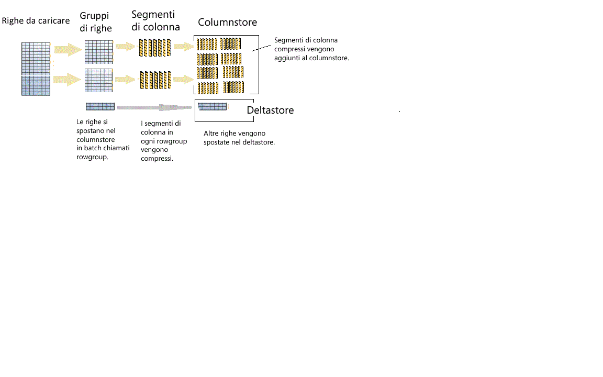

# <a name="columnstore-indexes---data-loading-guidance"></a>Indici columnstore - Linee guida per il caricamento di dati
[!INCLUDE[appliesto-ss-asdb-asdw-pdw-md](../../includes/appliesto-ss-asdb-asdw-pdw-md.md)]

Opzioni e suggerimenti per il caricamento di dati in un indice columnstore usando i metodi standard di caricamento bulk e con inserimento singolo di SQL. Il caricamento di dati in un indice columnstore è una parte essenziale di qualsiasi processo di data warehousing perché i dati vengono spostati nell'indice in preparazione per l'analisi.
  
 Se non si ha esperienza con gli indici columnstore, Vedere [Indici columnstore - Panoramica](../../relational-databases/indexes/columnstore-indexes-overview.md) e [Architettura degli indici columnstore](../../relational-databases/sql-server-index-design-guide.md#columnstore_index).
  
## <a name="what-is-bulk-loading"></a>Che cos'è il caricamento bulk?
Il termine *caricamento bulk* fa riferimento al modo in cui viene aggiunto un numero elevato di righe a un archivio dati. Questo è il modo che offre le prestazioni migliori per spostare i dati in un indice columnstore, perché si basa su batch di righe. Il caricamento bulk riempie i rowgroup fino alla capacità massima e li comprime direttamente nel columnstore. Solo le righe alla fine di un carico che non soddisfano il requisito minimo di 102.400 righe per ogni rowgroup passano all'archivio differenziale.  

Per eseguire un caricamento bulk è possibile usare l'[utilità bcp](../../tools/bcp-utility.md), [Integration Services](../../integration-services/sql-server-integration-services.md) oppure selezionare righe da una tabella di staging.

  
  
 Come illustrato nel diagramma, un caricamento bulk:  
  
* Non esegue il preordinamento dei dati. I dati vengono inseriti nei rowgroup secondo l'ordine di ricezione.
* Se le dimensioni del batch sono > = 102.400, le righe vengono caricate direttamente nei rowgroup compressi. Perché l'importazione bulk sia efficiente è consigliabile scegliere una dimensione di batch >= 102.400, per evitare lo spostamento di righe di dati in un rowgroup delta prima che le righe siano spostate nei rowgroup compressi da un thread in background, il motore di tuple.
* Se le dimensioni del batch sono < 102,400 o se le righe rimanenti sono < 102.400 le righe vengono caricate in rowgroup delta.

> [!NOTE]
> In una tabella rowstore con dati di un indice columnstore non cluster, [!INCLUDE[ssNoVersion](../../includes/ssnoversion-md.md)] inserisce sempre i dati nella tabella di base. I dati non vengono mai inseriti direttamente nell'indice columnstore.  

Il caricamento bulk include le ottimizzazioni seguenti per le prestazioni:
-   **Caricamenti in parallelo**: è possibile eseguire in simultanea più caricamenti bulk (bcp o bulk insert), ognuno dei quali carica un file di dati separato. Diversamente dai caricamenti bulk di rowstore in [!INCLUDE[ssNoVersion](../../includes/ssnoversion-md.md)] non è necessario specificare `TABLOCK`, poiché ogni thread di importazione bulk caricherà i dati esclusivamente in un rowgroup distinto (compresso o delta) che presenta un blocco esclusivo. Se si usa `TABLOCK` verrà forzato il blocco esclusivo sulla tabella e non sarà possibile importare dati in parallelo.  
-   **Registrazione minima:** un caricamento bulk usa la registrazione minima per i dati destinati direttamente a rowgroup compressi. Per tutti i dati destinati a un rowgroup differenziale viene usata la registrazione completa. Ciò include qualsiasi dimensione di batch minore di 102.400 righe. L'obiettivo del caricamento bulk, tuttavia, è evitare i rowgroup differenziali per la maggior parte dei dati.  
-   **Ottimizzazione del blocco:** durante il caricamento in rowgroup compressi, viene acquisito il blocco X del rowgroup. Tuttavia durante il caricamento bulk in rowgroup delta viene acquisito il blocco X del rowgroup, ma [!INCLUDE[ssNoVersion](../../includes/ssnoversion-md.md)] continua a bloccare i blocchi PAGE/EXTENT perché il blocco X del rowgroup non rientra nella gerarchia di blocco.  
  
In presenza di un indice albero B non cluster su un indice columnstore non sono previsti il blocco o l'ottimizzazione della registrazione per l'indice, ma le ottimizzazioni sull'indice columnstore cluster descritte in precedenza sono ancora presenti.  
  
## <a name="plan-bulk-load-sizes-to-minimize-delta-rowgroups"></a>Pianificare le dimensioni di caricamento bulk per ridurre al minimo i rowgroup differenziali
Gli indici columnstore offrono prestazioni ottimali quando la maggior parte delle righe viene compressa in columnstore e non inserita nei rowgroup differenziali. È consigliabile ridimensionare i carichi in modo che le righe vengano spostate direttamente nel columnstore ignorando il più possibile l'archivio differenziale.

Gli scenari seguenti indicano quando le righe caricate vengono direttamente indirizzate al columnstore o passano per il deltastore. Nell'esempio, ogni rowgroup può avere 102.400-1.048.576 righe per rowgroup. In pratica, la dimensione massima di un rowgroup può essere inferiore a 1.048.576 righe quando sono presenti richieste di memoria.  
  
|Righe per il caricamento bulk|Righe aggiunte al rowgroup compresso|Righe aggiunte al rowgroup delta|  
|-----------------------|-------------------------------------------|--------------------------------------|  
|102.000|0|102.000|  
|145.000|145.000<br /><br /> Dimensioni rowgroup: 145.000.|0|  
|1.048.577|1,048,576<br /><br /> Dimensioni rowgroup: 1.048.576.|1|  
|2.252.152|2.252.152<br /><br /> Dimensioni rowgroup: 1.048.576, 1.048.576, 155.000.|0|  
  
 Nell'esempio seguente vengono illustrati i risultati del caricamento di 1.048.577 righe in una tabella. I risultati mostrano che esiste un rowgroup COMPRESSED nel columnstore (come segmenti di colonna compressi) e 1 riga nel deltastore.  
  
```sql  
SELECT object_id, index_id, partition_number, row_group_id, delta_store_hobt_id, 
  state state_desc, total_rows, deleted_rows, size_in_bytes   
FROM sys.dm_db_column_store_row_group_physical_stats  
```  
  
   
  
## <a name="use-a-staging-table-to-improve-performance"></a>Usare una tabella di staging per migliorare le prestazioni
Se si caricano dati solo per la gestione temporanea, prima di eseguire ulteriori trasformazioni, il caricamento della tabella nella tabella heap sarà molto più rapido del caricamento dei dati in una tabella columnstore cluster. Inoltre, il caricamento dei dati in una [tabella temporanea][Temporanea] avverrà molto più velocemente del caricamento di una tabella in un archivio permanente.  

 Il modello comune per il caricamento di dati consiste nel caricare i dati in una tabella di staging, eseguire alcune trasformazioni e quindi caricare i dati nella tabella di destinazione usando il comando seguente  
  
```sql  
INSERT INTO <columnstore index>  
SELECT <list of columns> FROM <Staging Table>  
```  
  
 Il comando carica i dati nell'indice columnstore in modo analogo ai comandi bcp o bulk insert, ma in un unico batch. Se il numero di righe nella tabella di staging è < 102.400, le righe vengono caricate in un rowgroup delta, altrimenti possono essere caricate direttamente in un rowgroup compresso. Uno dei limiti principali era il fatto che l'operazione `INSERT` è a thread singolo. Per caricare i dati in parallelo era possibile creare più tabelle di staging o eseguire i comandi `INSERT`/`SELECT` con intervalli non sovrapposti di righe dalla tabella di staging. Questa limitazione è stata eliminata in [!INCLUDE[ssSQL15](../../includes/sssql15-md.md)]. Il comando seguente carica i dati dalla tabella di staging in parallelo, ma è necessario specificare `TABLOCK`.  
  
```sql  
INSERT INTO <columnstore index> WITH (TABLOCK) 
SELECT <list of columns> FROM <Staging Table>  
```  
  
 Per il caricamento in indici columnstore cluster da una tabella di staging sono disponibili le ottimizzazioni seguenti:
-   **Ottimizzazione dei log:** con registrazione minima quando i dati vengono caricati in rowgroup compressi. Non si ha registrazione minima quando i dati vengono caricati in rowgroup delta.  
-   **Ottimizzazione del blocco:** durante il caricamento in rowgroup compressi, viene acquisito il blocco X del rowgroup. Tuttavia quando si opera con rowgroup delta viene acquisito il blocco X del rowgroup, ma [!INCLUDE[ssNoVersion](../../includes/ssnoversion-md.md)] continua a bloccare i blocchi PAGE/EXTENT, perché il blocco X del rowgroup non rientra nella gerarchia di blocco.  
  
 In caso di più indici non cluster, non si ha blocco o ottimizzazione della registrazione dell'indice, ma le ottimizzazioni sull'indice columnstore cluster descritte in precedenza sono ancora presenti.  
  
## <a name="what-is-trickle-insert"></a>Che cos'è il caricamento con inserimento singolo?

L'*inserimento singolo* indica il modo in cui le singole righe vengono spostate nell'indice columnstore. Per gli inserimenti singoli viene usata l'istruzione [INSERT INTO](../../t-sql/statements/insert-transact-sql.md) e tutte le righe vengono spostate nell'archivio differenziale. Ciò è utile per un numero limitato di righe, ma non è pratico per caricamenti di grandi dimensioni.
  
```sql  
INSERT INTO <table-name> VALUES (<set of values>)  
```  
  
 > [!NOTE]
 > I thread simultanei che usano INSERT INTO per inserire valori in un indice columnstore cluster possono inserire righe nello stesso rowgroup deltastore.  
  
 Quando il rowgroup arriva a contenere 1.048.576 righe viene contrassegnato come chiuso, ma è ancora disponibile per query e operazioni di aggiornamento/eliminazione. Le righe appena inserite vengono indirizzate a un rowgroup deltastore nuovo o esistente. In background agisce il *motore di tuple* , che comprime i rowgroup delta chiusi ogni 5 minuti circa. È possibile richiamare in modo esplicito il comando seguente per comprimere il rowgroup delta chiuso:  
  
```sql  
ALTER INDEX <index-name> on <table-name> REORGANIZE  
```  
  
 Per forzare un rowgroup delta chiuso e compresso, eseguire il comando seguente. È consigliabile eseguire questo comando al termine del caricamento delle righe, quando non si prevede l'aggiunta di nuove righe. La chiusura e la compressione esplicita del rowgroup delta consente di risparmiare spazio di archiviazione e incrementare le prestazioni delle query di analisi. È consigliabile richiamare questo comando quando non si prevede l'inserimento di nuove righe.  
  
```sql  
ALTER INDEX <index-name> on <table-name> REORGANIZE with (COMPRESS_ALL_ROW_GROUPS = ON)  
```  
  
## <a name="how-loading-into-a-partitioned-table-works"></a>Come funziona il caricamento in una tabella partizionata  
 Per i dati partizionati, [!INCLUDE[ssNoVersion](../../includes/ssnoversion-md.md)] assegna prima ogni riga a una partizione, quindi esegue operazioni columnstore sui dati nella partizione. Ogni partizione ha i propri rowgroup e almeno un rowgroup differenziale.  
  
 ## <a name="next-steps"></a>Passaggi successivi
 Per altre informazioni sul caricamento, vedere questo [post di blog](http://blogs.msdn.com/b/sqlcat/archive/2015/03/11/data-loading-performance-considerations-on-tables-with-clustered-columnstore-index.aspx).  
