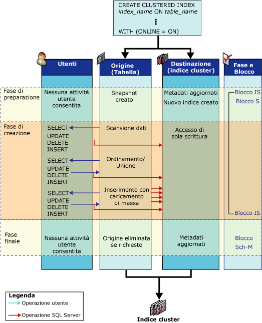

# Funzionamento delle operazioni sugli indici online
[!INCLUDE[tsql-appliesto-ss2016-asdb-xxxx-xxx_md](../../includes/tsql-appliesto-ss2016-asdb-xxxx-xxx-md.md)]

  In questo argomento vengono descritte le strutture esistenti durante un'operazione sugli indici online e illustra le attività associate a tali strutture.  
  
## Strutture degli indici online  
 Per consentire attività utente simultanee durante un'operazione DDL (Data Definition Language) sull'indice, durante l'operazione sull'indice online vengono utilizzate le strutture seguenti: indici di origine e preesistente, destinazione e, per la ricompilazione di un heap o l'eliminazione di un indice cluster online, un indice di mapping temporaneo.  
  
-   **Indici di origine e preesistenti**  
  
     L'origine è rappresentata dalla tabella originale o dai dati dell'indice cluster. Gli indici preesistenti sono indici non cluster associati alla struttura di origine. Se ad esempio l'operazione sull'indice online consiste nella ricompilazione di un indice cluster con quattro indici non cluster associati, l'origine è l'indice cluster esistente e gli indici preesistenti sono gli indici non cluster.  
  
     Gli indici preesistenti sono disponibili agli utenti simultanei per operazioni di selezione, inserimento, aggiornamento ed eliminazione, inclusi inserimenti bulk (supportati ma non consigliati) e aggiornamenti impliciti mediante trigger e vincoli di integrità referenziale. Tutti gli indici preesistenti sono disponibili per l'esecuzione di query e ricerche. Ciò significa che possono essere selezionati da Query Optimizer e, se necessario, specificati in hint per l'indice.  
  
-   **Destinazione**  
  
     La destinazione o le destinazioni sono rappresentate dal nuovo indice (o heap) o da un set di nuovi indici creati o ricompilati. Le operazioni utente di inserimento, aggiornamento ed eliminazione sull'origine vengono applicate da [!INCLUDE[ssDEnoversion](../../includes/ssdenoversion-md.md)] alla destinazione durante l'operazione sull'indice. Se ad esempio l'operazione sull'indice online consiste nella ricompilazione di un indice cluster, la destinazione è l'indice cluster ricompilato. [!INCLUDE[ssDE](../../includes/ssde-md.md)] non ricompila indici non cluster quando viene ricompilato un indice cluster.  
  
     Nell'indice di destinazione non viene eseguita la ricerca durante l'elaborazione delle istruzioni SELECT finché non viene eseguito il commit dell'operazione. L'indice viene contrassegnato internamente come di sola scrittura.  
  
-   **Indice di mapping temporaneo**  
  
     Per le operazioni sugli indici online che consistono nella creazione, nell'eliminazione o nella ricompilazione di un indice cluster è inoltre necessario un indice di mapping temporaneo che viene utilizzato dalle transazioni simultanee per determinare i record da eliminare nei nuovi indici ricompilati quando vengono aggiornate o eliminate righe nella tabella sottostante. Questo indice non cluster viene creato contemporaneamente al nuovo indice cluster (o heap) e non richiede un'operazione di ordinamento separata. Le transazioni simultanee mantengono l'indice di mapping temporaneo in tutte le operazioni di inserimento, aggiornamento ed eliminazione.  
  
## Attività sugli indici online  
 Durante un'operazione sugli indici online semplice, ad esempio la creazione di un indice cluster in una tabella non indicizzata (heap), l'origine e la destinazione passano attraverso tre fasi: preparatoria, di compilazione e finale.  
  
 Nella figura seguente si illustra il processo per la creazione di un indice cluster iniziale online. L'oggetto di origine, l'heap, non presenta altri indici. Per ogni fase sono illustrate le attività sulle strutture di origine e di destinazione, nonché le operazioni utente simultanee di selezione, inserimento, aggiornamento ed eliminazione. Le fasi preparatoria, di compilazione e finale sono indicate insieme alle modalità di blocco utilizzate in ogni fase.  
  
   
  
## Attività relative alla struttura di origine  
 Nella tabella seguente sono incluse le attività relative alle strutture di origine durante ogni fase dell'operazione sull'indice e la relativa strategia di blocco.  
  
|Fase|Attività di origine|Blocchi di origine|  
|-----------|---------------------|------------------|  
|Preparazione   Fase molto breve|Preparazione dei metadati di sistema per la creazione della nuova struttura vuota dell'indice.   Viene definito uno snapshot della tabella, ovvero viene utilizzato il controllo delle versioni delle righe per garantire la consistenza in lettura a livello di transazione.   Le operazioni utente di scrittura simultanee sull'origine vengono bloccate per un breve periodo di tempo.   Non sono consentite operazioni DDL simultanee, ad eccezione della creazione di più indici non cluster.|S (condiviso) nella tabella*   IS (preventivo condiviso)   INDEX_BUILD_INTERNAL_RESOURCE\*\*|  
|Compilazione   Fase principale|I dati vengono sottoposti ad analisi, ordinati, uniti e inseriti nella destinazione in operazioni di caricamento bulk.   Le operazioni utente simultanee di selezione, inserimento, aggiornamento ed eliminazione vengono applicate agli indici preesistenti e ai nuovi indici compilati.|IS   INDEX_BUILD_INTERNAL_RESOURCE**|  
|Finale   Fase molto breve|Prima dell'avvio di questa fase, è necessario che tutte le transazioni di aggiornamento di cui non è stato eseguito il commit vengano completate. A seconda del blocco acquisito, tutte le nuove transazioni utente di lettura o di scrittura vengono bloccate per un breve periodo di tempo finché questa fase non viene completata.   I metadati di sistema vengono aggiornati per sostituire l'origine con la destinazione.   Se necessario, l'origine viene eliminata, ad esempio dopo la ricompilazione o l'eliminazione di un indice cluster.|INDEX_BUILD_INTERNAL_RESOURCE**   S nella tabella se viene creato un indice non cluster.\*   SCH-M (modifica dello schema) se viene eliminata la struttura di origine (indice o tabella).\*|  
  
 \* Per l'operazione sull'indice si dovrà attendere il completamento delle transazioni di aggiornamento di cui non è stato eseguito il commit prima di acquisire il blocco S o SCH-M nella tabella.  
  
 ** Con il blocco di risorsa INDEX_BUILD_INTERNAL_RESOURCE viene impedita l'esecuzione di operazioni DDL (Data Definition Language) simultanee sulle strutture di origine e preesistenti mentre è in corso l'operazione sull'indice. Questo blocco impedisce ad esempio la ricompilazione simultanea di due indici nella stessa tabella. Nonostante questo blocco di risorsa sia associato al blocco SCH-M, non impedisce l'esecuzione di istruzioni DML.  
  
 Nella tabella precedente è incluso un solo blocco condiviso (S) acquisito durante la fase di compilazione di un'operazione sugli indici online relativa a un singolo indice. Quando si compilano o ricompilano indici cluster e non cluster, in una singola operazione sugli indici online, ad esempio durante la creazione dell'indice cluster iniziale in una tabella contenente uno o più indici non cluster, vengono acquisiti due blocchi S di breve durata durante la fase di compilazione seguiti da blocchi preventivi condivisi (IS) di lunga durata. Viene innanzitutto acquisito un blocco S per la creazione dell'indice cluster e, quando la creazione dell'indice cluster viene completata, viene acquisito un altro blocco S di breve durata per la creazione degli indici non cluster. Dopo la creazione degli indici non cluster, il blocco S viene abbassato di livello e portato a blocco IS fino alla fase finale dell'operazione sull'indice online.  
  
### Attività relative alla struttura di destinazione  
 Nella tabella seguente sono incluse le attività relative alla struttura di destinazione durante ogni fase dell'operazione sull'indice e la relativa strategia di blocco.  
  
|Fase|Attività di destinazione|Blocchi di destinazione|  
|-----------|---------------------|------------------|  
|Preparazione|Il nuovo indice viene creato e impostato in sola scrittura.|IS|  
|Compilazione|Vengono inseriti i dati dall'origine.   Vengono applicate le modifiche utente (inserimenti, aggiornamenti, eliminazioni) apportate all'origine.   Questa attività è visibile all'utente.|IS|  
|Finale|Vengono aggiornati i metadati dell'indice.   Viene impostato lo stato lettura/scrittura per l'indice.|S   o   SCH-M|  
  
 Con le istruzioni SELECT eseguite dall'utente non è possibile accedere alla destinazione finché l'operazione sull'indice non è stata completata.  
  
 Dopo il completamento della fase preparatoria e della fase finale, i piani di aggiornamento e di query archiviati nella cache delle procedure vengono invalidati e per le query successive verrà utilizzato il nuovo indice.  
  
 La durata di un cursore dichiarato in una tabella oggetto di un'operazione su un indice online è limitata dalle fasi dell'operazione sull'indice. I cursori di aggiornamento vengono invalidati in corrispondenza di ogni fase, mentre i cursori di sola lettura vengono invalidati solo dopo la fase finale.  
  
## Contenuto correlato  
 [Eseguire operazioni online sugli indici](../../relational-databases/indexes/perform-index-operations-online.md)  
  
 [Linee guida per operazioni di indice online](../../relational-databases/indexes/guidelines-for-online-index-operations.md)  
  
  

