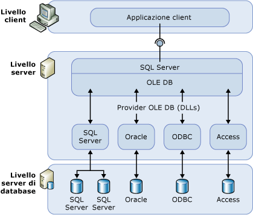

# Server collegati (Motore di database)
[!INCLUDE[appliesto-ss-xxxx-xxxx-xxx-md](../../includes/appliesto-ss-xxxx-xxxx-xxx-md.md)]
  Configurare un server collegato per consentire a [!INCLUDE[ssDEnoversion](../../includes/ssdenoversion-md.md)] di eseguire comandi su origini dati OLE DB all'esterno dell'istanza di [!INCLUDE[ssNoVersion](../../includes/ssnoversion-md.md)]. In genere i server collegati sono configurati per consentire a [!INCLUDE[ssDE](../../includes/ssde-md.md)] di eseguire l'istruzione [!INCLUDE[tsql](../../includes/tsql-md.md)] che include tabelle in un'altra istanza di [!INCLUDE[ssNoVersion](../../includes/ssnoversion-md.md)]o un altro prodotto del database quale Oracle. Molti tipi di origini dati OLE DB possono essere configurati come server collegati, incluso Access e Excel [!INCLUDE[msCoName](../../includes/msconame-md.md)] . I server collegati offrono i vantaggi riportati di seguito:  
  
-   Possibilità di accedere ai dati dall'esterno di [!INCLUDE[ssNoVersion](../../includes/ssnoversion-md.md)].  
  
-   Possibilità di eseguire query distribuite, aggiornamenti, comandi e transazioni su origini dati eterogenee in tutta l'azienda.  
  
-   Possibilità di utilizzare origini dati diverse in modo analogo.  
  
È possibile configurare un server collegato usando [!INCLUDE[ssManStudioFull](../../includes/ssmanstudiofull-md.md)] o l'istruzione [sp_addlinkedserver &#40;Transact-SQL&#41;](../../relational-databases/system-stored-procedures/sp-addlinkedserver-transact-sql.md) . I provider OLE DB variano in modo sostanziale nel tipo e nel numero di parametri richiesti. Ad esempio alcuni provider richiedono di fornire un contesto di sicurezza per la connessione usando [sp_addlinkedsrvlogin &#40;Transact-SQL&#41;](../../relational-databases/system-stored-procedures/sp-addlinkedsrvlogin-transact-sql.md). Alcuni provider OLE DB consentono a [!INCLUDE[ssNoVersion](../../includes/ssnoversion-md.md)] di aggiornare i dati sull'origine OLE DB. Altri forniscono accesso soltanto ai dati di sola lettura. Per informazioni su ogni provider OLE DB, consultare la documentazione relativa a detto provider OLE DB.  
  
## Componenti di un server collegato  
 Nella definizione di un server collegato sono specificati gli oggetti seguenti:  
  
-   Un provider OLE DB  
  
-   Un'origine dei dati OLE DB  
  
Un *provider OLE DB* è una DLL in grado di gestire un'origine dei dati specifica e interagire con essa. Un' *origine dei dati OLE DB* identifica lo specifico database a cui è possibile accedere con OLE DB. Anche se le origini dei dati su cui si eseguono query tramite definizioni di server collegati sono in genere database, esistono provider OLE DB per un'ampia gamma di file e formati di file, quali file di testo, dati di fogli di calcolo e risultati di ricerche di contenuto full-text.  
  
Il provider OLE DB di [!INCLUDE[msCoName](../../includes/msconame-md.md)] [!INCLUDE[ssNoVersion](../../includes/ssnoversion-md.md)] Native Client (PROGID: SQLNCLI11) è il provider OLE DB ufficiale per [!INCLUDE[ssNoVersion](../../includes/ssnoversion-md.md)].  
  
> [!NOTE]  
> [!INCLUDE[ssNoVersion](../../includes/ssnoversion-md.md)] Le query distribuite sono progettate per funzionare con qualsiasi provider OLE DB che implementi le interfacce OLE DB necessarie. [!INCLUDE[ssNoVersion](../../includes/ssnoversion-md.md)] è stato tuttavia testato solo con il provider OLE DB di [!INCLUDE[ssNoVersion](../../includes/ssnoversion-md.md)] Native Client e con alcuni altri provider.  
  
## Dettagli relativi ai server collegati  
 Nella figura seguente vengono illustrati i componenti di base di una configurazione con server collegati.  
  
   
  
I server collegati vengono in genere utilizzati per la gestione delle query distribuite. Quando un'applicazione client esegue una query distribuita tramite un server collegato, [!INCLUDE[ssNoVersion](../../includes/ssnoversion-md.md)] analizza il comando e invia le richieste a OLE DB. È possibile richiedere l'esecuzione di una query sul provider o l'apertura di una tabella di base dal provider.  
  
> [!NOTE]
> Un'origine dei dati può restituire dati tramite un server collegato solo se il relativo provider OLE DB (DLL) è presente nello stesso server dell'istanza di [!INCLUDE[ssNoVersion](../../includes/ssnoversion-md.md)].  
  
> [!IMPORTANT] 
> Quando viene usato un provider OLE DB, l'account con cui viene eseguito il servizio [!INCLUDE[ssNoVersion](../../includes/ssnoversion-md.md)] deve avere autorizzazioni di lettura ed esecuzione per la directory, e tutte le sottodirectory, in cui è installato il provider. Sono inclusi il provider rilasciato da Microsoft ed eventuali provider di terze parti. 
  
## Gestione dei provider  
È disponibile un set di opzioni che consente di controllare la modalità con cui [!INCLUDE[ssNoVersion](../../includes/ssnoversion-md.md)] carica e utilizza i provider OLE DB specificati nel Registro di sistema.  
  
## Gestione delle definizioni dei server collegati  
Quando si configura un server collegato è necessario registrare in [!INCLUDE[ssNoVersion](../../includes/ssnoversion-md.md)]i dati per la connessione e le informazioni sull'origine dei dati. Dopo la registrazione sarà possibile fare riferimento all'origine dei dati utilizzando un singolo nome logico.  
  
Per gestire le definizioni dei server collegati è possibile utilizzare stored procedure e viste del catalogo:  
  
-   Creare una definizione di un server collegato eseguendo **sp_addlinkedserver**.  
  
-   Per visualizzare informazioni sui server collegati definiti in una specifica istanza di [!INCLUDE[ssNoVersion](../../includes/ssnoversion-md.md)] , eseguire una query sulle viste del catalogo di sistema **sys.servers** .  
  
-   Eliminare la definizione di un server collegato eseguendo **sp_dropserver**. Questa stored procedure può essere utilizzata anche per rimuovere un server remoto.  
  
Per definire i server collegati è inoltre possibile utilizzare [!INCLUDE[ssManStudioFull](../../includes/ssmanstudiofull-md.md)]. In Esplora oggetti fare clic con il pulsante destro del mouse su **Oggetti server**, scegliere **Nuovo**e quindi **Server collegato**. Per eliminare la definizione di un server collegato, è possibile fare clic con il pulsante destro del mouse sul nome del server collegato e scegliere **Elimina**.  
  
 Quando si esegue una query distribuita su un server collegato, per ogni origine dei dati su cui viene eseguita la query specificare un nome di tabella completo in quattro parti. Questo nome composto da quattro parti deve essere nel formato *linked_server_name.catalog ***.*** schema ***.*** object_name*.  
  
> [!NOTE]  
> È possibile definire un server collegato in modo che punti all'indietro (loopback) al server in cui è stato definito. I server di loopback risultano particolarmente utili durante il test di un'applicazione in cui vengono utilizzate query distribuite in una rete con un solo server. I server collegati di loopback sono destinati ai test e non sono supportati per molte operazioni, ad esempio le transazioni distribuite.  
  
## Attività correlate  
 [Creare server collegati &#40;Motore di database di SQL Server&#41;](../../relational-databases/linked-servers/create-linked-servers-sql-server-database-engine.md)  
  
 [sp_addlinkedserver &#40;Transact-SQL&#41;](../../relational-databases/system-stored-procedures/sp-addlinkedserver-transact-sql.md)  
  
 [sp_addlinkedsrvlogin &#40;Transact-SQL&#41;](../../relational-databases/system-stored-procedures/sp-addlinkedsrvlogin-transact-sql.md)  
  
 [sp_dropserver &#40;Transact-SQL&#41;](../../relational-databases/system-stored-procedures/sp-dropserver-transact-sql.md)  
  
## Contenuto correlato  
 [sys.servers &#40;Transact-SQL&#41;](../../relational-databases/system-catalog-views/sys-servers-transact-sql.md)  
  
 [sp_linkedservers &#40;Transact-SQL&#41;](../../relational-databases/system-stored-procedures/sp-linkedservers-transact-sql.md)  
  
  
