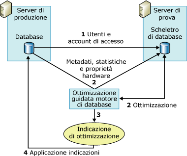

# <a name="reduce-the-production-server-tuning-load"></a>Riduzione del carico di ottimizzazione del server di produzione
[!INCLUDE[appliesto-ss-asdb-xxxx-xxx-md](../../includes/appliesto-ss-asdb-xxxx-xxx-md.md)]
  [!INCLUDE[ssDE](../../includes/ssde-md.md)] Ottimizzazione guidata si basa su Query Optimizer per analizzare un carico di lavoro e fornire indicazioni di ottimizzazione. L'esecuzione di questa analisi sul server di produzione aumenta il carico del server e può ridurre le prestazioni del server durante la sessione di ottimizzazione. È possibile diminuire l'impatto sul carico del server durante una sessione di ottimizzazione utilizzando un server di prova oltre al server di produzione.  
  
## <a name="how-database-engine-tuning-advisor-uses-a-test-server"></a>Modalità di utilizzo di un server di prova da parte di Ottimizzazione guidata motore di database  
 L'utilizzo tradizionale di un server di prova consiste nel copiare tutti i dati dal server di produzione sul server di prova, ottimizzare quest'ultimo e quindi implementare l'indicazione sul server di produzione. Questo processo elimina l'effetto sulle prestazioni del server di produzione, ma non rappresenta comunque la soluzione ideale. Ad esempio, la copia di grandi quantità di dati dal server di produzione sul server di prova può richiedere notevoli quantità di tempo e risorse. Inoltre, l'hardware del server di prova raramente è potente quanto quello utilizzato per i server di produzione. Il processo di ottimizzazione si basa su Query Optimizer e le indicazioni da esso generate dipendono in parte dall'hardware sottostante. Se l'hardware del server di prova e di produzione non sono identici, la qualità delle indicazioni di Ottimizzazione guidata [!INCLUDE[ssDE](../../includes/ssde-md.md)] ne risente.  
  
 Per evitare questi problemi, Ottimizzazione guidata [!INCLUDE[ssDE](../../includes/ssde-md.md)] esegue l'ottimizzazione di un database in un server di produzione ripartendo la maggioranza del carico di ottimizzazione in un server di prova. Questo avviene utilizzando le informazioni di configurazione hardware del server di produzione e senza copiare effettivamente i dati dal server di produzione sul server di prova. [!INCLUDE[ssDE](../../includes/ssde-md.md)] Ottimizzazione guidata non copia i dati effettivi dal server di produzione sul server di prova, ma solo i metadati e le statistiche necessarie.  
  
 Nella procedura seguente viene illustrato il processo per l'ottimizzazione di un database di produzione su un server di prova:  
  
1.  Verificare che l'utente che desidera utilizzare il server di prova sia presente su entrambi i server.  
  
     Prima di iniziare, verificare che l'utente che desidera utilizzare il server di prova per l'ottimizzazione del database sul server di produzione sia presente su entrambi i server. Questo richiede la creazione dell'utente e del relativo account di accesso sul server di prova. Per i membri del ruolo predefinito del server **sysadmin** su entrambi i computer, questo passaggio non è necessario.  
  
2.  Ottimizzazione del carico di lavoro sul server di prova.  
  
     Per ottimizzare un carico di lavoro su un server di prova, è necessario usare un file di input XML con l'utilità della riga di comando **dta** . Nel file di input XML specificare il nome del server di prova con l'elemento secondario **TestServer** oltre ai valori per gli altri elementi secondari dell'elemento padre **TuningOptions** .  
  
     Durante il processo di ottimizzazione, Ottimizzazione guidata motore di database crea uno scheletro di database sul server di prova. Per creare questo scheletro di database e ottimizzarlo, Ottimizzazione guidata motore di database esegue chiamate al server di produzione per gli elementi seguenti:  
  
    1.  [!INCLUDE[ssDE](../../includes/ssde-md.md)] Ottimizzazione guidata importa i metadati dal database di produzione sullo scheletro di database del server di prova. Questi metadati includono tabelle vuote, indici, viste, stored procedure, trigger e così via. Questo rende possibile l'esecuzione delle query del carico di lavoro sullo scheletro di database del server di prova.  
  
    2.  [!INCLUDE[ssDE](../../includes/ssde-md.md)] Ottimizzazione guidata importa le statistiche dal server di produzione in modo che Query Optimizer possa ottimizzare in modo accurato le query sul server di prova.  
  
    3.  [!INCLUDE[ssDE](../../includes/ssde-md.md)] Ottimizzazione guidata importa i parametri hardware specificando il numero di processori e la memoria disponibile dal server di produzione per offrire a Query Optimizer le informazioni necessarie per generare un piano di query.  
  
3.  Dopo aver ottimizzato lo scheletro di database del server di prova, Ottimizzazione guidata [!INCLUDE[ssDE](../../includes/ssde-md.md)] genera un'indicazione di ottimizzazione.  
  
4.  Applicare l'indicazione derivata dall'ottimizzazione del server di prova al server di produzione.  
  
 Nella seguente figura viene illustrato lo scenario relativo al server di prova e al server di produzione:  
  
   
  
> [!NOTE]  
>  La funzionalità di ottimizzazione del server di prova non è supportata nell'interfaccia utente grafica (GUI) di Ottimizzazione guidata [!INCLUDE[ssDE](../../includes/ssde-md.md)] .  
  
## <a name="example"></a>Esempio  
 Innanzitutto verificare che l'utente che desidera eseguire l'ottimizzazione sia presente sul server di prova e di produzione.  
  
 Dopo aver copiato le informazioni utente sul server di prova, è possibile definire la sessione di ottimizzazione del server di prova nel file di input XML di Ottimizzazione guidata [!INCLUDE[ssDE](../../includes/ssde-md.md)] . Nell'esempio di file di input XML seguente viene illustrato come specificare un server di prova per ottimizzare un database tramite Ottimizzazione guidata [!INCLUDE[ssDE](../../includes/ssde-md.md)] .  
  
 Nell'esempio, il database `MyDatabaseName` viene ottimizzato su `MyServerName`. Lo script [!INCLUDE[tsql](../../includes/tsql-md.md)] , `MyWorkloadScript.sql`, viene utilizzato come carico di lavoro. Esso include gli eventi eseguiti su `MyDatabaseName`. La maggioranza delle chiamate di Query Optimizer al database, che si verificano nell'ambito del processo di ottimizzazione, vengono gestite dallo scheletro di database che risiede su `MyTestServerName`. Lo scheletro di database è costituito da metadati e statistiche. Questo processo determina la ripartizione del carico dell'overhead di ottimizzazione sul server di prova. Quando Ottimizzazione guidata [!INCLUDE[ssDE](../../includes/ssde-md.md)] genera la propria indicazione di ottimizzazione utilizzando questo file di input XML, dovrebbe considerare solo gli indici (`<FeatureSet>IDX</FeatureSet>`), nessun partizionamento e non dovrebbe essere necessario mantenere alcuna delle strutture di progettazione fisica esistenti in `MyDatabaseName`.  
  
```  
<?xml version="1.0" encoding="utf-16" ?>  
<DTAXML xmlns:xsi="http://www.w3.org/2001/XMLSchema-instance" xmlns="http://schemas.microsoft.com/sqlserver/2004/07/dta">  
  <DTAInput>  
    <Server>  
      <Name>MyServerName</Name>  
      <Database>  
        <Name>MyDatabaseName</Name>  
      </Database>  
    </Server>  
    <Workload>  
      <File>MyWorkloadScript.sql</File>  
    </Workload>  
    <TuningOptions>  
      <TestServer>MyTestServerName</TestServer>  
      <FeatureSet>IDX</FeatureSet>  
      <Partitioning>NONE</Partitioning>  
      <KeepExisting>NONE</KeepExisting>  
    </TuningOptions>  
  </DTAInput>  
</DTAXML>  
```  
  
## <a name="see-also"></a>Vedere anche  
 [Considerazioni relative all'utilizzo di server di prova](../../relational-databases/performance/considerations-for-using-test-servers.md)   
 [Guida di riferimento ai file di input XML &#40;Ottimizzazione guidata motore di database&#41;](../../tools/dta/xml-input-file-reference-database-engine-tuning-advisor.md)  
  
  
