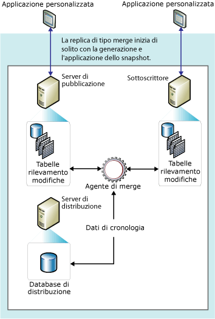

# Replica di tipo merge
  In genere la replica di tipo merge, come la replica transazionale, inizia con uno snapshot degli oggetti e dei dati del database di pubblicazione. Eventuali modifiche dei dati e dello schema apportate successivamente nel server di pubblicazione e nei Sottoscrittori vengono rilevate tramite trigger. Al momento della connessione alla rete il Sottoscrittore esegue la sincronizzazione con il server di pubblicazione e scambia con esso le righe modificate dopo l'ultima sincronizzazione.  
  
 In genere la replica di tipo merge è utilizzata in ambienti server-to-client. La replica di tipo merge è adatta alle seguenti situazioni:  
  
-   Più Sottoscrittori potrebbero richiedere l'aggiornamento dei dati in ore diverse e la distribuzione delle modifiche al server di pubblicazione e ad altri Sottoscrittori.  
  
-   I Sottoscrittori devono ricevere i dati, eseguire le modifiche offline e sincronizzarle successivamente con il server di pubblicazione e i Sottoscrittori.  
  
-   Per ogni Sottoscrittore è necessaria una diversa partizione di dati.  
  
-   È necessario essere in grado di individuare e risolvere tempestivamente eventuali conflitti che potrebbero verificarsi.  
  
-   È necessario lo scambio di dati net piuttosto che l'accesso a stati di dati intermedi. Ad esempio, se una riga viene modificata cinque volte nel Sottoscrittore prima della sincronizzazione con un server di pubblicazione, la riga verrà modificata solo una volta nel server di pubblicazione per riflettere la modifica dei dati net, ovvero il quinto valore.  
  
 La replica di tipo merge consente a vari siti di eseguire elaborazioni in modo autonomo e di unire quindi gli aggiornamenti in un unico risultato uniforme. Dato che gli aggiornamenti vengono eseguiti in più nodi, è possibile che dati uguali siano aggiornati dal server di pubblicazione e da più Sottoscrittori, con la conseguente possibilità di conflitti quando viene eseguito il merge degli aggiornamenti. La replica di tipo merge offre tuttavia diversi modi di risoluzione dei conflitti.  
  
 La replica di tipo merge viene implementata dall'agente snapshot e dall'agente di merge di [!INCLUDE[ssNoVersion](../../../includes/ssnoversion-md.md)]. Se la pubblicazione non è filtrata o utilizza filtri statici, l'agente snapshot crea un singolo snapshot. Se la pubblicazione utilizza filtri con parametri, l'agente snapshot crea uno snapshot per ogni partizione di dati. L'agente di merge applica gli snapshot iniziali ai Sottoscrittori e unisce le modifiche ai dati incrementali apportate nel server di pubblicazione o nei Sottoscrittori dopo la creazione dello snapshot iniziale, quindi rileva e risolve eventuali conflitti in base alle regole configurate.  
  
 Per tener traccia delle modifiche, tramite la replica di tipo merge e la replica transazionale con sottoscrizioni ad aggiornamento in coda deve essere possibile identificare in modo univoco ogni riga di ogni tabella pubblicata. Per eseguire questa unione replica aggiunge la colonna **rowguid** a ogni tabella, a meno che la tabella include già una colonna di tipo di dati **uniqueidentifier** con il **ROWGUIDCOL** impostata (nel qual caso viene utilizzata in questa colonna). Se la tabella viene rimossa dalla pubblicazione, il **rowguid** colonna viene rimossa; se per il rilevamento è stata utilizzata una colonna esistente, la colonna non viene rimosso. Non deve includere un filtro di **rowguidcol** utilizzata dalla replica per identificare le righe. Il **NEWID ()** funzione viene fornita come valore predefinito per il **rowguid** colonna, tuttavia i clienti possono fornire un guid per ogni riga se necessario. Tuttavia, non forniscono valore 00000000-0000-0000-0000-000000000000.  
  
 Nella figura seguente vengono illustrati i componenti utilizzati nella replica di tipo merge.  
  
   
  
  