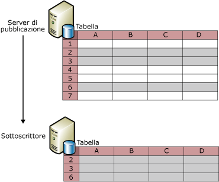
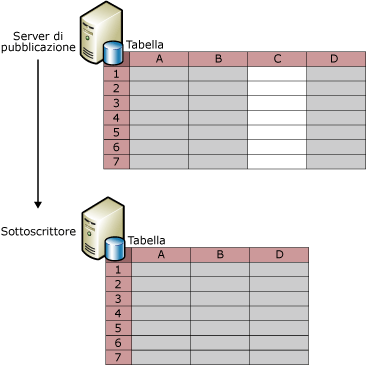
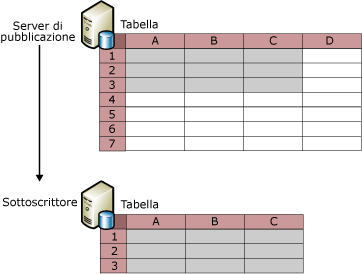

# Filtro dei dati pubblicati
[!INCLUDE[appliesto-ss-xxxx-xxxx-xxx-md](../../../includes/appliesto-ss-xxxx-xxxx-xxx-md.md)]
  L'applicazione di filtri agli articoli di una tabella consente di creare partizioni di dati da pubblicare. Tramite l'applicazione di filtri ai dati pubblicati è possibile:  
  
-   Ridurre al minimo la quantità di dati inviati in rete.  
  
-   Ridurre la quantità di spazio di archiviazione necessaria nel Sottoscrittore.  
  
-   Personalizzare le pubblicazioni e le applicazioni in base ai requisiti dei singoli Sottoscrittori.  
  
-   Evitare o limitare i conflitti in caso di aggiornamento dei dati da parte dei Sottoscrittori grazie alla possibilità di inviare partizioni di dati diverse a Sottoscrittori diversi. In due Sottoscrittori pertanto non verranno mai aggiornati gli stessi valori di dati.  
  
-   Evitare la trasmissione di dati riservati. È possibile utilizzare i filtri di riga e di colonna per limitare l'accesso ai dati da parte dei Sottoscrittori. Nella replica di tipo merge è necessario tenere in considerazione alcuni aspetti relativi alla sicurezza se si utilizza un filtro con parametri che include HOST_NAME(). Per ulteriori informazioni, vedere la sezione relativa all'utilizzo dei filtri con HOST_NAME() in [Parameterized Row Filters](../../../relational-databases/replication/merge/parameterized-filters-parameterized-row-filters.md).  
  
 La replica include quattro tipi di filtro:  
  
-   Filtri di riga statici, disponibili con tutti i tipi di replica.  
  
     L'utilizzo di questo tipo di filtro consente di scegliere un subset di righe da pubblicare. Tutti i Sottoscrittori di una pubblicazione filtrata ricevono lo stesso subset di righe per la tabella filtrata. Per ulteriori informazioni, vedere la sezione "Filtri di riga statici" di questo argomento.  
  
-   Filtri di colonna, disponibili con tutti i tipi di replica.  
  
     L'utilizzo di questo tipo di filtro consente di scegliere un subset di colonne da pubblicare. Per ulteriori informazioni, vedere la sezione "Filtri di colonna" in questo argomento.  
  
-   Filtri di riga con parametri, disponibili solo con la replica di tipo merge.  
  
     L'utilizzo di questo tipo di filtro consente di scegliere un subset di righe da pubblicare. Diversamente dai filtri statici che inviano lo stesso subset di righe a ogni Sottoscrittore, i filtri di riga con parametri utilizzano un valore di dati fornito dal Sottoscrittore per inviare ai Sottoscrittori subset di righe differenti. Per altre informazioni sui filtri di riga con parametri, vedere [Filtri di riga con parametri](../../../relational-databases/replication/merge/parameterized-filters-parameterized-row-filters.md).  
  
-   Filtri join, disponibili solo con la replica di tipo merge.  
  
     I filtri join consentono di estendere un filtro di riga da una tabella pubblicata a un'altra. Per altre informazioni, vedere [Join Filters](../../../relational-databases/replication/merge/join-filters.md).  
  
## filtri di riga statici  
 Nella figura seguente viene illustrata una tabella pubblicata, filtrata in modo che solo le righe 2, 3 e 6 siano incluse nella pubblicazione.  
  
   
  
 Un filtro di riga statico utilizza una clausola WHERE per selezionare i dati appropriati da pubblicare. La parte finale di tale clausola viene specificata dall'utente. Si consideri la tabella **Product** nel database di esempio AdventureWorks in cui è inclusa la colonna **ProductLine**. Per pubblicare solo le righe contenenti dati su prodotti correlati alle mountain bike, specificare `ProductLine = 'M'`.  
  
 Un filtro di riga statico restituisce un singolo set di dati per ogni pubblicazione. Nell'esempio precedente tutti i Sottoscrittori riceverebbero solo le righe contenenti dati su prodotti correlati alle mountain bike. Se un altro Sottoscrittore richiede solo le righe contenenti dati su prodotti correlati alle biciclette da strada:  
  
-   Con la replica snapshot o transazionale, è possibile creare un'altra pubblicazione e includere la tabella in entrambe le pubblicazioni (nella clausola di filtro relativa all'articolo di tale pubblicazione, specificare `ProductLine = 'R')`.  
  
    > [!NOTE]  
    >  Nelle pubblicazioni transazionali i filtri di riga comportano un notevole aumento dell'overhead in quanto la clausola di filtro per l'articolo viene valutata per ogni riga del log di una tabella pubblicata per stabilire se deve essere replicata. È consigliabile evitare l'uso dei filtri di riga nelle pubblicazioni transazionali se ogni nodo di replica può supportare il carico completo dei dati e se il set di dati complessivo è relativamente ridotto.  
  
-   Con la replica di tipo merge, utilizzare i filtri di riga con parametri anziché creare più pubblicazioni con filtri di riga statici. Per altre informazioni, vedere [Parameterized Row Filters](../../../relational-databases/replication/merge/parameterized-filters-parameterized-row-filters.md).  
  
 Per definire o modificare un filtro di riga statico, vedere [Define and Modify a Static Row Filter](../../../relational-databases/replication/publish/define-and-modify-a-static-row-filter.md).  
  
## Filtri colonne  
 Nella figura seguente viene illustrata una pubblicazione in cui la colonna C viene esclusa tramite un filtro.  
  
   
  
 È inoltre possibile utilizzare contemporaneamente il filtro di riga e di colonna, come illustrato di seguito.  
  
   
  
 Dopo aver creato una pubblicazione, è possibile utilizzare il filtro di colonna per eliminare una colonna da una pubblicazione esistente, mantenendola nella tabella del server di pubblicazione, nonché includere una colonna esistente nella pubblicazione. Per altre modifiche, ad esempio l'aggiunta di una nuova colonna a una tabella e quindi all'articolo pubblicato, utilizzare la replica di modifica dello schema. Per altre informazioni, vedere le sezioni "Aggiunta di colonne" ed "Eliminazione di colonne" nell'argomento [Apportare modifiche allo schema nei database di pubblicazione](../../../relational-databases/replication/publish/make-schema-changes-on-publication-databases.md).  
  
 Non è possibile escludere tramite filtro determinati tipi di pubblicazioni nei tipi di colonna elencati nella tabella seguente.  
  
|Tipo di colonna|Tipo di pubblicazione e opzioni|  
|-----------------|-------------------------------------|  
|Colonna chiave primaria|Nelle pubblicazioni transazionali tutte le tabelle devono contenere una colonna chiave primaria. Le chiavi primarie non sono necessarie per le tabelle delle pubblicazioni di tipo merge, ma se è presente una colonna chiave primaria, non sarà possibile filtrarla.|  
|Colonna chiave esterna|Tutte le pubblicazioni create mediante la Creazione guidata nuova pubblicazione. È possibile filtrare le colonne chiave esterna mediante le stored procedure Transact-SQL. Per ulteriori informazioni, vedere [Define and Modify a Column Filter](../../../relational-databases/replication/publish/define-and-modify-a-column-filter.md).|  
|Colonna **rowguid**|Pubblicazioni di tipo merge*|  
|Colonna **msrepl_tran_version**|Pubblicazioni snapshot o transazionali che consentono sottoscrizioni aggiornabili|  
|Colonne che non consentono valori NULL e non contengono valori predefiniti o il set di proprietà IDENTITY.|Pubblicazioni snapshot o transazionali che consentono sottoscrizioni aggiornabili|  
|Colonne con indici o vincoli univoci|Pubblicazioni snapshot o transazionali che consentono sottoscrizioni aggiornabili|  
|Tutte le colonne di una pubblicazione di tipo merge SQL Server 7.0|Nelle pubblicazioni di tipo merge SQL Server 7.0 non è possibile filtrare le colonne.|  
|Timestamp|Pubblicazioni snapshot o transazionali SQL Server 7.0 che consentono sottoscrizioni aggiornabili|  
  
 \*Se si pubblica una tabella in una pubblicazione di tipo merge e tale tabella contiene già una colonna con tipo di dati **uniqueidentifier** con la proprietà **ROWGUIDCOL** impostata, la replica può usare questa colonna invece di creare una colonna aggiuntiva denominata **rowguid**. In questo caso è necessario pubblicare la colonna esistente.  
  
 Per definire o modificare un filtro colonne, vedere [Define and Modify a Column Filter](../../../relational-databases/replication/publish/define-and-modify-a-column-filter.md).  
  
## Considerazioni sull'applicazione di filtri  
 Durante l'applicazioni di filtri ai dati tenere presente quanto segue:  
  
-   È necessario includere nella pubblicazione tutte le colonne a cui viene fatto riferimento nei filtri di riga. In altre parole, non è possibile utilizzare un filtro di colonna per escludere una colonna utilizzata in un filtro di riga.  
  
-   Se si aggiunge o si modifica un filtro in seguito all'inizializzazione delle sottoscrizioni, sarà necessario reinizializzarle.  
  
-   Il numero massimo di byte consentiti per una colonna utilizzata in un filtro è pari a 1024 per un articolo di una pubblicazione di tipo merge e a 8000 per un articolo di una pubblicazione transazionale.  
  
-   Nei filtri di riga o join non è possibile fare riferimento alle colonne con i tipi di dati seguenti:  
  
    -   **varchar(max) e nvarchar(max)**  
  
    -   **varbinary(max)**  
  
    -   **text e ntext**  
  
    -   **image**  
  
    -   **XML**  
  
    -   **UDT**  
  
-   La replica transazionale consente di replicare una vista indicizzata come vista o come tabella. Se la vista viene replicata come tabella, non sarà possibile filtrare le colonne dalla tabella.  
  
 I filtri di riga non sono progettati per funzionare nei database. [!INCLUDE[ssNoVersion](../../../includes/ssnoversion-md.md)] viene limitata intenzionalmente l'esecuzione di **sp_replcmds** (in cui vengono eseguiti i filtri) al proprietario del database (**dbo**). Al **dbo** non sono associati privilegi tra database. Grazie all'aggiunta di CDC (Change Data Capture) in [!INCLUDE[ssKatmai](../../../includes/sskatmai-md.md)] the **sp_replcmds** le tabelle di rilevamento delle modifiche vengono popolate con le informazioni che possono essere restituite all'utente e su cui quest'ultimo può eseguire una query. Per motivi di sicurezza, in [!INCLUDE[ssNoVersion](../../../includes/ssnoversion-md.md)] viene limitata l'esecuzione di questa logica in modo che un **dbo** malintenzionato non possa rubare il percorso di esecuzione. Ad esempio, un **dbo** malintenzionato potrebbe aggiungere trigger nelle tabelle CDC che quindi verrebbero eseguite nel contesto della chiamata a **sp_replcmds**da parte dell'utente, in questo caso l'agente di lettura log.  Se all'account con cui l'agente è in esecuzione sono associati privilegi superiori, il **dbo** malintenzionato potrebbe tentare l'escalation dei suoi privilegi.  
  
## Vedere anche  
 [Pubblicare dati e oggetti di database](../../../relational-databases/replication/publish/publish-data-and-database-objects.md)  
  
  
