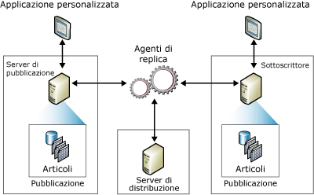

# Panoramica del modello di pubblicazione della replica
  Nella replica viene utilizzata una metafora basata sul settore dell'editoria per rappresentare i componenti di una topologia di replica: server di pubblicazione, server di distribuzione, sottoscrittori, pubblicazioni, articoli e sottoscrizioni. Si può infatti pensare alla replica [!INCLUDE[msCoName](../../../includes/msconame-md.md)] [!INCLUDE[ssNoVersion](../../../includes/ssnoversion-md.md)] usando come riferimento una rivista:  
  
-   Un editore di riviste produce una o più pubblicazioni  
  
-   Una pubblicazione contiene articoli  
  
-   L'editore distribuisce la rivista direttamente o tramite un distributore  
  
-   I sottoscrittori ricevono le pubblicazioni per le quali hanno effettuato una sottoscrizione  
  
 Sebbene la metafora della rivista si riveli utile per comprendere il concetto di replica, è importante osservare che in [!INCLUDE[ssNoVersion](../../../includes/ssnoversion-md.md)] la replica include funzionalità non rappresentate nella metafora, in particolare la possibilità per un Sottoscrittore di apportare aggiornamenti e per un server di pubblicazione di inviare modifiche incrementali agli articoli di una pubblicazione.  
  
 Una *topologia di replica* definisce la relazione tra i server e le copie di dati, nonché la logica che determina il flusso dei dati tra server. Sono disponibili diversi processi di replica, denominati *agenti*, responsabili della copia e del trasferimento di dati tra il server di pubblicazione e i sottoscrittori. Nella figura seguente viene offerta una panoramica dei componenti e dei processi coinvolti nella replica.  
  
   
  
## Server di pubblicazione  
 Il server di pubblicazione è un'istanza di database che rende i dati disponibili in altre posizioni tramite la replica. Può disporre di una o più pubblicazioni, ognuna delle quali definisce un set logicamente correlato di dati e oggetti da replicare.  
  
## Database di distribuzione  
 Il server di distribuzione è un'istanza di database che funge da archivio per i dati specifici della replica associati a uno o più server di pubblicazione. Ogni server di pubblicazione è associato a un singolo database, denominato database di distribuzione, nel server di distribuzione. Nel database di distribuzione vengono archiviati i dati relativi allo stato di replica e i metadati sulla pubblicazione. In alcuni casi, il database funge inoltre da coda per i dati trasferiti dal server di pubblicazione ai Sottoscrittori. Frequentemente, una singola istanza di server di database funge sia da server di pubblicazione che da server di distribuzione. Questa configurazione viene denominata *server di distribuzione locale*. In caso di configurazione del server di pubblicazione e del server di distribuzione in istanze di server di database separate, il server di distribuzione è noto come *server di distribuzione remoto*.  
  
## Sottoscrittori  
 Un Sottoscrittore è un'istanza di database che riceve i dati replicati da uno o più server di pubblicazione e una o più pubblicazioni. A seconda del tipo di replica selezionato, il Sottoscrittore può inoltre passare modifiche di dati al server di pubblicazione oppure ripubblicare i dati per altri Sottoscrittori.  
  
## Articolo  
 Un articolo identifica un oggetto di database incluso in una pubblicazione. Una pubblicazione può contenere diversi tipi di articoli, tra cui tabelle, viste, stored procedure e altri oggetti. In caso di pubblicazione delle tabelle come articoli, è possibile utilizzare filtri per limitare le colonne e le righe di dati inviate ai Sottoscrittori.  
  
## Pubblicazione  
 Una pubblicazione è una raccolta di uno o più articoli di un database. Il raggruppamento di più articoli in una pubblicazione semplifica la selezione di un set logicamente correlato di dati e oggetti di database replicati come unità.  
  
## Sottoscrizione  
 Una sottoscrizione è una richiesta di recapito di una copia di una pubblicazione a un Sottoscrittore. Una sottoscrizione definisce la pubblicazione che verrà ricevuta, insieme alla posizione e al momento in cui l'operazione verrà eseguita. Esistono due tipi di sottoscrizioni: push e pull. Per altre informazioni sulle sottoscrizioni push e pull, vedere [Sottoscrizione delle pubblicazioni](../../../relational-databases/replication/subscribe-to-publications.md).  
  
## Vedere anche  
 [Panoramica degli agenti di replica](../../../relational-databases/replication/agents/replication-agents-overview.md)   
 [Tipi di replica](../../../relational-databases/replication/types-of-replication.md)   
 [Configurare la replica per i gruppi di disponibilità AlwaysOn (SQL Server)](../../../database-engine/availability-groups/windows/configure-replication-for-always-on-availability-groups-sql-server.md)   
 [Gestione di un database di pubblicazione AlwaysOn (SQL Server)](../../../database-engine/availability-groups/windows/maintaining-an-always-on-publication-database-sql-server.md)  
  
  