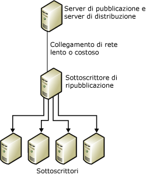
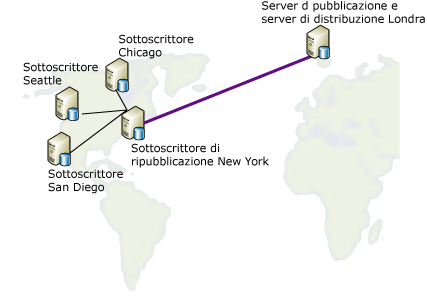

# Ripubblicazione dei dati
  In un modello di ripubblicazione il server di pubblicazione invia i dati a un Sottoscrittore, il quale ripubblica i dati in un numero qualsiasi di altri Sottoscrittori. Si tratta di un comportamento utile quando un server di pubblicazione deve inviare dati ai Sottoscrittori tramite un collegamento di comunicazione lento o costoso. Se all'altro capo del collegamento sono presenti più Sottoscrittori, l'utilizzo di un server di ripubblicazione consente di trasferirvi il carico dell'attività di distribuzione.  
  
 La ripubblicazione dei dati comprende i passaggi seguenti:  
  
1.  Creare una pubblicazione nel server di pubblicazione.  
  
2.  Creare una sottoscrizione della pubblicazione per il Sottoscrittore di ripubblicazione.  
  
3.  Inizializzare la sottoscrizione. Perché la replica non abbia esito negativo, è necessario che la sottoscrizione sia inizializzata prima della creazione della pubblicazione nel Sottoscrittore di ripubblicazione.  
  
4.  Creare una pubblicazione nel database di sottoscrizione del Sottoscrittore di ripubblicazione.  
  
5.  Creare sottoscrizioni della pubblicazione nel Sottoscrittore di ripubblicazione per altri Sottoscrittori.  
  
6.  Inizializzare le sottoscrizioni.  
  
> [!NOTE]  
>  Se si utilizza la replica di tipo merge in una topologia di ripubblicazione, tutti i Sottoscrittori di ripubblicazione devono utilizzare sottoscrizioni server. Per altre informazioni sui tipi di sottoscrizioni, vedere [Sottoscrivere le pubblicazioni](../../relational-databases/replication/subscribe-to-publications.md).  
  
 Nell'illustrazione seguente il server di pubblicazione e il server di ripubblicazione operano entrambi come server di distribuzione locali. Se sono stati configurati per l'utilizzo di un server di distribuzione remoto, ogni server di distribuzione deve trovarsi allo stesso capo di un collegamento di comunicazione lento o costoso e operare come server di pubblicazione proprio. È necessario che i server di pubblicazione siano connessi ai server di distribuzione remoti tramite collegamenti di comunicazioni affidabili e ad alta velocità.  
  
   
  
 Ogni server può operare sia come server di pubblicazione che come Sottoscrittore. Si consideri ad esempio la figura seguente, in cui la pubblicazione di una tabella ubicata a Londra deve essere distribuita in quattro diverse città degli Stati Uniti: Chicago, New York, San Diego e Seattle. Per la sottoscrizione della tabella pubblicata creata a Londra viene scelto il server di New York, in quanto risponde ai requisiti seguenti:  
  
-   La connessione di rete con Londra è relativamente affidabile.  
  
-   I costi di comunicazione tra Londra e New York sono accettabili.  
  
-   Le linee di comunicazione di rete tra New York e tutti gli altri Sottoscrittori statunitensi sono efficienti.  
  
       
  
 La replica supporta gli scenari di ripubblicazione illustrati nella tabella seguente.  
  
|Server di pubblicazione|Sottoscrittore di pubblicazione|Sottoscrittore|  
|---------------|---------------------------|----------------|  
|Pubblicazione transazionale|Sottoscrizione transazionale/pubblicazione transazionale|Sottoscrizione transazionale|  
|Pubblicazione transazionale|Sottoscrizione transazionale/pubblicazione di tipo merge*|Sottoscrizione di tipo merge|  
|Pubblicazione di tipo merge|Sottoscrizione di tipo merge/pubblicazione di tipo merge|Sottoscrizione di tipo merge|  
|Pubblicazione di tipo merge|Sottoscrizione di tipo merge/pubblicazione transazionale|Sottoscrizione transazionale|  
  
 \*È consigliabile impostare la proprietà **@published_in_tran_pub** sulla pubblicazione di tipo merge. Per impostazione predefinita, la replica transazionale prevede che le tabelle nel Sottoscrittore vengano considerate di sola lettura. Se durante la replica di tipo merge vengono apportate modifiche a una tabella in una sottoscrizione transazionale, si potrà verificare una mancata convergenza dei dati. Per evitare questo rischio, si suggerisce di specificare queste tabelle come di solo download nella pubblicazione di tipo merge. In tal modo si impedisce al Sottoscrittore di tipo merge di caricare le modifiche ai dati nella tabella. Per altre informazioni, vedere [Ottimizzare le prestazioni della replica di tipo merge con gli articoli di solo download](../../relational-databases/replication/merge/optimize-merge-replication-performance-with-download-only-articles.md).  
  
## Vedere anche  
 [Configurare la distribuzione](../../relational-databases/replication/configure-distribution.md)   
 [Pubblicare dati e oggetti di database](../../relational-databases/replication/publish/publish-data-and-database-objects.md)   
 [Sottoscrivere le pubblicazioni](../../relational-databases/replication/subscribe-to-publications.md)   
 [Inizializzare una sottoscrizione](../../relational-databases/replication/initialize-a-subscription.md)   
 [Sincronizzare i dati](../../relational-databases/replication/synchronize-data.md)  
  
  
