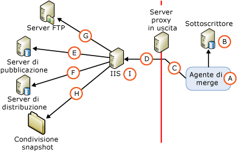

# Architettura di sicurezza per la sincronizzazione tramite il Web
[!INCLUDE[appliesto-ss-xxxx-xxxx-xxx-md](../../../includes/appliesto-ss-xxxx-xxxx-xxx-md.md)]
  [!INCLUDE[msCoName](../../../includes/msconame-md.md)] [!INCLUDE[ssNoVersion](../../../includes/ssnoversion-md.md)] consente un controllo accurato della configurazione della sicurezza per la sincronizzazione Web. In questo articolo viene riportato un elenco completo dei componenti che possono essere inclusi in una configurazione di sincronizzazione tramite il Web e vengono fornite informazioni sulle connessioni tra i componenti. [!INCLUDE[ssNoteWinAuthentication](../../../includes/ssnotewinauthentication-md.md)]  
  
 Nella figura seguente sono illustrate tutte le possibili connessioni, anche se è possibile che alcune di esse non siano necessarie in determinate topologie. Una connessione a un server FTP, ad esempio, è necessaria solo se lo snapshot viene recapitato tramite FTP.  
  
   
  
 Nella tabella seguente vengono descritti i componenti e le connessioni illustrati nella figura.  
  
## A. Utente di Windows utilizzato per l'esecuzione dell'agente di merge  
 Durante la sincronizzazione, l'agente di merge (A) viene avviato come Sottoscrittore. L'agente di merge può essere avviato da un passaggio del processo di [!INCLUDE[ssNoVersion](../../../includes/ssnoversion-md.md)] Agent o da un'applicazione personalizzata autonoma. Se viene avviato da un passaggio del processo di [!INCLUDE[ssNoVersion](../../../includes/ssnoversion-md.md)] Agent, l'agente di merge verrà eseguito nel contesto di un utente di Windows specificato. Se non viene specificato un utente di Windows, l'agente di merge verrà eseguito nel contesto dell'account di servizio di Windows per [!INCLUDE[ssNoVersion](../../../includes/ssnoversion-md.md)] Agent.  
  
|Tipo di account|Posizione in cui viene specificato l'account|  
|---------------------|------------------------------------|  
|Utente di Windows|[!INCLUDE[tsql](../../../includes/tsql-md.md)]: parametri **@job_login** e **@job_password** di [sp_addmergepullsubscription_agent](../../../relational-databases/system-stored-procedures/sp-addmergepullsubscription-agent-transact-sql.md).   RMO (Replication Management Objects): proprietà <xref:Microsoft.SqlServer.Replication.IProcessSecurityContext.Login%2A> e <xref:Microsoft.SqlServer.Replication.IProcessSecurityContext.Password%2A> per <xref:Microsoft.SqlServer.Replication.PullSubscription.SynchronizationAgentProcessSecurity%2A>.|  
|Account di servizio di Windows per [!INCLUDE[ssNoVersion](../../../includes/ssnoversion-md.md)] Agent|Gestione configurazione[!INCLUDE[ssNoVersion](../../../includes/ssnoversion-md.md)] |  
|Applicazione autonoma|L'agente di merge viene eseguito nel contesto dell'utente di Windows che esegue l'applicazione.|  
  
## B. Connessione al Sottoscrittore  
 L'agente di merge si connette al Sottoscrittore utilizzando l'autenticazione di Windows o l'autenticazione di [!INCLUDE[ssNoVersion](../../../includes/ssnoversion-md.md)] . L'utente di Windows o l'account di accesso di [!INCLUDE[ssNoVersion](../../../includes/ssnoversion-md.md)] specificato deve essere associato a un utente di database che sia membro del ruolo predefinito del database **dbowner** nel database di sottoscrizione.  
  
> [!NOTE]  
>  Quando l'agente di merge viene avviato da un processo di [!INCLUDE[ssNoVersion](../../../includes/ssnoversion-md.md)] Agent, viene sempre utilizzata l'autenticazione di Windows. L'autenticazione di Windows viene inoltre utilizzata quando l'agente di merge viene avviato a livello di programmazione, a meno che non venga specificata in modo esplicito l'autenticazione di [!INCLUDE[ssNoVersion](../../../includes/ssnoversion-md.md)] .  
  
|Tipo di autenticazione|Posizione in cui viene specificata l'autenticazione|  
|----------------------------|-------------------------------------------|  
|- Autenticazione di Windows.|L'agente di merge esegue le connessioni nel contesto dell'utente di Windows specificato per l'agente di merge (A).|  
|L'autenticazione di[!INCLUDE[ssNoVersion](../../../includes/ssnoversion-md.md)] viene utilizzata solo se si specifica quanto segue:   - RMO: valore di <xref:Microsoft.SqlServer.Replication.SecurityMode.Standard> per <xref:Microsoft.SqlServer.Replication.MergeSynchronizationAgent.SubscriberSecurityMode%2A>. - Riga di comando dell'agente di merge: valore **0** per **SubscriberSecurityMode**.|RMO: <xref:Microsoft.SqlServer.Replication.MergeSynchronizationAgent.SubscriberLogin%2A> e <xref:Microsoft.SqlServer.Replication.MergeSynchronizationAgent.SubscriberPassword%2A>.   Riga di comando dell'agente di merge: **-SubscriberLogin** e **-SubscriberLogin**.|  
  
## C. Connessione a un server proxy in uscita  
 Specificare un utente di Windows per questa connessione solo se è presente un server proxy in uscita che limita l'accesso alla rete interna del Sottoscrittore.  
  
|Tipo di autenticazione|Posizione in cui viene specificata l'autenticazione|  
|----------------------------|-------------------------------------------|  
|Autenticazione di Windows|RMO: <xref:Microsoft.SqlServer.Replication.MergeSynchronizationAgent.InternetProxyLogin%2A> e <xref:Microsoft.SqlServer.Replication.MergeSynchronizationAgent.InternetProxyPassword%2A> con <xref:Microsoft.SqlServer.Replication.MergeSynchronizationAgent.InternetProxyServer%2A>.   Riga di comando dell'agente di merge: **-InternetProxyLogin** e **-InternetProxyPassword** con **-InternetProxyServer**.|  
  
## D. Connessione a IIS  
 Dopo la connessione al Sottoscrittore e l'estrazione delle modifiche dal database di sottoscrizione, l'agente di merge esegue una richiesta HTTPS a [!INCLUDE[msCoName](../../../includes/msconame-md.md)] Internet Information Services (IIS) e carica le modifiche ai dati come messaggio XML. L'agente di merge deve disporre delle autorizzazioni di accesso a IIS.  
  
|Tipo di autenticazione|Posizione in cui viene specificata l'autenticazione|  
|----------------------------|-------------------------------------------|  
|L'autenticazione di base viene utilizzata se si specifica uno dei valori seguenti:   -   [!INCLUDE[tsql](../../../includes/tsql-md.md)]: valore **0** per il parametro **@internet_security_mode** di [sp_addmergepullsubscription_agent](../../../relational-databases/system-stored-procedures/sp-addmergepullsubscription-agent-transact-sql.md). - RMO: valore di <xref:Microsoft.SqlServer.Replication.SecurityMode.Standard> per <xref:Microsoft.SqlServer.Replication.MergeSynchronizationAgent.InternetSecurityMode%2A>. - Riga di comando dell'agente di merge: valore **0** per **-InternetSecurityMode**.|[!INCLUDE[tsql](../../../includes/tsql-md.md)]: parametri **@internet_login** e **@internet_password** di [sp_addmergepullsubscription_agent](../../../relational-databases/system-stored-procedures/sp-addmergepullsubscription-agent-transact-sql.md).   RMO: <xref:Microsoft.SqlServer.Replication.MergeSynchronizationAgent.InternetLogin%2A> e <xref:Microsoft.SqlServer.Replication.MergeSynchronizationAgent.InternetPassword%2A>.   Riga di comando dell'agente di merge: **-InternetLogin** e **-InternetPassword**.|  
|L'autenticazione integrata1 viene utilizzata se si specifica uno dei valori seguenti:   -   [!INCLUDE[tsql](../../../includes/tsql-md.md)]: valore **1** per il parametro **@internet_security_mode** di [sp_addmergepullsubscription_agent](../../../relational-databases/system-stored-procedures/sp-addmergepullsubscription-agent-transact-sql.md). - RMO: valore di <xref:Microsoft.SqlServer.Replication.SecurityMode.Integrated> per <xref:Microsoft.SqlServer.Replication.MergeSynchronizationAgent.InternetSecurityMode%2A>. - Riga di comando dell'agente di merge: valore **1** per **-InternetSecurityMode**.|L'agente di merge esegue le connessioni nel contesto dell'utente di Windows specificato per l'agente di merge (A).|  
  
 1 L'autenticazione integrata può essere utilizzata solo se tutti i computer si trovano nello stesso dominio oppure in più domini con relazioni di trust reciproche.  
  
> [!NOTE]  
>  La delega è necessaria se si utilizza l'autenticazione integrata. Per le connessioni dal Sottoscrittore a IIS è consigliabile utilizzare l'autenticazione di base e SSL.  
  
## E. Connessione al server di pubblicazione  
 I componenti Listener per la replica e Riconciliatore replica di tipo merge (Merge Replication Reconciler) di [!INCLUDE[ssNoVersion](../../../includes/ssnoversion-md.md)] sono ospitati nel computer che esegue IIS. Questi componenti eseguono le operazioni seguenti:  
  
-   Prelievo della richiesta HTTPS descritta nella sezione "D. Connessione a IIS".  
  
-   Esecuzione di una connessione SQL al database di pubblicazione e applicazione delle modifiche caricate nel database di pubblicazione.  
  
-   Estrazione delle modifiche scaricate e invio di una risposta HTTPS all'agente di merge.  
  
 Riconciliatore replica di tipo merge (Merge Replication Reconciler) si connette al server di pubblicazione mediante l'autenticazione di Windows o l'autenticazione di [!INCLUDE[ssNoVersion](../../../includes/ssnoversion-md.md)] . L'utente di Windows o l'account di accesso di [!INCLUDE[ssNoVersion](../../../includes/ssnoversion-md.md)] specificato deve essere conforme alle regole seguenti:  
  
-   Trovarsi nell'elenco di accesso alla pubblicazione. Per altre informazioni, vedere [Proteggere il server di pubblicazione](../../../relational-databases/replication/security/secure-the-publisher.md).  
  
-   Essere associato a un utente nel database di pubblicazione.  
  
|Tipo di autenticazione|Posizione in cui viene specificata l'autenticazione|  
|----------------------------|-------------------------------------------|  
|L'autenticazione di Windows viene utilizzata se si specifica uno dei valori seguenti:   -   [!INCLUDE[tsql](../../../includes/tsql-md.md)]: valore **1** per il parametro **@publisher_security_mode** di [sp_addmergepullsubscription_agent](../../../relational-databases/system-stored-procedures/sp-addmergepullsubscription-agent-transact-sql.md). - RMO: valore di <xref:Microsoft.SqlServer.Replication.SecurityMode.Integrated> per <xref:Microsoft.SqlServer.Replication.MergeSynchronizationAgent.PublisherSecurityMode%2A>. - Riga di comando dell'agente di merge: valore **1** per **-PublisherSecurityMode**.|L'agente di merge esegue le connessioni al server di pubblicazione nel contesto dell'utente di Windows specificato per la connessione a IIS (D). Se il server di pubblicazione e IIS si trovano in computer differenti e viene utilizzata l'autenticazione integrata per la connessione (D), è necessario abilitare la delega Kerberos nel computer che esegue IIS. Per ulteriori informazioni, vedere la documentazione di Windows.|  
|L'autenticazione di[!INCLUDE[ssNoVersion](../../../includes/ssnoversion-md.md)] viene utilizzata se si specifica uno dei valori seguenti:   -   [!INCLUDE[tsql](../../../includes/tsql-md.md)]: valore **0** per il parametro **@publisher_security_mode** di [sp_addmergepullsubscription_agent](../../../relational-databases/system-stored-procedures/sp-addmergepullsubscription-agent-transact-sql.md). - RMO: valore di <xref:Microsoft.SqlServer.Replication.SecurityMode.Standard> per <xref:Microsoft.SqlServer.Replication.MergeSynchronizationAgent.PublisherSecurityMode%2A>. - Riga di comando dell'agente di merge: valore **0** per **-PublisherSecurityMode**.|[!INCLUDE[tsql](../../../includes/tsql-md.md)]: parametri **@publisher_login** e **@publisher_password** di [sp_addmergepullsubscription_agent](../../../relational-databases/system-stored-procedures/sp-addmergepullsubscription-agent-transact-sql.md).   RMO: <xref:Microsoft.SqlServer.Replication.MergeSynchronizationAgent.PublisherLogin%2A> e <xref:Microsoft.SqlServer.Replication.MergeSynchronizationAgent.PublisherPassword%2A>.   Riga di comando dell'agente di merge: **-PublisherLogin** e **-PublisherPassword**.|  
  
## F. Connessione al server di distribuzione  
 Anche Riconciliatore replica di tipo merge (Merge Replication Reconciler) ospitato nel computer che esegue IIS effettua connessioni al server di distribuzione. Per tali connessioni utilizza l'autenticazione di Windows o l'autenticazione di [!INCLUDE[ssNoVersion](../../../includes/ssnoversion-md.md)] . L'utente di Windows o l'account di accesso di [!INCLUDE[ssNoVersion](../../../includes/ssnoversion-md.md)] specificato deve essere conforme alle regole seguenti:  
  
-   Trovarsi nell'elenco di accesso alla pubblicazione. Per altre informazioni, vedere [Proteggere il server di pubblicazione](../../../relational-databases/replication/security/secure-the-publisher.md).  
  
-   Essere associato a un utente di database nel database di distribuzione. L'utente può essere l'utente **Guest** .  
  
 La condivisione snapshot si trova generalmente nel server di distribuzione. Per ulteriori informazioni sulle condivisioni snapshot, vedere la sezione "H. Accesso alla condivisione snapshot", più avanti in questo argomento.  
  
|- Tipo di autenticazione|Posizione in cui viene specificata l'autenticazione|  
|-------------------------------|-------------------------------------------|  
|L'autenticazione di Windows viene utilizzata se si specifica uno dei valori seguenti:   -   [!INCLUDE[tsql](../../../includes/tsql-md.md)]: valore **1** per il parametro **@distributor_security_mode** di [sp_addmergepullsubscription_agent](../../../relational-databases/system-stored-procedures/sp-addmergepullsubscription-agent-transact-sql.md). - RMO: valore di <xref:Microsoft.SqlServer.Replication.SecurityMode.Integrated> per <xref:Microsoft.SqlServer.Replication.MergeSynchronizationAgent.DistributorSecurityMode%2A>. - Riga di comando dell'agente di merge: valore **1** per **-DistributorSecurityMode**.|L'agente di merge esegue le connessioni al server di distribuzione nel contesto dell'utente di Windows specificato per la connessione a IIS (D). Se il server di distribuzione e IIS si trovano in computer differenti e viene utilizzata l'autenticazione integrata per la connessione (D), è necessario abilitare la delega Kerberos nel computer che esegue IIS. Per ulteriori informazioni, vedere la documentazione di Windows.|  
|L'autenticazione di[!INCLUDE[ssNoVersion](../../../includes/ssnoversion-md.md)] viene utilizzata se si specifica uno dei valori seguenti:   -   [!INCLUDE[tsql](../../../includes/tsql-md.md)]: valore **0** per il parametro **@distributor_security_mode** di [sp_addmergepullsubscription_agent](../../../relational-databases/system-stored-procedures/sp-addmergepullsubscription-agent-transact-sql.md). - RMO: valore di <xref:Microsoft.SqlServer.Replication.SecurityMode.Standard> per <xref:Microsoft.SqlServer.Replication.MergeSynchronizationAgent.DistributorSecurityMode%2A>. - Riga di comando dell'agente di merge: valore **0** per **-DistributorSecurityMode**.|[!INCLUDE[tsql](../../../includes/tsql-md.md)]: parametri **@distributor_login** e **@distributor_password** di [sp_addmergepullsubscription_agent](../../../relational-databases/system-stored-procedures/sp-addmergepullsubscription-agent-transact-sql.md).   RMO: <xref:Microsoft.SqlServer.Replication.MergeSynchronizationAgent.DistributorLogin%2A> e <xref:Microsoft.SqlServer.Replication.MergeSynchronizationAgent.DistributorPassword%2A>   Riga di comando dell'agente di merge: **-DistributorLogin** e **-DistributorPassword**.|  
  
## G. Connessione a un server FTP  
 Specificare un utente di Windows per questa connessione solo se si eseguirà il download dei file di snapshot da un server FTP, anziché da un percorso UNC, al computer che esegue IIS prima dell'applicazione dello snapshot al Sottoscrittore. Per altre informazioni, vedere [Trasferire snapshot tramite FTP](../../../relational-databases/replication/transfer-snapshots-through-ftp.md).  
  
|Tipo di autenticazione|Posizione in cui viene specificata l'autenticazione|  
|----------------------------|-------------------------------------------|  
|Autenticazione di Windows|[!INCLUDE[tsql](../../../includes/tsql-md.md)]: parametri **@ftp_login** e **@ftp_password** di [sp_addmergepublication](../../../relational-databases/system-stored-procedures/sp-addmergepublication-transact-sql.md).   RMO: <xref:Microsoft.SqlServer.Replication.Publication.FtpLogin%2A> e <xref:Microsoft.SqlServer.Replication.Publication.FtpPassword%2A>.|  
  
## H. Accesso alla condivisione snapshot  
 Alla condivisione snapshot è possibile accedere tramite Riconciliatore replica di tipo merge (Merge Replication Reconciler) ospitato nel computer che esegue IIS.  
  
|Tipo di autenticazione|Posizione in cui viene specificata l'autenticazione|  
|----------------------------|-------------------------------------------|  
|Autenticazione di Windows|L'agente di merge accede alla condivisione snapshot nel contesto dell'utente di Windows specificato per la connessione a IIS (D). Se la condivisione snapshot e IIS si trovano in computer differenti e viene utilizzata l'autenticazione integrata per la connessione (D), è necessario abilitare la delega Kerberos nel computer che esegue IIS. Per ulteriori informazioni, vedere la documentazione di Windows.|  
  
## I. Account del pool di applicazioni per IIS  
 Questo account viene utilizzato per avviare il processo W3wp.exe nel computer che esegue IIS per [!INCLUDE[winxpsvr](../../../includes/winxpsvr-md.md)] o il processo Dllhost.exe in [!INCLUDE[win2kfamily](../../../includes/win2kfamily-md.md)]. Questi processi ospitano applicazioni nel computer che esegue IIS, ad esempio Listener per la replica di [!INCLUDE[ssNoVersion](../../../includes/ssnoversion-md.md)] e Riconciliatore replica di tipo merge (Merge Replication Reconciler). Questo account deve disporre delle autorizzazioni di lettura ed esecuzione sulle seguenti DLL di replica nel computer che esegue IIS:  
  
-   Replisapi  
  
-   Replrec  
  
-   Replprov  
  
-   Msgprox  
  
-   Xmlsub  
  
 L'account deve inoltre essere membro del gruppo IIS_WPG. Per altre informazioni, vedere la sezione "Impostazione delle autorizzazioni per Listener per la replica di [!INCLUDE[ssNoVersion](../../../includes/ssnoversion-md.md)]" in [Configurazione di IIS per la sincronizzazione Web](../../../relational-databases/replication/configure-iis-for-web-synchronization.md).  
  
|Tipo di account|Posizione in cui viene specificato l'account|  
|---------------------|------------------------------------|  
|Qualsiasi utente di Windows che dispone delle autorizzazioni necessarie.|Gestione Internet Information Services (IIS). |  
  
## Vedere anche  
 [Configure Web Synchronization](../../../relational-databases/replication/configure-web-synchronization.md)   
 [Replication Merge Agent](../../../relational-databases/replication/agents/replication-merge-agent.md)  
  
  
