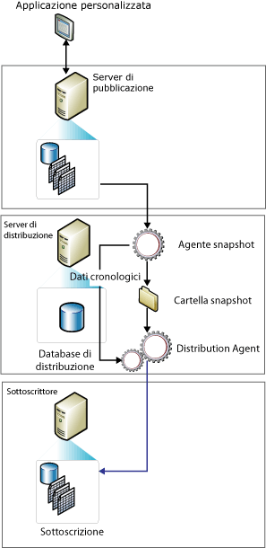

# Replica snapshot
  La replica snapshot distribuisce i dati così come appaiono in uno determinato momento e non prevede il monitoraggio degli aggiornamenti ai dati. Quando viene eseguita la sincronizzazione, viene generato e inviato ai Sottoscrittori l'intero snapshot.  
  
> [!NOTE]  
>  È possibile utilizzare la replica snapshot autonomamente, ma il processo di snapshot (che crea una copia di tutti gli oggetti e dati specificati da una pubblicazione) viene anche comunemente utilizzato per fornire il set iniziale di dati e oggetti di database per le pubblicazioni transazionali e di tipo merge.  
  
 L'utilizzo della replica snapshot in modo autonomo si rivela maggiormente appropriato in presenza di una o più delle condizioni seguenti:  
  
-   I dati vengono modificati raramente.  
  
-   L'utilizzo temporaneo di copie di dati non aggiornate rispetto al server di pubblicazione è accettabile.  
  
-   Vengono replicati volumi ridotti di dati.  
  
-   Viene apportato un ingente volume di modifiche in un breve periodo di tempo.  
  
 La replica snapshot è maggiormente appropriata in caso di modifiche di dati sostanziali ma non frequenti. Se, ad esempio, un'organizzazione addetta alle vendite gestisce un listino prezzi dei prodotti e i prezzi vengono aggiornati contemporaneamente una o due volte all'anno, è consigliabile eseguire la replica dell'intero snapshot di dati dopo che è stato modificato. Data la natura di determinati tipi di dati, può essere consigliabile eseguire snapshot più frequenti. Se, ad esempio, una tabella relativamente piccola viene aggiornata sul server di pubblicazione nel corso della giornata ma un minimo di latenza è tollerata, le modifiche possono essere recapitate durante la notte sotto forma di snapshot.  
  
 La replica snapshot presenta un overhead continuo più basso sul server di pubblicazione rispetto alla replica transazionale, in quanto le modifiche incrementali non vengono rilevate. Se, tuttavia, il set di dati replicato è molto ampio, sarà necessario un numero significativo di risorse per generare e applicare lo snapshot. Per valutare l'opportunità o meno di utilizzare la replica snapshot, considerare la dimensione dell'intero set di dati e la frequenza delle modifiche ai dati.  
  
 **Contenuto dell'argomento**  
  
 [Funzionamento della replica snapshot](#HowWorks)  
  
 [agente snapshot](#SnapshotAgent)  
  
 [Agenti di distribuzione e di merge](#DistAgent)  
  
##   Funzionamento della replica snapshot  
 Per impostazione predefinita, tutti e tre i tipi di replica utilizzano uno snapshot per inizializzare i Sottoscrittori. L'agente snapshot di [!INCLUDE[ssNoVersion](../../includes/ssnoversion-md.md)] genera sempre file di snapshot ma l'agente che recapita i file varia a seconda del tipo di replica in uso. La replica snapshot e la replica transazionale utilizzano l'agente di distribuzione per recapitare i file, mentre la replica di tipo merge utilizza l'agente di merge di [!INCLUDE[ssNoVersion](../../includes/ssnoversion-md.md)] . L'agente snapshot viene eseguito nel server di distribuzione. L'agente di distribuzione e l'agente di merge vengono eseguiti nel database di distribuzione per le sottoscrizioni push o nei Sottoscrittori per le sottoscrizioni pull.  
  
 Gli snapshot possono essere generati e applicati immediatamente dopo la creazione della sottoscrizione oppure in base a un set di pianificazioni durante la creazione della pubblicazione. L'agente snapshot prepara i file di snapshot contenenti lo schema e i dati delle tabelle pubblicate e degli oggetti di database, archivia i file nella cartella snapshot del server di pubblicazione e registra le informazioni di rilevamento nel database di distribuzione del server di distribuzione. Durante la configurazione di un database di distribuzione viene specificata una cartella snapshot predefinita, ma è anche possibile indicare una posizione alternativa per una pubblicazione in aggiunta a quella predefinita o al posto di questa.  
  
 Oltre al processo di snapshot standard descritto in questo argomento, viene utilizzato un processo di snapshot a due parti per le pubblicazioni di tipo merge che utilizzano filtri con parametri.  
  
 Nella figura seguente vengono illustrati i componenti principali della replica snapshot.  
  
   
  
##   agente snapshot  
 Per la replica di tipo merge, viene generato uno snapshot a ogni esecuzione dell'agente snapshot. Per la replica transazionale, la generazione dello snapshot dipende dall'impostazione della proprietà di pubblicazione **immediate_sync**. Se tale proprietà è impostata su TRUE, ovvero il valore predefinito quando si utilizza la Creazione guidata nuova pubblicazione, viene generato uno snapshot ogni volta che viene eseguito l'agente snapshot, che può essere applicato a un Sottoscrittore in qualsiasi momento. Se la proprietà è impostata su FALSE (impostazione predefinita quando si utilizza **sp_addpublication**), lo snapshot viene generato solo se è stato aggiunto un nuovo abbonamento poiché l'agente Snapshot ultima esecuzione. I sottoscrittori devono attendere l'agente Snapshot per il completamento prima di poter eseguire la sincronizzazione.  
  
 L'agente snapshot esegue la procedura seguente:  
  
1.  Stabilisce una connessione dal server di distribuzione al server di pubblicazione, quindi imposta dei blocchi sulle tabelle pubblicate, se necessario:  
  
    -   Per le pubblicazioni di tipo merge, l'agente snapshot non imposta alcun blocco.  
  
    -   Per le pubblicazioni transazionali, per impostazione predefinita l'agente snapshot imposta dei blocchi solo durante la fase iniziale della generazione degli snapshot.  
  
    -   Per le pubblicazioni snapshot, i blocchi vengono mantenuti durante l'intero processo di generazione degli snapshot.  
  
2.  Scrive in un file con estensione sch una copia dello schema della tabella. Se vengono pubblicati altri oggetti di database, ad esempio indici, vincoli, stored procedure, viste, funzioni definite dall'utente e così via, verranno generati file script aggiuntivi.  
  
3.  Copia i dati dalla tabella pubblicata nel server di pubblicazione e scrive i dati nella cartella snapshot. Lo snapshot viene generato come set di file di programma per la copia bulk (BCP).  
  
4.  Per pubblicazioni snapshot e transazionali, l'agente Snapshot aggiunge righe per il **MSrepl_commands** e **MSrepl_transactions** tabelle nel database di distribuzione. Le voci di **MSrepl_commands** tabella sono comandi che indica il percorso del file con estensione sch e bcp, qualsiasi altro file di snapshot e riferimenti a tutti gli script pre-distribuzione o post-snapshot. Le voci di **MSrepl_transactions** tabella sono comandi rilevanti per la sincronizzazione del sottoscrittore.  
  
     Per le pubblicazioni di tipo merge, l'agente snapshot esegue operazioni aggiuntive.  
  
5.  Rilascia gli eventuali blocchi sulle tabelle pubblicate.  
  
 Durante la generazione degli snapshot, non è possibile apportare modifiche di schema nelle tabelle pubblicate. Dopo avere generato i file di snapshot, è possibile visualizzarli nella cartella snapshot tramite Esplora risorse.  
  
##   Agente di distribuzione e di merge  
 Per le applicazioni snapshot, ogni volta che l'agente di distribuzione viene eseguito per la pubblicazione, un nuovo snapshot viene spostato in ogni Sottoscrittore che non è stato ancora sincronizzato, è stato contrassegnato per la reinizializzazione o include nuovi articoli.  
  
 Per la replica snapshot e transazionale, l'agente di distribuzione esegue la procedura seguente:  
  
1.  Stabilisce una connessione con il server di distribuzione.  
  
2.  Esamina la **MSrepl_commands** e **MSrepl_transactions** tabelle nel database di distribuzione nel server di distribuzione. L'agente legge nella prima tabella la posizione dei file di snapshot e in entrambe le tabelle i comandi di sincronizzazione del Sottoscrittore.  
  
3.  Applica lo schema e i comandi al database di sottoscrizione.  
  
 Per una pubblicazione per la replica di tipo merge non filtrata, l'agente di merge esegue la procedura seguente:  
  
1.  Stabilisce una connessione con il server di pubblicazione.  
  
2.  Esamina la tabella **sysmergeschemachange** sul server di pubblicazione e stabilisce se è presente un nuovo snapshot da applicare al Sottoscrittore.  
  
3.  In caso affermativo, l'agente di merge applica al database di sottoscrizione i file di snapshot dalla posizione specificata in **sysmergeschemachange**.  
  
  