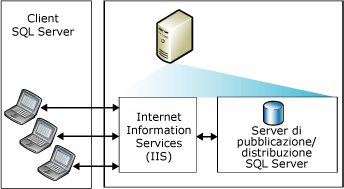
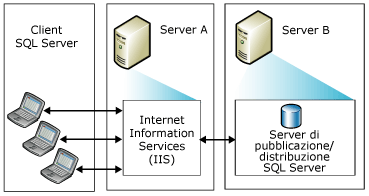
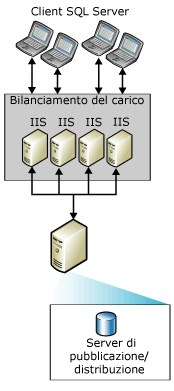
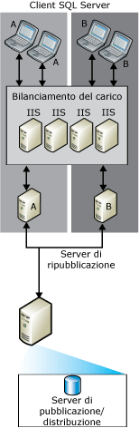

# Topologie per la sincronizzazione tramite il Web
  È possibile scegliere tra un'ampia gamma di [!INCLUDE[msCoName](../../includes/msconame-md.md)] [!INCLUDE[ssNoVersion](../../includes/ssnoversion-md.md)] Web topologie di replica di sincronizzazione. Le modalità comuni di configurazione della sincronizzazione tramite il Web includono:  
  
-   Server unico  
  
-   Due server  
  
-   Più sistemi [!INCLUDE[msCoName](../../includes/msconame-md.md)] Internet Information Services (IIS) e ripubblicazione [!INCLUDE[ssNoVersion](../../includes/ssnoversion-md.md)]  
  
 Per informazioni sulla configurazione della sincronizzazione Web, vedere [Configura sincronizzazione Web](../../relational-databases/replication/configure-web-synchronization.md).  
  
## Server unico  
 Nella topologia più semplice, quella di tipo IIS, il server di pubblicazione [!INCLUDE[ssNoVersion](../../includes/ssnoversion-md.md)] e il server di distribuzione [!INCLUDE[ssNoVersion](../../includes/ssnoversion-md.md)] sono contenuti in un unico server. I Sottoscrittori si sincronizzano connettendosi ad IIS sul server di pubblicazione. Il server di pubblicazione può essere protetto da un firewall.  
  
> [!NOTE]  
>  L'uso di questa funzionalità è consigliabile solo per gli scenari intranet. Per gli altri scenari, è consigliabile che il server IIS e i server di pubblicazione e di distribuzione [!INCLUDE[ssNoVersion](../../includes/ssnoversion-md.md)] si trovino su computer diversi.  
  
   
  
## Due server  
 È possibile posizionare IIS su un server e configurare il server di pubblicazione e quello di distribuzione [!INCLUDE[ssNoVersion](../../includes/ssnoversion-md.md)] su un altro server. Il server che esegue IIS può essere isolato da Internet da un firewall. I Sottoscrittori si sincronizzano connettendosi ad IIS.  
  
   
  
## Più sistemi IIS e ripubblicazione SQL Server  
 Se è necessario supportare numeri molto elevati di Sottoscrittori che si sincronizzano contemporaneamente, è possibile suddividere il lavoro tra più computer che eseguono IIS.  
  
   
  
 Se sul computer che esegue [!INCLUDE[ssNoVersion](../../includes/ssnoversion-md.md)] è richiesto un ulteriore bilanciamento del carico, è possibile creare una gerarchia di ripubblicazione su più computer. Il server di pubblicazione di livello massimo pubblica i dati nei Sottoscrittori che a loro volta ripubblicano i dati, richieste di bilanciamento del carico dei Sottoscrittori.  
  
> [!NOTE]  
>  I Sottoscrittori possono eseguire la sincronizzazione solo con un server di pubblicazione specifico. Un Sottoscrittore del server di ripubblicazione A, ad esempio, non potrà eseguire la sincronizzazione con il server di ripubblicazione B, se A non è disponibile.  
  
   
  
## Vedere anche  
 [Configurazione della sincronizzazione Web](../../relational-databases/replication/configure-web-synchronization.md)   
 [Sincronizzazione Web per la replica di tipo merge](../../relational-databases/replication/web-synchronization-for-merge-replication.md)  
  
  