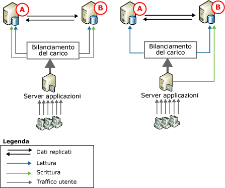
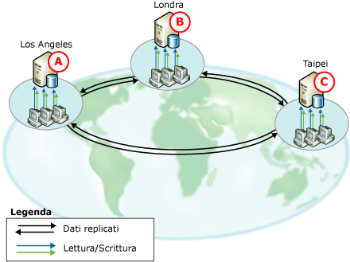
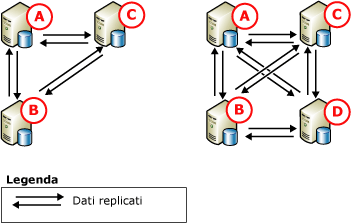

# Peer-to-peer - Replica transazionale
[!INCLUDE[appliesto-ss-xxxx-xxxx-xxx-md](../../../includes/appliesto-ss-xxxx-xxxx-xxx-md.md)]

  La replica peer-to-peer rappresenta una soluzione per la scalabilità orizzontale ad elevata disponibilità in quanto consente di gestire copie dei dati in più istanze del server, definite *nodi*. Compilata sulle basi della replica transazionale, la replica peer-to-peer propaga quasi in tempo reale modifiche coerenti dal punto di vista transazionale. In tal modo le applicazioni che richiedono la scalabilità orizzontale delle operazioni di lettura possono distribuire le operazioni di lettura dei client in più nodi. Perché i dati vengono gestiti nei nodi quasi in tempo reale, la replica peer-to-peer offre quella funzionalità di ridondanza dei dati che consente di aumentare la disponibilità dei dati.  
  
 Un'applicazione Web può ad esempio trarre vantaggio dalla replica peer-to-peer nei modi seguenti:  
  
-   Query sul catalogo e altre operazioni di lettura vengono estese a più nodi, garantendo in tal modo prestazioni coerenti anche in caso di aumento delle operazioni di lettura.  
  
-   In caso di errore in un nodo del sistema, un livello dell'applicazione può reindirizzare a un altro nodo le operazioni di scrittura destinate a tale nodo, garantendo in tal modo la disponibilità.  
  
-   Se è necessario eseguire la manutenzione di un nodo o un aggiornamento dell'intero sistema, è possibile portare offline il singolo nodo riaggiungerlo al sistema senza influire sulla disponibilità dell'applicazione.  
  
 Anche se la replica peer-to-peer consente di abilitare la scalabilità orizzontale per le operazioni di lettura, le prestazioni delle operazioni di scrittura eseguite nella topologia sono simili a quelle di un singolo nodo, poiché alla fine tutti gli inserimenti, gli aggiornamenti e le eliminazioni vengono propagati in tutti i nodi. La replica è in grado di stabilire quando una modifica è stata applicata a un determinato nodo e quindi di impedire che le modifiche passino da un nodo all'altro più volte. È consigliabile eseguire nel solo nodo le operazioni di scrittura a livello di singola riga per i motivi seguenti:  
  
-   Se una riga viene modificata in più nodi, può causare un conflitto o persino la perdita di un aggiornamento quando viene propagata in altri nodi.  
  
-   La replica delle modifiche implica sempre una certa latenza. Per le applicazioni che richiedono la disponibilità immediata dell'ultima modifica, il bilanciamento dinamico carico dell'applicazione in più nodi può risultare problematico.  
  
 La replica peer-to-peer include l'opzione che consente di abilitare il rilevamento dei conflitti in una topologia peer-to-peer. Questa opzione consente di prevenire i problemi causati da conflitti non rilevati, incluso il comportamento incoerente dell'applicazione e la perdita di aggiornamenti. Se questa opzione è attivata, per impostazione predefinita, una modifica in conflitto viene considerata come un errore critico che impedisce il corretto funzionamento dell'agente di distribuzione. In caso di conflitto la topologia rimane in uno stato incoerente finché il conflitto non viene risolto manualmente e i dati non vengono resi coerenti nell'intera topologia. Per altre informazioni, vedere [Conflict Detection in Peer-to-Peer Replication](../../../relational-databases/replication/transactional/peer-to-peer-conflict-detection-in-peer-to-peer-replication.md).  
  
> [!NOTE]  
>  Per prevenire potenziali incoerenze dei dati, evitare che si verifichino conflitti in una topologia peer-to-peer, anche quando il rilevamento dei conflitti è abilitato. Per garantire che le operazioni di scrittura relative a una determinata riga vengano eseguite in un unico nodo, le applicazioni che accedono e modificano i dati devono partizionare le operazioni di inserimento, aggiornamento ed eliminazione. Tale partizionamento assicura che modifiche apportate a una determinata riga in un singolo nodo vengano sincronizzate con tutti gli altri nodi della topologia prima che la riga venga modificata da un nodo diverso. Se un'applicazione richiede funzionalità avanzate di rilevamento e risoluzione dei conflitti, utilizzare la replica di tipo merge. Per altre informazioni, vedere [Replica di tipo merge](../../../relational-databases/replication/merge/merge-replication.md) e [Rilevare e risolvere i conflitti tra repliche di tipo merge](../../../relational-databases/replication/merge/advanced-merge-replication-resolve-merge-replication-conflicts.md).  
  
## Topologie peer-to-peer  
 Negli scenari seguenti vengono illustrati gli utilizzi tipici della replica peer-to-peer.  
  
### Topologia con due database  
   
  
 In entrambe le figure precedenti vengono illustrati due database coinvolti e il traffico di dati utente viene diretto ai database tramite un server applicazioni. Questa configurazione può essere utilizzata per numerose applicazioni diverse, dai siti Web alle applicazioni per gruppi di lavoro e offre i vantaggi seguenti:  
  
-   Migliori prestazioni di lettura, poiché le operazioni di lettura sono distribuite a due server.  
  
-   Maggiore disponibilità in caso di manutenzione o di errore in uno dei nodi.  
  
 In entrambe le figure il carico dell'attività di lettura è bilanciato tra i database partecipanti, mentre gli aggiornamenti sono gestiti diversamente:  
  
-   A sinistra, gli aggiornamenti vengono partizionati tra due server. Ad esempio, se nel database fosse disponibile un catalogo dei prodotti, un'applicazione personalizzata potrebbe dirigere gli aggiornamenti al nodo **A** per i prodotti con nomi che iniziano per A-M e al nodo **B** per i prodotti con nomi che iniziano per N-Z. Gli aggiornamenti verrebbero quindi replicati all'altro nodo.  
  
-   A destra tutti gli aggiornamenti vengono diretti al nodo **B** e da questo nodo vengono quindi replicati al nodo **A**. Se **B** è offline, ad esempio per manutenzione, il server applicazioni può dirigere tutte le attività al nodo **A**. Quando **B** sarà nuovamente online, potrà essere raggiunto dagli aggiornamenti e il server applicazioni potrà spostare tutti gli aggiornamenti a **B** o continuare a dirigerli ad **A**.  
  
 La replica peer-to-peer può supportare entrambi gli approcci, ma l'esempio di aggiornamento centrale illustrato a destra viene spesso utilizzato nella replica transazionale standard.  
  
### Topologie con tre o più database  
   
  
 Nella figura precedente vengono illustrati tre database partecipanti che rappresentano i dati per un'organizzazione di assistenza software internazionale, con uffici a Los Angeles, Londra e Taipei. I tecnici del supporto tecnico in tutti gli uffici ricevono le chiamate dei clienti e immettono o aggiornano informazioni su ogni chiamata. I fusi orari dei tre uffici sono separati da un intervallo di otto ore, quindi non si verificano sovrapposizioni nella giornata lavorativa. Quando l'ufficio di Taipei chiude, quello di Londra apre. Se è in corso una chiamata al momento della chiusura di un ufficio, la chiamata viene trasferita all'operatore dell'altro ufficio.  
  
 Ogni sede dispone di un database e di un server applicazioni, che vengono utilizzati dai tecnici del supporto tecnico per l'immissione e l'aggiornamento delle informazioni sulle chiamate dei clienti. La topologia viene partizionata in base al tempo, pertanto gli aggiornamenti vengono eseguiti solo nel nodo in uso e successivamente vengono distribuiti agli altri database coinvolti. Questa topologia offre i vantaggi seguenti:  
  
-   Indipendenza senza isolamento: ogni ufficio può inserire, aggiornare o eliminare dati in modo indipendente e, al contempo, condividere i dati poiché essi vengono replicati in tutti gli altri database coinvolti.  
  
-   Maggiore disponibilità in caso di errore o manutenzione in uno o più dei database coinvolti.  
  
       
  
 Nella figura precedente viene illustrata l'aggiunta di un nodo alla topologia a tre nodi. È possibile scegliere di aggiungere un nodo in questo scenario per i motivi seguenti:  
  
-   All'apertura di un altro ufficio.  
  
-   Per garantire maggiore disponibilità in caso di manutenzione o per incrementare la tolleranza di errore in caso di errore del disco o di altro errore grave.  
  
 Si noti che nelle topologie a tre e quattro nodi tutti i database pubblicano e sottoscrivono dati in tutti gli altri database, garantendo così la massima disponibilità in caso di manutenzione o di errore in uno o più nodi. In seguito all'aggiunta di nodi, è necessario bilanciare le esigenze di disponibilità e scalabilità in base alle prestazioni e alla complessità della distribuzione e dell'amministrazione.  
  
## Configurazione della replica peer-to-peer  
 La configurazione di una topologia di replica peer-to-peer è molto simile alla configurazione di una serie di pubblicazioni e sottoscrizioni transazionali standard. La procedura descritta negli argomenti seguenti illustra la configurazione di un sistema a tre nodi, simile alla configurazione illustrata nel diagramma precedente a sinistra in cui è raffigurata la topologia peer-to-peer.  
  
## Considerazioni per l'utilizzo della replica peer-to-peer  
 In questa sezione vengono fornite informazioni e linee guida da considerare quando si utilizza la replica peer-to-peer.  
  
### Considerazioni generali  
  
-   La replica peer-to-peer è disponibile solo nelle versioni Enterprise di [!INCLUDE[ssNoVersion](../../../includes/ssnoversion-md.md)].  
  
-   Tutti i database coinvolti nella replica peer-to-peer devono contenere lo stesso schema e gli stessi dati:  
  
    -   I nomi degli oggetti, lo schema degli oggetti e i nomi delle pubblicazioni devono essere identici.  
  
    -   Le pubblicazioni devono consentire la replica delle modifiche dello schema. Il valore è **1** per la proprietà della pubblicazione **replicate_ddl**, che corrisponde all'impostazione predefinita. Per altre informazioni, vedere [Apportare modifiche allo schema nei database di pubblicazione](../../../relational-databases/replication/publish/make-schema-changes-on-publication-databases.md).  
  
    -   Non è supportata l'applicazioni di filtri alle righe e alle colonne.  
  
-   È consigliabile configurare la replica in modo che ogni nodo utilizzi un database di distribuzione specifico. In questo modo si evita il rischio che si verifichi un singolo punto di errore.  
  
-   Non è possibile includere tabelle e altri oggetti in più pubblicazioni peer-to-peer di un singolo database di pubblicazione.  
  
-   Per poter creare sottoscrizioni, è necessario abilitare una pubblicazione per la replica peer-to-peer.  
  
-   Le sottoscrizioni devono essere inizializzate mediante una copia di backup o tramite l'opzione **'replication support only'** . Per altre informazioni, vedere [Initialize a Transactional Subscription Without a Snapshot](../../../relational-databases/replication/initialize-a-transactional-subscription-without-a-snapshot.md).  
  
-   L'utilizzo di colonne Identity non è consigliato. Quando si utilizzano valori Identity, è necessario unire manualmente gli intervalli assegnati alle tabelle in ogni database coinvolto. Per altre informazioni, vedere la sezione "Assegnazione di intervalli per la gestione manuale degli intervalli di valori Identity" nell'argomento [Replicare colonne Identity](../../../relational-databases/replication/publish/replicate-identity-columns.md).  
  
### Limitazioni delle funzionalità  
 La replica peer-to-peer supporta le funzionalità di base della replica transazionale, ma non le opzioni descritte di seguito:  
  
-   Inizializzazione e reinizializzazione con uno snapshot.  
  
-   Filtri di riga e colonna.  
  
-   Colonne di tipo timestamp.  
  
-   Server di pubblicazione e Sottoscrittori non[!INCLUDE[ssNoVersion](../../../includes/ssnoversion-md.md)] .  
  
-   Aggiornamento immediato e sottoscrizioni ad aggiornamento in coda.  
  
-   Sottoscrizioni anonime.  
  
-   Sottoscrizioni parziali.  
  
-   Sottoscrizioni collegabili e trasformabili (opzioni entrambe deprecate in [!INCLUDE[ssVersion2005](../../../includes/ssversion2005-md.md)]).  
  
-   Agenti di distribuzione condivisi.  
  
-   Il parametro **-SubscriptionStreams** dell'agente di distribuzione e il parametro **-MaxCmdsInTran**dell'agente di lettura log.  
  
-   Le proprietà di articolo **@destination_owner** e **@destination_table**.

-   La replica transazionale peer-to-peer non supporta la creazione di una sottoscrizione transazionale unidirezionale di una pubblicazione peer-to-peer.   
  
 Per le proprietà indicate di seguito sono presenti considerazioni speciali:  
  
-   La proprietà di pubblicazione **@allow_initialize_from_backup** richiede il valore **true**.  
  
-   La proprietà di articolo **@replicate_ddl** richiede il valore **true**, **@identityrangemanagementoption** richiede il valore **manual**e **@status** richiede che l'opzione **24** sia impostata.  
  
-   Il valore delle proprietà di articolo **@ins_cmd**, **@del_cmd**e **@upd_cmd** non può essere impostato su **SQL**.  
  
-   La proprietà di sottoscrizione **@sync_type** richiede il valore **none** o **automatic**.  
  
### Considerazioni relative alla manutenzione  
 Per alcune operazioni è necessario mettere il sistema in stato di inattività, ovvero arrestare le attività sulle tabelle pubblicate in tutti i nodi e verificare che ogni nodo abbia ricevuto tutte le modifiche dagli altri nodi:  
  
||Solo peer di SQL Server 2005 o una combinazione di peer di SQL Server 2005 con peer di SQL Server 2008 e versioni successive|Solo peer di SQL Server 2005 o una combinazione di peer di SQL Server 2005 con peer di SQL Server 2008 e versioni successive|Peer di SQL2008 e versioni successive|Peer di SQL2008 e versioni successive|  
|-|------------------------------------------------------------------------------------------------------|------------------------------------------------------------------------------------------------------|------------------------------|------------------------------|  
|Aggiunta di un nodo alla topologia|2 nodi nella topologia completa: disattivazione non obbligatoria. Usare `sync_type = 'initialize with backup'`.|Più di due nodi: disattivazione obbligatoria.|`sync_type = 'replication support only'`: disattivazione obbligatoria.|`sync_type = 'initialize with backup'` e `'initialize from lsn'`: disattivazione non obbligatoria.|  
  
 Le modifiche dello schema di topologia (aggiunta o eliminazione di un articolo) richiedono la disattivazione. Per altre informazioni, vedere [Amministrare una topologia peer-to-peer &#40;programmazione Transact-SQL della replica&#41;](../../../relational-databases/replication/administration/administer-a-peer-to-peer-topology-replication-transact-sql-programming.md).  
  
 La rimozione di un nodo dalla topologia non richiede mai la disattivazione.  
  
 La modifica delle proprietà dell'articolo con  [sp_changearticle](../../../relational-databases/system-stored-procedures/sp-changearticle-transact-sql.md) non richiede mai la disattivazione. Le modifiche consentite (per P2P) sono le proprietà `description`, `ins_cmd`, `upd_cmd`e `del_cmd` .  
  
 Le modifiche dello schema dell'articolo (aggiunta o eliminazione di una colonna) non richiedono mai la disattivazione.  
  
-   Aggiunta di un articolo: per aggiungere un articolo alla configurazione esistente è necessario disattivare il sistema, eseguire l'istruzione CREATE TABLE e caricare i dati iniziali in ciascun nodo nella topologia, quindi aggiungere il nuovo articolo in ogni nodo nella topologia.  
  
-   Eliminazione di un articolo: per ottenere uno stato coerente in tutti i nodi è necessario disattivare la topologia  
  
 Per altre informazioni, vedere [Come mettere una topologia di replica in stato di inattività &#40;programmazione Transact-SQL della replica&#41;](../../../relational-databases/replication/administration/quiesce-a-replication-topology-replication-transact-sql-programming.md) e [Amministrare una topologia peer-to-peer &#40;programmazione Transact-SQL della replica&#41;](../../../relational-databases/replication/administration/administer-a-peer-to-peer-topology-replication-transact-sql-programming.md).  
  
-   Se si aggiunge un nuovo nodo a una topologia peer-to-peer, è necessario eseguire il ripristino solo dai backup creati dopo l'aggiunta del nuovo nodo.  
  
-   Non è possibile reinizializzare le sottoscrizioni in una topologia peer-to-peer. Per garantire che un nodo disponga di una nuova copia dei dati, ripristinare un backup nel nodo stesso.  
  
## Vedere anche  
 [Amministrare una topologia peer-to-peer &#40;programmazione Transact-SQL della replica&#41;](../../../relational-databases/replication/administration/administer-a-peer-to-peer-topology-replication-transact-sql-programming.md)   
 [Strategie per il backup e il ripristino della replica snapshot e della replica transazionale](../../../relational-databases/replication/administration/strategies-for-backing-up-and-restoring-snapshot-and-transactional-replication.md)   
 [Tipi di pubblicazioni per la replica transazionale](../../../relational-databases/replication/transactional/publication-types-for-transactional-replication.md)  
  
  
