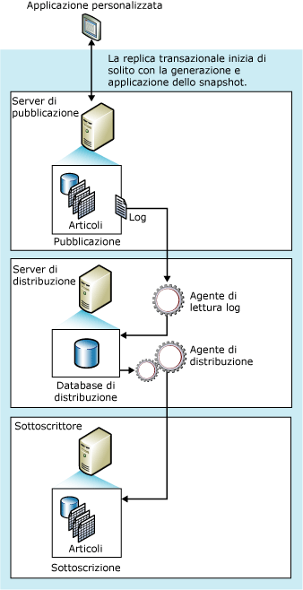

# Replica transazionale
  La replica transazionale in genere ha inizio con la creazione di uno snapshot degli oggetti e dei dati del database di pubblicazione. Dopo la creazione dello snapshot iniziale, le successive modifiche ai dati e allo schema eseguite nel server di pubblicazione vengono generalmente recapitate al Sottoscrittore nel momento in cui vengono eseguite. Le modifiche ai dati vengono applicate al Sottoscrittore nello stesso ordine e negli stessi limiti della transazione con cui vengono eseguite nel server di pubblicazione. Di conseguenza, la consistenza transazionale all'interno di una pubblicazione è garantita.  
  
 La replica transazionale viene solitamente utilizzata negli ambienti da server a server ed è appropriata ai casi seguenti:  
  
-   Si desidera propagare modifiche incrementali ai Sottoscrittori appena vengono apportate.  
  
-   L'applicazione richiede una bassa latenza tra il momento in cui le modifiche vengono apportate nel server di pubblicazione e il momento in cui raggiungono il Sottoscrittore.  
  
-   L'applicazione richiede l'accesso a stati dei dati intermedi. Se una riga viene modificata cinque volte, ad esempio, la replica transazionale consente a un'applicazione di rispondere a ogni modifica, ad esempio attivando un trigger, anziché soltanto alla modifica di dati netta apportata alla riga.  
  
-   Il server di pubblicazione è caratterizzato da un'intensa attività di inserimento, aggiornamento ed eliminazione.  
  
-   Il server di pubblicazione o il Sottoscrittore è un database non[!INCLUDE[ssNoVersion](../../../includes/ssnoversion-md.md)] , ad esempio Oracle.  
  
 Per impostazione predefinita, i Sottoscrittori di pubblicazioni transazionali devono essere considerati di sola lettura poiché le modifiche non vengono trasferite al server di pubblicazione. La replica transazionale offre tuttavia opzioni che consentono aggiornamenti nel Sottoscrittore.  
  
 **Contenuto dell'argomento**  
  
 [Funzionamento della replica transazionale](#HowWorks)  
  
 [Set di dati iniziale](#Dataset)  
  
 [agente snapshot](#SnapshotAgent)  
  
 [Agente di lettura log](#LogReaderAgent)  
  
 [Agente di distribuzione](#DistributionAgent)  
  
##   Funzionamento della replica transazionale  
 La replica transazionale viene implementata dall'agente snapshot, dall'agente di lettura log e dall'agente di distribuzione [!INCLUDE[ssNoVersion](../../../includes/ssnoversion-md.md)] . L'agente snapshot prepara i file di snapshot contenenti lo schema e i dati delle tabelle pubblicate e degli oggetti di database, archivia i file nella cartella snapshot e registra i processi di sincronizzazione nel database di distribuzione sul server di distribuzione.  
  
 L'agente di lettura log esegue il monitoraggio del log delle transazioni di tutti i database configurati per la replica transazionale e copia le transazioni contrassegnate per la replica dal log delle transazioni al database di distribuzione, che agisce come coda di archiviazione e inoltro affidabile. L'agente di distribuzione copia nei Sottoscrittori i file snapshot iniziali dalla cartella snapshot e le transazioni archiviate nelle tabelle del database di distribuzione.  
  
 Le modifiche incrementali effettuate nel server di pubblicazione vengono trasferite nei Sottoscrittori in base alla pianificazione dell'agente di distribuzione, che può essere eseguito in modo continuo per una latenza minima o a intervalli pianificati. Quando la replica transazionale viene utilizzata senza l'opzione di aggiornamento immediato o in coda, le modifiche ai dati devono essere apportate nel server di pubblicazione. Di conseguenza tra gli aggiornamenti non si verifica alcun conflitto. Alla fine in tutti i Sottoscrittori saranno disponibili gli stessi valori inclusi del server di pubblicazione. Se si utilizza la replica transazionale con l'opzione di aggiornamento immediato o in coda, è possibile apportare aggiornamenti nel Sottoscrittore. Nel caso dell'aggiornamento in coda, è possibile che si verifichino conflitti.  
  
 Nella figura seguente vengono illustrati i componenti principali della replica transazionale.  
  
   
  
##   Set di dati iniziale  
 Un nuovo Sottoscrittore per la replica transazionale può ricevere modifiche incrementali da un server di pubblicazione solo quando contiene lo stesso schema e gli stessi dati disponibili nelle tabelle del server di pubblicazione. Il set di dati iniziale è generalmente uno snapshot creato dall'agente snapshot e distribuito e applicato dall'agente di distribuzione. È inoltre possibile ottenerlo mediante un backup o altri strumenti, come [!INCLUDE[ssNoVersion](../../../includes/ssnoversion-md.md)] Integration Services.  
  
 La distribuzione e l'applicazione degli snapshot nei Sottoscrittori ha effetto solo sui Sottoscrittori in attesa degli snapshot iniziali e non sugli altri Sottoscrittori della pubblicazione che sono stati già inizializzati.  
  
## Elaborazione di snapshot concorrenti  
 La replica snapshot colloca blocchi condivisi su tutte le tabelle pubblicate durante la replica e per tutta la durata della generazione degli snapshot. La presenza di tali blocchi può impedire l'esecuzione di aggiornamenti nelle tabelle di pubblicazione. Tramite l'elaborazione degli snapshot concorrenti, ovvero l'impostazione predefinita nella replica transazionale, i blocchi di condivisione non vengono mantenuti attivi durante l'intero processo di generazione degli snapshot. In questo modo gli utenti possono lavorare senza essere interrotti mentre è in corso la creazione dei file dello snapshot iniziale.  
  
##   agente snapshot  
 Le procedure con cui l'agente snapshot implementa lo snapshot iniziale nella replica transazionale sono analoghe alle procedure utilizzate nella replica snapshot, ad eccezione di quanto descritto sopra in relazione all'elaborazione degli snapshot concorrenti.  
  
 Dopo avere generato i file di snapshot, è possibile visualizzarli nella cartella snapshot tramite Esplora risorse di [!INCLUDE[msCoName](../../../includes/msconame-md.md)] .  
  
##   Modifica dei dati e dell'agente di lettura log  
 L'agente di lettura log viene eseguito nel server di distribuzione, generalmente in modo continuo sebbene sia possibile eseguirlo anche in base a una pianificazione stabilita. Quando viene eseguito, l'agente di lettura log legge prima il log delle transazioni della pubblicazione, ovvero lo stesso log di database utilizzato per il rilevamento e il recupero delle transazioni durante il normale funzionamento del Motore di database di [!INCLUDE[ssNoVersion](../../../includes/ssnoversion-md.md)] , e identifica tutte le istruzioni INSERT, UPDATE e DELETE o le modifiche di altro tipo apportate ai dati delle transazioni contrassegnate per la replica. L'agente copia quindi le transazioni in batch nel database di distribuzione del server di distribuzione. Tramite la stored procedure interna **sp_replcmds** l'agente di lettura log acquisisce dal log il set successivo di comandi contrassegnati per la replica. Il database di distribuzione diventa quindi la coda di archiviazione e inoltro da cui le modifiche vengono inviate ai Sottoscrittori. Al database di distribuzione vengono inviate solo le transazioni di cui è stato eseguito il commit.  
  
 Dopo la scrittura dell'intero batch di transazioni nel database di distribuzione, ne viene eseguito il commit. Al termine del commit di ogni batch di comandi nel server di distribuzione l'agente di lettura log chiama la stored procedure **sp_repldone** per contrassegnare il punto in cui è stato completato l'ultimo processo di replica, quindi contrassegna le righe del log delle transazioni pronte per essere eliminate. Le righe in attesa di replica non vengono eliminate.  
  
 I comandi di transazione vengono archiviati nel database di distribuzione finché non vengono propagati a tutti i Sottoscrittori o finché non viene raggiunto il periodo massimo di memorizzazione della distribuzione. I Sottoscrittori ricevono le transazioni nello stesso ordine in cui sono state applicate nel server di pubblicazione.  
  
##   Agente di distribuzione  
 L'agente di distribuzione viene eseguito nel server di distribuzione per le sottoscrizioni push e nel Sottoscrittore per le sottoscrizioni pull. e sposta le transazioni dal database di distribuzione al Sottoscrittore. Se una sottoscrizione è contrassegnata per la convalida, l'agente di distribuzione verifica anche se i dati nel server di pubblicazione e nel Sottoscrittore corrispondono.  
  
  
