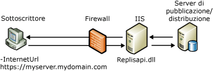

# Sincronizzazione Web per la replica di tipo merge
  La sincronizzazione tramite il Web per la replica di tipo merge consente di replicare i dati utilizzando il protocollo HTTPS e si rivela utile negli scenari seguenti:  
  
-   Sincronizzazione di dati da utenti mobili su Internet.  
  
-   Sincronizzazione di dati tra database [!INCLUDE[msCoName](../../includes/msconame-md.md)] [!INCLUDE[ssNoVersion](../../includes/ssnoversion-md.md)] attraverso un firewall aziendale.  
  
 Tale funzionalità può essere ad esempio utilizzata dai rappresentanti in trasferta, come nel caso dei rappresentanti della società [!INCLUDE[ssSampleDBCoFull](../../includes/sssampledbcofull-md.md)]in visita a diversi magazzini e fornitori nelle rispettive aree. In occasione di viaggi di lunga durata essi alloggiano in alberghi e hanno bisogno di uno strumento di semplice utilizzo per caricare i dati delle vendite e scaricare eventuali aggiornamenti dei prodotti alla fine di ogni giornata.  
  
 Si supponga che il reparto IT di [!INCLUDE[ssSampleDBCoShort](../../includes/sssampledbcoshort-md.md)] abbia configurato ogni computer portatile con [!INCLUDE[ssNoVersion](../../includes/ssnoversion-md.md)] e abilitato la replica di tipo merge per l'utilizzo della sincronizzazione tramite il Web. L'agente di merge in ogni computer portatile dispone di un URL Internet che punta ai componenti di replica installati in un computer in cui è in esecuzione [!INCLUDE[msCoName](../../includes/msconame-md.md)] Internet Information Services (IIS). Questi componenti sincronizzano il Sottoscrittore con il server di pubblicazione. Ogni rappresentante potrà connettersi mediante qualsiasi connessione Internet disponibile senza utilizzare una connessione remota, nonché caricare e scaricare i dati appropriati. Poiché la connessione Internet utilizza il protocollo SSL (Secure Sockets Layer), non è richiesta una rete privata virtuale (VPN).  
  
 Per informazioni sulla configurazione dei componenti necessari per la sincronizzazione tramite il Web, vedere [Configurare la sincronizzazione Web](../../relational-databases/replication/configure-web-synchronization.md), [Configurare IIS per la sincronizzazione Web](../../relational-databases/replication/configure-iis-for-web-synchronization.md) e [Configurare IIS 7 per la sincronizzazione Web](../../relational-databases/replication/configure-iis-7-for-web-synchronization.md).  
  
> [!NOTE]  
>  La sincronizzazione Web è progettata per sincronizzare i dati mediante computer portatili, dispositivi palmari e altri client e non è adatta per le applicazioni caratterizzate da un elevato traffico tra server.  
  
## Panoramica del funzionamento della sincronizzazione Web  
 Quando si utilizza la sincronizzazione tramite il Web, gli aggiornamenti nel Sottoscrittore vengono assemblati e inviati come messaggio XML al computer che esegue IIS mediante il protocollo HTTPS. Il computer che esegue IIS invia quindi i comandi al server di pubblicazione in un formato binario, generalmente utilizzando il protocollo TCP/IP. Gli aggiornamenti del server di pubblicazione vengono inviati al computer che esegue IIS e quindi assemblati come messaggio XML per il recapito nel Sottoscrittore.  
  
 Nella figura seguente sono illustrati alcuni dei componenti coinvolti nel processo di sincronizzazione tramite il Web per la replica di tipo merge.  
  
   
  
 La sincronizzazione tramite il Web è disponibile solo per le sottoscrizioni pull e pertanto un agente di merge verrà sempre eseguito sul Sottoscrittore. Tale agente può essere l'agente di merge standard, il controllo ActiveX dell'agente di merge o un'applicazione che consente la sincronizzazione tramite gli oggetti RMO (Replication Management Objects). Per specificare la posizione del computer che esegue IIS, usare il parametro **-InternetUrl** per l'agente di merge.  
  
 Il listener per la replica di [!INCLUDE[ssNoVersion](../../includes/ssnoversion-md.md)] (replisapi.dll) viene configurato sul computer che esegue IIS ed è responsabile della gestione dei messaggi inviati al server dal server di pubblicazione e dai Sottoscrittori. Ogni nodo nella topologia gestisce il flusso di dati XML mediante replrec.dll, ovvero Riconciliatore replica di tipo merge (Merge Replication Reconciler).  
  
 Per tutti i computer che partecipano alla sincronizzazione tramite il Web è necessario[!INCLUDE[ssVersion2005](../../includes/ssversion2005-md.md)] o versione successiva.  
  
### Processo di sincronizzazione  
 La sincronizzazione prevede i passaggi seguenti:  
  
1.  L'agente di merge viene avviato nel Sottoscrittore. L'agente esegue le operazioni seguenti:  
  
    1.  Stabilisce una connessione SQL con il database di sottoscrizione.  
  
    2.  Estrae tutte le modifiche dal database.  
  
    3.  Invia una richiesta HTTPS al computer che esegue IIS.  
  
    4.  Carica le modifiche ai dati come messaggio XML.  
  
2.  I componenti Listener per la replica di [!INCLUDE[ssNoVersion](../../includes/ssnoversion-md.md)] e Riconciliatore replica di tipo merge (Merge Replication Reconciler) ospitati nel computer con IIS eseguono le operazioni seguenti:  
  
    1.  Rispondono alla richiesta HTTPS.  
  
    2.  Stabiliscono una connessione SQL con il database di pubblicazione.  
  
    3.  Applicano le modifiche caricate al database di pubblicazione.  
  
    4.  Estraggono le modifiche scaricate per il Sottoscrittore.  
  
    5.  Inviano una risposta HTTPS all'agente di merge.  
  
3.  L'agente di merge nel Sottoscrittore accetta la risposta HTTPS e applica nel database di sottoscrizione le modifiche scaricate.  
  
## Vedere anche  
 [Configurare la sincronizzazione Web](../../relational-databases/replication/configure-web-synchronization.md)   
 [Topologies for Web Synchronization](../../relational-databases/replication/topologies-for-web-synchronization.md)  
  
  
