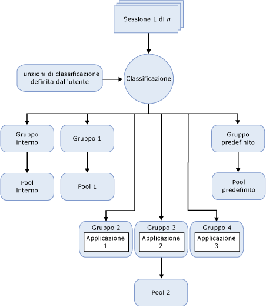

# Resource Governor
[!INCLUDE[appliesto-ss-xxxx-xxxx-xxx-md](../../includes/appliesto-ss-xxxx-xxxx-xxx-md.md)]
  [!INCLUDE[ssNoVersion](../../includes/ssnoversion-md.md)] La funzionalità Resource Governor consente di gestire il carico di lavoro e l'utilizzo delle risorse di sistema in [!INCLUDE[ssNoVersion](../../includes/ssnoversion-md.md)]. Resource Governor permette di specificare i limiti sulla quantità di CPU, I/O fisico e memoria che le richieste dell'applicazione in ingresso possono utilizzare.  
  
## Vantaggi di Resource Governor  
 Resource Governor consente di gestire i carichi di lavoro e le risorse di [!INCLUDE[ssNoVersion](../../includes/ssnoversion-md.md)] specificando limiti relativi all'utilizzo delle risorse da parte delle richieste in entrata. Nel contesto di Resource Governor il carico di lavoro è un set di richieste o query con dimensioni simili che può o deve essere considerato come singola entità. Sebbene non si tratti di un requisito obbligatorio, utilizzando in modo uniforme le risorse di un carico di lavoro è possibile sfruttare al massimo i vantaggi offerti da Resource Governor. I limiti delle risorse possono essere riconfigurati in tempo reale con un minimo impatto sui carichi di lavoro in esecuzione.  
  
 In un ambiente con più carichi di lavoro distinti nello stesso server Resource Governor consente di differenziare tali carichi di lavoro e allocare le risorse condivise in modo appropriato, in base ai limiti specificati. Tali risorse sono rappresentate da CPU, I/O fisico e memoria.  
  
 Resource Governor consente di:  
  
-   Fornire multi-tenancy e isolamento delle risorse in singole istanze di SQL Server che servono più carichi di lavoro client. In pratica, è possibile dividere le risorse disponibili su un server tra i carichi di lavoro e ridurre al minimo i problemi che possono verificarsi quando i carichi di lavoro si contendono le risorse.  
  
-   Fornire prestazioni prevedibili e supportare SLA per tenant di carichi di lavoro in un ambiente con più carichi di lavoro e più utenti.  
  
-   Isolare e limitare le query con eccessivo tempo di esecuzione o limitare le risorse di I/O per le operazioni come DBCC CHECKDB che possono saturare il sottosistema di I/O e influire negativamente sugli altri carichi di lavoro.  
  
-   Aggiungere un rilevamento delle risorse con granularità fine per i chargeback dell'utilizzo delle risorse e fornire una fatturazione prevedibile ai clienti che utilizzano le risorse del server.  
  
## Vincoli di Resource Governor  
 In questa versione di Resource Governor sono previsti i seguenti vincoli:  
  
-   La gestione delle risorse è limitata a [!INCLUDE[ssDEnoversion](../../includes/ssdenoversion-md.md)]. Non è possibile utilizzare Resource Governor per [!INCLUDE[ssASnoversion](../../includes/ssasnoversion-md.md)], [!INCLUDE[ssISnoversion](../../includes/ssisnoversion-md.md)]e [!INCLUDE[ssRSnoversion](../../includes/ssrsnoversion-md.md)].  
  
-   Non è disponibile il monitoraggio o la gestione del carico di lavoro tra istanze di SQL Server.  
  
-   Resource Governor è in grado di gestire i carichi di lavoro OLTP. Questi tipi di query, in genere con una durata molto breve, non restano tuttavia mai abbastanza a lungo nella CPU da richiedere l'applicazione dei controlli di larghezza di banda. Ciò può comportare un'asimmetria nelle statistiche restituite per la percentuale di utilizzo della CPU.  
  
-   La capacità di governare l'I/O fisico è relativa solo alle operazioni degli utenti e non alle attività di sistema. Tra le attività di sistema sono incluse le operazioni di scrittura nel log delle transazioni e le operazioni di I/O del Lazywriter. La funzionalità Resource Governor si applica soprattutto alle operazioni di lettura dell'utente perché la maggior parte delle operazioni di scrittura viene eseguita in genere dalle attività di sistema.  
  
-   Non è possibile impostare delle soglie di I/O sul pool di risorse interne.  
  
## Concetti relativi alle risorse  
 I tre concetti seguenti sono essenziali per la comprensione e l'utilizzo di Resource Governor:  
  
-   **Pool di risorse.** Un pool di risorse rappresenta le risorse fisiche del server. Il pool può essere paragonato a un'istanza virtuale di [!INCLUDE[ssNoVersion](../../includes/ssnoversion-md.md)] in un'istanza di [!INCLUDE[ssNoVersion](../../includes/ssnoversion-md.md)] . Due pool di risorse (interno e predefinito) vengono creati con l'installazione di [!INCLUDE[ssNoVersion](../../includes/ssnoversion-md.md)] . Resource Governor supporta anche i pool di risorse definiti dall'utente. Per altre informazioni, vedere [Pool di risorse di Resource Governor](../../relational-databases/resource-governor/resource-governor-resource-pool.md).  
  
-   **Gruppi del carico di lavoro.** Un gruppo di carico di lavoro viene utilizzato come contenitore per richieste di sessione che presentano criteri di classificazione simili. Un carico di lavoro consente il monitoraggio complessivo delle sessioni e di definire i criteri per le sessioni. Ciascun gruppo di carico di lavoro si trova in un pool di risorse. Vengono creati due gruppi di carico di lavoro (interno e predefinito) e ne viene eseguito il mapping ai relativi pool di risorse durante l'installazione di [!INCLUDE[ssNoVersion](../../includes/ssnoversion-md.md)] . Resource Governor supporta anche i gruppi del carico di lavoro definiti dall'utente. Per altre informazioni, vedere [Gruppo di carico di lavoro di Resource Governor](../../relational-databases/resource-governor/resource-governor-workload-group.md).  
  
-   **Classificazione.** Il processo di classificazione consente di assegnare sessioni in ingresso a un gruppo di carico di lavoro in base alle caratteristiche della sessione. È possibile personalizzare la logica di classificazione scrivendo una funzione definita dall'utente, chiamata funzione di classificazione. Resource Governor supporta anche una funzione di classificazione definita dall'utente per l'implementazione delle regole di classificazione. Per altre informazioni, vedere [Funzione di classificazione di Resource Governor](../../relational-databases/resource-governor/resource-governor-classifier-function.md).  
  
> [!NOTE]  
>  Resource Governor non impone controlli su una connessione amministrativa dedicata (DAC, Dedicated Administrator Connection). Non è necessario classificare le query DAC in esecuzione nel gruppo del carico di lavoro interno e nel pool di risorse.  
  
 Nel contesto di Resource Governor è possibile considerare i concetti precedenti come componenti. Nella seguente illustrazione vengono mostrati questi componenti e le relazioni tra di essi nell'ambiente del motore di database. Da una prospettiva di elaborazione, il flusso semplificato è il seguente:  
  
-   È presente una connessione in ingresso per una sessione (sessione 1 di *n*).  
  
-   La sessione è classificata (classificazione).  
  
-   Il carico di lavoro della sessione viene indirizzato a un gruppo del carico di lavoro, ad esempio, il gruppo 4.  
  
-   Il gruppo del carico di lavoro utilizza il pool di risorse al quale è associato, ad esempio il pool 2.  
  
-   Il pool di risorse fornisce e consente di limitare le risorse richieste dall'applicazione, ad esempio, l'applicazione 3.  
  
   
  
## Attività di Resource Governor  
  
|Descrizione dell'attività|Argomento|  
|----------------------|-----------|  
|Viene descritto come abilitare Resource Governor.|[Abilitare Resource Governor](../../relational-databases/resource-governor/enable-resource-governor.md)|  
|Viene descritto come disabilitare Resource Governor.|[Disabilitare Resource Governor](../../relational-databases/resource-governor/disable-resource-governor.md)|  
|Viene descritto come creare, modificare ed eliminare un pool di risorse.|[Pool di risorse di Resource Governor](../../relational-databases/resource-governor/resource-governor-resource-pool.md)|  
|Viene descritto come creare, modificare, spostare ed eliminare un gruppo di carico di lavoro.|[Gruppo di carico di lavoro di Resource Governor](../../relational-databases/resource-governor/resource-governor-workload-group.md)|  
|Viene descritto come creare e verificare una funzione di classificazione definita dall'utente.|[Funzione di classificazione di Resource Governor](../../relational-databases/resource-governor/resource-governor-classifier-function.md)|  
|Viene descritto come configurare Resource Governor utilizzando un modello.|[Configurare Resource Governor utilizzando un modello](../../relational-databases/resource-governor/configure-resource-governor-using-a-template.md)|  
|Viene illustrata la procedura per visualizzare le proprietà di Resource Governor.|[Visualizzare proprietà di Resource Governor](../../relational-databases/resource-governor/view-resource-governor-properties.md)|  
  
## Vedere anche  
 [Istanze del motore di database &#40;SQL Server&#41;](../../database-engine/configure-windows/database-engine-instances-sql-server.md)  
  
  
