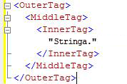
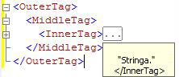

# <a name="code-outlining"></a>Struttura del codice
[!INCLUDE[appliesto-ss-asdb-asdw-pdw-md](../../includes/appliesto-ss-asdb-asdw-pdw-md.md)]
  La modalità struttura negli editor di query di [!INCLUDE[ssManStudioFull](../../includes/ssmanstudiofull-md.md)] consente di nascondere in modo selettivo il codice quando si modificano query. In questo modo è possibile visualizzare più facilmente il codice utilizzato, soprattutto in file di query di dimensioni elevate.  
  
## <a name="outlining-overview"></a>Panoramica sulla struttura  
 Per impostazione predefinita, quando si apre una finestra dell'editor di query tutto il codice è visibile. È possibile comprimere alcune aree del codice per nasconderne la visualizzazione. In una riga verticale sul bordo sinistro della finestra dell'editor viene utilizzato un quadrato con un segno meno (-) per identificare l'inizio di ogni area di codice comprimibile. Quando si fa clic sul segno meno, il testo dell'area del codice viene sostituito con una casella che contiene tre punti (...) e il segno meno viene modificato in un segno più (+). Quando si fa clic sul segno più, il codice compresso viene visualizzato e il segno più viene modificato in un segno meno. Quando si sposta il puntatore su una casella in cui sono presenti i tre punti, viene visualizzata una descrizione di comando in cui viene mostrato il codice contenuto nella sezione compressa.  
  
## <a name="system-outline-regions"></a>Aree della struttura di sistema  
 Ogni editor di [!INCLUDE[ssManStudioFull](../../includes/ssmanstudiofull-md.md)] genera un set di aree della struttura predefinite stabilite dal sistema.  
  
 Gli editor del codice MDX e DMX creano aree della struttura per ogni istruzione su più righe. Questo è l'unico livello di struttura supportata da tali editor.  
  
### <a name="analysis-services-xmla-query-editor-regions"></a>Aree dell'editor di query XMLA di Analysis Services  
 L'editor di query XMLA di [!INCLUDE[ssASnoversion](../../includes/ssasnoversion-md.md)] genera un'area della struttura per ogni attributo XML su più righe. L'editor nidifica le aree della struttura per i tag nidificati. L'editor XMLA, ad esempio, crea tre aree della struttura per il documento seguente.  
  
   
  
 Quando si fa clic sul segno meno nella riga \<InnerTag, viene compressa solo la parte relativa a InnerTag, come illustrato nella figura seguente.  
  
   
  
 Quando si sposta il puntatore sulla casella in cui sono presenti i tre punti (…), il codice contenuto nell'area compressa viene visualizzato in una descrizione di comando, come illustrato nella figura seguente.  
  
   
  
 Quando si fa clic sul segno meno nella riga \<MiddleTag>, vengono compresse le parti relative a MiddleTag e InnerTag, come illustrato nella figura seguente.  
  
   
  
 Quando si fa clic sul segno meno nella riga \<OuterTag>, vengono compresse tutte e tre le righe, come illustrato nella figura seguente.  
  
   
  
### <a name="database-engine-query-editor-regions"></a>Aree dell'editor di query del Motore di database  
 L'editor di query del [!INCLUDE[ssDE](../../includes/ssde-md.md)] genera aree di struttura per ogni elemento presente nella gerarchia seguente:  
  
1.  Batch. Il primo batch è rappresentato dal codice dall'inizio del file fino al primo comando GO o fino alla fine del file nel caso in cui non siano presenti comandi GO. Dopo il primo comando GO, è presente un batch da ogni comando GO fino a quello successivo o fino alla fine del file.  
  
2.  Blocchi delimitati dalle parole chiave seguenti:  
  
    -   BEGIN - END  
  
    -   BEGIN TRY - END TRY  
  
    -   BEGIN CATCH - END CATCH  
  
3.  Istruzioni su più righe.  
  
 L'editor di query del [!INCLUDE[ssDE](../../includes/ssde-md.md)] crea ad esempio tre aree della struttura per la query seguente:  
  
```  
CREATE PROCEDURE Sales.SampleProc --Outline region 1  
AS  
BEGIN --Outline region 2   
  SELECT GETDATE() AS TimeOfQuery;  
  SELECT * --Outline region 3  
  FROM sys.transmission_queue;  
  SELECT @@VERSION;  
END;  
GO  
```  
  
 È possibile fare clic sul segno di meno sulla riga `SELECT *` per comprimere solo l'istruzione `SELECT` specifica. Per comprimere l'intero blocco `BEGIN - END` , fare clic sul segno meno sulla riga `BEGIN` . Per comprimere l'intero batch fino al comando `GO` , fare clic sul segno meno sulla riga `CREATE PROCEDURE` . Non è possibile comprimere la riga `SELECT GETDATE()` o `SELECT @@VERSION` singolarmente poiché ognuna costituisce un'istruzione su un'unica riga e non definisce aree della struttura.  
  
  
