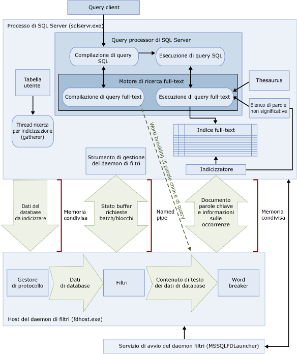

# <a name="full-text-search"></a>Ricerca full-text
  In [!INCLUDE[ssNoVersion](../../includes/ssnoversion-md.md)] e [!INCLUDE[ssSDSFull](../../includes/sssdsfull-md.md)] la ricerca full-text consente a utenti e applicazioni di eseguire query full-text su dati di tipo carattere in tabelle di [!INCLUDE[ssNoVersion](../../includes/ssnoversion-md.md)] .
  
## <a name="basic-tasks"></a>Attività di base
Questo argomento offre una panoramica della ricerca full-text e descrive i componenti e l'architettura di questa funzionalità. Per iniziare subito, ecco le attività di base.
-   [Introduzione alla ricerca full-text](../../relational-databases/search/get-started-with-full-text-search.md)
-   [Creazione e gestione dei cataloghi full-text](../../relational-databases/search/create-and-manage-full-text-catalogs.md)
-   [Creazione e gestione di indici full-text](../../relational-databases/search/create-and-manage-full-text-indexes.md)
-   [Popolamento degli indici full-text](../../relational-databases/search/populate-full-text-indexes.md)
-   [Esecuzione della query con ricerca Full-Text](../../relational-databases/search/query-with-full-text-search.md)

> [!NOTE]
> Full-Text Search is an optional component of the [!INCLUDE[ssNoVersion](../../includes/ssnoversion-md.md)] . Se non è stata selezionata l'opzione Ricerca full-text durante l'installazione di SQL Server, eseguire di nuovo il programma di installazione di SQL Server per aggiungerla.

## <a name="overview"></a>Panoramica
Un indice full-text include una o più colonne basate su caratteri in una tabella. Queste colonne possono avere uno dei tipi di dati seguenti: **char**, **varchar**, **nchar**, **nvarchar**, **text**, **ntext**, **image**, **xml** o **varbinary(max)** e **FILESTREAM**. Ogni indice full-text consente di indicizzare una o più colonne della tabella e ciascuna colonna può essere utilizzata con una lingua specifica.  
  
 Attraverso le query full-text è possibile eseguire ricerche linguistiche sui dati di testo contenuti negli indici full-text, usando parole e frasi in base alle regole di una determinata lingua, come ad esempio l'inglese o il giapponese. Le query full-text possono contenere semplici parole e frasi oppure più forme di una parola o frase. Una query full-text restituisce qualsiasi documento contenente almeno una corrispondenza, nota anche come *riscontro*. Si ottiene una corrispondenza quando un documento di destinazione contiene tutti i termini specificati nella query full-text e soddisfa qualsiasi altra condizione di ricerca, come ad esempio la distanza entro i termini corrispondenti.    
  
##  <a name="queries"></a> Query di ricerca full-text  
 Dopo l'aggiunta delle colonne a un indice full-text, gli utenti e le applicazioni possono eseguire query full-text sul testo contenuto all'interno delle colonne. Queste query possono consentire la ricerca degli elementi seguenti:  
  
-   Una o più parole o frasi specifiche (*termine semplice*)  
  
-   Parola o frase in cui le parole iniziano con il testo specificato (*termine di prefisso*)  
  
-   Forme flessive di una parola specifica (*termine di generazione*)  
  
-   Una parola o frase vicina a un'altra parola o frase (*termine di prossimità*)  
  
-   Sinonimi di una parola specifica (*thesaurus*)  
  
-   Parole o frasi che usano valori ponderati (*termine ponderato*)  
  
 Per le query di ricerca full-text non viene fatta distinzione tra maiuscole e minuscole. Ad esempio, dalla ricerca di "Alluminio" o "alluminio" vengono restituiti gli stessi risultati.  
  
 Nelle query full-text viene utilizzato un set ridotto di predicati (CONTAINS e FREETEXT) e funzioni (CONTAINSTABLE e FREETEXTTABLE) [!INCLUDE[tsql](../../includes/tsql-md.md)] . Tuttavia, gli obiettivi di ricerca di un determinato scenario aziendale influiscono sulla struttura delle query full-text. Esempio:  
  
-   Commercio elettronico: ricerca di un prodotto in un sito Web  
  
    ```  
    SELECT product_id   
    FROM products   
    WHERE CONTAINS(product_description, ”Snap Happy 100EZ” OR FORMSOF(THESAURUS,’Snap Happy’) OR ‘100EZ’)   
    AND product_cost < 200 ;  
    ```  
  
-   Assunzione di personale: ricerca di candidati con esperienza in [!INCLUDE[ssNoVersion](../../includes/ssnoversion-md.md)]  
  
    ```  
    SELECT candidate_name,SSN   
    FROM candidates   
    WHERE CONTAINS(candidate_resume,”SQL Server”) AND candidate_division =DBA;  
    ```  
  
 Per altre informazioni, vedere [Esecuzione della query con ricerca Full-Text](../../relational-databases/search/query-with-full-text-search.md).  
  
##  <a name="like"> </a> Query di ricerca full-text a confronto con il predicato LIKE
 Contrariamente alla ricerca full-text, il predicato [LIKE](../../t-sql/language-elements/like-transact-sql.md) [!INCLUDE[tsql](../../includes/tsql-md.md)] funziona unicamente con i modelli di caratteri. Non è inoltre possibile utilizzare il predicato LIKE per eseguire query su dati binari formattati. Inoltre, l'esecuzione di una query LIKE su una grande quantità di dati di testo non strutturati è molto più lenta dell'esecuzione di una query full-text equivalente sugli stessi dati. Una query LIKE eseguita su milioni di righe di dati di testo può richiedere diversi minuti, mentre per una query full-text sugli stessi dati possono essere necessari al massimo pochi secondi, a seconda del numero di righe restituite.  
  
##  <a name="architecture"></a> Architettura della ricerca full-text
 L'architettura della ricerca full-text è costituita dai processi seguenti:  
  
-   Processo di [!INCLUDE[ssNoVersion](../../includes/ssnoversion-md.md)] (sqlservr.exe).  
  
-   Processo host del daemon di filtri (fdhost.exe).  
  
     Ai fini della sicurezza, i filtri vengono caricati da processi separati definiti host del daemon di filtri. I processi fdhost.exe vengono creati da un servizio dell'utilità di avvio di FDHOST (MSSQLFDLauncher) e vengono eseguiti con le credenziali di sicurezza dell'account del servizio dell'utilità di avvio di FDHOST. Il funzionamento delle query e dell'indicizzazione full-text dipende quindi dall'esecuzione del servizio dell'utilità di avvio di FDHOST. Per informazioni sulla configurazione dell'account del servizio per questo servizio, vedere [Impostazione dell'account del servizio dell'Utilità di avvio del daemon di filtri full-text](../../relational-databases/search/set-the-service-account-for-the-full-text-filter-daemon-launcher.md).  
  
 In questi due processi sono inclusi i componenti dell'architettura della ricerca full-text, riepilogati con le relative relazioni nell'illustrazione seguente. I componenti vengono descritti dopo l'illustrazione.  
  
   

###  <a name="sqlprocess"></a> Processo di SQL Server  
 Nel processo di [!INCLUDE[ssNoVersion](../../includes/ssnoversion-md.md)] vengono utilizzati i componenti seguenti per la ricerca full-text:  
  
-   **Tabelle utente.** In queste tabelle sono contenuti i dati da inserire nell'indice full-text.  
  
-   **Gatherer full-text.** Il gatherer full-text funziona con i thread della ricerca per indicizzazione full-text e consente di pianificare e gestire il popolamento degli indici full-text, nonché di monitorare i cataloghi full-text.  
  
-   **File del thesaurus.** In questi file sono contenuti i sinonimi dei termini da cercare. Per altre informazioni, vedere [Configurare e gestire i file del thesaurus per la ricerca full-text](../../relational-databases/search/configure-and-manage-thesaurus-files-for-full-text-search.md).  
  
-   **Oggetti dell'elenco di parole non significative.** Negli oggetti dell'elenco di parole non significative sono inclusi un insieme di parole comuni che non risultano utili per la ricerca. Per altre informazioni, vedere [Configurare e gestire parole non significative ed elenchi di parole non significative per la ricerca full-text](../../relational-databases/search/configure-and-manage-stopwords-and-stoplists-for-full-text-search.md).  
  
-   **[!INCLUDE[ssNoVersion](../../includes/ssnoversion-md.md)] Query Processor.** Query Processor consente di compilare ed eseguire query SQL. Se in una query SQL è inclusa una query di ricerca full-text, la query viene inviata al motore di ricerca full-text sia durante la compilazione sia durante l'esecuzione. Il risultato della query viene messo a confronto con l'indice full-text.  
  
-   **Motore di ricerca full-text.** Il motore di ricerca full-text in [!INCLUDE[ssNoVersion](../../includes/ssnoversion-md.md)] è attualmente completamente integrato con Query Processor. Il motore di ricerca full-text compila ed esegue query full-text. Come parte dell'esecuzione di query, il motore di ricerca full-text può ricevere input dal thesaurus e dall'elenco di parole non significative.  

    >[!NOTE]  
    >  In [!INCLUDE[ssKatmai](../../includes/sskatmai-md.md)] e versioni successive, il motore di ricerca full-text si trova nel processo di [!INCLUDE[ssNoVersion](../../includes/ssnoversion-md.md)] anziché in un servizio distinto. L'integrazione del motore di ricerca full-text nel motore di database consente di ottimizzare la gestibilità della ricerca full-text, l'esecuzione delle query miste e le prestazioni generali.  
 
-   **Writer di indici (indicizzatore).** Il writer di indici consente di compilare la struttura utilizzata per archiviare i token indicizzati.  
  
-   **Strumento di gestione del daemon di filtri.** Lo strumento di gestione del daemon di filtri consente di monitorare lo stato dell'host del daemon di filtri per il motore di ricerca full-text.  
  
###  <a name="fdhostprocess"></a> Filter Daemon Host process  
 L'host del daemon di filtri è un processo avviato dal motore di ricerca full-text e consente l'esecuzione dei componenti della ricerca full-text seguenti, responsabili dell'accesso, del filtraggio e del word breaking di dati dalle tabelle, nonché del word breaking e dello stemming dell'input della query.  
  
 I componenti dell'host del daemon di filtri sono i seguenti:  
  
-   **Protocol handler.** Questo componente consente di effettuare il pull dei dati dalla memoria per un'ulteriore elaborazione e di accedere ai dati da una tabella utente in un database specificato. È inoltre responsabile della raccolta dei dati dalle colonne oggetto dell'indicizzazione full-text e del loro passaggio all'host del daemon di filtri tramite il quale verrà applicato il filtro e il word breaker in base alle specifiche esigenze.  
  
-   **Filtri.** Per alcuni tipi di dati è richiesta l'applicazione di un filtro prima che i dati di un documento possano essere sottoposti all'indicizzazione full-text, inclusi i dati nelle colonne **varbinary**, **varbinary(max)**, **image**o **xml** . Il filtro utilizzato per un documento dipende dal relativo tipo. Vengono infatti utilizzati filtri diversi per documenti di Microsoft Word (doc), documenti di Microsoft Excel (xls) e documenti XML (xml). Il filtro estrae blocchi di testo dal documento, rimuovendo la formattazione incorporata e mantenendo il testo e, potenzialmente, le informazioni sulla posizione del testo. Il risultato è un flusso di informazioni testuali. Per altre informazioni, vedere [Configurazione e gestione di filtri per la ricerca](../../relational-databases/search/configure-and-manage-filters-for-search.md).  
  
-   **Word breaker e stemmer.** Un word breaker è un componente specifico della lingua che consente di trovare i delimitatori di parola in base alle regole lessicali di una determinata lingua (*word breaking*). Ogni word breaker è associato a uno stemmer specifico della lingua che coniuga i verbi ed esegue le espansioni flessionali. In fase di indicizzazione, l'host del daemon di filtri utilizza un word breaker e uno stemmer per eseguire l'analisi linguistica sui dati testuali di una colonna di tabella specificata. Il word breaker e lo stemmer utilizzati per l'indicizzazione della colonna sono determinati dalla lingua associata a una colonna di tabella nell'indice full-text. Per altre informazioni, vedere [Configurare e gestire word breaker e stemmer per la ricerca](../../relational-databases/search/configure-and-manage-word-breakers-and-stemmers-for-search.md).  
  
##  <a name="processing"></a> Elaborazione della ricerca full-text  
 La ricerca full-text è supportata dal motore di ricerca full-text che svolge due ruoli, vale a dire il supporto per l'indicizzazione e quello per l'esecuzione di query.  
  
###  <a name="indexing"></a> Processo di indicizzazione full-text  
 Quando viene iniziato un popolamento full-text, noto anche come ricerca per indicizzazione, tramite il motore di ricerca full-text viene eseguito il push di batch di grandi dimensioni di dati in memoria e viene inviata una notifica all'host del daemon di filtri. L'host filtra ed esegue il word breaking dei dati ed esegue inoltre la conversione dei dati convertiti in elenchi di parole invertiti. La ricerca full-text effettua quindi il pull dei dati convertiti dagli elenchi di parole, elabora i dati per rimuovere le parole non significative e salva in modo permanente gli elenchi di parole per un batch in uno o più indici invertiti.  
  
 Durante l'indicizzazione dei dati archiviati in una colonna **varbinary(max)** o **image** , il filtro, che implementa l'interfaccia **IFilter** , estrae testo in base al formato file specificato per tali dati, ad esempio [!INCLUDE[msCoName](../../includes/msconame-md.md)] Word. Per i componenti filtro talvolta i dati di tipo **varbinary(max)**o **image** devono essere scritti nella cartella filterdata e non deve esserne eseguito il push in memoria.  
  
 Nell'ambito dell'elaborazione, i dati di testo raccolti vengono sottoposti a un word breaker per separare il testo in singoli token o parole chiave. La lingua usata per la tokenizzazione viene specificata a livello di colonna o può essere identificata all'interno dei dati **varbinary(max)**, **image**o **xml** dal componente filtro.  
  
 È possibile eseguire un'ulteriore elaborazione per rimuovere le parole non significative e normalizzare i token prima di archiviarli nell'indice full-text o in un frammento di indice.  
  
 Al termine di un popolamento, viene attivato un processo di unione conclusivo che associa i frammenti di indice in un singolo indice full-text master. Ciò consente prestazioni di query superiori poiché è necessario eseguire query solo sull'indice master anziché su alcuni frammenti di indice ed è possibile utilizzare statistiche di punteggio migliori per la classificazione della pertinenza.  
  
###  <a name="querying"></a> Processo di esecuzione di query full-text  
 Query Processor consente di passare le parti full-text di una query al motore di ricerca full-text affinché vengano elaborate. Il motore di ricerca full-text esegue il word breaking e, facoltativamente, le espansioni del thesaurus, lo stemming e l'elaborazione delle parole non significative. Le parti full-text della query vengono rappresentate come operatori SQL, principalmente come funzioni di flusso con valori di tabella. Durante l'esecuzione della query, queste funzioni accedono all'indice invertito per recuperare i risultati corretti. I risultati vengono restituiti al client immediatamente oppure dopo essere stati ulteriormente elaborati.  

## <a name="full-text-index-architecture"></a>Architettura degli indici full-text
  Le informazioni contenute negli indici full-text vengono utilizzate dal motore di ricerca full-text per compilare query full-text che consentono di cercare rapidamente parole o combinazioni di parole specifiche in una tabella. In un indice full-text vengono archiviate informazioni su parole significative e sulla relativa posizione all'interno di una o più colonne di una tabella di database. Un indice full-text è un tipo speciale di indice funzionale basato su token compilato e gestito dal motore di ricerca full-text per [!INCLUDE[ssNoVersion](../../includes/ssnoversion-md.md)]. Il processo di compilazione di un indice full-text è diverso da quello di altri tipi di indici. Anziché creare un albero B basato su un valore archiviato in una riga specifica, il motore di ricerca full-text compila una struttura con indice invertito, compresso e in pila dai singoli token dal testo indicizzato.  Le dimensioni di un indice full-text sono limitate solo dalle risorse di memoria disponibili del computer in cui viene eseguita l'istanza di [!INCLUDE[ssNoVersion](../../includes/ssnoversion-md.md)] .  
  
 A partire da [!INCLUDE[ssKatmai](../../includes/sskatmai-md.md)]gli indici full-text sono integrati nel Motore di database anziché risiedere nel file system come nelle versioni precedenti di [!INCLUDE[ssNoVersion](../../includes/ssnoversion-md.md)]. Per un nuovo database, il catalogo full-text è ora un oggetto virtuale che non appartiene ad alcun filegroup. Si tratta semplicemente di un concetto logico che fa riferimento a un gruppo di indici full-text. Si noti tuttavia che durante l'aggiornamento di un database di [!INCLUDE[ssVersion2005](../../includes/ssversion2005-md.md)] , ovvero qualsiasi catalogo full-text contenente file di dati, viene creato un nuovo filegroup. Per altre informazioni, vedere [Aggiornamento della ricerca full-text](../../relational-databases/search/upgrade-full-text-search.md).  
  
È consentito un solo indice full-text per tabella. Per creare un indice full-text su una tabella, quest'ultima deve contenere una colonna singola, univoca e non Null. È possibile compilare un indice full-text su colonne di tipo **char**, **varchar**, **nchar**, **nvarchar**, **text**, **ntext**, **image**, **xml**, **varbinary**e **varbinary(max)** . La creazione di un indice full-text in colonne con tipo di dati  **varbinary**, **varbinary(max)**, **image**o **xml** richiede la specifica di una colonna del tipo. Una *colonna del tipo* è una colonna di tabella in cui è possibile archiviare l'estensione file (doc, pdf, xls e così via) del documento in ogni riga.  

###  <a name="structure"></a> Struttura di un indice full-text  
 Comprendere a fondo la struttura di un indice full-text è fondamentale per comprendere il funzionamento del motore di ricerca full-text. In questo argomento viene usato come esempio l'estratto seguente della tabella **Document** in [!INCLUDE[ssSampleDBCoShort](../../includes/sssampledbcoshort-md.md)] . In questo estratto sono visualizzate solo due colonne, la colonna **DocumentID** e la colonna **Title** , e tre righe della tabella.  
  
 In questo esempio si suppone che nella colonna **Title** sia stato creato un indice full-text.  
  
|DocumentID|Title|  
|----------------|-----------|  
|1|Crank Arm and Tire Maintenance|  
|2|Front Reflector Bracket and Reflector Assembly 3|  
|3|Front Reflector Bracket Installation|  
  
 Nella tabella seguente, Fragment 1, viene illustrato il contenuto dell'indice full-text creato nella colonna **Title** della tabella **Document** . Gli indici full-text contengono più informazioni rispetto a quelle riportate in questa tabella. La tabella è una rappresentazione logica di un indice full-text e ha solo scopo illustrativo. Per ottimizzare l'utilizzo del disco, le righe vengono archiviate in un formato compresso.  
  
 Si noti che i dati sono stati invertiti dai documenti originali. Questa inversione è dovuta al fatto che per le parole chiave viene eseguito il mapping agli ID documento. Per questo motivo, un indice full-text viene spesso definito come un indice invertito.  
  
 Si noti inoltre che la parola chiave "and" è stata rimossa dall'indice full-text, trattandosi di una parola non significativa, e che la rimozione di tali parole da un indice full-text può contribuire a risparmiare spazio su disco, migliorando di conseguenza le prestazioni delle query. Per altre informazioni sulle parole non significative e sugli elenchi di parole non significative, vedere [Configurare e gestire parole non significative ed elenchi di parole non significative per la ricerca full-text](../../relational-databases/search/configure-and-manage-stopwords-and-stoplists-for-full-text-search.md).  
  
 **Frammento 1**  
  
|Parola chiave|ColId|DocId|Occorrenza|  
|-------------|-----------|-----------|----------------|  
|Crank|1|1|1|  
|Arm|1|1|2|  
|Tire|1|1|4|  
|Maintenance|1|1|5|  
|Front|1|2|1|  
|Front|1|3|1|  
|Reflector|1|2|2|  
|Reflector|1|2|5|  
|Reflector|1|3|2|  
|Bracket|1|2|3|  
|Bracket|1|3|3|  
|Assembly|1|2|6|  
|3|1|2|7|  
|Installazione|1|3|4|  
  
 La colonna **Parola chiave** contiene la rappresentazione di un singolo token estratto al momento dell'indicizzazione. I word breaker stabiliscono il modo in cui un token viene determinato.  
  
 La colonna **ColId** contiene un valore che corrisponde a una particolare colonna con indicizzazione full-text.  
  
 La colonna **DocId** contiene valori per un integer a otto byte con mapping a un determinato valore chiave full-text in una tabella con indicizzazione full-text. Questo mapping è necessario se la chiave full-text non è un tipo di dati integer. In questi casi i mapping tra i valori chiave full-text e i valori **DocId** vengono mantenuti in una tabella separata denominata DocId Mapping. Per eseguire una query per questi mapping usare la stored procedure di sistema [sp_fulltext_keymappings](../../relational-databases/system-stored-procedures/sp-fulltext-keymappings-transact-sql.md) . Per soddisfare una condizione di ricerca, è necessario creare un join tra i valori DocId della tabella precedente e la tabella DocId Mapping per recuperare le righe dalla tabella di base su cui viene eseguita la query. Se il valore della chiave full-text della tabella di base è di tipo integer, il valore viene utilizzato direttamente come DocId e non è necessario alcun mapping. Pertanto, l'utilizzo di valori chiave full-text di tipo integer può contribuire all'ottimizzazione delle query full-text.  
  
 La colonna **Occurrence** contiene un valore di tipo integer. Per ogni valore DocId è presente un elenco di valori di occorrenza corrispondenti agli offset relativi di una particolare parola chiave all'interno di DocId. I valori di occorrenza sono utili per determinare le corrispondenze di frase o prossimità, ad esempio frasi con valori di occorrenza numericamente adiacenti. Sono inoltre utili per calcolare i punteggi di pertinenza, ad esempio il numero di occorrenze di una parola chiave in un DocId può essere utilizzato per l'assegnazione del punteggio.   
  
###  <a name="fragments"></a> Frammenti di indice full-text  
 L'indice full-text logico viene in genere suddiviso tra più tabelle interne. Ogni tabella interna viene definita un frammento di indice full-text. Alcuni di questi frammenti potrebbero contenere dati più recenti di altri. Ad esempio, se un utente aggiorna la riga seguente il cui DocId è 3 e per la tabella è impostato il rilevamento automatico delle modifiche, viene creato un nuovo frammento.  
  
|DocumentID|Title|  
|----------------|-----------|  
|3|Rear Reflector|  
  
 Nell'esempio seguente, Fragment 2, il frammento contiene dati più recenti su DocId 3, rispetto a Fragment 1. Pertanto, quando viene eseguita una query per "Rear Reflector" i dati di Fragment 2 vengono utilizzati per DocId 3. Ogni frammento viene contrassegnato con un timestamp di creazione su cui è possibile eseguire query tramite la vista del catalogo [sys.fulltext_index_fragments](../../relational-databases/system-catalog-views/sys-fulltext-index-fragments-transact-sql.md) .  
  
 **Frammento 2**  
  
|Parola chiave|ColId|DocId|Occ|  
|-------------|-----------|-----------|---------|  
|Rear|1|3|1|  
|Reflector|1|3|2|  
  
 Come si può vedere da Fragment 2, le query full-text devono essere eseguite internamente su ogni frammento e le voci più obsolete devono essere eliminate. Un numero eccessivo di frammenti di indice full-text nell'indice full-text può causare un calo sensibile delle prestazioni di esecuzione delle query. Per ridurre il numero di frammenti, riorganizzare il catalogo full-text tramite l'opzione REORGANIZE dell'istruzione [ALTER FULLTEXT CATALOG](../../t-sql/statements/alter-fulltext-catalog-transact-sql.md)[!INCLUDE[tsql](../../includes/tsql-md.md)] . Questa istruzione consente di eseguire un' *unione nell'indice master*, ovvero un'unione dei frammenti in un singolo frammento più grande e la rimozione di tutte le voci obsolete dall'indice full-text.  
  
 Dopo essere stato riorganizzato, l'indice di esempio dovrebbe contenere le righe seguenti:  
  
|Parola chiave|ColId|DocId|Occ|  
|-------------|-----------|-----------|---------|  
|Crank|1|1|1|  
|Arm|1|1|2|  
|Tire|1|1|4|  
|Maintenance|1|1|5|  
|Front|1|2|1|  
|Rear|1|3|1|  
|Reflector|1|2|2|  
|Reflector|1|2|5|  
|Reflector|1|3|2|  
|Bracket|1|2|3|  
|Assembly|1|2|6|  
|3|1|2|7|  

### <a name="differences-between-full-text-indexes-and-regular-sql-server-indexes"></a>Differenze tra indici full-text e indici SQL Server normali:  
  
|Indici full-text|Indici di SQL Server normali|  
|------------------------|--------------------------------|  
|È consentito un solo indice full-text per tabella.|Sono consentiti più indici normali per tabella.|  
|L'aggiunta di dati a indici full-text, definita *popolamento*, può essere richiesta in modo specifico, tramite pianificazione oppure può avvenire in modo automatico con l'aggiunta di nuovi dati.|Vengono automaticamente aggiornati quando si inseriscono, aggiornano o eliminano dati.|  
|Sono raggruppati all'interno dello stesso database in uno o più cataloghi full-text.|Non sono raggruppati.|  

##  <a name="components"></a> Componenti linguistici e supporto per la lingua nella ricerca full-text
 La ricerca full-text supporta quasi 50 lingue, tra cui inglese, spagnolo, cinese, giapponese, arabo, bengali e hindi. Per un elenco completo delle lingue full-text supportate, vedere [sys.fulltext_languages &#40;Transact-SQL&#41;](../../relational-databases/system-catalog-views/sys-fulltext-languages-transact-sql.md). A ognuna delle colonne contenute nell'indice full-text è associato un identificatore delle impostazioni locali (LCID) di Microsoft Windows che corrisponde a una lingua supportata dalla ricerca full-text. L'identificatore LCID 1033, ad esempio, corrisponde all'inglese americano, mentre l'identificatore LCID 2057 corrisponde all'inglese britannico. Per ogni lingua full-text supportata, in [!INCLUDE[ssNoVersion](../../includes/ssnoversion-md.md)] vengono forniti componenti linguistici che supportano l'indicizzazione e l'esecuzione di query su dati full-text archiviati in quella lingua.  
  
 Tra i componenti specifici della lingua sono inclusi gli elementi seguenti:  
  
-   **Word breaker e stemmer.** Un word breaker consente di trovare i delimitatori di parola in base alle regole lessicali di una determinata lingua (*word breaking*). A ogni word breaker è associato uno stemmer tramite cui vengono coniugati i verbi per la stessa lingua. Per altre informazioni, vedere [Configurare e gestire word breaker e stemmer per la ricerca](../../relational-databases/search/configure-and-manage-word-breakers-and-stemmers-for-search.md).  
  
-   **Elenchi di parole non significative.** Viene inoltre fornito un elenco di parole non significative di sistema. Per *parola non significativa* si intende una parola inutile ai fini della ricerca e quindi ignorata dalle query full-text. Ad esempio, nelle impostazioni locali della lingua italiana parole quali "circa", "con", "devo" e "cui" sono considerate non significative. In genere, è necessario configurare uno o più file del thesaurus ed elenchi di parole non significative. Per altre informazioni, vedere [Configurare e gestire parole non significative ed elenchi di parole non significative per la ricerca full-text](../../relational-databases/search/configure-and-manage-stopwords-and-stoplists-for-full-text-search.md).  
  
-   **File del thesaurus.** [!INCLUDE[ssNoVersion](../../includes/ssnoversion-md.md)] installa anche un file del thesaurus per ogni lingua full-text e un file del thesaurus globale. I file del thesaurus installati sono praticamente vuoti, ma è possibile modificarli per definire sinonimi per una lingua o uno scenario aziendale specifico. Sviluppando un thesaurus basato sui dati full-text in uso, è possibile ampliare in modo efficace l'ambito delle query full-text su tali dati. Per altre informazioni, vedere [Configurare e gestire i file del thesaurus per la ricerca full-text](../../relational-databases/search/configure-and-manage-thesaurus-files-for-full-text-search.md).  
  
-   **Filtri (iFilters).**  Per l'indicizzazione di un documento in una colonna del tipo di dati **varbinary(max)**, **image**o **xml** è richiesta l'applicazione di un filtro per eseguire altre operazioni di elaborazione. Il filtro deve essere specifico del tipo di documento (doc, pdf, xls, xml e così via). Per altre informazioni, vedere [Configurazione e gestione di filtri per la ricerca](../../relational-databases/search/configure-and-manage-filters-for-search.md).  
  
 I word breaker, gli stemmer e i filtri vengono eseguiti nel processo host del daemon di filtri (fdhost.exe).  

[!INCLUDE[tsql-appliesto-ss2008-asdb-xxxx-xxx_md](../../includes/tsql-appliesto-ss2008-asdb-xxxx-xxx-md.md)]


