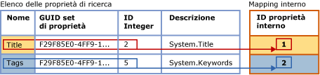
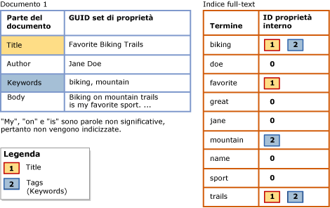

# Eseguire ricerche nelle propriet&#224; dei documenti con elenchi delle propriet&#224; di ricerca
  In passato non era possibile distinguere il contenuto delle proprietà del documento dal contenuto del corpo del documento. Ciò limitava le query full-text a ricerche generiche in documenti interi. Attualmente, invece, è possibile configurare un indice full-text per supportare la ricerca con ambito proprietà di particolari proprietà, ad esempio Author e Title, per tipi di documenti supportati in una colonna di dati binari **varbinary**, **varbinary(max)** (incluso **FILESTREAM**) o **image**. Questa modalità di ricerca è nota come *ricerca basata su proprietà*.  
  
 La possibilità di usare la ricerca basata su proprietà in un tipo specifico di documento è determinata dal [filtro](../../relational-databases/search/configure-and-manage-filters-for-search.md) (IFilter) associato. Per alcuni tipi di documento, il filtro IFilter associato estrae alcune o tutte le proprietà definite per quel tipo di documento, nonché il contenuto del corpo del documento. È possibile configurare un indice full-text per supportare la ricerca basata su proprietà solo in proprietà estratte da un filtro IFilter durante l'indicizzazione full-text. I filtri IFilter in grado di estrarre alcune proprietà del documento comprendono i filtri IFilter per tipi di documento di Microsoft Office, ad esempio docx, xlsx e pptx. D'altra parte, il filtro IFilter XML non genera proprietà.  
  
##  <a name="How_FTS_Works_with_search_properties"></a> Funzionamento della ricerca full-text con proprietà di ricerca  
  
### ID di proprietà interni  
 Tramite il motore di ricerca full-text viene arbitrariamente assegnato un ID di proprietà interno a ogni proprietà registrata, che identifica in modo univoco la proprietà in tale particolare elenco di ricerca ed è specifico di quell'elenco. Pertanto, se una proprietà viene aggiunta a più elenchi di proprietà di ricerca, è probabile che l'ID di proprietà interno sia diverso nei diversi elenchi.  
  
 Quando si registra una proprietà per un elenco di ricerca, a tale proprietà viene arbitrariamente assegnato un *ID di proprietà interno* da parte del motore di ricerca full-text. L'ID di proprietà interno è un valore di tipo integer che identifica in modo univoco la proprietà in tale elenco di proprietà di ricerca.  
  
 Nella figura seguente viene illustrata una vista logica di un elenco di proprietà di ricerca in cui sono specificate due proprietà, Title e Keywords. Il nome dell'elenco di proprietà per Keywords è "Tags". Queste proprietà appartengono allo stesso set di proprietà il cui GUID è F29F85E0-4FF9-1068-AB91-08002B27B3D9. Gli identificatori di tipo integer della proprietà sono 2 per Title e 5 per Tags (Keywords). Tramite il motore di ricerca full-text viene arbitrariamente eseguito il mapping di ogni proprietà a un ID di proprietà interno univoco per l'elenco di proprietà di ricerca. L'ID di proprietà interno per la proprietà Title è 1, mentre per la proprietà Tags è 2.  
  
   
  
 È probabile che l'ID di proprietà interno sia diverso dall'identificatore di tipo integer della proprietà relativo alla proprietà. Se una determinata proprietà viene registrata in più elenchi di proprietà di ricerca, è possibile che a ciascun elenco di proprietà di ricerca venga assegnato un ID di proprietà interno. L'ID di proprietà interno potrebbe essere, ad esempio, 4 in un elenco di proprietà di ricerca, 1 in un altro, 3 in un altro ancora e così via. Al contrario, l'identificatore di tipo integer della proprietà è intrinseco della proprietà stessa e rimane uguale ovunque venga utilizzata la proprietà.  
  
### Indicizzazione di proprietà registrate  
 Dopo l'associazione di un indice full-text a un elenco di proprietà di ricerca, è necessario ripopolare l'indice per indicizzare i termini di ricerca specifici della proprietà. Durante l'indicizzazione full-text, il contenuto di tutte le proprietà viene archiviato nell'indice full-text insieme ad altro contenuto. Quando tuttavia si indicizza un termine di ricerca trovato in una proprietà registrata, tramite l'indicizzatore full-text viene archiviato insieme al termine anche il corrispondente ID di proprietà interno. Al contrario, se una proprietà non è registrata, viene archiviata nell'indice full-text come se fosse parte del corpo del documento e il valore dell'ID di proprietà interno sarà pari a zero.  
  
 Nella figura seguente viene illustrata una vista logica di come vengono visualizzati i termini di ricerca in un indice full-text associato all'elenco di proprietà di ricerca illustrato nella figura precedente. Un documento di esempio, Document 1, contiene tre proprietà, ovvero Title, Author e Keywords, oltre al corpo del documento. Per le proprietà Title e Keywords, specificate nell'elenco di proprietà di ricerca, i termini di ricerca sono associati ai corrispondenti ID di proprietà interni nell'indice full-text. Al contrario, il contenuto della proprietà Author viene indicizzato come se fosse parte del corpo del documento. Ciò significa che la registrazione di una proprietà aumenta le dimensioni dell'indice full-text, a seconda della quantità di contenuto archiviata nella proprietà.  
  
   
  
 I termini di ricerca nella proprietà Title, ovvero "Favorite," "Biking" e "Trails", sono associati all'ID di proprietà interno 1 assegnato a Title per questo indice. I termini di ricerca nella proprietà Keywords, ovvero "biking" e "mountain", sono associati all'ID di proprietà interno 2 assegnato a Tags per questo indice. Per i termini di ricerca nella proprietà Author, ovvero "Jane" e "Doe", e per i termini di ricerca nel corpo del documento, l'ID di proprietà interno è pari a 0. Si noti che il termine "biking" è presente nella proprietà Title, nella proprietà Keywords (Tags) e nel corpo del documento. Nei risultati di una ricerca basata su proprietà per "biking" nella proprietà Title o Keywords (Tags) verrà restituito questo documento. Anche una query full-text generica per "biking" restituirebbe questo documento, come se l'indice non fosse configurato per la ricerca basata su proprietà. Questo documento non verrà restituito da una ricerca basata su proprietà per "biking" nella proprietà Author.  
  
 In una query full-text con ambito proprietà vengono utilizzati gli ID di proprietà interni registrati per l'elenco di proprietà di ricerca corrente dell'indice full-text.  
  
##  <a name="impact"></a> Impatto dell'abilitazione della ricerca basata su proprietà  
 La configurazione di un indice full-text per supportare la ricerca basata su una o più proprietà aumenta le dimensioni dell'indice, a seconda del numero di proprietà specificate nell'elenco di proprietà di ricerca e del contenuto di ogni proprietà.  
  
 Per l'esecuzione di test di corpi tipici di documenti di Microsoft Word, Excel e PowerPoint, è stato configurato un indice full-text per indicizzare le proprietà di ricerca più comuni. L'indicizzazione di queste proprietà ha comportato l'aumento delle dimensioni dell'indice full-text di circa il 5%. Si prevede che tale aumento approssimativo delle dimensioni caratterizzerà la maggior parte dei corpi di documento. In ultima analisi l'aumento delle dimensioni dipenderà, tuttavia, dalla quantità di dati della proprietà nel corpo di un determinato documento rispetto alla quantità di dati complessivi.  
  
##  <a name="creating"></a> Creazione di un elenco di proprietà di ricerca e abilitazione della ricerca basata su proprietà  
  
###  <a name="creating_sub"></a> Creazione di un elenco di proprietà di ricerca  
 **Per creare un elenco di proprietà di ricerca con Transact-SQL**  
  
 Usare l'istruzione [CREATE SEARCH PROPERTY LIST &#40;Transact-SQL&#41;](../../t-sql/statements/create-search-property-list-transact-sql.md) e fornire almeno un nome per l'elenco.  
  
##### Per creare un elenco di proprietà di ricerca in Management Studio  
  
1.  In Esplora oggetti espandere il server.  
  
2.  Espandere **Database**, quindi espandere il database in cui si desidera creare l'elenco di proprietà di ricerca.  
  
3.  Espandere **Archiviazione**, quindi fare clic con il pulsante destro del mouse su **Elenchi di proprietà di ricerca**.  
  
4.  Selezionare **Nuovo elenco di proprietà di ricerca**.  
  
5.  Specificare il nome dell'elenco di proprietà.  
  
6.  Facoltativamente, specificare un altro utente come proprietario dell'elenco di proprietà.  
  
7.  Selezionare una delle opzioni seguenti:  
  
    -   **Crea un elenco di proprietà di ricerca vuoto**  
  
    -   **Crea da un elenco di proprietà di ricerca esistente**  
  
     Per altre informazioni, vedere [Nuovo elenco di proprietà di ricerca](../Topic/New%20Search%20Property%20List.md).  
  
8.  [!INCLUDE[clickOK](../../includes/clickok-md.md)]  
  
###  <a name="adding"></a> Aggiunta di proprietà a un elenco di proprietà di ricerca  
 La ricerca basata su proprietà richiede la creazione di un *elenco di proprietà di ricerca* e l'indicazione di una o più proprietà in cui è possibile eseguire la ricerca. Quando si aggiunge una proprietà a un elenco di proprietà di ricerca, la proprietà viene registrata per quel particolare elenco. Per aggiungere una proprietà a un elenco di proprietà di ricerca sono necessari i valori seguenti:  
  
-   GUID set di proprietà  
  
     Ogni proprietà di ricerca appartiene al singolo set di proprietà che contiene un gruppo di proprietà correlate. Ogni set di proprietà viene identificato da un identificatore univoco globale (GUID).  
  
-   Identificatore di tipo integer della proprietà  
  
     In ogni proprietà di ricerca è disponibile un identificatore univoco all'interno del set di proprietà. Si noti che per una determinata proprietà l'identificatore potrebbe essere un tipo integer o una stringa, tuttavia la ricerca full-text supporta solo identificatori di tipo integer.  
  
-   Nome proprietà  
  
     Si tratta del nome che gli utenti specificheranno nelle query full-text per la ricerca basata su proprietà. Un nome di proprietà può contenere spazi interni. La lunghezza massima è 256 caratteri.  
  
     Il nome di proprietà può essere uno dei seguenti:  
  
    -   Il nome canonico Windows della proprietà, come **System. Author** o **System.Contact.HomeAddress**.  
  
    -   Nome descrittivo facile da ricordare per gli utenti. Alcune proprietà sono associate a un nome descrittivo noto, ad esempio "Autore" o "Indirizzo abitazione", ma è possibile specificare qualsiasi nome appropriato per gli utenti.  
  
    > [!NOTE]  
    >  Una determinata combinazione di GUID del set di proprietà e di identificatore di proprietà deve essere univoca in un elenco di proprietà di ricerca specificato. Ciò significa che non è possibile aggiungere la stessa proprietà più di una volta con diversi nomi o descrizioni.  
  
-   Descrizione (facoltativo)  
  
     Quando si aggiunge una proprietà di ricerca a un elenco di proprietà di ricerca, è possibile fornire una descrizione facoltativa. Ad esempio, includere informazioni su una proprietà che non è possibile dedurre dal nome o descrivere il set di proprietà della proprietà stessa.  
  
 **Per ottenere valori per un elenco di proprietà di ricerca**  
  
 Vedere [Trovare GUID del set di proprietà e ID di tipo integer delle proprietà per le proprietà di ricerca](../../relational-databases/search/find-property-set-guids-and-property-integer-ids-for-search-properties.md).  
  
 **Per aggiungere una proprietà a un elenco di proprietà di ricerca con Transact-SQL**  
  
 Usare l'istruzione [ALTER SEARCH PROPERTY LIST &#40;Transact-SQL&#41;](../../t-sql/statements/alter-search-property-list-transact-sql.md) con i valori ottenuti mediante uno dei metodi descritti nell'argomento [Trovare GUID del set di proprietà e ID di tipo integer delle proprietà per le proprietà di ricerca](../../relational-databases/search/find-property-set-guids-and-property-integer-ids-for-search-properties.md).  
  
 Nell'esempio seguente viene illustrato l'utilizzo di questi valori in caso di aggiunta di una proprietà a un elenco di proprietà di ricerca:  
  
```  
ALTER SEARCH PROPERTY LIST DocumentTablePropertyList  
   ADD 'Title'  
   WITH ( PROPERTY_SET_GUID = 'F29F85E0-4FF9-1068-AB91-08002B27B3D9', PROPERTY_INT_ID = 2,   
      PROPERTY_DESCRIPTION = 'System.Title - Title of the item.' );  
```  
  
 **Per aggiungere una proprietà a un elenco di proprietà di ricerca in Management Studio**  
  
 Utilizzare la finestra di dialogo **Proprietà elenco delle proprietà di ricerca** per aggiungere e rimuovere proprietà di ricerca. È possibile trovare **Elenchi di proprietà di ricerca** in Esplora oggetti nel nodo **Archiviazione** del database associato.  
  
###  <a name="associating"></a> Associazione di un elenco di proprietà di ricerca a un indice full-text  
 Affinché un indice full-text supporti la ricerca basata su proprietà delle proprietà registrate per un elenco di proprietà di ricerca, è necessario associare tale elenco all'indice e ripopolare l'indice. Il ripopolamento dell'indice full-text consente di creare voci di indice specifiche della proprietà per i termini di ricerca in ognuna delle proprietà registrate.  
  
 Finché l'indice full-text rimane associato a tale elenco di proprietà di ricerca, nelle query full-text potrà essere utilizzata l'opzione PROPERTY del predicato CONTAINS per la ricerca basata su proprietà registrate per tale elenco di proprietà di ricerca.  
  
 Se si modifica l'elenco di proprietà di ricerca associato a un indice full-text, sarà necessario ricompilare l'indice per ripristinarne lo stato coerente. L'indice viene troncato immediatamente e rimane vuoto fino al termine del popolamento completo. Per altre informazioni sul caso in cui la modifica dell'elenco di proprietà di ricerca provoca la ricompilazione dell'indice, vedere la sezione "Osservazioni" in [ALTER FULLTEXT INDEX &#40;Transact-SQL&#41;](../../t-sql/statements/alter-fulltext-index-transact-sql.md).  
  
 **Per associare un elenco di proprietà di ricerca a un indice full-text con Transact-SQL:**  
  
 Usare l'istruzione [ALTER FULLTEXT INDEX &#40;Transact-SQL&#41;](../../t-sql/statements/alter-fulltext-index-transact-sql.md) con la clausola `SET SEARCH PROPERTY LIST = <property_list_name>`.  
  
 **Per associare un elenco di proprietà di ricerca a un indice full-text con Management Studio**  
  
 Specificare un valore per **Elenco delle proprietà di ricerca** nella pagina **Generale** della finestra di dialogo **Proprietà indice full-text**.  
  
##  <a name="Ov_CONTAINS_using_PROPERTY"></a> Query delle proprietà di ricerca con CONTAINS  
 Di seguito è riportata la sintassi di base di [CONTAINS](../../t-sql/queries/contains-transact-sql.md) per una query full-text con ambito proprietà:  
  
```tsql  
SELECT column_name FROM table_name  
  WHERE CONTAINS ( PROPERTY ( column_name, 'property_name' ), '<contains_search_condition>' )  
```  
  
 La query seguente, ad esempio, esegue la ricerca di una proprietà indicizzata, `Title`, nella colonna `Document` della tabella `Production.Document` del database `AdventureWorks`. La query restituisce solo documenti la cui proprietà `Title` contiene la stringa `Maintenance` o `Repair`  
  
```  
USE AdventureWorks  
GO  
SELECT Document FROM Production.Document  
  WHERE CONTAINS ( PROPERTY ( Document, 'Title' ), 'Maintenance OR Repair')  
GO  
```  
  
 Nell'esempio si presuppone che il filtro IFilter per il documento estragga la proprietà Title, che la proprietà Title venga aggiunta all'elenco di proprietà di ricerca e che tale elenco sia associato all'indice full-text.  
  
##  <a name="managing"></a> Gestione degli elenchi di proprietà di ricerca  
  
###  <a name="viewing"></a> Visualizzazione e modifica di un elenco di proprietà di ricerca  
 **Per modificare un elenco di proprietà di ricerca con Transact-SQL**  
  
 Usare l'istruzione [ALTER SEARCH PROPERTY LIST &#40;Transact-SQL&#41;](../../t-sql/statements/alter-search-property-list-transact-sql.md) per aggiungere o rimuovere proprietà di ricerca.  
  
##### Per visualizzare e modificare un elenco di proprietà di ricerca in Management Studio  
  
1.  In Esplora oggetti espandere il server.  
  
2.  Espandere **Database**, quindi espandere il database.  
  
3.  Espandere **Archiviazione**.  
  
4.  Espandere **Elenchi di proprietà di ricerca** per visualizzare gli elenchi di proprietà di ricerca.  
  
5.  Fare clic con il pulsante destro del mouse sull'elenco di proprietà, quindi scegliere **Proprietà**.  
  
6.  Nella finestra di dialogo dell'**editor dell'elenco delle proprietà di ricerca** usare la griglia Proprietà per aggiungere o rimuovere proprietà di ricerca:  
  
    1.  Per rimuovere una proprietà del documento, fare clic sull'intestazione di riga a sinistra della proprietà e premere CANC.  
  
    2.  Per aggiungere una proprietà del documento, fare clic nella riga vuota nella parte inferiore dell'elenco, a destra di **\***, quindi immette i valori per la nuova proprietà.  
  
         Per informazioni su questi valori, vedere [Editor dell'elenco delle proprietà di ricerca](../Topic/Search%20Property%20List%20Editor.md). Per informazioni su come ottenere questi valori per le proprietà definite da Microsoft, vedere [Trovare GUID del set di proprietà e ID di tipo integer delle proprietà per le proprietà di ricerca](../../relational-databases/search/find-property-set-guids-and-property-integer-ids-for-search-properties.md). Per informazioni sulle proprietà definite da un fornitore di software indipendente (ISV, Independent Software Vendor), vedere la documentazione di tale fornitore.  
  
7.  [!INCLUDE[clickOK](../../includes/clickok-md.md)]  
  
###  <a name="deleting"></a> Eliminazione di un elenco di proprietà di ricerca  
 Non è possibile eliminare un elenco di proprietà da un database se l'elenco è associato a un indice full-text.  
  
 **Per eliminare un elenco di proprietà di ricerca con Transact-SQL**  
  
 Usare l'istruzione [DROP SEARCH PROPERTY LIST &#40;Transact-SQL&#41;](../../t-sql/statements/drop-search-property-list-transact-sql.md).  
  
##### Per eliminare un elenco di proprietà di ricerca in Management Studio  
  
1.  In Esplora oggetti espandere il server.  
  
2.  Espandere **Database**, quindi espandere il database.  
  
3.  Espandere **Archiviazione**, quindi espandere il nodo **Elenchi di proprietà di ricerca**.  
  
4.  Fare clic con il pulsante destro del mouse sull'elenco di proprietà che si desidera eliminare, quindi scegliere **Elimina**.  
  
5.  [!INCLUDE[clickOK](../../includes/clickok-md.md)]  
  
## Vedere anche  
 [Trovare GUID del set di proprietà e ID di tipo integer delle proprietà per le proprietà di ricerca](../../relational-databases/search/find-property-set-guids-and-property-integer-ids-for-search-properties.md)   
 [Configurazione e gestione di filtri per la ricerca](../../relational-databases/search/configure-and-manage-filters-for-search.md)  
  
  