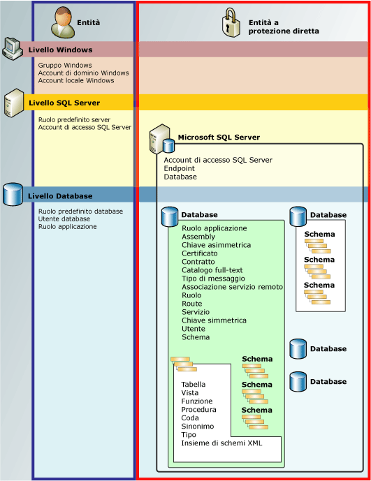

# Gerarchia delle autorizzazioni (Motore di database)
[!INCLUDE[tsql-appliesto-ss2008-all_md](../../includes/tsql-appliesto-ss2008-all-md.md)]

  [!INCLUDE[ssDE](../../includes/ssde-md.md)] gestisce una raccolta gerarchica di entità che possono essere protette attraverso l'uso di autorizzazioni. Queste entità sono denominate *entità a sicurezza diretta*. Le entità a protezione diretta più significative sono server e database, ma è possibile impostare autorizzazione distinte a un livello più specifico. [!INCLUDE[ssNoVersion](../../includes/ssnoversion-md.md)] regola le azioni delle entità sulle entità a protezione diretta verificando che siano state concesse le autorizzazioni corrette.  
  
 Nella figura seguente vengono illustrate le relazioni esistenti tra le gerarchie di autorizzazioni di [!INCLUDE[ssDE](../../includes/ssde-md.md)] .  
  
 Il sistema di autorizzazioni funziona allo stesso modo in tutte le versioni di [!INCLUDE[ssNoVersion](../../includes/ssnoversion-md.md)], [!INCLUDE[ssSDS](../../includes/sssds-md.md)], [!INCLUDE[ssDW](../../includes/ssdw-md.md)]e [!INCLUDE[ssAPS](../../includes/ssaps-md.md)], ma alcune funzionalità non sono disponibili in tutte le versioni. Le autorizzazioni a livello di server, ad esempio, non possono essere configurate nei prodotti Azure.  
  
   
  
## Grafico delle autorizzazioni di SQL Server  
 Per un grafico di grandi dimensioni di tutte le autorizzazioni [!INCLUDE[ssDE](../../includes/ssde-md.md)] in formato pdf, vedere [http://go.microsoft.com/fwlink/?LinkId=229142](http://go.microsoft.com/fwlink/?LinkId=229142).  
  
## Utilizzo delle autorizzazioni  
 Le autorizzazioni possono essere manipolate attraverso le ben note query GRANT, DENY e REVOKE [!INCLUDE[tsql](../../includes/tsql-md.md)] . Le informazioni sulle autorizzazioni sono visualizzate nelle viste di catalogo [sys.server_permissions](../../relational-databases/system-catalog-views/sys-server-permissions-transact-sql.md) e [sys.database_permissions](../../relational-databases/system-catalog-views/sys-database-permissions-transact-sql.md) . Le funzioni predefinite offrono inoltre supporto per query sulle informazioni relative alle autorizzazioni.  
  
 Per informazioni sulla progettazione di un sistema di autorizzazioni, vedere [Introduzione alle autorizzazioni del motore di database](../../relational-databases/security/authentication-access/getting-started-with-database-engine-permissions.md).  
  
## Vedere anche  
 [Sicurezza di SQL Server](../../relational-databases/security/securing-sql-server.md)   
 [Autorizzazioni &#40;motore di database&#41;](../../relational-databases/security/permissions-database-engine.md)   
 [Securables](../../relational-databases/security/securables.md)   
 [Entità &#40;motore di database&#41;](../../relational-databases/security/authentication-access/principals-database-engine.md)   
 [GRANT &#40;Transact-SQL&#41;](../../t-sql/statements/grant-transact-sql.md)   
 [REVOKE &#40;Transact-SQL&#41;](../../t-sql/statements/revoke-transact-sql.md)   
 [DENY &#40;Transact-SQL&#41;](../../t-sql/statements/deny-transact-sql.md)   
 [HAS_PERMS_BY_NAME &#40;Transact-SQL&#41;](../../t-sql/functions/has-perms-by-name-transact-sql.md)   
 [sys.fn_builtin_permissions &#40;Transact-SQL&#41;](../../relational-databases/system-functions/sys-fn-builtin-permissions-transact-sql.md)   
 [sys.server_permissions &#40;Transact-SQL&#41;](../../relational-databases/system-catalog-views/sys-server-permissions-transact-sql.md)   
 [sys.database_permissions &#40;Transact-SQL&#41;](../../relational-databases/system-catalog-views/sys-database-permissions-transact-sql.md)  
  
  

