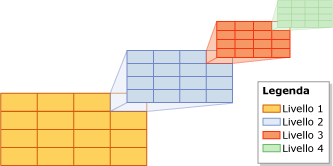
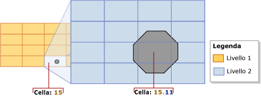
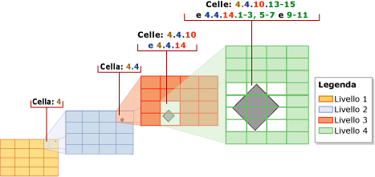
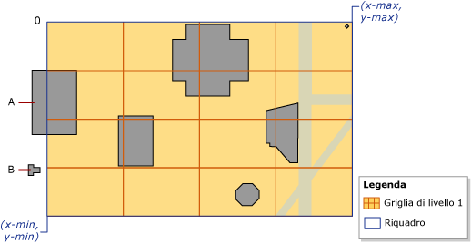
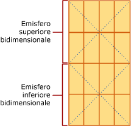

# <a name="spatial-indexes-overview"></a>Panoramica degli indici spaziali
[!INCLUDE[appliesto-ss-asdb-xxxx-xxx-md](../../includes/appliesto-ss-asdb-xxxx-xxx-md.md)]
  [!INCLUDE[ssNoVersion](../../includes/ssnoversion-md.md)] supporta dati e indici spaziali. Un *indice spaziale* è un tipo di indice esteso che consente di indicizzare una colonna spaziale. Una colonna spaziale è una colonna della tabella che contiene dati spaziali, ad esempio **geometry** o **geography**.  
  
> [!IMPORTANT]  
>  Per una descrizione dettagliata ed esempi delle nuove funzionalità spaziali di [!INCLUDE[ssSQL11](../../includes/sssql11-md.md)], incluse le funzionalità che incidono sugli indici spaziali, scaricare il white paper [New Spatial Features in SQL Server 2012](https://go.microsoft.com/fwlink/?LinkId=226407)(Nuove funzionalità spaziali in SQL Server 2012).  
  
##  <a name="about"></a> Informazioni sugli indici spaziali  
  
###  <a name="decompose"></a> Scomposizione dello spazio indicizzato in una gerarchia di griglie  
 In [!INCLUDE[ssNoVersion](../../includes/ssnoversion-md.md)]gli indici spaziali vengono compilati utilizzando alberi B, pertanto gli indici devono rappresentare i dati spaziali bidimensionali nell'ordine lineare degli alberi B. Pertanto, prima della lettura di dati in un indice spaziale, [!INCLUDE[ssNoVersion](../../includes/ssnoversion-md.md)] consente di implementare una scomposizione gerarchica uniforme dello spazio. Il processo di creazione dell'indice *scompone* lo spazio in una *gerarchia di griglie*a quattro livelli. Questi livelli vengono indicati come *livello 1* (il livello principale), *livello 2*, *livello 3*e *livello 4*.  
  
 Ogni livello successivo scompone ulteriormente il livello precedente, pertanto ogni cella di livello superiore contiene una griglia completa al livello successivo. Su un livello specificato, tutte le griglie hanno lo stesso numero di celle lungo entrambi gli assi (ad esempio, 4x4 o 8x8) e le celle hanno tutte la stessa dimensione.  
  
 Nell'illustrazione seguente viene mostrata la scomposizione per la cella in alto destra a ogni livello della gerarchia di griglie in una griglia da 4x4. In realtà, tutte le celle vengono scomposte in questo modo. Quindi, ad esempio, scomponendo uno spazio in quattro livelli di griglie 4x4 si produce un totale di 65.536 celle a quattro livelli.  
  
   
  
> [!NOTE]  
>  La scomposizione dello spazio per un indice spaziale è indipendente dall'unità di misura utilizzata dai dati dell'applicazione.  
  
 Le celle di una gerarchia di griglie sono numerate in modo lineare tramite una variazione della curva di riempimento dello spazio di Hilbert. Tuttavia, a scopo illustrativo, viene utilizzata una semplice numerazione per riga, invece della numerazione effettivamente prodotta dalla curva di Hilbert. Nell'illustrazione seguente molti poligoni che rappresentano edifici e linee che rappresentano strade sono già stati posizionati in una griglia 4x4 di livello 1. Le celle di 1 livello sono numerate da 1 a 16 partendo dalla cella in alto a sinistra.  
  
   
  
#### <a name="grid-density"></a>Densità della griglia  
 Il numero di celle lungo gli assi di una griglia ne determina *densità*. Maggiore è il numero di celle, più densa è la griglia. Ad esempio, una griglia 8x8 (che crea 64 celle) è più densa di una griglia 4x4 (che crea 16 celle). La densità della griglia è definita per ogni livello.  
  
 L'istruzione [CREATE SPATIAL INDEX](../../t-sql/statements/create-spatial-index-transact-sql.md)[!INCLUDE[tsql](../../includes/tsql-md.md)] supporta una clausola GRIDS che consente di specificare diverse densità di griglia a livelli differenti. La densità della griglia per un determinato livello viene specificata utilizzando una delle parole chiave seguenti.  
  
|Parola chiave|Configurazione della griglia|Numero di celle|  
|-------------|------------------------|---------------------|  
|LOW|4X4|16|  
|MEDIUM|8X8|64|  
|HIGH|16X16|256|  
  
 Quando in [!INCLUDE[ssNoVersion](../../includes/ssnoversion-md.md)]il livello di compatibilità del database è impostato su 100 o su un valore inferiore, l'impostazione predefinita è MEDIUM in tutti i livelli. Quando il livello di compatibilità del database è impostato su 110 o su un valore superiore, l'impostazione predefinita è uno schema a griglia automatica. Griglia automatica indica una configurazione di livello 8 di HLLLLLLL. Invece di variare la densità della griglia di indice, si possono modificare le celle per oggetto e le celle dell'intervallo di query per oggetto tramite hint. 
  
 È possibile controllare il processo di scomposizione specificando densità della griglia non predefinite. Diverse densità della griglia a livelli diversi, ad esempio, potrebbero essere utili per l'ottimizzazione di un indice in base alle dimensioni dello spazio indicizzato e agli oggetti nella colonna spaziale.  
  
> [!NOTE]  
>  Le densità della griglia di un indice spaziale sono visibili nelle colonne level_1_grid, level_2_grid, level_3_grid e level_4_grid della vista del catalogo [sys.spatial_index_tessellations](../../relational-databases/system-catalog-views/sys-spatial-index-tessellations-transact-sql.md) quando il livello di compatibilità del database è impostato su 100 o su un valore inferiore. Le opzioni dello schema a mosaico **GEOMETRY_AUTO_GRID**/**GEOGRAPHY_AUTO_GRID** non popolano queste colonne. La vista del catalogo sys.spatial_index_tessellations ha valori **NULL** per queste colonne quando si usano le opzioni della griglia automatiche.  
  
###  <a name="tessellation"></a> Suddivisione a mosaico  
 Dopo la scomposizione di uno spazio indicizzato in una gerarchia di griglie, l'indice spaziale legge i dati dalla colonna spaziale, riga per riga. Al termine della lettura dei dati per un oggetto spaziale (o istanza), l'indice spaziale esegue un *processo di suddivisione a mosaico* per l'oggetto. Il processo di suddivisione a mosaico adatta l'oggetto nella gerarchia di griglie associandolo a un set di celle della griglia interessate dall'oggetto stesso (*celle interessate*). Partendo dal livello 1 della gerarchia di griglie, la suddivisione a mosaico procede *prima in profondità* attraverso il livello. Potenzialmente, il processo può continuare per tutti i quattro livelli, uno dopo l'altro.  
  
 L'output del processo a mosaico è un set di celle interessate registrate nell'indice spaziale per l'oggetto. Riferendosi a queste celle registrate, l'indice spaziale può trovare l'oggetto nello spazio in relazione ad altri oggetti nella colonna spaziale che sono archiviati anche nell'indice.  
  
#### <a name="tessellation-rules"></a>Regole della suddivisione a mosaico  
 Per limitare il numero di celle interessate registrate per un oggetto, nel processo di suddivisione a mosaico vengono applicate diverse regole, che permettono di determinare la profondità del processo e indicare quali delle celle interessate devono essere registrate nell'indice.  
  
 Le regole sono le seguenti:  
  
-   Regola di copertura  
  
     Se l'oggetto copre completamente una cella, tale cella viene definita *coperta* dall'oggetto. Una cella coperta viene inserita nel conteggio e non viene suddivisa a mosaico. Questa regola è valida per tutti i livelli della gerarchia di griglie. La regola di copertura semplifica il processo a mosaico e riduce la quantità di dati registrata da un indice spaziale.  
  
-   Regola delle celle per oggetto  
  
     Questa regola stabilisce il *limite di celle per oggetto*e determina il numero massimo di celle che possono essere conteggiate per ogni oggetto, a eccezione del livello 1. A livelli inferiori, la regola delle celle per oggetto consente di controllare la quantità di informazioni che possono essere registrate sull'oggetto.  
  
-   Regola della cella più in basso  
  
     La regola della cella più in basso genera la migliore approssimazione di un oggetto registrando solo le celle più in basso suddivise a mosaico per l'oggetto. Le celle padre non contribuiscono al conteggio celle per oggetto e non sono registrate nell'indice.  
  
 Queste regole vengono applicate in modo ricorsivo a ogni livello della griglia. Nella parte restante di questa sezione vengono descritte le regole in maggiore dettaglio.  
  
#### <a name="covering-rule"></a>Regola di copertura  
 Se un oggetto copre completamente una cella, quella cella viene definita *coperta* dall'oggetto. Ad esempio, nell'illustrazione seguente, una delle celle di secondo livello, 15.11, è completamente coperta dalla parte centrale di un ottagono.  
  
   
  
 Una cella coperta viene inserita nel conteggio e registrata nell'indice e non è più suddivisa a mosaico.  
  
#### <a name="cells-per-object-rule"></a>Regola delle celle per oggetto  
 L'entità della suddivisione a mosaico di ogni oggetto dipende principalmente dal *limite di celle per oggetto* dell'indice spaziale. Questo limite definisce il numero massimo di celle che la suddivisione a mosaico può conteggiare per ogni oggetto. Tuttavia la regola delle celle per oggetto non viene applicata per il livello 1, pertanto è possibile superare questo limite. Se il livello 1 raggiunge o supera il limite di celle per oggetto, non si verifica alcun altro inserimento nel mosaico ai livelli inferiori.  
  
 Finché il conteggio è inferiore al limite di celle per oggetto, il processo a mosaico continua. Partendo dalla cella interessata con il numero più basso (ad esempio, cella 15.6 nell'illustrazione precedente), ogni cella viene testata durante il processo per valutare se conteggiarla o suddividerla a mosaico. Se la suddivisione di una cella a mosaico determina il superamento del limite di celle per oggetto, la cella viene conteggiata e non viene suddivisa a mosaico; in caso contrario è suddivisa a mosaico e le celle di livello inferiore interessate dall'oggetto vengono conteggiate. Il processo continua in questo modo, nel senso della larghezza, attraverso il livello e viene ripetuto in modo ricorsivo per le griglie di livello inferiore delle celle a mosaico fino al raggiungimento del limite oppure al conteggio di tutte le celle.  
  
 Ad esempio, nell'illustrazione precedente viene mostrato un ottagono che si inserisce perfettamente nella cella 15 della griglia di livello 1. Nella figura, la cella 15 è stata suddivisa a mosaico, sezionando l'ottagono in nove celle di livello 2. In questa illustrazione si presuppone che il limite di celle per oggetto sia 9 o più. Se tuttavia il limite di celle per oggetto è pari o inferiore a 8, la cella 15 non viene suddivisa e viene conteggiata da sola per l'oggetto.  
  
 Per impostazione predefinita il limite di celle per oggetto è pari a 16, una soluzione intermedia soddisfacente tra spazio e precisione per la maggior parte di indici spaziali. Tuttavia, l'istruzione [CREATE SPATIAL INDEX](../../t-sql/statements/create-spatial-index-transact-sql.md)[!INCLUDE[tsql](../../includes/tsql-md.md)] supporta una clausola CELLS_PER_OBJECT**=**_n_ che consente di specificare un limite di celle per oggetto compreso tra 1 e 8192 inclusi.  
  
> [!NOTE]  
>  L'impostazione **cells_per_object** di un indice spaziale è visibile nella vista del catalogo [sys.spatial_index_tessellations](../../relational-databases/system-catalog-views/sys-spatial-index-tessellations-transact-sql.md) .  
  
#### <a name="deepest-cell-rule"></a>Regola della cella più in basso  
 La regola della cella più in basso sfrutta il fatto che ogni cella di livello inferiore appartiene alla cella a essa superiore: una cella di livello 4 appartiene a una cella di livello 3, una cella di livello 3 appartiene a una cella di livello 2 e una cella di livello 2 appartiene a una cella di livello 1. Un oggetto che appartiene alla cella 1.1.1.1, ad esempio, appartiene anche alle celle 1.1.1, 1.1 e 1. Il riconoscimento di tali relazioni gerarchiche tra celle è incorporata in Query Processor. Pertanto, solo le celle di livello più basso devono essere registrate nell'indice, rendendo minime le informazioni da archiviare.  
  
 Nell'illustrazione seguente, un poligono a forma di diamante relativamente piccolo è suddiviso a mosaico. L'indice utilizza il limite di celle per oggetto predefinito di 16 che non è raggiunto per questo piccolo oggetto. La suddivisione a mosaico, pertanto, continua fino al livello 4. Il poligono si trova nelle celle comprese tra il livello 1 e il livello 3 seguenti: 4, 4.4 e 4.4.10 e 4.4.14. Utilizzando la regola della cella più in basso, tuttavia, nella suddivisione a mosaico vengono contate solo le 12 celle di livello 4: 4.4.10.13-15 e 4.4.14.1-3, 4.4.14.5-7 e 4.4.14.9-11.  
  
   
  
###  <a name="schemes"></a> Schemi a mosaico  
 Il comportamento di un indice spaziale dipende parzialmente dal relativo *schema a mosaico*. Lo schema a mosaico è specifico per il tipo di dati. In [!INCLUDE[ssNoVersion](../../includes/ssnoversion-md.md)]gli indici spaziali supportano due schemi a mosaico:  
  
-   *Mosaico per griglia di geometria*, ovvero lo schema per il tipo di dati **geometry** .  
  
-   *Mosaico per griglia di geografia*che si applica a colonne del tipo di dati **geografia** .  
  
> [!NOTE]  
>  L'impostazione **tessellation_scheme** di un indice spaziale è visibile nella vista del catalogo [sys.spatial_index_tessellations](../../relational-databases/system-catalog-views/sys-spatial-index-tessellations-transact-sql.md) .  
  
#### <a name="geometry-grid-tessellation-scheme"></a>Schema a mosaico per griglia di geometria  
 Lo schema a mosaico GEOMETRY_AUTO_GRID è lo schema a mosaico predefinito per il tipo di dati **geometry** per [!INCLUDE[ssNoVersion](../../includes/ssnoversion-md.md)] e versioni successive.  Lo schema a mosaico GEOMETRY_GRID è l'unico schema a mosaico disponibile per il tipo di dati geometry in [!INCLUDE[ssNoVersion](../../includes/ssnoversion-md.md)]. In questa sezione vengono trattati alcuni aspetti della suddivisione a mosaico per la griglia di geometria che sono rilevanti per l'utilizzo di indici spaziali, ovvero i metodi e i rettangoli di selezione supportati.  
  
> [!NOTE]  
>  È possibile specificare in modo esplicito questo schema a mosaico con la clausola USING (GEOMETRY_AUTO_GRID/GEOMETRY_GRID) dell'istruzione [CREATE SPATIAL INDEX](../../t-sql/statements/create-spatial-index-transact-sql.md)[!INCLUDE[tsql](../../includes/tsql-md.md)] .  
  
##### <a name="the-bounding-box"></a>Riquadro  
 I dati geometrici occupano un piano che può essere infinito. In [!INCLUDE[ssNoVersion](../../includes/ssnoversion-md.md)], tuttavia, un indice spaziale richiede uno spazio finito. Per stabilire uno spazio finito per la scomposizione, lo schema a mosaico per la griglia di geometria richiede un *riquadro*rettangolare. Il rettangolo di selezione è definito da quattro coordinate, **(**_x-min_**,**_y-min_**)** e **(**_x-max_**,**_y-max_**)**, che sono archiviate come proprietà dell'indice spaziale. Queste coordinate rappresentano gli elementi seguenti:  
  
-   *x-min* è la coordinata x dell'angolo inferiore sinistro del rettangolo di selezione.  
  
-   *y-min* è la coordinata y dell'angolo inferiore sinistro.  
  
-   *x-max* è la coordinata x dell'angolo superiore destro.  
  
-   *y-max* è la coordinata y dell'angolo superiore destro.  
  
> [!NOTE]  
>  Queste coordinate sono specificate dalla clausola BOUNDING_BOX dell'istruzione [!INCLUDE[tsql](../../includes/tsql-md.md)] [CREATE SPATIAL INDEX](../../t-sql/statements/create-spatial-index-transact-sql.md).  
  
 Le coordinate **(**_x-min_**,**_y-min_**)** e **(**_x-max_**,**_y-max_**)** determinano la posizione e le dimensioni del rettangolo di selezione. Lo spazio al di fuori del riquadro viene considerato come una cella unica numerata con 0.  
  
 L'indice spaziale scompone lo spazio nel riquadro. che viene riempito dalla griglia di livello 1 della gerarchia di griglie. Per posizionare un oggetto geometrico nella gerarchia di griglie, l'indice spaziale confronta le coordinate dell'oggetto con quelle del riquadro.  
  
 La figura seguente illustra i punti definiti dalle coordinate **(**_x-min_**,**_y-min_**)** e **(**_x-max_**,**_y-max_**)** del rettangolo di selezione. Il livello superiore della gerarchia di griglie viene mostrato come una griglia 4x4. Ai fini dell'illustrazione, i livelli inferiori sono omessi. Lo spazio al di fuori del riquadro è indicato da uno zero (0). L'oggetto 'A' si estende in parte oltre il riquadro e l'oggetto 'B' si trova completamente al di fuori del riquadro nella cella 0.  
  
   
  
 Un riquadro corrisponde ad alcune parti dei dati spaziali di un'applicazione. In base all'applicazione, il riquadro dell'indice può contenere tutti o solo una parte dei dati archiviati nella colonna spaziale. Solo le operazioni calcolate su oggetti che sono completamente inseriti nel riquadro traggono vantaggio dall'indice spaziale. Per ottenere il massimo vantaggio da un indice spaziale in una colonna **geometry** , è quindi necessario specificare un riquadro che contenga tutti o la maggior parte degli oggetti.  
  
> [!NOTE]  
>  Le densità della griglia di un indice spaziale sono visibili nelle colonne bounding_box_xmin, bounding_box_ymin, bounding_box_xmax e bounding_box_ymax della vista del catalogo [sys.spatial_index_tessellations](../../relational-databases/system-catalog-views/sys-spatial-index-tessellations-transact-sql.md) .  
  
#### <a name="the-geography-grid-tessellation-scheme"></a>Schema a mosaico per la griglia di geografia  
 Questo schema a mosaico si applica solo a una colonna **geography** . In questa sezione vengono riepilogati i metodi supportati dal mosaico della griglia di geografia e discusso il modo in cui lo spazio geodetico è proiettato su un piano scomposto in una gerarchia di griglie.  
  
> [!NOTE]  
>  È possibile specificare in modo esplicito questo schema a mosaico con la clausola USING (GEOGRAPHY_AUTO_GRID/GEOGRAPHY_GRID) dell'istruzione [CREATE SPATIAL INDEX](../../t-sql/statements/create-spatial-index-transact-sql.md)[!INCLUDE[tsql](../../includes/tsql-md.md)] .  
  
##### <a name="projection-of-the-geodetic-space-onto-a-plane"></a>Proiezione dello spazio geodetico su un piano  
 I calcoli sulle istanze (oggetti) **geography** considerano lo spazio che contiene gli oggetti come un ellissoide geodetico. Per scomporre questo spazio lo schema a mosaico della griglia di geografia divide la superficie dell'ellissoide negli emisferi superiori e inferiori e quindi esegue i passaggi seguenti:  
  
1.  Proiezione di ogni emisfero sui facet di una piramide del quadrilatero.  
  
2.  Appiattimento delle due piramidi.  
  
3.  Unione delle piramidi piatte per formare un piano non euclideo.  
  
 Nell'illustrazione seguente viene mostrata una vista schematica del processo di scomposizione a tre passaggi. Nelle piramidi, le linee punteggiate rappresentano i limiti dei quattro facet di ogni piramide. I passaggi 1 e 2 illustrano l'ellissoide geodetico, utilizzando una linea verde orizzontale per rappresentare la linea longitudinale dell'equatore e una serie di linee verdi verticali per rappresentare diverse linee della latitudine. Il passaggio 1 mostra le piramidi proiettate sui due emisferi. Il passaggio 2 mostra le piramidi appiattite. Il passaggio 3 illustra le piramidi bidimensionali, dopo che sono state combinate per formare un piano, mostrando un certo numero di linee longitudinali proiettate. Queste linee proiettate sono dritte e di lunghezza diversa, a seconda di dove cadono sulle piramidi.  
  
   
  
 Una volta che lo spazio è stato proiettato sul piano, questo viene scomposto in una gerarchia di griglie a quattro livelli. Livelli diversi possono utilizzare densità della griglia differenti. Nell'illustrazione seguente viene mostrato il piano dopo essere stato scomposto in una griglia a 1 livello 4x4. Ai fini dell'illustrazione, i livelli inferiori della gerarchia di griglie sono omessi. In effetti, il piano è completamente scomposto in una gerarchia di griglie a quattro livelli. Al termine del processo di scomposizione, i dati geografici vengono letti, riga per riga, dalla colonna relativa e il processo a mosaico viene eseguito per ogni oggetto.  
  
   
  
##  <a name="methods"></a> Metodi supportati dagli indici spaziali  
  
###  <a name="geometry"></a> Metodi di geometria supportati da indici spaziali  
 In alcuni casi, gli indici spaziali supportano i metodi geometry orientati ai set seguenti: STContains(), STDistance(), STEquals(), STIntersects(), STOverlaps(), STTouches() e STWithin(). Per essere supportati da un indice spaziale questi metodi devono essere utilizzati all'interno della clausola WHERE o JOIN ON di una query e devono verificarsi all'interno di un predicato del seguente form generale:  
  
 *geometry1*.*nome_metodo*(*geometry2*)*operatore_confronto**numero_valido*  
  
 Per ottenere un risultato non Null, *geometry1* e *geometry2* devono avere lo stesso [identificatore SRID (Spatial Reference Identifier)](../../relational-databases/spatial/spatial-reference-identifiers-srids.md). In caso contrario, il metodo restituisce NULL.  
  
 Gli indici spaziali supportano i seguenti form di predicato:  
  
-   *geometry1*.[STContains](../../t-sql/spatial-geometry/stcontains-geometry-data-type.md)(*geometry2*) = 1  
  
-   *geometry1*.[STDistance](../../t-sql/spatial-geometry/stdistance-geometry-data-type.md)(*geometry2*) < *numero*  
  
-   *geometry1*.[STDistance](../../t-sql/spatial-geometry/stdistance-geometry-data-type.md)(*geometry2*) <= *numero*  
  
-   *geometry1*.[STEquals](../../t-sql/spatial-geometry/stequals-geometry-data-type.md)(*geometry2*)= 1  
  
-   *geometry1*.[STIntersects](../../t-sql/spatial-geometry/stintersects-geometry-data-type.md)(*geometry2*)= 1  
  
-   *geometry1.* [STOverlaps](../../t-sql/spatial-geometry/stoverlaps-geometry-data-type.md) *(geometry2) = 1*  
  
-   *geometry1*.[STTouches](../../t-sql/spatial-geometry/sttouches-geometry-data-type.md)(*geometry2*) = 1  
  
-   *geometry1*.[STWithin](../../t-sql/spatial-geometry/stwithin-geometry-data-type.md)(*geometry2*)= 1  
  
###  <a name="geography"></a> Metodi di geografia supportati da indici spaziali  
 In alcuni casi, gli indici spaziali supportano i metodi geography orientati ai set seguenti: STIntersects(),STEquals() e STDistance(). Per essere supportati da un indice spaziale questi metodi devono essere utilizzati all'interno della clausola WHERE di una query e devono verificarsi all'interno di un predicato del seguente form generale:  
  
 *geography1*.*nome_metodo*(*geography2*)*operatore_confronto**numero_valido*  
  
 Per ottenere un risultato non Null, *geography1* e *geography2* devono avere lo stesso [identificatore SRID (Spatial Reference Identifier)](../../relational-databases/spatial/spatial-reference-identifiers-srids.md). In caso contrario, il metodo restituisce NULL.  
  
 Gli indici spaziali supportano i seguenti form di predicato:  
  
-   *geography1*.[STIntersects](../../t-sql/spatial-geography/stintersects-geography-data-type.md)(*geography2*)= 1  
  
-   *geography1*.[STEquals](../../t-sql/spatial-geography/stequals-geography-data-type.md)(*geography2*)= 1  
  
-   *geography1*.[STDistance](../../t-sql/spatial-geography/stdistance-geography-data-type.md)(*geography2*) < *numero*  
  
-   *geography1*.[STDistance](../../t-sql/spatial-geography/stdistance-geography-data-type.md)(*geography2*) <= *numero*  
  
### <a name="queries-that-use-spatial-indexes"></a>Query con indici spaziali  
 Gli indici spaziali sono supportati solo nelle query che includono un operatore spaziale indicizzato nella clausola **WHERE** . Ad esempio, la sintassi seguente:  
  
```  
[spatial object].SpatialMethod([reference spatial object]) [ = | < ] [const literal or variable]  
```  
  
 Query Optimizer riconosce la commutatività di operazioni spaziali ( `@a.STIntersects(@b) = @b.STInterestcs(@a)` ). Tuttavia, l'indice spaziale non verrà utilizzato se l'inizio di un confronto non contiene l'operatore spaziale (ad esempio `WHERE 1 = spatial op` non utilizzerà l'indice spaziale). Per utilizzare l'indice spaziale, riscrivere il confronto (ad esempio `WHERE spatial op = 1`).  
  
 Analogamente a qualsiasi altro indice, quando è supportato un indice spaziale, l'utilizzo di quest'ultimo viene scelto in base al costo, pertanto tramite Query Optimizer non è possibile scegliere di utilizzare l'indice spaziale anche se vengono soddisfatti tutti i requisiti per utilizzarlo. Utilizzare showplan per verificare se l'indice spaziale è stato utilizzato e, se necessario, specificare gli hint per la query per forzare un piano di query desiderato.  
  
 Il tipo adiacente più prossimo di query supporta anche gli indici spaziali, tuttavia solo se viene scritta una sintassi di query specifica. La sintassi appropriata è:  
  
```  
SELECT TOP(K) [WITH TIES] *   
FROM <Table> AS T [WITH(INDEX(<SpatialIndex>))]  
WHERE <SpatialColumn>.STDistance(@reference_object) IS NOT NULL  
ORDER BY <SpatialColumn>.STDistance(@reference_object) [;]  
```  
  
## <a name="see-also"></a>Vedere anche  
 [Dati spaziali &#40;SQL Server&#41;](../../relational-databases/spatial/spatial-data-sql-server.md)  
  
  
