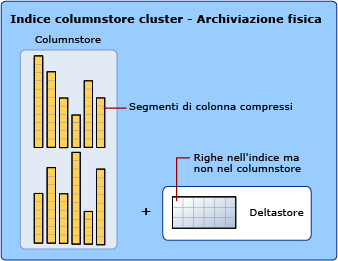

# <a name="sql-server-index-architecture-and-design-guide"></a>Architettura e guida per la progettazione degli indici di SQL Server
[!INCLUDE[appliesto-ss-asdb-asdw-pdw-md](../includes/appliesto-ss-asdb-asdw-pdw-md.md)]

Gli indici progettati in modo non corretto e la mancanza di indici costituiscono le cause principali dei colli di bottiglia delle applicazioni di database. La progettazione di indici efficienti è fondamentale per ottenere buone prestazioni del database e dell'applicazione. Questa guida per la progettazione degli indici di [!INCLUDE[ssNoVersion](../includes/ssnoversion-md.md)] contiene informazioni sull'architettura degli indici e le procedure consigliate che consentono di progettare indici validi per soddisfare le esigenze dell'applicazione.  
    
In questa guida si presuppone che il lettore conosca i tipi di indice disponibili in [!INCLUDE[ssNoVersion](../includes/ssnoversion-md.md)]. Per una descrizione generale dei tipi di indice, vedere [Tipi di indice](../relational-databases/indexes/indexes.md).  

In questa guida vengono illustrati i tipi di indici seguenti:

-   Cluster
-   Non cluster
-   Univoco
-   Filtrato
-   columnstore
-   Hash
-   Non cluster ottimizzati per la memoria

Per informazioni sugli indici XML, vedere [Panoramica degli indici XML](../relational-databases/xml/xml-indexes-sql-server.md).

Per informazioni sugli indici spaziali, vedere [Panoramica degli indici spaziali](../relational-databases/spatial/spatial-indexes-overview.md).

Per informazioni sugli indici full-text, vedere [Popolamento degli indici full-text](../relational-databases/search/populate-full-text-indexes.md).
  
##  <a name="Basics"></a> Nozioni fondamentali sulla progettazione di indici  
 Un indice è una struttura su disco o memoria associata a una tabella o a una vista che consente di recuperare in modo rapido le righe della tabella o della vista. L'indice contiene chiavi costituite da una o più colonne della tabella o della vista. Per gli indici su disco, queste chiavi vengono archiviate in una struttura (albero B) che consente a SQL Server di individuare con rapidità ed efficienza la riga o le righe associate ai valori di chiave.  

 Un indice archivia dati organizzati logicamente, come una tabella con righe e colonne, e archiviati fisicamente in un formato di dati a livello di riga denominato *rowstore* <sup>1</sup>, o archiviati in un formato di dati a livello di colonna denominato  *[columnstore](#columnstore_index)*.  
    
 La selezione degli indici adatti a un database e al relativo carico di lavoro è un'operazione complessa che comporta la ricerca di un equilibrio tra velocità delle query e costi di aggiornamento. Gli indici limitati, ovvero con poche colonne nella chiave di indice, richiedono meno spazio su disco e overhead di gestione. Gli indici estesi, d'altra parte, coprono più query. Potrebbe essere necessario sperimentare diverse soluzioni prima di trovare l'indice più efficiente. È possibile aggiungere, modificare ed eliminare indici senza modificare lo schema del database o la struttura dell'applicazione. È pertanto opportuno sperimentare il funzionamento di vari tipi di indice.  
  
 Query Optimizer in [!INCLUDE[ssNoVersion](../includes/ssnoversion-md.md)] consente di scegliere in modo affidabile l'indice più efficace nella maggior parte dei casi. La strategia globale di progettazione dell'indice deve offrire a Query Optimizer un'ampia gamma di indici tra cui scegliere e fare affidamento su questo strumento per la scelta. In questo modo, è possibile ridurre i tempi di analisi e garantire buone prestazioni in numerose situazioni. Per visualizzare gli indici usati da Query Optimizer per una query specifica, in [!INCLUDE[ssManStudioFull](../includes/ssmanstudiofull-md.md)]scegliere **Includi piano di esecuzione effettivo** dal menu **Query**.  
  
 L'utilizzo di indici non consente necessariamente di ottenere prestazioni ottimali e prestazioni ottimali non sempre sono da mettere in relazione all'utilizzo di indici. Se l'utilizzo di un indice garantisse sempre le prestazioni migliori, il processo di Query Optimizer risulterebbe semplice. In realtà, una scelta non corretta di un indice può portare a prestazioni per niente ottimali. L'attività di Query Optimizer consiste pertanto nel selezionare un indice, o una combinazione di indici, solo quando questo comporta un miglioramento delle prestazioni e nell'evitare il recupero indicizzato quando ciò potrebbe avere conseguenze negative sulle prestazioni.  

 <sup>1</sup> Il formato rowstore è il metodo di archiviazione tradizionale per i dati relazionali di tabella. In [!INCLUDE[ssNoVersion](../includes/ssnoversion-md.md)], rowstore fa riferimento alla tabella in cui il formato di archiviazione dati sottostante è un heap, un albero B ([indice cluster](#Clustered)) o una tabella ottimizzata per la memoria.

### <a name="index-design-tasks"></a>Attività di progettazione di indici  
 Le attività seguenti costituiscono la strategia consigliata per la progettazione di indici:  
  
1.  Comprendere le caratteristiche del database. 
    * Ad esempio, si tratta di un database di elaborazione di transazioni online (OLTP) con modifiche frequenti dei dati che deve sostenere una velocità effettiva elevata. A partire da [!INCLUDE[ssSQL14](../includes/sssql14-md.md)], indici e tabelle ottimizzati per la memoria sono particolarmente adatti per questo scenario, in quanto offrono una progettazione priva di latch. Per altre informazioni, vedere [Indici per tabelle ottimizzate per la memoria](../relational-databases/in-memory-oltp/indexes-for-memory-optimized-tables.md), oppure [Indici non cluster per le linee guida di progettazione di tabelle ottimizzate per la memoria](#inmem_nonclustered_index) e [Indice Hash per le linee guida di progettazione di tabelle ottimizzate per la memoria](#hash_index) presenti in questa guida.
    * Oppure un esempio di database DSS (Decision Support System) o di data warehouse (OLAP) che deve elaborare rapidamente grandi set di dati. A partire da [!INCLUDE[ssSQL11](../includes/sssql11-md.md)], gli indici columnstore sono particolarmente adatti per i set di dati tipici del warehousing. Gli indici columnstore possono trasformare l'ambiente di data warehousing per gli utenti consentendo prestazioni più veloci per le query di data warehousing comuni quali quelle di filtro, aggregazione, raggruppamento e join a stella. Per altre informazioni, vedere [Indici columnstore - Panoramica](../relational-databases/indexes/columnstore-indexes-overview.md) e [Linee guida per la progettazione di indici columnstore](#columnstore_index) presenti in questa guida.  

2.  Comprendere le caratteristiche delle query utilizzate più di frequente. Se, ad esempio, si stabilisce che una query utilizzata di frequente unisce in join due o più tabelle, è possibile determinare il tipo più adatto di indici da utilizzare.  
  
3.  Comprendere le caratteristiche delle colonne utilizzate nelle query. Un indice è ad esempio ideale per colonne con tipo di dati integer e univoche o non Null. Per colonne con subset di dati ben definiti, è possibile utilizzare un indice filtrato in [!INCLUDE[ssKatmai](../includes/sskatmai-md.md)] e versioni successive. Per altre informazioni, vedere [Linee guida per la progettazione di indici filtrati](#Filtered) in questa guida.  
  
4.  Determinare quali opzioni dell'indice potrebbero migliorare le prestazioni in fase di creazione o manutenzione dell'indice. Per la creazione, ad esempio, di un indice cluster in una tabella esistente di grandi dimensioni può essere utile usare l'opzione `ONLINE`. Tale opzione consente l'esecuzione di attività simultanee sui dati sottostanti durante la creazione o la ricompilazione dell'indice. Per altre informazioni vedere [Impostare le opzioni di indice](../relational-databases/indexes/set-index-options.md).  
  
5.  Determinare il percorso di archiviazione ottimale per l'indice. Un indice non cluster può essere archiviato nello stesso filegroup della tabella sottostante oppure in un filegroup diverso. Il percorso di archiviazione degli indici può consentire di migliorare le prestazioni di esecuzione delle query grazie a un aumento delle prestazioni di I/O su disco. L'archiviazione, ad esempio, di un indice non cluster in un filegroup in un disco diverso rispetto al filegroup della tabella può consentire di migliorare le prestazioni in quanto è possibile leggere più dischi contemporaneamente.  
     In alternativa, per gli indici cluster e non cluster è possibile utilizzare uno schema di partizione in più filegroup. Il partizionamento semplifica la gestione di tabelle o indici di grandi dimensioni in quanto consente di gestire o accedere a subset di dati in modo rapido ed efficace mantenendo l'integrità della raccolta. Per altre informazioni, vedere [Partitioned Tables and Indexes](../relational-databases/partitions/partitioned-tables-and-indexes.md). Quando si considera il partizionamento, determinare se è necessario che l'indice sia allineato, ovvero partizionato nello stesso modo della tabella, o partizionato in modo indipendente.   

##  <a name="General_Design"></a> Linee guida generali per la progettazione di indici  
 Gli amministratori di database esperti in genere sono in grado di progettare un set di indici adeguato, ma questa attività è molto complessa, richiede tempo ed è soggetta ad errori anche nel caso di database e carichi di lavoro di media complessità. Conoscere le caratteristiche del database, delle query e delle colonne di dati può aiutare a progettare indici ottimali.  
  
### <a name="database-considerations"></a>Considerazioni sui database  
 Quando si progetta un indice è consigliabile attenersi alle linee guida seguenti sui database:  
  
-   Un numero elevato di indici in una tabella ha ripercussioni sulle prestazioni delle istruzioni `INSERT`, `UPDATE`, `DELETE`, e `MERGE` perché, quando vengono modificati i dati nella tabella, tutti gli indici devono essere modificati di conseguenza. Ad esempio, se una colonna viene usata in molti indici e si esegue un'istruzione `UPDATE` tramite cui i dati della colonna vengono modificati, ogni indice contenente la colonna in questione deve essere aggiornato, nonché la colonna nella tabella di base sottostante (heap o indice cluster).  
  
    -   Evitare di creare un numero eccessivo di indici in tabelle che vengono aggiornate spesso e mantenere indici di piccole dimensioni, vale a dire con il minor numero possibile di colonne.  
  
    -   Utilizzare molti indici per migliorare le prestazioni delle query nelle tabelle che vengono aggiornate raramente ma che contengono grandi volumi di dati. Un numero elevato di indici può contribuire a migliorare le prestazioni delle query che non modificano i dati, ad esempio delle istruzioni SELECT, perché Query Optimizer può scegliere fra un numero maggiore di indici per determinare il metodo di accesso più rapido.  
  
-   L'indicizzazione di tabelle di piccole dimensioni può non risultare ottimale, perché Query Optimizer impiega più tempo per scorrere l'indice cercando i dati che per eseguire una semplice scansione della tabella. Pertanto, può accadere che gli indici delle tabelle di piccole dimensioni non vengano mai utilizzati, ma devono comunque essere gestiti in caso di modifica dei dati della tabella.  
  
-   Gli indici nelle viste possono garantire miglioramenti significativi delle prestazioni quando la vista contiene aggregazioni, join di tabella o una combinazione di aggregazioni e join. Non è necessario che venga fatto riferimento esplicito alla vista nella query affinché Query Optimizer la utilizzi.  
  
-   Utilizzare Ottimizzazione guidata motore di database per analizzare il database e raccogliere informazioni per gli indici. Per altre informazioni, vedere [Database Engine Tuning Advisor](../relational-databases/performance/database-engine-tuning-advisor.md).  
  
### <a name="query-considerations"></a>Considerazioni sulle query  
 Quando si progetta un indice è consigliabile attenersi alle linee guida seguenti sulle query:  
  
-   Creare indici non cluster nelle colonne che vengono utilizzate spesso in predicati e condizioni di join nelle query. Queste sono le colonne SARGable<sup>1</sup>. Tuttavia, è consigliabile non aggiungere colonne non necessarie. L'aggiunta di un numero eccessivo di colonne di indice può avere effetti negativi sullo spazio su disco e sulle prestazioni per la gestione degli indici.  
  
-   Gli indici di copertura possono migliorare le prestazioni delle query, perché tutti i dati necessari per soddisfare i requisiti della query esistono all'interno dell'indice stesso. In altre parole, per recuperare i dati richiesti sono necessarie solo le pagine di indice, e non le pagine di dati della tabella o dell'indice cluster. Viene dunque ridotto l'I/O complessivo del disco. Una query di colonne **a** e **b** in una tabella con un indice composto creato nelle colonne **a**, **b**e **c** può recuperare i dati specificati dall'indice solo.  

    > [!IMPORTANT]
    > Il termine indice di copertura indica un [indice non cluster](#nonclustered-index-architecture) che risolve uno o più risultati di query simili direttamente, senza accedere alla tabella di base e senza incorrere in ricerche.
    > Tali indici hanno tutte le colonne non [SARGable](#sargable) necessarie al livello foglia. Questo significa che le colonne restituite dalla clausola SELECT e tutti gli argomenti WHERE e JOIN sono coperti dall'indice.
    > Il carico di I/O richiesto per eseguire la query è potenzialmente molto minore, se l'indice è sufficientemente ridotto rispetto alle righe e alle colonne nella tabella, ovvero rappresenta realmente un subset del totale delle colonne. Prendere in considerazione gli indici di copertura quando si seleziona una piccola parte di una tabella di grandi dimensioni e tale piccola parte è definita da un predicato fisso, ad esempio le [colonne di tipo sparse](../relational-databases/tables/use-sparse-columns.md) che contengono solo pochi valori non NULL.
    
-   Scrivere query che inseriscono o modificano il numero più alto possibile di righe con una sola istruzione, anziché utilizzare più query per aggiornare le stesse righe. L'utilizzo di una sola istruzione consente di avvalersi della gestione ottimizzata degli indici.  
  
-   Valutare il tipo di query e la modalità di utilizzo delle colonne nella query. Una colonna utilizzata in un tipo di query di corrispondenze esatte, ad esempio, potrebbe essere valida per un indice non cluster o cluster.

<a name="sargable"></a><sup>1</sup> Il termine SARGable nei database relazionali si riferisce a un predicato **S**earch **ARG**ument -**able** (ovvero un predicato che supporta argomenti di ricerca) che può sfruttare un indice per accelerare l'esecuzione delle query.
  
### <a name="column-considerations"></a>Considerazioni sulle colonne  
 Quando si progetta un indice è consigliabile attenersi alle linee guidata seguenti:  
  
-   Mantenere corta la chiave dell'indice negli indici cluster. Inoltre, è consigliabile creare gli indici cluster su colonne univoche o non Null.  
  
-   Le colonne dei tipi di dati **ntext**, **text**, **image**, **varchar(max)**, **nvarchar(max)** e **varbinary(max)** non possono essere specificate come colonne chiave di indice. Tuttavia, i tipi di dati **varchar(max)**, **nvarchar(max)**, **varbinary(max)** e **xml** possono essere usati in un indice non cluster come colonne di indice non chiave. Per altre informazioni, vedere la sezione " [Indice con colonne incluse](#Included_Columns)" in questa guida.  
  
-   Un tipo di dati **xml** può essere solo una colonna chiave esclusivamente in un indice XML. Per altre informazioni, vedere [Indici XML &#40;SQL Server&#41;](../relational-databases/xml/xml-indexes-sql-server.md). In SQL Server 2012 SP1 viene introdotto un nuovo tipo di indice XML noto come indice XML selettivo. Grazie al nuovo indice potranno essere migliorate le prestazioni di esecuzione delle query sui dati archiviati come XML in SQL Server, pertanto sarà possibile un'indicizzazione molto più rapida di carichi di lavoro di dati XML di grandi dimensioni, nonché un miglioramento della scalabilità riducendo i costi di archiviazione dell'indice stesso. Per altre informazioni vedere [Indici XML selettivi &#40;SXI&#41;](../relational-databases/xml/selective-xml-indexes-sxi.md).  
  
-   Esaminare l'univocità delle colonne. Un indice univoco al posto di un indice non univoco nella stessa combinazione di colonne fornisce informazioni aggiuntive per Query Optimizer, che rendono l'indice più utile. Per altre informazioni, vedere [Linee guida per la progettazione di indici univoci](#Unique) in questa guida.  
  
-   Esaminare la distribuzione dei dati nelle colonne indicizzate. Spesso l'esecuzione prolungata di una query deriva dall'indicizzazione di una colonna con pochi valori univoci o dall'esecuzione di un join su tale colonna. Questo problema fondamentale relativo ai dati e alle query in genere non può essere risolto senza identificare questa situazione specifica. Ad esempio, in un elenco telefonico ordinato alfabeticamente in base al cognome non sarà possibile velocizzare la ricerca se i nomi di tutti gli abitanti della città sono Bianchi o Rossi. Per altre informazioni sulla distribuzione dei dati, vedere [Statistiche](../relational-databases/statistics/statistics.md).  
  
-   È consigliabile utilizzare indici filtrati su colonne dispongono di subset ben definiti, ad esempio colonne di tipo sparse, colonne con la maggior parte di valori Null, colonne con categorie di valori e colonne con intervalli di valori distinti. Un indice filtrato progettato correttamente consente di migliorare le prestazioni di esecuzione delle query e di ridurre i costi di archiviazione e di manutenzione dell'indice.  
  
-   Esaminare l'ordine delle colonne se l'indice conterrà più colonne. La colonna che viene utilizzata nella clausola WHERE in una condizione di ricerca uguale a (=), maggiore di (>), minore di (<) o BETWEEN oppure che partecipa a un join deve essere al primo posto. Le altre colonne devono essere ordinate in base alla presenza di valori distinct, vale a dire da quella con più valori distinct a quella con meno valori distinct.  
  
     Se, ad esempio, l'indice è definito come `LastName`, `FirstName` l'indice risulterà utile se il criterio di ricerca è `WHERE LastName = 'Smith'` o `WHERE LastName = Smith AND FirstName LIKE 'J%'`. Query Optimizer, tuttavia, non utilizzerebbe l'indice per una query che effettuasse la ricerca solo in base a `FirstName (WHERE FirstName = 'Jane')`.  
  
-   Valutare l'opportunità di indicizzare colonne calcolate. Per altre informazioni, vedere [Indici per le colonne calcolate](../relational-databases/indexes/indexes-on-computed-columns.md).  
  
### <a name="index-characteristics"></a>Caratteristiche degli indici  
 Dopo avere determinato che un indice è adeguato per una query, è possibile scegliere il tipo di indice più adatto a seconda della situazione. Le caratteristiche degli indici sono:  
  
-   Cluster e non cluster  
-   Univoci e non univoci  
-   A colonna singola e a più colonne  
-   In ordine crescente o decrescente per le colonne dell'indice  
-   Di tabella completa o filtrato per gli indici non cluster  
-   Columnstore e rowstore
-   Hash e non cluster per tabelle ottimizzate per la memoria
  
È inoltre possibile personalizzare le caratteristiche iniziali dell'archiviazione dell'indice per ottimizzarne le prestazioni o la gestione impostando un'opzione quale FILLFACTOR. È inoltre possibile determinare la posizione di archiviazione dell'indice utilizzando filegroup o schemi di partizione per ottimizzare le prestazioni.  
  
###  <a name="Index_placement"></a> Posizione degli indici nei filegroup o negli schemi di partizioni  
 Durante lo sviluppo della strategia di progettazione degli indici, è opportuno considerare la posizione degli indici nei filegroup associati al database. Un'attenta selezione dello schema di filegroup o di partizione può contribuire a migliorare le prestazioni delle query.  
  
 Per impostazione predefinita, gli indici vengono archiviati nello stesso filegroup della tabella di base in cui viene creato l'indice. Un indice cluster non partizionato e la tabella di base sono sempre inclusi nello stesso filegroup. È tuttavia possibile eseguire una delle operazioni seguenti:  
  
-   Creare indici non cluster in un filegroup diverso dal filegroup della tabella di base o un indice cluster.  
-   Partizionare indici cluster e non cluster tra più filegroup.  
-   Spostare una tabella da un filegroup a un altro eliminando l'indice cluster e specificando un nuovo schema di filegroup o di partizione nella clausola MOVE TO dell'istruzione DROP INDEX oppure utilizzando l'istruzione CREATE INDEX con la clausola DROP_EXISTING.  
  
La creazione dell'indice non cluster in un altro filegroup consente di migliorare le prestazioni se i filegroup utilizzano unità fisiche diverse con controller distinti. In tal caso, i dati e le informazioni degli indici possono essere letti in parallelo contemporaneamente da più testine. Ad esempio, se `Table_A` nel filegroup `f1` e `Index_A` nel filegroup `f2` vengono entrambi utilizzati dalla stessa query, è possibile che si riscontrino miglioramenti delle prestazioni, in quanto i filegroup vengono utilizzati integralmente senza contese. Se invece tramite la query viene eseguita l'analisi di `Table_A` ma non è presente un riferimento a `Index_A` , verrà utilizzato solo il filegroup `f1` . e non si otterrà un miglioramento delle prestazioni.  
  
Non potendo prevedere il tipo di accesso e tantomeno il momento in cui questo si verifica, risulta più appropriato scegliere di suddividere le tabelle e gli indici tra tutti i filegroup. Poiché tutti i dati e gli indici sono suddivisi equamente in tutti i dischi, l'accesso riguarderà tutti i dischi, indipendentemente dalla modalità di accesso. Questo approccio è inoltre più semplice per gli amministratori del sistema.  
  
#### <a name="partitions-across-multiple-filegroups"></a>Partizioni tra più filegroup  
 È anche possibile scegliere di partizionare indici cluster e non cluster tra più filegroup. Gli indici vengono partizionati in orizzontale, ovvero per riga, in base a una funzione di partizione. Tale funzione definisce la modalità di mapping di ciascuna riga a un set di partizioni sulla base dei valori di colonne specifiche, dette colonne di partizionamento. Uno schema di partizione consente di specificare il mapping delle partizioni a un set di filegroup.  
  
 Il partizionamento di un indice può offrire i vantaggi seguenti:  
  
-   Fornire sistemi scalabili per una maggior gestibilità degli indici di grandi dimensioni. I sistemi OLTP, ad esempio, possono implementare applicazioni che riconoscono le partizioni e gestiscono correttamente gli indici di grandi dimensioni.  
  
-   Rendere più rapida ed efficace l'esecuzione delle query. Quando le query accedono a diverse partizioni di un indice, Query Optimizer è in grado di elaborare le singole partizioni contemporaneamente e di escludere quelle non interessate dalla query.  
  
Per altre informazioni, vedere [Partitioned Tables and Indexes](../relational-databases/partitions/partitioned-tables-and-indexes.md).  
  
###  <a name="Sort_Order"></a> Linee guida per la progettazione dell'ordinamento dell'indice  
 Quando si definiscono gli indici, è necessario valutare se la colonna chiave dell'indice deve essere archiviata in ordine crescente o decrescente. L'ordine crescente rappresenta l'impostazione predefinita e consente di garantire la compatibilità con le versioni precedenti di [!INCLUDE[ssNoVersion](../includes/ssnoversion-md.md)]. La sintassi delle istruzioni CREATE INDEX, CREATE TABLE e ALTER TABLE supporta le parole chiave ASC (ascending, crescente) e DESC (descending, decrescente) per singole colonne di indici e vincoli.  
  
 È utile specificare l'ordine di archiviazione dei valori chiave in un indice nel caso in cui le query che fanno riferimento alla tabella includono clausole ORDER BY che specificano direzioni diverse per la colonna o le colonne chiave nell'indice. In questi casi, l'indice non richiede un operatore SORT nel piano della query e pertanto la query risulta più efficiente. Gli acquirenti nel reparto acquisti di [!INCLUDE[ssSampleDBCoFull](../includes/sssampledbcofull-md.md)] , ad esempio, devono valutare la qualità dei prodotti acquistati dai fornitori. Gli acquirenti sono più interessati a trovare i prodotti inviati dai fornitori con una percentuale di resi maggiore. Come illustrato nella query seguente, per recuperare i dati che soddisfano questo criterio è necessario che la colonna `RejectedQty` della tabella `Purchasing.PurchaseOrderDetail` sia disposta in ordine decrescente, ovvero dal valore più grande al più piccolo, e che la colonna `ProductID` sia disposta in ordine crescente, ovvero dal valore più piccolo al più grande.  
  
```sql  
SELECT RejectedQty, ((RejectedQty/OrderQty)*100) AS RejectionRate,  
    ProductID, DueDate  
FROM Purchasing.PurchaseOrderDetail  
ORDER BY RejectedQty DESC, ProductID ASC;  
```  
  
 Il piano di esecuzione seguente per questa query mostra che in Query Optimizer viene utilizzato un operatore SORT per restituire il set di risultati nell'ordine specificato dalla clausola ORDER BY.  
  
 
  
 Se un indice viene creato con colonne chiave che corrispondono a quelle della clausola ORDER BY nella query, è possibile eliminare l'operatore SORT nel piano della query, migliorando l'efficienza della query.  
  
```sql  
CREATE NONCLUSTERED INDEX IX_PurchaseOrderDetail_RejectedQty  
ON Purchasing.PurchaseOrderDetail  
    (RejectedQty DESC, ProductID ASC, DueDate, OrderQty);  
```  
  
 Dopo che la query è stata eseguita di nuovo, il piano di esecuzione seguente mostra che l'operatore SORT è stato eliminato ed è stato utilizzato il nuovo indice non cluster creato.  
  
 
  
 Il [!INCLUDE[ssDE](../includes/ssde-md.md)] consente di spostarsi con la stessa efficienza in entrambe le direzioni. Un indice definito come `(RejectedQty DESC, ProductID ASC)` può comunque essere utilizzato per una query in cui l'ordinamento delle colonne nella clausola ORDER BY viene invertito. L'indice può ad esempio essere utilizzato da una query con la clausola ORDER BY `ORDER BY RejectedQty ASC, ProductID DESC` .  
  
 È possibile specificare l'ordinamento solo per le colonne chiave. La vista del catalogo [sys.index_columns](../relational-databases/system-catalog-views/sys-index-columns-transact-sql.md) e la funzione INDEXKEY_PROPERTY indicano se una colonna di un indice è archiviata in ordine crescente o decrescente.  

## <a name="metadata"></a>Metadati  
Usare queste viste dei metadati per visualizzare gli attributi degli indici. In alcune di queste viste sono incorporate altre informazioni sull'architettura.

> [!NOTE]
> Tutte le colonne di un indice columnstore vengono archiviate nei metadati come colonne incluse. L'indice columnstore non contiene colonne chiave.  

||| 
|-|-|
|[sys.indexes &#40;Transact-SQL&#41;](../relational-databases/system-catalog-views/sys-indexes-transact-sql.md)|[sys.index_columns &#40;Transact-SQL&#41;](../relational-databases/system-catalog-views/sys-index-columns-transact-sql.md)|  
|[sys.partitions &#40;Transact-SQL&#41;](../relational-databases/system-catalog-views/sys-partitions-transact-sql.md)|[sys.internal_partitions &#40;Transact-SQL&#41;](../relational-databases/system-catalog-views/sys-internal-partitions-transact-sql.md)|
[sys.dm_db_index_operational_stats &#40;Transact-SQL&#41;](../relational-databases/system-dynamic-management-views/sys-dm-db-index-operational-stats-transact-sql.md)|[sys.dm_db_index_physical_stats &#40;Transact-SQL&#41;](../relational-databases/system-dynamic-management-views/sys-dm-db-index-physical-stats-transact-sql.md)|  
|[sys.column_store_segments &#40;Transact-SQL&#41;](../relational-databases/system-catalog-views/sys-column-store-segments-transact-sql.md)|[sys.column_store_dictionaries &#40;Transact-SQL&#41;](../relational-databases/system-catalog-views/sys-column-store-dictionaries-transact-sql.md)|  
|[sys.column_store_row_groups &#40;Transact-SQL&#41;](../relational-databases/system-catalog-views/sys-column-store-row-groups-transact-sql.md)|[sys.dm_db_column_store_row_group_operational_stats &#40;Transact-SQL&#41;](../relational-databases/system-dynamic-management-views/sys-dm-db-column-store-row-group-operational-stats-transact-sql.md)|
|[sys.dm_db_column_store_row_group_physical_stats &#40;Transact-SQL&#41;](../relational-databases/system-dynamic-management-views/sys-dm-db-column-store-row-group-physical-stats-transact-sql.md)|[sys.dm_column_store_object_pool &#40;Transact-SQL&#41;](../relational-databases/system-dynamic-management-views/sys-dm-column-store-object-pool-transact-sql.md)|  
|[sys.dm_db_column_store_row_group_operational_stats &#40;Transact-SQL&#41;](../relational-databases/system-dynamic-management-views/sys-dm-db-column-store-row-group-operational-stats-transact-sql.md)|[sys.dm_db_xtp_hash_index_stats &#40;Transact-SQL&#41;](../relational-databases/system-dynamic-management-views/sys-dm-db-xtp-hash-index-stats-transact-sql.md)| 
|[sys.dm_db_xtp_index_stats &#40;Transact-SQL&#41;](../relational-databases/system-dynamic-management-views/sys-dm-db-xtp-index-stats-transact-sql.md)|[sys.dm_db_xtp_object_stats &#40;Transact-SQL&#41;](../relational-databases/system-dynamic-management-views/sys-dm-db-xtp-object-stats-transact-sql.md)|
|[sys.dm_db_xtp_nonclustered_index_stats &#40;Transact-SQL&#41;](../relational-databases/system-dynamic-management-views/sys-dm-db-xtp-nonclustered-index-stats-transact-sql.md)|[sys.dm_db_xtp_table_memory_stats &#40;Transact-SQL&#41;](../relational-databases/system-dynamic-management-views/sys-dm-db-xtp-table-memory-stats-transact-sql.md)|
|[sys.hash_indexes &#40;Transact-SQL&#41;](../relational-databases/system-catalog-views/sys-hash-indexes-transact-sql.md)|[sys.memory_optimized_tables_internal_attributes &#40;Transact-SQL&#41;](../relational-databases/system-catalog-views/sys-memory-optimized-tables-internal-attributes-transact-sql.md)|  

##  <a name="Clustered"></a> Linee guida per la progettazione di indici cluster  
 Gli indici cluster ordinano e archiviano le righe di dati della tabella in base ai valori di chiave. Per ogni tabella è disponibile un solo indice cluster poiché le righe di dati possono essere ordinate con un solo tipo di ordinamento. Con poche eccezioni, è opportuno definire un indice cluster sulla colonna o sulle colonne di tutte le tabelle che presentano le caratteristiche seguenti:  
  
-   Possono essere utilizzate per query frequenti.  
  
-   Garantiscono un elevato livello di univocità.  
  
    > [!NOTE]  
    > Quando si crea un vincolo PRIMARY KEY, viene automaticamente creato un indice univoco sulla colonna o sulle colonne. Per impostazione predefinita, tale indice è cluster. È tuttavia possibile specificare un indice non cluster durante la creazione del vincolo.  
  
-   Possono essere utilizzate in query di intervallo.  
  
Se l'indice cluster non viene creato con la proprietà `UNIQUE`, tramite il [!INCLUDE[ssDE](../includes/ssde-md.md)] viene aggiunta automaticamente una colonna uniqueifier a 4 byte alla tabella. Se necessario, tramite il [!INCLUDE[ssDE](../includes/ssde-md.md)] viene aggiunto automaticamente un valore uniqueifier a una riga per rendere univoca ciascuna chiave. Questa colonna e i relativi valori sono per uso interno e non sono visualizzati o accessibili dagli utenti.  
  
### <a name="clustered-index-architecture"></a>Architettura dell'indice cluster  
 In [!INCLUDE[ssNoVersion](../includes/ssnoversion-md.md)]gli indici sono organizzati in alberi B. Ogni pagina dell'albero B di un indice viene definita nodo. Il nodo di livello superiore dell'albero B viene definito nodo radice. I nodi inferiori dell'indice vengono definiti nodi foglia. I livelli dell'indice compresi tra il nodo radice e i nodi foglia sono noti come livelli intermedi. In un indice cluster il livello foglia include le pagine di dati della tabella sottostante. I nodi di livello radice e intermedio contengono pagine di indice che includono le righe dell'indice. Ogni riga di indice contiene un valore di chiave e un puntatore a una pagina di livello intermedio nell'albero B o a una riga di dati nel livello foglia dell'indice. Le pagine di ogni livello dell'indice sono collegate in un elenco collegato doppiamente.  
  
 Gli indici cluster includono una riga in [sys.partitions](../relational-databases/system-catalog-views/sys-partitions-transact-sql.md), con **index_id** = 1 per ogni partizione usata dall'indice. Per impostazione predefinita, un indice cluster include una singola partizione. Quando in un indice cluster sono incluse più partizioni, ogni partizione ha un albero B contenente i dati per la partizione specifica. Se, ad esempio, un indice cluster include quattro partizioni, vi sono quattro alberi B, una in ogni partizione.  
  
 In base al tipo di dati nell'indice non cluster, ogni struttura dell'indice non cluster avrà una o più unità di allocazione in cui archiviare e gestire i dati per una partizione specifica. Ogni indice cluster conterrà almeno un'unità di allocazione IN_ROW_DATA per partizione e anche un'unità di allocazione *LOB_DATA* per partizione se contiene colonne LOB. Conterrà anche un'unità di allocazione *ROW_OVERFLOW_DATA* per partizione, se include colonne a lunghezza variabile che superano il limite della lunghezza di riga di 8.060.  
  
 Le pagine nella catena di dati e le righe incluse nelle pagine vengono ordinate in base al valore della chiave dell'indice cluster. Tutti gli inserimenti vengono eseguiti in corrispondenza del punto in cui il valore di chiave della riga inserita rientra nella sequenza di ordinamento tra righe esistenti.  
  
 Nella figura seguente viene illustrata la struttura di un indice cluster in una singola partizione.  
 
   
  
### <a name="query-considerations"></a>Considerazioni sulle query  
 Prima di creare indici cluster, è consigliabile conoscere la modalità di accesso ai dati. Utilizzare ad esempio un indice cluster per query che eseguono le operazioni seguenti:  
  
-   Restituiscono un intervallo di valori usando operatori quali `BETWEEN`, >, >=, < e <=.  
  
     Quando la riga con il primo valore viene trovata utilizzando l'indice cluster, le righe con i valori indicizzati successivi sono sempre fisicamente adiacenti. Se, ad esempio, tramite una query vengono recuperati i record compresi tra un intervallo di numeri di ordini vendita, la presenza di un indice cluster nella colonna `SalesOrderNumber` consente di individuare rapidamente la riga contenente il numero iniziale dell'ordine di vendita e quindi di recuperare tutte le righe successive nella tabella fino al raggiungimento dell'ultimo numero dell'ordine vendita.  
  
-   Restituiscono set di risultati di grandi dimensioni.  
  
-   Usano clausole `JOIN`, come nel caso delle colonne chiave esterne.  
  
-   Usano clausole `ORDER BY` o `GROUP BY`.  
  
     L'utilizzo di un indice basato sulle colonne specificate nella clausola ORDER BY o GROUP BY consente di evitare operazioni di ordinamento dei dati in [!INCLUDE[ssDE](../includes/ssde-md.md)] perché le righe sono già ordinate e pertanto di ottimizzare le prestazioni delle query.  
  
### <a name="column-considerations"></a>Considerazioni sulle colonne  
 È in genere opportuno definire la chiave di indice cluster con il minor numero di colonne possibile. Utilizzare colonne che presentano o più degli attributi seguenti:  
  
-   Sono univoche o contengono molti valori distinti.  
  
    Gli ID dipendente consentono ad esempio di identificare in modo univoco i dipendenti. Un indice cluster o un vincolo [PRIMARY KEY](../relational-databases/tables/create-primary-keys.md) nella colonna `EmployeeID` contribuisce a migliorare le prestazioni di query tramite cui viene eseguita la ricerca di informazioni sui dipendenti in base al numero ID del dipendente. In alternativa, è possibile creare un indice cluster in `LastName`, `FirstName`, `MiddleName` perché i record relativi ai dipendenti sono in genere raggruppati e sottoposti a query in questo modo. Inoltre, la combinazione di queste colonne garantisce un elevato livello di differenziazione. 

    > [!TIP]
    > Se non specificato diversamente, durante la creazione di un vincolo [PRIMARY KEY](../relational-databases/tables/create-primary-keys.md) [!INCLUDE[ssNoVersion](../includes/ssnoversion-md.md)]crea un [indice cluster](#clustered_index) per supportare tale vincolo.
    > Sebbene un *[uniqueidentifier](../t-sql/data-types/uniqueidentifier-transact-sql.md)* possa essere usato per applicare una PRIMARY KEY di univocità, non si tratta di una chiave di clustering efficiente.
    > Se si usa un valore *uniqueidentifier* come PRIMARY KEY, è consigliabile crearlo come un indice non cluster e usare un'altra colonna, ad esempio `IDENTITY`, per creare l'indice cluster.   
  
-   Sono caratterizzate dall'accesso in modalità sequenziale.  
  
    Tramite un ID prodotto, ad esempio, vengono identificati in modo univoco i prodotti inclusi nella tabella `Production.Product` del database [!INCLUDE[ssSampleDBobject](../includes/sssampledbobject-md.md)] . La definizione di un indice cluster in `WHERE ProductID BETWEEN 980 and 999`produce effetti positivi sulle query in cui è stata specificata una ricerca sequenziale, come nel caso di `ProductID`, in quanto le righe vengono archiviate in base all'ordinamento definito per tale colonna chiave.  
  
-   Definito come `IDENTITY`.  
  
-   Vengono utilizzate di frequente per ordinare i dati recuperati da una tabella.  
  
    Può essere utile eseguire il clustering della tabella, ovvero ordinarla fisicamente, in base a tale colonna per evitare il costo di un'operazione di ordinamento ogni volta che si esegue la query sulla colonna.  
  
 Gli indici cluster non sono consigliati per gli attributi seguenti:  
  
-   Colonne che vengono modificate di frequente  
  
    Le modifiche frequenti determinano lo spostamento dell'intera riga in quanto [!INCLUDE[ssDE](../includes/ssde-md.md)] deve mantenere i valori dei dati nell'ordine fisico. Si tratta di una considerazione importante nel caso di sistemi che elaborano volumi elevati di transazioni in cui i dati sono in genere volatili.  
  
-   Chiavi estese  
  
    Le chiavi estese sono costituite da diverse colonne normali o di grandi dimensioni. I valori di chiave dell'indice cluster vengono utilizzati come chiavi di ricerca da tutti gli indici non cluster. Gli indici non cluster definiti nella stessa tabella saranno significativamente più grandi perché le voci di indice non cluster includono la chiave di clustering, nonché le colonne chiave definite per l'indice non cluster.  
  
##  <a name="Nonclustered"></a> Linee guida per la progettazione di un indice non cluster  
 Un indice non cluster contiene i valori della chiave di indice e gli indicatori di posizione delle righe che puntano al percorso di archiviazione dei dati della tabella. In una vista tabella o indicizzata è possibile creare più indici non cluster. In genere, gli indici non cluster consentono di migliorare le prestazioni di query utilizzate di frequente non coperte da un indice cluster.  
  
 Analogamente a quando si utilizza l'indice di un libro, Query Optimizer cerca un valore di dati eseguendo una ricerca nell'indice non cluster per trovare la posizione del valore di dati nella tabella e quindi recupera i dati direttamente da quella posizione. Per questo motivo, gli indici non cluster sono la scelta ottimale per le query di corrispondenza esatta, in quanto l'indice contiene le voci che descrivono la posizione esatta nella tabella dei valori di dati cercati dalle query. Per eseguire, ad esempio, una query sulla tabella `HumanResources. Employee` per cercare tutti i dipendenti che fanno riferimento a un responsabile specifico, tramite Query Optimizer si potrebbe utilizzare l'indice non cluster `IX_Employee_ManagerID`, la cui colonna chiave è `ManagerID` . Query Optimizer consente di trovare in modo rapido tutte le voci di indice che corrispondono all'oggetto `ManagerID`specificato. Ogni voce di indice punta alla pagina e alla riga esatte nella tabella o all'indice cluster in cui è possibile trovare i dati corrispondenti. Dopo avere trovato tutte le voci nell'indice, Query Optimizer può passare direttamente alla pagina e alla riga esatte per recuperare i dati.  
  
### <a name="nonclustered-index-architecture"></a>Architettura dell'indice non cluster  
 Gli indici non cluster hanno lo stesso albero B degli indici cluster, con due differenze significative:  
  
-   Le righe di dati della tabella sottostante vengono archiviate con ordinamento basato sulle relative chiavi non cluster.  
  
-   Il livello foglia di un indice non cluster è composto da pagine di indice invece che da pagine di dati.  
  
Gli indicatori di posizione delle righe nelle righe di indice non cluster sono rappresentati da un puntatore a una riga o da una chiave di indice cluster per una riga, come illustrato di seguito:  
  
-   Se la tabella è un heap, ovvero non include un indice cluster, l'indicatore di posizione è un puntatore riferito alla riga e compilato in base all'ID del file, al numero della pagina e al numero della riga nella pagina. L'intero puntatore è noto come ID di riga.  
  
-   Se una tabella include un indice cluster oppure l'indice è riferito a una vista indicizzata, l'indicatore di posizione delle righe corrisponde alla chiave di indice cluster per la riga.  
  
Negli indici non cluster è inclusa una riga in [sys.partitions](../relational-databases/system-catalog-views/sys-partitions-transact-sql.md) con **index_id** > 1 per ogni partizione usata dall'indice. Per impostazione predefinita, un indice non cluster include una singola partizione. Quando in un indice non cluster sono incluse più partizioni, ogni partizione ha un albero B contenente le righe di indice per la partizione specifica. Se, ad esempio, un indice non cluster include quattro partizioni, vi sono quattro alberi B, una in ogni partizione.  
  
In base ai tipi di dati nell'indice non cluster, ogni struttura dell'indice non cluster avrà una o più unità di allocazione in cui archiviare e gestire i dati per una partizione specifica. Ogni indice non cluster ha almeno un'unità di allocazione *IN_ROW_DATA* per partizione in cui sono archiviate le pagine relative all'albero B dell'indice. L'indice non cluster include anche un'unità di allocazione *LOB_DATA* per partizione se contiene colonne LOB. L'indice include anche un'unità di allocazione *ROW_OVERFLOW_DATA* per partizione se contiene colonne a lunghezza variabile che superano le dimensioni massime di 8.060 byte.  
  
Nella figura seguente viene illustrata la struttura di un indice non cluster in una singola partizione.  

  
  
### <a name="database-considerations"></a>Considerazioni sui database  
 Quando si progettano indici non cluster, considerare le caratteristiche del database.  
  
-   In caso di database o tabelle che richiedono pochi aggiornamenti ma contengono grandi volumi di dati, l'utilizzo di molti indici non cluster può consentire di migliorare le prestazioni di esecuzione delle query. È consigliabile creare indici filtrati per subset ben definiti di dati per ottimizzare le prestazioni relative alle query e ridurre i costi di archiviazione e di manutenzione dell'indice rispetto agli indici non cluster di tabella completa.  
  
     In caso di applicazioni DSS (Decision Support System) e database che contengono principalmente dati di sola lettura è consigliabile l'utilizzo di molti indici non cluster. In questo modo, saranno disponibili per Query Optimizer più indici tra cui scegliere per determinare il metodo di accesso più rapido e la bassa frequenza di aggiornamento del database significa che la manutenzione dell'indice non influirà negativamente sulle prestazioni.  
  
-   In caso di applicazioni di elaborazione delle transazioni online (OLTP) e database contenenti tabelle aggiornate di frequente, è consigliabile evitare di usare un numero eccessivo di indici. È inoltre necessario che gli indici siano limitati, ovvero con il minor numero possibile di colonne.  
  
     Un numero elevato di indici in una tabella ha ripercussioni sulle prestazioni delle istruzioni INSERT, UPDATE, DELETE e MERGE perché, quando vengono modificati i dati nella tabella, tutti gli indici devono essere modificati di conseguenza.  
  
### <a name="query-considerations"></a>Considerazioni sulle query  
 Prima di creare indici non cluster, è consigliabile analizzare la modalità di accesso ai dati. Utilizzare un indice non cluster per le query con gli attributi seguenti:  
  
-   Usano clausole `JOIN` o `GROUP BY`.  
  
     Creare più indici non cluster in colonne interessate da operazioni di join e raggruppamento e un indice cluster in ogni colonna chiave esterna.  
  
-   Query che non restituiscono set di risultati estesi.  
  
     Creare indici filtrati per coprire query che restituiscono un subset ben definito di righe da una tabella di elevate dimensioni. 
     
     > [!TIP] 
     > In genere la clausola WHERE dell'istruzione CREATE INDEX corrisponde alla clausola WHERE di una query con copertura.  

-   Query che contengono colonne interessate di frequente da condizioni di ricerca di una query, ad esempio la clausola WHERE, che restituiscono corrispondenze esatte.  

    > [!TIP]
    > Quando si aggiungono nuovi indici, valutare il rapporto tra costi e benefici. Può essere preferibile consolidare le esigenze di query aggiuntive in un indice esistente. Ad esempio, è consigliabile aggiungere uno o due colonne a livello foglia a un indice esistente, se ciò consente la copertura di diverse query critiche, invece di avere un indice di copertura per ogni query critica.
    
### <a name="column-considerations"></a>Considerazioni sulle colonne  
 Considerare le colonne con uno o più degli attributi seguenti:  
  
-   Colonne che coprono la query.  
  
     È possibile ottenere un miglioramento delle prestazioni quando l'indice contiene tutte le colonne nella query. Query Optimizer può individuare tutti i valori della colonna all'interno dell'indice. Poiché non viene effettuato l'accesso ai dati della tabella o dell'indice cluster, il numero di operazioni di I/O su disco risulta inferiore. Usare un indice con [colonne incluse](#Included_Columns) per aggiungere colonne di copertura invece di creare una chiave di indice esteso.  
  
     Se la tabella include un indice cluster, la colonna o le colonne definite in tale indice vengono automaticamente accodate alla fine di ogni indice non cluster nella tabella. In questo modo, è possibile produrre una query coperta senza specificare le colonne dell'indice cluster nella definizione dell'indice non cluster. Se, ad esempio, in una tabella sono inclusi un indice cluster nella colonna `C`, un indice non cluster nelle colonne `B` e `A` , le colonne `B`, `A`e `C`della tabella in questione rappresenteranno i relativi valori chiave.  
      
-   Colonne che includono un numero elevato di valori distinct, ad esempio una combinazione di cognome e nome, se per le altre colonne viene utilizzato un indice cluster.  
  
     Se sono presenti soltanto pochi valori distinct, ad esempio 1 e 0, la maggior parte delle query non utilizzerà l'indice in quanto una scansione della tabella risulta in genere più efficiente. Per questo tipo di dati, creare un indice filtrato su un valore distinto che presente solo in un numero ridotto di righe. Se la maggior parte dei valori è impostata su 0, Query Optimizer potrebbe utilizzare un indice filtrato per le righe di dati che contengono il valore 1.  
  
####  <a name="Included_Columns"></a> Utilizzare colonne incluse per estendere gli indici non cluster  
 È possibile estendere le funzionalità degli indici non cluster aggiungendo colonne non chiave a livello foglia dell'indice non cluster. Con l'inclusione di colonne non chiave è possibile creare indici non cluster in grado di coprire più query. Ciò è possibile perché le colonne non chiave presentano i vantaggi seguenti:  
  
-   Possono essere tipi di dati che non sono consentiti come colonne chiave indice.  
  
-   Non vengono prese in esame dal [!INCLUDE[ssDE](../includes/ssde-md.md)] durante il calcolo del numero di colonne chiave indice o della dimensione delle chiavi di indice.  
  
 Un indice con colonne non chiave incluse può aumentare significativamente le prestazioni delle query quando tutte le colonne della query sono incluse nell'indice come colonne chiave o non chiave. I vantaggi nelle prestazioni si ottengono poiché in Query Optimizer è possibile individuare tutti i valori delle colonne all'interno dell'indice. In questo modo, la quantità di operazioni di I/O su disco è inferiore dato che non viene eseguito alcun accesso ai dati delle tabelle o degli indici cluster.  
  
> [!NOTE]  
> Quando un indice contiene tutte le colonne a cui fa riferimento la query, viene generalmente indicato come indice di copertura.  
  
 Mentre le colonne chiave sono archiviate a tutti i livelli dell'indice, le colonne non chiave sono archiviate solo al livello foglia.  
  
##### <a name="using-included-columns-to-avoid-size-limits"></a>Utilizzo di colonne incluse per aggirare i limiti alle dimensioni  
 È possibile includere colonne non chiave in un indice non cluster per evitare il superamento delle limitazioni di dimensione correnti degli indici (numero massimo di colonne chiave pari a 16 e dimensione massima delle chiavi di indice pari a 900 byte). Il [!INCLUDE[ssDE](../includes/ssde-md.md)] non prende in esame le colonne non chiave durante il calcolo del numero di colonne chiave indice o della dimensione delle chiavi di indice.   
 Si supponga, ad esempio, che si desideri indicizzare le colonne seguenti nella tabella `Document` :  
 *  `Title nvarchar(50)`  
 *  `Revision nchar(5)`  
 *  `FileName nvarchar(400)`  
  
 Dal momento che i tipi i dati **nchar** e **nvarchar** richiedono 2 byte per ogni carattere, un indice contenente queste tre colonne supererebbe di 10 byte il limite di 900 byte (455 x 2). Utilizzando la clausola `INCLUDE` dell'istruzione `CREATE INDEX` , è possibile definire la chiave dell'indice come (`Title, Revision`) e `FileName` come colonna non chiave. In questo modo, la dimensione della chiave dell'indice sarebbe pari a 110 byte (55 \* 2) e l'indice conterrebbe ancora tutte le colonne necessarie. Nell'istruzione seguente viene creato un simile indice.  
  
```sql  
CREATE INDEX IX_Document_Title   
ON Production.Document (Title, Revision)   
INCLUDE (FileName);   
```  
  
##### <a name="index-with-included-columns-guidelines"></a>Linee guida sull'utilizzo degli indici con colonne incluse  
Quando si progettano indici non cluster con colonne incluse è opportuno considerare le indicazioni generali seguenti:  
  
-   Le colonne non chiave vengono definite nella clausola INCLUDE dell'istruzione CREATE INDEX.  
  
-   Le colonne non chiave possono essere definite solo su indici non cluster su tabelle o viste indicizzate.  
  
-   È possibile usare qualsiasi tipo di dati, ad eccezione di **text**, **ntext**e **image**.  
  
-   Come colonne incluse è possibile utilizzare colonne calcolate che sono deterministiche, sia precise che imprecise. Per altre informazioni, vedere [Indici per le colonne calcolate](../relational-databases/indexes/indexes-on-computed-columns.md).  
  
-   In maniera simile alle colonne chiave, le colonne calcolate derivate dai tipi di dati **image**, **ntext**e **text** possono essere colonne non chiave (incluse) purché il tipo di dati della colonna calcolata sia consentito come colonna non chiave dell'indice.  
  
-   Non è possibile specificare i nomi delle colonne sia nell'elenco INCLUDE che nell'elenco delle colonne chiave.  
  
-   Non è possibile ripetere i nomi delle colonne nell'elenco INCLUDE.  

##### <a name="column-size-guidelines"></a>Linee guida sulle dimensioni delle colonne  
  
-   È necessario definire almeno una colonna chiave. Il numero massimo di colonne non chiave è 1023. Questo limite è rappresentato dal numero massimo di colonne nelle tabelle meno 1.  
  
-   Le colonne chiave non indice, escluse le colonne non chiave dell'indice, devono soddisfare le limitazioni di dimensione correnti degli indici (numero massimo di colonne chiave pari a 16 e dimensione totale delle chiavi di indice pari a 900 byte).  
  
-   La dimensione totale delle colonne non chiave è limitata solo dalle dimensioni delle colonne specificate nella clausola INCLUDE; ad esempio, le colonne **varchar(max)** sono limitate a 2 GB.  
  
##### <a name="column-modification-guidelines"></a>Linee guida sulla modifica delle colonne  
 Quando si modifica una colonna di tabella che è stata definita come colonna inclusa, vengono applicate le limitazioni seguenti:  
  
-   Non è possibile eliminare dalla tabella le colonne non chiave se non si è prima eliminato l'indice.  
  
-   Non è possibile modificare le colonne non chiave se non per effettuare le operazioni seguenti:  
  
    -   Modifica del supporto di valori NULL della colonna da NOT NULL a NULL.  
  
    -   Aumento della lunghezza di colonne **varchar**, **nvarchar**o **varbinary** .  
  
        > [!NOTE]  
        >  Tali restrizioni sulla modifica delle colonne sono valide anche per le colonne chiave indice.  
  
##### <a name="design-recommendations"></a>Consigli sulla progettazione  
 Progettare nuovamente gli indici non cluster con chiavi di indice dalle dimensioni elevate in modo da utilizzare come colonne chiave solo le colonne utilizzate per le ricerche. Modificare in colonne non chiave incluse tutte le altre colonne che coprono la query. In questo modo si avranno tutte le colonne necessarie per coprire la query, contenendo al tempo stesso le dimensioni della chiave dell'indice e mantenendone l'efficienza.  
  
 Si supponga, ad esempio, che si desideri progettare un indice per coprire la query seguente.  
  
```sql  
SELECT AddressLine1, AddressLine2, City, StateProvinceID, PostalCode  
FROM Person.Address  
WHERE PostalCode BETWEEN N'98000' and N'99999';  
```  
  
 Per coprire la query è necessario definire tutte le colonne nell'indice. Sebbene sia possibile definire tutte le colonne come colonne chiave, la dimensione delle chiavi sarebbe di 334 byte. Dal momento che la sola colonna effettivamente utilizzata come criterio di ricerca è la colonna `PostalCode` , la quale ha una lunghezza pari a 30 byte, è possibile migliorare la progettazione degli indici definendo `PostalCode` come colonna chiave e includendo tutte le altre colonne come colonne non chiave.  
  
 Nell'istruzione seguente viene creato un indice con colonne incluse per coprire la query.  
  
```sql  
CREATE INDEX IX_Address_PostalCode  
ON Person.Address (PostalCode)  
INCLUDE (AddressLine1, AddressLine2, City, StateProvinceID);  
```  
  
##### <a name="performance-considerations"></a>Considerazioni sulle prestazioni  
 Evitare di aggiungere colonne non necessarie. L'aggiunta di troppe colonne indice, chiave o non chiave, può avere le implicazioni sulle prestazioni seguenti:  
  
-   In una pagina rientreranno meno righe di indice. Ciò potrebbe causare più operazioni di I/O e ridurre l'efficienza della cache.  
  
-   Sarà necessario più spazio su disco per archiviare l'indice. In particolare, l'aggiunta di tipi di dati **varchar(max)**, **nvarchar(max)**, **varbinary(max)** o **xml** come colonne non chiave dell'indice potrebbe aumentare significativamente l'utilizzo di spazio su disco. Ciò accade perché i valori delle colonne vengono copiati nel livello foglia dell'indice, risiedendo in tal modo sia nell'indice che nella tabella di base.  
  
-   La manutenzione degli indici può aumentare il tempo necessario per eseguire modifiche, inserimenti, aggiornamenti o eliminazioni nella tabella sottostante o nella vista indicizzata.  
  
 Sarà necessario determinare se i guadagni in termini di prestazioni delle query offrano maggiore vantaggio rispetto all'influenza sulle prestazioni durante la modifica dei dati e ai maggiori requisiti di spazio su disco.  
  
##  <a name="Unique"></a> Linee guida per la progettazione di indici univoci  
 Un indice univoco consente di garantire che nella chiave dell'indice non siano contenuti valori duplicati e che pertanto ogni riga della tabella sia univoca. È consigliabile specificare un indice univoco solo se l'unicità è una caratteristica dei dati stessi. Per verificare, ad esempio, che i valori della colonna `NationalIDNumber` nella tabella `HumanResources.Employee` siano univoci quando la chiave primaria è `EmployeeID`, creare un vincolo UNIQUE nella colonna `NationalIDNumber` . Se l'utente tenta di inserire nella colonna lo stesso valore per più dipendenti, verrà visualizzato un messaggio di errore e il valore duplicato non verrà inserito.  
  
 Per gli indici univoci a più colonne, l'indice garantisce che ogni combinazione di valori nella chiave dell'indice sia univoca. Ad esempio, se si crea un indice univoco basato su una combinazione delle colonne `LastName`, `FirstName`e `MiddleName` , non è possibile che nella tabella siano incluse due righe in cui è presente la stessa combinazione di valori per queste colonne.  
  
 Sia gli indici cluster che non cluster possono essere univoci. Se i dati nella colonna sono univoci, nella stessa tabella è possibile creare sia un indice cluster univoco che più indici non cluster univoci.  
  
 Gli indici univoci offrono i vantaggi seguenti:  
  
-   Garantiscono l'integrità dei dati delle colonne definite.  
  
-   Forniscono informazioni aggiuntive utili per Query Optimizer.  
  
 Se si crea un vincolo PRIMARY KEY o UNIQUE, viene creato automaticamente un indice univoco basato sulle colonne specificate. Non esistono differenze significative tra la creazione determinata da un vincolo UNIQUE e la creazione di un indice univoco indipendente da un vincolo. La convalida dei dati viene eseguita nello stesso modo e Query Optimizer non differenzia un indice univoco creato da un vincolo da un indice creato in modo manuale. Se l'obiettivo è l'integrità dei dati, è tuttavia consigliabile creare un vincolo UNIQUE o PRIMARY KEY sulla colonna, in modo tale che l'obiettivo dell'indice risulti chiaro.  
  
### <a name="considerations"></a>Considerazioni  
  
-   Se nei dati sono presenti valori di chiave duplicati, non è possibile creare un indice univoco, un vincolo UNIQUE o un vincolo PRIMARY KEY.  
  
-   Se i dati sono univoci e si desidera imporre l'unicità, la creazione di un indice univoco anziché di un indice non univoco per la stessa combinazione di colonne fornirà a Query Optimizer una maggiore quantità di informazioni che consentiranno di creare piani di esecuzione più efficienti. In questo caso è consigliabile creare un indice univoco, preferibilmente tramite un vincolo UNIQUE.  
  
-   In un indice non cluster univoco possono essere contenute colonne non chiave. Per altre informazioni, vedere [Indice con colonne incluse](#Included_Columns).  
  
  
##  <a name="Filtered"></a> Linee guida per la progettazione di indici filtrati  
 Un indice filtrato è un indice non cluster ottimizzato, particolarmente indicato per coprire query che selezionano dati da un subset ben definito. Un indice di questo tipo utilizza un predicato del filtro per indicizzare una parte di righe nella tabella. Se confrontato con indici di tabella completa, un indice filtrato progettato correttamente consente di migliorare le prestazioni di esecuzione delle query e di ridurre i costi di manutenzione e di archiviazione dell'indice stesso.  
  
**Si applica a**: [!INCLUDE[ssKatmai](../includes/sskatmai-md.md)] tramite [!INCLUDE[ssCurrent](../includes/sscurrent-md.md)].  
  
 Rispetto agli indici di tabella completa, gli indici filtrati consentono di ottenere i vantaggi seguenti:  
  
-   **Prestazioni di esecuzione delle query e qualità del piano migliorate**  
  
     Un indice filtrato progettato correttamente migliora le prestazioni di esecuzione delle query e la qualità del piano di esecuzione poiché è caratterizzato da dimensioni minori rispetto a un indice non cluster di tabella completa e dispone di statistiche filtrate. Queste ultime sono più accurate delle statistiche di tabella completa poiché coprono solo le righe nell'indice filtrato.  
  
-   **Costi di manutenzione dell'indice ridotti**  
  
     La manutenzione di un indice viene eseguita solo quando le istruzioni DML (Data Manipulation Language) influiscono sui dati relativi all'indice. Un indice filtrato consente di ridurre i costi di manutenzione rispetto a un indice non cluster di tabella completa poiché è caratterizzato da dimensioni minori e viene gestito solo se i dati relativi sono interessati. È possibile disporre di un numero elevato di indici filtrati, soprattutto quando questi ultimi contengono dati interessati raramente. In modo analogo, se un indice filtrato contiene dati interessati di frequente, la dimensione minore dell'indice consente di ridurre il costo di aggiornamento delle statistiche.  
  
-   **Costi di archiviazione dell'indice ridotti**  
  
     La creazione di un indice filtrato può ridurre lo spazio di archiviazione su disco per gli indici non cluster nel caso in cui non sia necessario un indice di tabella completa. È possibile sostituire un indice non cluster di tabella completa con più indici filtrati senza aumentare in modo significativo i requisiti di archiviazione.  
  
 Gli indici filtrati risultano particolarmente utili quando le colonne contengono subset ben definiti di dati cui le query fanno riferimento nelle istruzioni SELECT. Di seguito vengono indicati alcuni esempi:  
  
-   Colonne di tipo sparse che contengono solo un numero limitato di valori non NULL.  
  
-   Colonne eterogenee che contengono categorie di dati.  
  
-   Colonne che contengono intervalli di valori diversi, ad esempio quantità di denaro, ore e date.  
  
-   Partizioni di tabelle definite da logica di confronto semplice per i valori di colonna.  
  
 I costi di manutenzione ridotti ottenuti dall'utilizzo di indici filtrati sono più apprezzabili quando il numero di righe dell'indice non è elevato rispetto a quello di un indice di tabella completa. Se l'indice filtrato include la maggior parte delle righe della tabella, è possibile che i costi di manutenzione siano maggiori rispetto a quelli relativi a un indice di tabella completa. In questo caso è opportuno utilizzare un indice di tabella completa anziché un indice filtrato.  
  
 Gli indici filtrati sono definiti in una tabella e supportano solo operatori di confronto semplici. Se è necessaria un'espressione di filtro in cui viene fatto riferimento a più tabelle o in cui è presente della logica complessa, è necessario creare una vista.  
  
### <a name="design-considerations"></a>Considerazioni sulla progettazione  
 Per progettare indici filtrati efficaci, è importante comprendere quali sono le query utilizzate dall'applicazione e il modo in cui sono correlate ai subset dei dati. Alcuni esempi di dati che dispongono di subset ben definiti sono costituiti da colonne con la maggior parte di valori NULL, colonne con categorie eterogenee di valori e colonne con intervalli di valori distinti. Nelle considerazioni sulla progettazione seguenti viene indicata una varietà di scenari in cui un indice filtrato può fornire vantaggi rispetto agli indici di tabella completa.  
 
> [!TIP] 
> La definizione degli [indici columnstore](#columnstore_index) non cluster supporta l'uso di una condizione filtrata. Per ridurre al minimo l'impatto sulle prestazioni conseguente all'aggiunta di un indice columnstore in una tabella OLTP, usare una condizione filtrata per creare un indice columnstore non cluster solo sui dati usati meno di frequente del carico di lavoro operativo. 
  
#### <a name="filtered-indexes-for-subsets-of-data"></a>Indici filtrati per subset di dati  
Quando una colonna dispone solo di un numero ridotto di valori rilevanti per le query, è possibile creare un indice filtrato sul subset di valori. Ad esempio, quando la maggior parte dei valori di una colonna è costituita da valori NULL e la query esegue la selezione solo dai valori non NULL, è possibile creare un indice filtrato per le righe di dati non NULL. L'indice risultante sarà minore e sarà possibile gestirlo con costi ridotti rispetto a un indice non cluster di tabella completa definito sulle stesse colonne chiave.  
  
Nel database `AdventureWorks2012` , ad esempio, è disponibile una tabella `Production.BillOfMaterials` con 2679 righe. La colonna `EndDate` dispone solo di 199 righe che contengono un valore non NULL, mentre le altre 2480 righe contengono valori NULL. L'indice filtrato seguente coprirà query che restituiscono le colonne definite nell'indice e che selezionano solo righe con un valore non NULL per `EndDate`.  
  
```sql  
CREATE NONCLUSTERED INDEX FIBillOfMaterialsWithEndDate  
    ON Production.BillOfMaterials (ComponentID, StartDate)  
    WHERE EndDate IS NOT NULL ;  
GO  
```  
  
L'indice filtrato `FIBillOfMaterialsWithEndDate` è valido per la query seguente. È possibile visualizzare il piano di esecuzione della query per determinare se in Query Optimizer è stato utilizzato l'indice filtrato.  
  
```sql  
SELECT ProductAssemblyID, ComponentID, StartDate   
FROM Production.BillOfMaterials  
WHERE EndDate IS NOT NULL   
    AND ComponentID = 5   
    AND StartDate > '20080101' ;  
```  
  
Per altre informazioni sulla creazione di indici filtrati e sulla definizione dell'espressione del predicato dell'indice filtrato, vedere [Creare indici filtrati](../relational-databases/indexes/create-filtered-indexes.md).  
  
#### <a name="filtered-indexes-for-heterogeneous-data"></a>Indici filtrati per dati eterogenei  
 Se in una tabella sono presenti righe di dati eterogenei, è possibile creare un indice filtrato per una o più categorie di dati.  
  
 Ogni prodotto elencato nella tabella `Production.Product` , ad esempio, è assegnato a un `ProductSubcategoryID`, associato a sua volta alle categorie di prodotti Bikes, Components, Clothing o Accessories. Queste categorie sono eterogenee poiché i valori di colonna relativi nella tabella `Production.Product` non sono strettamente correlati. Ad esempio, le colonne `Color`, `ReorderPoint`, `ListPrice`, `Weight`, `Class`e `Style` dispongono di caratteristiche univoche per ogni categoria di prodotti. Se vengono eseguite query frequenti sugli accessori con sottocategorie tra 27 e 36 inclusi, è possibile migliorarne le prestazioni creando un indice filtrato nella sottocategoria degli accessori come mostrato nell'esempio riportato di seguito.  
  
```sql  
CREATE NONCLUSTERED INDEX FIProductAccessories  
    ON Production.Product (ProductSubcategoryID, ListPrice)   
        Include (Name)  
WHERE ProductSubcategoryID >= 27 AND ProductSubcategoryID <= 36;  
```  
  
 L'indice filtrato `FIProductAccessories` si applica alla query seguente, in quanto i risultati  
  
 della query sono contenuti nell'indice e il piano della query non include una ricerca nella tabella di base. Ad esempio, l'espressione del predicato di query `ProductSubcategoryID = 33` è un subset del predicato dell'indice filtrato `ProductSubcategoryID >= 27` e `ProductSubcategoryID <= 36`, le colonne `ProductSubcategoryID` e `ListPrice` nel predicato di query sono entrambe colonne chiave nell'indice e il nome è archiviato al livello foglia dell'indice come colonna inclusa.  
  
```sql  
SELECT Name, ProductSubcategoryID, ListPrice  
FROM Production.Product  
WHERE ProductSubcategoryID = 33 AND ListPrice > 25.00 ;  
```  
  
#### <a name="key-columns"></a>Colonne chiave  
 È consigliabile inserire un numero ridotto di colonne chiave o incluse in una definizione di indice filtrato e incorporare solo le colonne necessarie affinché Query Optimizer scelga l'indice filtrato per il piano di esecuzione della query. Sebbene Query Optimizer possa scegliere un indice filtrato per la query indipendentemente dal fatto che la copra o meno, tuttavia è più probabile che venga scelto un indice filtrato che copre la query.  
  
 In alcuni casi, un indice filtrato copre la query senza includere le colonne nell'espressione che lo definisce come colonne chiave o incluse nella definizione dell'indice stesso. Le linee guida seguenti indicano quando una colonna nell'espressione che definisce l'indice filtrato deve essere una colonna chiave o inclusa nella definizione dell'indice filtrato stesso. Gli esempi si riferiscono all'indice filtrato `FIBillOfMaterialsWithEndDate` creato in precedenza.  
  
 Non è necessario che una colonna nell'espressione che definisce l'indice filtrato sia una colonna chiave o inclusa nella definizione dell'indice stesso se l'espressione che definisce l'indice filtrato è equivalente al predicato della query e la query non restituisce la colonna in tale espressione con i risultati della query. L'indice `FIBillOfMaterialsWithEndDate` , ad esempio, copre la query seguente perché il predicato della query è equivalente all'espressione di filtro ed `EndDate` non viene restituito con i risultati della query. `FIBillOfMaterialsWithEndDate` non ha bisogno di `EndDate` come colonna chiave o inclusa nella definizione dell'indice filtrato.  
  
```sql  
SELECT ComponentID, StartDate FROM Production.BillOfMaterials  
WHERE EndDate IS NOT NULL;   
```  
  
 Una colonna nell'espressione che definisce l'indice filtrato deve essere una colonna chiave o inclusa nella definizione dell'indice se il predicato della query la utilizza in un confronto non equivalente all'espressione che definisce l'indice filtrato. L'indice `FIBillOfMaterialsWithEndDate` , ad esempio, è valido per la query seguente perché seleziona un subset di righe dall'indice filtrato. Tale indice tuttavia non copre la query poiché `EndDate` viene utilizzato nel confronto `EndDate > '20040101'`, che non è equivalente all'espressione che definisce l'indice filtrato. Poiché Query Processor non è in grado di eseguire questa query senza cercare i valori di `EndDate`, Di conseguenza, `EndDate` deve essere una colonna chiave o inclusa nella definizione dell'indice filtrato.  
  
```sql  
SELECT ComponentID, StartDate FROM Production.BillOfMaterials  
WHERE EndDate > '20040101';   
```  
  
 Una colonna nell'espressione che definisce l'indice filtrato deve essere una colonna chiave o inclusa nella definizione dell'indice se è presente nel set di risultati della query. L'indice `FIBillOfMaterialsWithEndDate` , ad esempio, non copre la query seguente perché restituisce la colonna `EndDate` nei risultati della query. Di conseguenza, `EndDate` deve essere una colonna chiave o inclusa nella definizione dell'indice filtrato.  
  
```sql  
SELECT ComponentID, StartDate, EndDate FROM Production.BillOfMaterials  
WHERE EndDate IS NOT NULL;  
```  
  
 Non è necessario che la chiave di indice cluster della tabella sia una colonna chiave o inclusa nella definizione dell'indice filtrato poiché viene inclusa automaticamente in tutti gli indici non cluster, inclusi quelli filtrati.  
  
#### <a name="data-conversion-operators-in-the-filter-predicate"></a>Operatori di conversione dei dati nel predicato del filtro  
 Se l'operatore di confronto specificato nell'espressione che definisce l'indice filtrato determina una conversione dei dati implicita o esplicita, si verificherà un errore se la conversione viene eseguita sul lato sinistro di un operatore di confronto. Una soluzione consiste nello scrivere l'espressione che definisce l'indice filtrato con l'operatore di conversione dei dati (CAST o CONVERT) sul lato destro dell'operatore di confronto.  
  
 Nell'esempio seguente viene creata una tabella con tipi di dati diversi.  
  
```sql  
USE AdventureWorks2012;  
GO  
CREATE TABLE dbo.TestTable (a int, b varbinary(4));  
```  
  
 Nella definizione dell'indice filtrato seguente la colonna `b` viene convertita implicitamente a un tipo di dati integer per eseguire il confronto con la costante 1. Verrà generato un messaggio di errore 10611 poiché la conversione viene eseguita sul lato sinistro dell'operatore nel predicato filtrato.  
  
```sql  
CREATE NONCLUSTERED INDEX TestTabIndex ON dbo.TestTable(a,b)  
WHERE b = 1;  
```  
  
 La soluzione consiste nel convertire la costante sul lato destro in modo che sia dello stesso tipo della colonna `b`, come illustrato nell'esempio seguente:  
  
```sql  
CREATE INDEX TestTabIndex ON dbo.TestTable(a,b)  
WHERE b = CONVERT(Varbinary(4), 1);  
```  
  
 Lo spostamento della conversione dei dati dal lato sinistro a quello destro di un operatore di confronto potrebbe modificare il significato della conversione. Nell'esempio precedente, quando l'operatore CONVERT è stato aggiunto al lato destro, il confronto è stato modificato da un confronto di un tipo integer in un confronto di tipo **varbinary** .  
  
## <a name="columnstore_index"></a> Linee guida per la progettazione di indici columnstore

L' *columnstore index* è una tecnologia per l'archiviazione, il recupero e la gestione dei dati utilizzando un formato di dati in colonna, detto columnstore. Per altre informazioni, vedere [Panoramica sugli indici columnstore](../relational-databases/indexes/columnstore-indexes-overview.md). 

Per informazioni sulle versioni, vedere [Indici columnstore - Novità](/sql/relational-databases/indexes/columnstore-indexes-what-s-new).

### <a name="columnstore-index-architecture"></a>Architettura degli indici columnstore

La conoscenza di questi concetti di base renderà più facile comprendere altri articoli dedicati agli indici columnstore che spiegano come usarli in modo efficace.

#### <a name="data-storage-uses-columnstore-and-rowstore-compression"></a>Per l'archiviazione dei dati viene usata la compressione di columnstore e rowstore
Quando si parla di indici columnstore, si usano i termini *rowstore* e *columnstore* per enfatizzare il formato per l'archiviazione dei dati. Gli indici columnstore usano entrambi i tipi di archiviazione.

 

- Un **indice columnstore** è costituito da dati organizzati logicamente in una tabella con righe e colonne e archiviati fisicamente in un formato di dati a colonne.
  
  Un indice columnstore archivia fisicamente la maggior parte dei dati nel formato columnstore. Nel formato columnstore i dati vengono compressi e decompressi come colonne. Non è necessario decomprimere altri valori in ogni riga, se non sono richiesti dalla query. Ciò consente di analizzare in modo veloce un'intera colonna di una tabella di grandi dimensioni. 

- Un **indice rowstore** è costituito da dati organizzati logicamente in una tabella con righe e colonne e archiviati fisicamente in un formato di dati a righe. Questo è stato il metodo tradizionale per archiviare dati relazionali di tabella, come un indice heap o un indice albero B cluster.

  Un indice columnstore archivia inoltre fisicamente alcune righe in un formato rowstore, denominato archivio differenziale. L'archivio differenziale, detto anche rowgroup differenziale, è una posizione di archiviazione per le righe in numero troppo limitato per qualificarsi per la compressione nel columnstore. Ogni rowgroup differenziale viene implementato come indice albero B cluster. 

- Il **deltastore** è una posizione di archiviazione per le righe in numero troppo limitato per essere compresse nel columnstore. Il deltastore archivia le righe in formato rowstore. 
  
#### <a name="operations-are-performed-on-rowgroups-and-column-segments"></a>Le operazioni vengono eseguite sui rowgroup e sui segmenti di colonna

L'indice columnstore raggruppa le righe in unità gestibili. Ognuna di queste unità viene chiamata **rowgroup**. Per ottenere prestazioni ottimali, il numero di righe nel rowgroup deve essere sufficientemente grande da migliorare il tasso di compressione e sufficientemente ridotto da poter trarre vantaggio dall'esecuzione delle operazioni in memoria.

Ad esempio, l'indice columnstore esegue queste operazioni sui rowgroup:

* Compressione dei rowgroup nel columnstore. La compressione viene eseguita su ogni segmento di colonna all'interno di un rowgroup.
* Esegue il merge dei rowgroup durante un'operazione `ALTER INDEX ... REORGANIZE`.
* Crea nuovi rowgroup durante un'operazione `ALTER INDEX ... REBUILD`.
* Restituzione di informazioni sull'integrità e la frammentazione dei rowgroup nelle viste a gestione dinamica (DMV).

L'archivio differenziale è costituito da uno o più rowgroup detti **rowgroup differenziali**. Un rowgroup differenziale è un indice albero B cluster che archivia caricamenti e inserimenti bulk di dimensioni contenute, fino a quando il rowgroup non contiene 1.048.576 righe o l'indice non viene ricompilato.  Quando un rowgroup differenziale raggiunge 1.048.576 righe, viene contrassegnato come chiuso e attende che un processo denominato motore di tuple lo comprima nel columnstore. 

Ogni colonna dispone di alcuni dei relativi valori in ogni rowgroup. Questi valori sono denominati **segmenti di colonna**. Ogni rowgroup contiene un segmento di colonna per ogni colonna della tabella. Ogni colonna ha un segmento di colonna in ogni rowgroup.

 
 
Quando l'indice columnstore comprime un rowgroup, ogni segmento di colonna viene compresso separatamente. Per decomprimere un'intera colonna, l'indice columnstore deve semplicemente decomprimere un segmento di colonna da ogni rowgroup.   

#### <a name="small-loads-and-inserts-go-to-the-deltastore"></a>I caricamenti e gli inserimenti di dimensioni contenute vengono indirizzati all'archivio differenziale
Un indice columnstore migliora le prestazioni e la compressione del columnstore comprimendo almeno 102.400 righe alla volta nell'indice columnstore. Per eseguire la compressione bulk delle righe, l'indice columnstore accumula caricamenti e inserimenti di dimensioni contenute nell'archivio differenziale. Le operazioni deltastore sono gestite in modo automatico. Per tornare ai risultati della query corretti, l'indice columnstore cluster combina i risultati della query da columnstore e deltastore. 

Le righe vengono indirizzate all'archivio differenziale nei casi seguenti:
* Inserimento con l'istruzione `INSERT INTO ... VALUES`.
* Alla fine di un caricamento bulk e quando sono meno di 102.400.
* Quando vengono aggiornate. Ogni aggiornamento viene implementato come un'eliminazione e un inserimento.

L'archivio differenziale archivia anche un elenco di ID per le righe eliminate contrassegnate come eliminate ma non ancora eliminate fisicamente dal columnstore. 

#### <a name="when-delta-rowgroups-are-full-they-get-compressed-into-the-columnstore"></a>Quando i rowgroup differenziali sono pieni, vengono compressi nel columnstore

Gli indici columnstore cluster acquisiscono fino a 1.048.576 righe in ogni rowgroup differenziale prima di comprimere il rowgroup nel columnstore. migliorando così la compressione dell'indice columnstore. Quando un rowgroup differenziale contiene 1.048.576 righe, l'indice columnstore lo contrassegna come chiuso. Un processo in background, denominato *motore di tuple*, trova ogni rowgroup chiuso e lo comprime nel columnstore. 

È possibile forzare l'inserimento dei rowgroup differenziali nel columnstore usando [ALTER INDEX](../t-sql/statements/alter-index-transact-sql.md) per ricostruire o riorganizzare l'indice.  Si noti che in caso di memoria insufficiente durante la compressione, l'indice columnstore potrebbe ridurre il numero di righe nel rowgroup compresso.

#### <a name="each-table-partition-has-its-own-rowgroups-and-delta-rowgroups"></a>Ogni partizione di tabella ha i propri rowgroup e rowgroup differenziali

Il concetto di partizionamento è lo stesso per un indice cluster, un indice heap e un indice columnstore. Il partizionamento di una tabella suddivide la tabella in piccoli gruppi di righe in base a un intervallo di valori di colonna e viene spesso usato per la gestione dei dati. Ad esempio, è possibile creare una partizione per ogni anno dei dati e quindi usare il cambio della partizione per archiviare i dati in una soluzione di archiviazione meno costosa. Il cambio della partizione si applica agli indici columnstore e rende più semplice spostare una partizione di dati in un'altra posizione.

I rowgroup sono sempre definiti all'interno di una partizione di tabella. Quando un indice columnstore viene partizionato, ogni partizione ha rowgroup compressi e rowgroup differenziali propri.

##### <a name="each-partition-can-have-multiple-delta-rowgroups"></a>Ogni partizione può avere più rowgroup differenziali
Ogni partizione può avere più di un rowgroup differenziale. Quando l'indice columnstore deve aggiungere dati a un rowgroup differenziale e il rowgroup differenziale è bloccato, l'indice columnstore tenterà di ottenere un blocco su un rowgroup differenziale diverso. In assenza di rowgroup differenziali disponibili, l'indice columnstore creerà un nuovo rowgroup differenziale.  Ad esempio, una tabella con 10 partizioni potrebbe avere facilmente 20 o più rowgroup differenziali. 

#### <a name="you-can-combine-columnstore-and-rowstore-indexes-on-the-same-table"></a>È possibile combinare indici columnstore e rowstore nella stessa tabella
Un indice non cluster contiene una copia totale o parziale di tutte le righe e colonne della tabella sottostante. L'indice è definito sotto forma di una o più colonne della tabella e ha una condizione facoltativa che consente di filtrare le righe. 

A partire da [!INCLUDE[ssSQL15](../includes/sssql15-md.md)], è possibile creare un indice **columnstore non cluster aggiornabile in una tabella rowstore**. L'indice columnstore archivia una copia dei dati, pertanto è necessario spazio di archiviazione aggiuntivo. Tuttavia, i dati nell'indice columnstore verranno compressi fino a ottenere dimensioni minori rispetto a quanto richiesto per la tabella del rowstore.  In questo modo è possibile eseguire allo stesso tempo analisi sull'indice columnstore e transazioni sull'indice rowstore. Il columnstore viene aggiornato quando i dati nella tabella rowstore vengono modificati. In questo modo entrambi gli indici possono usare gli stessi dati.  
  
A partire da [!INCLUDE[ssSQL15](../includes/sssql15-md.md)], è possibile avere **uno o più indici rowstore non cluster per un indice columnstore**. Ciò consente di eseguire ricerche efficienti all'interno delle tabelle del columnstore sottostante. Sono disponibili anche altre opzioni. È possibile, ad esempio, applicare un vincolo di chiave primaria tramite un vincolo UNIQUE nella tabella rowstore. Di conseguenza, poiché non è possibile inserire un valore non univoco nella tabella rowstore, SQL Server non può inserire il valore nel columnstore.  
 
### <a name="performance-considerations"></a>Considerazioni sulle prestazioni 

-   La definizione degli indici columnstore non cluster supporta l'uso di una condizione filtrata. Per ridurre al minimo l'impatto sulle prestazioni conseguente all'aggiunta di un indice columnstore in una tabella OLTP, usare una condizione filtrata per creare un indice columnstore non cluster solo sui dati usati meno di frequente del carico di lavoro operativo. 
  
-   Una tabella in memoria può avere un solo indice columnstore. È possibile crearlo durante la creazione della tabella o aggiungerlo in un secondo momento con [ALTER TABLE &#40;Transact-SQL&#41;](../t-sql/statements/alter-table-transact-sql.md). Prima di [!INCLUDE[ssSQL15](../includes/sssql15-md.md)], solamente una tabella basata su disco poteva avere un indice columnstore. 

Per altre informazioni, vedere [Indici columnstore - Prestazioni delle query ](../relational-databases/indexes/columnstore-indexes-query-performance.md).

### <a name="design-guidance"></a>Linee guida per la progettazione 

-   Una tabella rowstore può avere un solo indice columnstore non cluster aggiornabile. Prima di [!INCLUDE[ssSQL14](../includes/sssql14-md.md)], l'indice columnstore non cluster era un indice di sola lettura.  
 
Per altre informazioni, fare riferimento a [Linee guida per la progettazione di un indice columnstore](../relational-databases/indexes/columnstore-indexes-design-guidance.md).

##  <a name="hash_index"></a> Linee guida per la progettazione di indici hash 

Tutte le tabelle ottimizzate per la memoria devono contenere almeno un indice in quanto gli indici consentono l'interconnessione delle righe. In una tabella con ottimizzazione per la memoria, ogni indice è anche ottimizzato per la memoria. Gli indici hash sono uno dei tipi di indice possibili in una tabella ottimizzata per la memoria. Per altre informazioni, vedere [Indici per le tabelle ottimizzate per la memoria](../relational-databases/in-memory-oltp/indexes-for-memory-optimized-tables.md).

**Si applica a**: [!INCLUDE[ssSQL14](../includes/sssql14-md.md)] tramite [!INCLUDE[ssCurrent](../includes/sscurrent-md.md)].  

### <a name="hash-index-architecture"></a>Architettura dell'indice hash
Un indice hash è costituito da una matrice di puntatori e ogni elemento della matrice viene definito bucket di hash.
- Ogni bucket è costituito da 8 byte, che vengono usati per archiviare l'indirizzo di memoria di un elenco di collegamenti delle voci della chiave.  
- Ogni voce rappresenta un valore per una chiave di indice, oltre all'indirizzo della riga corrispondente nella tabella ottimizzata per la memoria sottostante.  
- Ogni voce punta alla voce successiva in un elenco di collegamenti di voci, tutte concatenate per il bucket corrente.  

Il numero di bucket deve essere specificato in fase di definizione dell'indice:
- Minore è il rapporto tra bucket e righe di tabella o valori distinct, maggiore sarà la lunghezza dell'elenco di collegamenti bucket medio.  
- Gli elenchi di collegamenti brevi risultano più veloci rispetto agli elenchi di collegamenti lunghi.
- Il numero massimo di bucket negli indici hash è 1.073.741.824.

> [!TIP]
> Per determinare il corretto `BUCKET_COUNT` per i propri dati, vedere [Configurazione del numero di bucket dell'indice hash](#configuring_bucket_count).

La funzione hash si applica alle colonne chiave dell'indice e il risultato della funzione determina il bucket in cui rientra la chiave. Ogni bucket ha un puntatore per righe con valori di chiave hash. Per questi valori è eseguito il mapping al bucket.

La funzione di hashing utilizzata per gli indici hash presenta le caratteristiche seguenti:
- In [!INCLUDE[ssNoVersion](../includes/ssnoversion-md.md)] è disponibile una funzione hash utilizzata per tutti gli indici hash.
- La funzione hash è deterministica. Nell'indice hash viene sempre eseguito il mapping del valore di chiave di input allo stesso bucket.
- È possibile che venga eseguito il mapping di più chiavi di indice allo stesso bucket di hash.
- La funzione hash viene bilanciata, pertanto la distribuzione dei valori di chiave di indice in bucket di hash segue in genere una distribuzione di probabilità di Poisson o a campana e non una distribuzione lineare piana.
- La distribuzione di probabilità di Poisson non è uniforme. I valori delle chiavi di indice non vengono distribuiti in modo uniforme nei bucket di hash.
- Se viene eseguito il mapping di due chiavi dell'indice allo stesso bucket di hash, si verifica una *collisione hash*. Un numero elevato di collisioni hash può influire negativamente sulle prestazioni nelle operazioni di lettura. Un obiettivo realistico è che il 30% dei bucket contengano due valori di chiave diversi.
  
Nell'immagine seguente è riepilogata l'interazione tra l'indice hash e i bucket.  
  
  

### <a name="configuring_bucket_count"></a> Configurazione del numero di bucket dell'indice hash
Il numero di bucket dell'indice hash viene specificato al momento della creazione dell'indice e può essere modificato tramite la sintassi `ALTER TABLE...ALTER INDEX REBUILD`.  
  
Nella maggior parte dei casi, il numero di bucket dovrebbe essere in teoria impostato su un valore compreso tra una e due volte il numero di valori distinct della chiave di indice.   
Non è sempre possibile stimare quanti valori ha o potrebbe avere una particolare chiave di indice. Le prestazioni sono di norma ancora soddisfacenti se il valore **BUCKET_COUNT** è al massimo 10 volte superiore al numero effettivo di valori chiave e un valore superiore è in genere migliore di un valore inferiore.  
  
Un numero di bucket troppo **ridotto** presenta i seguenti svantaggi:  
  
- Più collisioni hash di valori di chiave distinct.  
- Ogni valore distinct è costretto a condividere lo stesso bucket con un valore distinct diverso.  
- La lunghezza media di catena per bucket aumenta.  
- Più è lunga la catena di bucket, più lente saranno le ricerche di uguaglianza nell'indice.  
  
Un numero di bucket troppo **elevato** presenta i seguenti svantaggi:  
  
- Un numero di bucket troppo elevato può comportare la presenza di più bucket vuoti.  
- I bucket vuoti influiscono sulle prestazioni delle analisi complete degli indici. Se le analisi vengono eseguite regolarmente, è consigliabile scegliere un numero di bucket simile al numero dei valori di chiave di indice distinct.  
- I bucket vuoti utilizzano memoria, anche se ogni bucket utilizza solo 8 byte.  
  
> [!NOTE]
> L'aggiunta di ulteriori bucket non determina in alcun modo la riduzione del concatenamento di voci che condividono un valore duplicato. La frequenza di duplicazione dei valori viene usata per stabilire se un hash è del tipo di indice appropriato, non per calcolare il numero di bucket.  

### <a name="performance-considerations"></a>Considerazioni sulle prestazioni  
  
Le prestazioni di un indice hash sono:  
  
- Eccellenti quando il predicato nella clausola `WHERE` specifica un valore **esatto** per ogni colonna della chiave di indice hash. Se viene fornito un predicato di disuguaglianza, l'indice hash verrà ripristinato in un'analisi. 
- Scarse quando il predicato nella clausola `WHERE` cerca un **intervallo** di valori nella chiave di indice.  
- Scarse quando il predicato nella clausola `WHERE` specifica un determinato valore per la **prima** colonna di una chiave di indice hash a due colonne, ma non specifica un valore per **altre** colonne della chiave.  

> [!TIP]
> Il predicato deve includere tutte le colonne nella chiave di indice hash. L'indice hash richiede una chiave per eseguire l'hashing ovvero eseguire ricerche nell'indice. Se una chiave di indice è costituita da due colonne e la clausola `WHERE` specifica solo la prima colonna, in [!INCLUDE[ssNoVersion](../includes/ssnoversion-md.md)] non sarà disponibile una chiave completa di cui eseguire l'hashing. Verrà pertanto generato un piano di query per l'analisi di indice.

Se si usa un indice hash e il numero di chiavi di indice univoco supera di 100 volte (o più) il numero di righe, è necessario aumentare il numero di bucket per evitare catene di righe troppo grandi oppure usare un [indice non cluster](#inmem_nonclustered_index).

### <a name="h3-b2-declaration-limitations"></a> Considerazioni sulla dichiarazione  
Un indice hash può essere presente solo in una tabella ottimizzata per la memoria. Non può esistere in una tabella basata su disco.  
  
Un indice hash può essere dichiarato:  
  
- UNIQUE, oppure per impostazione predefinita Nonunique.  
- NONCLUSTERED, che è l'impostazione predefinita.   
  
Di seguito è riportato un esempio della sintassi per creare un indice hash al di fuori dell'istruzione CREATE TABLE:  
  
```sql
ALTER TABLE MyTable_memop  
ADD INDEX ix_hash_Column2 UNIQUE  
HASH (Column2) WITH (BUCKET_COUNT = 64);
``` 

### <a name="row-versions-and-garbage-collection"></a>Versioni delle righe e Garbage Collection  
In una tabella ottimizzata per la memoria, quando una riga è interessata da un'istruzione `UPDATE`, la tabella crea una versione aggiornata della riga. Durante la transazione di aggiornamento, altre sessioni potrebbero riuscire a leggere la versione precedente della riga e quindi evitare il rallentamento delle prestazioni associato a un blocco di riga.  
  
L'indice hash potrebbe anche avere versioni diverse delle relative voci per includere l'aggiornamento.  
  
In seguito, quando le versioni precedenti non sono più necessarie, un thread di Garbage Collection (GC) attraversa i bucket e i relativi elenchi di collegamenti per eliminare le voci obsolete. Il thread GC offre prestazioni migliori se le catene degli elenchi di collegamenti sono brevi. Per altre informazioni, vedere [Garbage Collection per OLTP in memoria](../relational-databases/in-memory-oltp/in-memory-oltp-garbage-collection.md). 

##  <a name="inmem_nonclustered_index"></a> Linee guida per la progettazione di indici non cluster ottimizzati per la memoria 

Gli indici non cluster sono uno dei tipi di indice possibili in una tabella ottimizzata per la memoria. Per altre informazioni, vedere [Indici per le tabelle ottimizzate per la memoria](../relational-databases/in-memory-oltp/indexes-for-memory-optimized-tables.md).

**Si applica a**: [!INCLUDE[ssSQL14](../includes/sssql14-md.md)] tramite [!INCLUDE[ssCurrent](../includes/sscurrent-md.md)].  

### <a name="in-memory-nonclustered-index-architecture"></a>Architettura dell'indice non cluster in memoria

Gli indici non cluster in memoria sono implementati mediante una struttura di dati albero Bw, inizialmente concepita e descritta da Microsoft Research nel 2011. Un albero Bw è una variazione priva di latch e blocco di un albero B. Per altri dettagli, vedere [Albero Bw: un albero B per nuove piattaforme Hardware](http://www.microsoft.com/research/publication/the-bw-tree-a-b-tree-for-new-hardware/). 

A un livello elevato l'albero Bw può essere interpretato come una mappa di pagine organizzate in base all'ID della pagina (PidMap), una struttura per allocare e riusare gli ID di pagine (PidAlloc) e un set di pagine collegate nella mappa di pagine e tra di loro. Questi tre sottocomponenti di alto livello costituiscono la struttura interna di base di un albero Bw.

La struttura è simile a quella di un normale albero B in quanto ogni pagina ha una raccolta di valori di chiave ordinati e sono presenti livelli di indice che puntano a un livello inferiore e livelli foglia che puntano a una riga di dati. Tuttavia sono presenti delle differenze.

Proprio come negli indici hash, possono essere collegate tra loro (versioni) più righe di dati. I puntatori di pagina tra i livelli sono l'ID di pagine logiche, ovvero gli offset in una tabella di mapping di pagina, che a sua volta contiene l'indirizzo fisico per ogni pagina.

Non sono disponibili aggiornamenti sul posto di pagine di indice. A questo scopo, vengono introdotte nuove pagine delta.
-  Per gli aggiornamenti della pagina, non sono necessari blocchi o latch.
-  Le pagine di indice non hanno dimensioni fisse.

Il valore chiave in ogni pagina a livello non foglia descritta è il valore più alto che l'elemento figlio a cui punta contiene e ogni riga contiene anche l'ID pagina della pagina logica. Nelle pagine a livello di foglia, oltre al valore chiave, è contenuto l'indirizzo fisico della riga di dati.

Le ricerche di punti frequenti sono simili a quelle dell'albero B tranne per il fatto che, poiché le pagine sono collegate solo in una direzione, [!INCLUDE[ssDEnoversion](../includes/ssdenoversion-md.md)] segue i puntatori di pagina a destra, in cui ogni pagina che non è una pagina foglia corrisponde al valore massimo del relativo elemento figlio, anziché al valore più basso come accade in un albero B.

Se si deve modificare una pagina foglia, [!INCLUDE[ssDEnoversion](../includes/ssdenoversion-md.md)] non modifica la pagina stessa. [!INCLUDE[ssDEnoversion](../includes/ssdenoversion-md.md)] crea un record delta che descrive la modifica e lo aggiunge alla pagina precedente. Aggiorna l'indirizzo di tabella della mappa per la pagina precedente all'indirizzo del record delta che diventa l'indirizzo fisico per questa pagina.

Per la gestione della struttura di un albero Bw sono possibili tre opzioni diverse: consolidamento, divisione e unione.

#### <a name="delta-consolidation"></a>Consolidamento del delta
Le prestazioni della ricerca potrebbero risultare ridotte in presenza di una lunga catena di record delta, in quanto potrebbe significare l'attraversamento di lunghe catene durante una ricerca in un indice. Se un nuovo record delta è aggiunto a un catena che ha già 16 elementi, le modifiche apportate nel record delta saranno consolidate nella pagina di indice di riferimento e la pagina sarà ricompilata, includendo le modificate indicate dal nuovo record delta che ha avviato il consolidamento. La nuova pagina avrà lo stesso ID ma un nuovo indirizzo di memoria. 


#### <a name="split-page"></a>Dividere la pagina
Una pagina di indice nell'albero Bw aumenta in base alle esigenze a partire dall'archiviazione di una singola riga fino all'archiviazione di un massimo di 8 KB. Una volta che la pagina di indice ha raggiunto 8 KB, un nuovo inserimento di una riga singola causa la divisione della pagina di indice. Per una pagina interna, ciò significa che non è disponibile più spazio per aggiungere altri valori chiave e puntatori. Per una pagina foglia, ciò significa che, una volta incorporati tutti i record delta, la riga risulta troppo grande per la pagina. Le informazioni statistiche nell'intestazione della pagina foglia tengono traccia della quantità di spazio necessaria per consolidare i record delta. Tali informazioni vengono regolate quando un nuovo record delta viene aggiunto. 

Un'operazione di divisione è effettuata in due passaggi atomici. Nell'immagine seguente, si supponga che una pagina foglia forzi una divisione in quanto una chiave con valore 5 viene inserita e che sia presente una pagina non foglia che punta alla fine della pagina a livello foglia attuale (valore chave 4).


**Passaggio 1:** Assegnare due nuove pagine P1 e P2 e suddividere le righe dalla pagina P1 precedente in queste nuove pagine, inclusa la riga appena inserita. Un nuovo slot nella tabella di mapping della pagina viene usato per archiviare l'indirizzo fisico della pagina P2. Le due pagine, P1 e P2, non sono ancora accessibili ad alcuna operazione simultanea. Il puntatore logico da P1 a P2 è impostato. Poi l'aggiornamento della tabella di mapping della pagina per modificare il puntatore dal vecchio P1 al nuovo P1, avviene in un unico passaggio atomico. 

**Passaggio 2:** La pagina non foglia punta a P1 ma non è presente alcun puntatore diretto da una pagina non foglia per P2. P2 è raggiungibile solo tramite P1. Per creare un puntatore da una pagina non foglia a P2, allocare una nuova pagina non foglia (pagina di indice interno), copiare tutte le righe dalla pagina foglia precedente e aggiungere una nuova riga in modo che punti a P2. Una volta terminata questa operazione, eseguita in un unico passaggio atomico, aggiornare la tabella di mapping della pagina per modificare il puntatore dalla pagina non foglia precedente alla nuova pagina non foglia.

#### <a name="merge-page"></a>Unire le pagine
Quando un'operazione `DELETE` restituisce una pagina con meno del 10% della dimensione massima della pagina (attualmente 8 KB) o con una sola riga, la pagina verrà unita a una pagina contigua.

Quando viene eliminata una riga da una pagina, viene aggiunto un record delta per l'eliminazione. Viene anche eseguito un controllo per determinare se la pagina di indice (pagina non foglia) soddisfa i criteri per l'unione. Questo controllo verifica se lo spazio rimanente dopo l'eliminazione della riga sarà inferiore al 10% delle dimensioni massime della pagina. Se i requisiti sono soddisfatti, l'unione viene eseguita in tre passaggi atomici.

Nell'immagine seguente, si supponga che un'operazione `DELETE` eliminerà il valore chiave 10. 


**Passaggio 1:** Viene creata una pagina delta che rappresenta il valore di chiave 10 (triangolo blu) e il suo puntatore nella pagina non foglia Pp1 è impostato per la nuova pagina delta. Viene anche creata una pagina speciale delta di tipo unione (triangolo verde) e viene collegata in modo da puntare alla pagina delta. In questa fase le due pagine (pagina delta e pagina delta di tipo unione) non sono visibili per le transazioni simultanee. In un unico passaggio atomico, il puntatore alla pagina di livello foglia P1 nella tabella di mapping della pagina viene aggiornato per puntare alla pagina delta di tipo unione. Dopo questo passaggio, la voce relativa al valore chiave 10 in Pp1 punta alla pagina delta dell'unione. 

**Passaggio 2:** La riga che rappresenta il valore chiave 7 nella pagina non foglia Pp1 deve essere rimosso e la voce per il valore chiave 10 aggiornato per puntare a P1. A tale scopo, viene allocata una nuova pagina non foglia Pp2 e vengono copiate tutte le righe a partire da Pp1, tranne la riga che rappresenta il valore chiave 7. La riga per il valore chiave 10 viene quindi aggiornata per puntare alla pagina P1. Dopo questa operazione, eseguita in un unico passaggio atomico, la voce della tabella di mapping di pagina che punta a Pp1 viene aggiornata per puntare a Pp2. Pp1 non è più raggiungibile. 

**Passaggio 3:** Le pagine a livello foglia P2 e P1 vengono unite e le pagine delta rimosse. A tale scopo, viene allocata una nuova pagina P3 e le righe da P2 a P1 sono unite. Le modifiche apportate alla pagina delta sono incluse nella nuova pagina P3. In un unico passaggio atomico, la voce della tabella di mapping di pagina che punta alla pagina P1 viene aggiornata per puntare alla pagina P3. 

### <a name="performance-considerations"></a>Considerazioni sulle prestazioni

Quando si esegue una query su una tabella ottimizzata per la memoria con predicati di disuguaglianza, gli indici non cluster offriranno prestazioni migliori rispetto agli indici hash non cluster.

> [!NOTE]
> Una colonna di una tabella ottimizzata per la memoria può far parte sia di un indice hash che di un indice non cluster.

> [!TIP]
> Quando in un indice non cluster le colonne chiave contengono molti valori duplicati, le prestazioni per le operazioni di aggiornamento, inserimento ed eliminazione potrebbero risultare ridotte. Un modo per migliorare le prestazioni in questa situazione è aggiungere un'altra colonna nell'indice non cluster.

##  <a name="Additional_Reading"></a> Ulteriori informazioni  
[CREATE INDEX &#40;Transact-SQL&#41;](../t-sql/statements/create-index-transact-sql.md)    
[ALTER INDEX &#40;Transact-SQL&#41;](../t-sql/statements/alter-index-transact-sql.md)   
[CREATE XML INDEX &#40;Transact-SQL&#41;](../t-sql/statements/create-xml-index-transact-sql.md)  
[CREATE SPATIAL INDEX &#40;Transact-SQL&#41;](../t-sql/statements/create-spatial-index-transact-sql.md)     
[Riorganizzare e ricompilare gli indici](../relational-databases/indexes/reorganize-and-rebuild-indexes.md)         
[Miglioramento delle prestazioni con le viste indicizzate di SQL Server 2008](http://msdn.microsoft.com/library/dd171921(v=sql.100).aspx)  
[Partitioned Tables and Indexes](../relational-databases/partitions/partitioned-tables-and-indexes.md)  
[Creare una chiave primaria](../relational-databases/tables/create-primary-keys.md)    
[Indici per tabelle con ottimizzazione per la memoria](../relational-databases/in-memory-oltp/indexes-for-memory-optimized-tables.md)  
[Indici columnstore - Panoramica](../relational-databases/indexes/columnstore-indexes-overview.md)  
[Risoluzione dei problemi per gli indici hash per tabelle ottimizzate per la memoria](../relational-databases/in-memory-oltp/hash-indexes-for-memory-optimized-tables.md)    
[Viste a gestione dinamica correlate alle tabelle con ottimizzazione per la memoria &#40;Transact-SQL&#41;](../relational-databases/system-dynamic-management-views/memory-optimized-table-dynamic-management-views-transact-sql.md)   
[Funzioni a gestione dinamica e DMV correlate all'indice &#40;Transact-SQL&#41;](../relational-databases/system-dynamic-management-views/index-related-dynamic-management-views-and-functions-transact-sql.md)       
[Indici per le colonne calcolate](../relational-databases/indexes/indexes-on-computed-columns.md)   
[Indici e ALTER TABLE](../t-sql/statements/alter-table-transact-sql.md#indexes-and-alter-table)      
[Adaptive Index Defrag](http://github.com/Microsoft/tigertoolbox/tree/master/AdaptiveIndexDefrag) (Deframmentazione dell'indice adattativo)      
