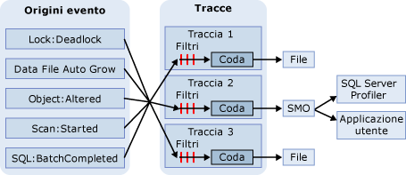

# Traccia SQL
[!INCLUDE[appliesto-ss-xxxx-xxxx-xxx-md](../../includes/appliesto-ss-xxxx-xxxx-xxx-md.md)]
  In Traccia SQL vengono raccolti unicamente gli eventi che rappresentano istanze delle classi di evento elencate nella definizione di traccia. Tali eventi possono essere esclusi dalla traccia tramite un filtro oppure essere inseriti in coda per la relativa destinazione. La destinazione può essere un file o [!INCLUDE[ssNoVersion](../../includes/ssnoversion-md.md)] Management Objects (SMO), che è in grado di utilizzare le informazioni della traccia nelle applicazioni che gestiscono [!INCLUDE[ssNoVersion](../../includes/ssnoversion-md.md)].  
  
> [!IMPORTANT]  
>  [!INCLUDE[ssNoteDepFutureAvoid](../../includes/ssnotedepfutureavoid-md.md)] In alternativa, usare Eventi estesi.  
  
## Vantaggi di Traccia SQL  
 In Microsoft [!INCLUDE[ssNoVersion](../../includes/ssnoversion-md.md)] sono disponibili stored procedure di sistema [!INCLUDE[tsql](../../includes/tsql-md.md)] per la creazione di tracce per un'istanza di [!INCLUDE[ssDEnoversion](../../includes/ssdenoversion-md.md)]. È possibile utilizzare tali stored procedure di sistema all'interno di applicazioni personalizzate per creare tracce in modo manuale anziché tramite [!INCLUDE[ssSqlProfiler](../../includes/sssqlprofiler-md.md)]. Ciò consente di creare applicazioni personalizzate in grado di soddisfare esigenze aziendali specifiche.  
  
## Architettura di Traccia SQL  
 L'origine di un evento può essere qualsiasi origine che genera l'evento di traccia, ad esempio batch [!INCLUDE[tsql](../../includes/tsql-md.md)] o eventi di [!INCLUDE[ssNoVersion](../../includes/ssnoversion-md.md)] quali i deadlock. Per altre informazioni sulle classi degli eventi, vedere [Guida di riferimento alla classe di evento SQL Server](../../relational-databases/event-classes/sql-server-event-class-reference.md). Dopo che è stato generato un evento, se la classe di evento è stata inclusa in una definizione di traccia, le informazioni relative all'evento verranno raccolte dalla traccia. Se nella definizione di traccia sono stati definiti filtri per la classe di evento, tali filtri verranno applicati e le informazioni sull'evento di traccia verranno passate a una coda. Le informazioni di traccia verranno quindi scritte in un file o potranno essere utilizzate da SMO nelle applicazioni, ad esempio [!INCLUDE[ssSqlProfiler](../../includes/sssqlprofiler-md.md)]. Nella figura seguente viene illustrata la modalità di raccolta degli eventi in Traccia SQL durante la creazione di una traccia.  
  
   
  
## Terminologia relativa a Traccia SQL  
 Di seguito vengono definiti i concetti fondamentali di Traccia SQL.  
  
 **Evento**  
 L'occorrenza di un'azione con un'istanza di [!INCLUDE[msCoName](../../includes/msconame-md.md)] [!INCLUDE[ssDEnoversion](../../includes/ssdenoversion-md.md)].  
  
 **Colonna di dati**  
 Attributo di un evento.  
  
 **Classe di evento**  
 Tipo di evento che è possibile tracciare. La classe di evento contiene tutte le colonne di dati che possono essere restituite da un evento.  
  
 **Categoria di eventi**  
 Gruppo di classi di evento correlate.  
  
 **Traccia** (sostantivo)  
 Raccolta di eventi e dati restituiti da [!INCLUDE[ssDE](../../includes/ssde-md.md)].  
  
 **Tracciare** (verbo)  
 Acquisire e monitorare gli eventi in un'istanza di [!INCLUDE[ssNoVersion](../../includes/ssnoversion-md.md)].  
  
 **Definizione della traccia**  
 Raccolta delle classi di evento, delle colonne di dati e dei filtri che identificano i tipi di evento da acquisire in una traccia.  
  
 **Filter**  
 Criteri in base ai quali vengono selezionati gli eventi per una traccia.  
  
 **File di traccia**  
 File creato quando si salva una traccia.  
  
 **Modello**  
 In [!INCLUDE[ssSqlProfiler](../../includes/sssqlprofiler-md.md)], file che definisce le classi di evento e le colonne di dati da acquisire in una traccia.  
  
 **Tabella di traccia**  
 In [!INCLUDE[ssSqlProfiler](../../includes/sssqlprofiler-md.md)], tabella creata quando viene salvata una traccia in una tabella.  
  
## Utilizzare le colonne di dati per descrivere gli eventi restituiti  
 Traccia SQL utilizza le colonne di dati nell'output di traccia per descrivere gli eventi restituiti quando viene eseguita la traccia. Nella tabella seguente vengono descritte le colonne di dati di [!INCLUDE[ssSqlProfiler](../../includes/sssqlprofiler-md.md)] che sono le stesse utilizzate da Traccia SQL e vengono indicate le colonne selezionate per impostazione predefinita.  
  
|Colonna di dati|Numero colonna|Description|  
|-----------------|-------------------|-----------------|  
|**ApplicationName***|10|Nome dell'applicazione client in cui è stata creata la connessione a un'istanza di [!INCLUDE[ssNoVersion](../../includes/ssnoversion-md.md)]. Questa colonna viene popolata con i valori passati dall'applicazione anziché con il nome visualizzato del programma.|  
|**BigintData1**|52|Valore (tipo di dati**bigint** ) che dipende dalla classe di evento specificata nella traccia.|  
|**BigintData2**|53|Valore (tipo di dati**bigint** ) che dipende dalla classe di evento specificata nella traccia.|  
|**Binary Data**|2|Valore binario che dipende dalla classe di evento acquisita nella traccia.|  
|**ClientProcessID***|9|ID assegnato dal computer host al processo in cui è in esecuzione l'applicazione client. Questa colonna di dati viene popolata se l'ID del processo client viene fornito dal client.|  
|**ColumnPermissions**|44|Indica se è stata impostata un'autorizzazione a livello di colonna. È possibile analizzare il testo dell'istruzione per determinare con esattezza quali autorizzazioni sono state impostate per quali colonne.|  
|**CPU**|18|Tempo della CPU in millisecondi utilizzato dall'evento.|  
|**Database ID***|3|ID del database specificato nell'istruzione USE *nome_database* oppure ID del database predefinito, se per una determinata istanza non viene eseguita un'istruzione USE *nome_database*. [!INCLUDE[ssSqlProfiler](../../includes/sssqlprofiler-md.md)] visualizza il nome del database se la colonna di dati **ServerName** è acquisita nella traccia e il server è disponibile. Determinare il valore per un database utilizzando la funzione DB_ID.|  
|**DatabaseName**|35|Nome del database in cui viene eseguita l'istruzione dell'utente.|  
|**DBUserName***|40|Nome utente di [!INCLUDE[ssNoVersion](../../includes/ssnoversion-md.md)] del client.|  
|**Durata**|13|Durata dell'evento in microsecondi.   Il server indica la durata di un evento in microsecondi (un milionesimo o 10-6di secondo) e la quantità di tempo della CPU usato dall'evento in millisecondi (un millesimo o 10-3di secondo). Nell'interfaccia utente grafica di [!INCLUDE[ssSqlProfiler](../../includes/sssqlprofiler-md.md)] il valore della colonna **Duration** viene visualizzato in millisecondi. Tuttavia, quando si salva una traccia in un file o in una tabella di database, il valore della colonna **Duration** viene scritto in microsecondi.|  
|**EndTime**|15|Ora di fine dell'evento. Questa colonna non viene popolata per le classi di evento che fanno riferimento all'avvio di un evento, quali **SQL:BatchStarting** o **SP:Starting**.|  
|**Errore**|31|Numero di errore di un determinato evento. In genere corrisponde al numero di errore archiviato in **sysmessages**.|  
|**EventClass***|27|Tipo di classe di evento acquisita.|  
|**EventSequence**|51|Numero di sequenza dell'evento.|  
|**EventSubClass***|21|Tipo di sottoclasse di evento, che offre informazioni aggiuntive su ogni classe di evento. Ad esempio, i valori della sottoclasse della classe di evento **Execution Warning** rappresentano il tipo di avviso di esecuzione:   **1** = attesa della query. Tempo di attesa delle risorse, ad esempio della memoria, prima dell'esecuzione della query.   **2** = timeout della query. Timeout della query durante l'attesa delle risorse necessarie per l'esecuzione. Questa colonna di dati non viene popolata per tutte le classi di evento.|  
|**GUID**|54|Valore GUID che dipende dalla classe di evento specificata nella traccia.|  
|**FileName**|36|Nome logico del file modificato.|  
|**Handle**|33|Valore intero utilizzato da ODBC, OLE DB o DB-Library per il coordinamento dell'esecuzione con il server.|  
|**HostName***|8|Nome del computer in cui è in esecuzione il client. Questa colonna di dati viene popolata se il nome host viene fornito dal client. Per determinare il nome host, usare la funzione HOST_NAME.|  
|**IndexID**|24|ID dell'indice dell'oggetto interessato dall'evento. Per determinare l'ID di indice di un oggetto, utilizzare la colonna **indid** della tabella di sistema **sysindexes** .|  
|**IntegerData**|25|Valore intero che dipende dalla classe di evento acquisita nella traccia.|  
|**IntegerData2**|55|Valore intero che dipende dalla classe di evento acquisita nella traccia.|  
|**IsSystem**|60|Indica se l'evento si è verificato in un processo di sistema o in un processo utente:   **1** = sistema   **0** = utente|  
|**LineNumber**|5|Contiene il numero della riga contenente l'errore. Per gli eventi associati a istruzioni [!INCLUDE[tsql](../../includes/tsql-md.md)] , come **SP:StmtStarting**, **LineNumber** contiene il numero di riga dell'istruzione nella stored procedure o nel batch.|  
|**LinkedServerName**|45|Nome del server collegato.|  
|**LoginName**|11|Nome dell'account di accesso dell'utente (account di sicurezza di SQL Server o credenziali di accesso di Windows nel formato DOMINIO\Nomeutente).|  
|**LoginSid***|41|ID di sicurezza (SID) dell'utente connesso. Tali informazioni sono disponibili nella vista **sys.server_principals** del database **master** . L'ID è univoco per ogni account di accesso al server.|  
|**MethodName**|47|Nome del metodo OLE DB.|  
|**Mode**|32|Valore intero utilizzato da vari eventi per descrivere uno stato richiesto o ricevuto dall'evento.|  
|**NestLevel**|29|Valore intero che rappresenta i dati restituiti da @@NESTLEVEL.|  
|**NTDomainName***|7|Dominio di Windows a cui appartiene l'utente.|  
|**NTUserName***|6|Nome utente di Windows.|  
|**ObjectID**|22|ID dell'oggetto assegnato dal sistema.|  
|**ObjectID2**|56|ID dell'entità o dell'oggetto correlato, se disponibile.|  
|**ObjectName**|34|Nome dell'oggetto a cui si fa riferimento.|  
|**ObjectType***\*|28|Valore che rappresenta il tipo di oggetto coinvolto nell'evento. Questo valore corrisponde alla colonna **type** nella tabella **sysobjects**.|  
|**Offset**|61|Offset iniziale dell'istruzione nella stored procedure o nel batch.|  
|**OwnerID**|58|Solo per gli eventi di blocco. Tipo dell'oggetto proprietario di un blocco.|  
|**OwnerName**|37|Nome utente del database per il proprietario dell'oggetto.|  
|**ParentName**|59|Nome dello schema contenente l'oggetto.|  
|**Autorizzazioni**|19|Valore intero che rappresenta il tipo di autorizzazioni controllato. I valori possibili sono:   **1** = SELECT ALL   **2** = UPDATE ALL   **4** = REFERENCES ALL   **8** = INSERT   **16** = DELETE   **32** = EXECUTE (solo procedure)   **4096** = SELECT ANY (almeno una colonna)   **8192** = UPDATE ANY   **16384** = REFERENCES ANY|  
|**ProviderName**|46|Nome del provider OLE DB.|  
|**Reads**|16|Numero delle operazioni di lettura del disco logico eseguite dal server in relazione all'evento. Queste operazioni includono tutte le letture dalle tabelle e dai buffer durante l'esecuzione dell'istruzione.|  
|**RequestID**|49|ID della richiesta contenente l'istruzione.|  
|**RoleName**|38|Nome del ruolo applicazione in corso di abilitazione.|  
|**RowCounts**|48|Numero di righe del batch.|  
|**ServerName***|26|Nome dell'istanza di [!INCLUDE[ssNoVersion](../../includes/ssnoversion-md.md)] tracciata.|  
|**SessionLoginName**|64|Nome dell'account di accesso dell'utente che ha avviato la sessione. Se, ad esempio, si esegue la connessione a [!INCLUDE[ssNoVersion](../../includes/ssnoversion-md.md)] con l'account di accesso **Login1** e si esegue un'istruzione con l'account di accesso **Login2**, **SessionLoginName** indica **Login1**, mentre **LoginName** indica **Login2**. In questa colonna vengono visualizzati sia gli account di accesso di [!INCLUDE[ssNoVersion](../../includes/ssnoversion-md.md)] che quelli di Windows.|  
|**Severity**|20|Livello di gravità dell'evento di eccezione.|  
|**SourceDatabaseID**|62|ID del database di origine dell'oggetto.|  
|**SPID**|12|ID del processo server (SPID) che [!INCLUDE[ssNoVersion](../../includes/ssnoversion-md.md)] assegna al processo associato al client.|  
|**SqlHandle**|63|Hash a 64 bit basato sul testo di una query ad hoc oppure ID del database e dell'oggetto di un oggetto SQL. È possibile passare questo valore a **sys.dm_exec_sql_text()** per recuperare il testo SQL associato.|  
|**StartTime***|14|Ora di inizio dell'evento, se disponibile.|  
|**State**|30|Codice dello stato di errore.|  
|**Esito positivo**|23|Indica l'esito dell'evento. I possibili valori sono:   **1** = esito positivo.   **0** = esito negativo   Ad esempio, **1** indica l'esito positivo di un controllo delle autorizzazioni e **0** indica l'esito negativo di tale controllo.|  
|**TargetLoginName**|42|Per le azioni relative a un account di accesso, ad esempio l'aggiunta di un nuovo account di accesso, il nome dell'account di accesso specifico.|  
|**TargetLoginSid**|43|Per le azioni relative a un account di accesso, ad esempio l'aggiunta di un nuovo account di accesso, il SID dell'account di accesso specifico.|  
|**TargetUserName**|39|Per le azioni relative a un utente del database, ad esempio la concessione di un'autorizzazione a un utente, il nome di tale utente.|  
|**TextData**|1|Valore di testo che dipende dalla classe di evento acquisita nella traccia. Se si esegue la traccia di una query con parametri, le variabili visualizzate non includeranno valori di dati nella colonna **TextData** .|  
|**TransactionID**|4|ID della transazione assegnato dal sistema.|  
|**Tipo**|57|Valore intero che dipende dalla classe di evento acquisita nella traccia.|  
|**Writes**|17|Numero di operazioni di scrittura fisiche su disco eseguite dal server in relazione all'evento.|  
|**XactSequence**|50|Token utilizzato per descrivere la transazione corrente.|  
  
 *Queste colonne di dati vengono popolate automaticamente per tutti gli eventi.  
  
 \*\*Per altre informazioni sulla colonna di dati **ObjectType**, vedere [Colonna ObjectType per gli eventi di traccia](../../relational-databases/event-classes/objecttype-trace-event-column.md).  
  
## Attività di Traccia SQL  
  
|Descrizione dell'attività|Argomento|  
|----------------------|-----------|  
|Descrive come creare ed eseguire tracce utilizzando stored procedure Transact-SQL.|[Creare ed eseguire tracce usando stored procedure Transact-SQL](../../relational-databases/sql-trace/create-and-run-traces-using-transact-sql-stored-procedures.md)|  
|Descrive come creare tracce manuali utilizzando stored procedure su un'istanza di [!INCLUDE[ssDEnoversion](../../includes/ssdenoversion-md.md)].|[Creare tracce manuali usando stored procedure](../../relational-databases/sql-trace/create-manual-traces-using-stored-procedures.md)|  
|Descrive come salvare risultati di traccia nel file in cui vengono scritti i risultati di traccia.|[Salvare i risultati della traccia in un file](../../relational-databases/sql-trace/save-trace-results-to-a-file.md)|  
|Descrive come migliorare l'accesso ai dati di traccia usando spazio nella directory **temp** .|[Migliorare l'accesso ai dati della traccia](../../relational-databases/sql-trace/improve-access-to-trace-data.md)|  
|Descrive come utilizzare stored procedure per creare una traccia.|[Creare una traccia &#40;Transact-SQL&#41;](../../relational-databases/sql-trace/create-a-trace-transact-sql.md)|  
|Descrive come utilizzare stored procedure per creare un filtro che recupera solo le informazioni necessarie su un evento di cui è in corso la traccia.|[Impostare un filtro di traccia &#40;Transact-SQL&#41;](../../relational-databases/sql-trace/set-a-trace-filter-transact-sql.md)|  
|Descrive come utilizzare stored procedure per modificare una traccia esistente.|[Modificare una traccia esistente &#40;Transact-SQL&#41;](../../relational-databases/sql-trace/modify-an-existing-trace-transact-sql.md)|  
|Descrive l'utilizzo delle funzionalità integrate per visualizzare una traccia salvata.|[Visualizzare una traccia salvata &#40;Transact-SQL&#41;](../../relational-databases/sql-trace/view-a-saved-trace-transact-sql.md)|  
|Descrive come utilizzare le funzioni predefinite per la visualizzazione delle informazioni sui filtri di traccia.|[Visualizzare informazioni sui filtri &#40;Transact-SQL&#41;](../../relational-databases/sql-trace/view-filter-information-transact-sql.md)|  
|Descrive come utilizzare le stored procedure per eliminare una traccia.|[Eliminare una traccia &#40;Transact-SQL&#41;](../../relational-databases/sql-trace/delete-a-trace-transact-sql.md)|  
|Descrive come ridurre al minimo i costi di prestazioni provocati dall'utilizzo di una traccia.|[Ottimizzare l'uso di Traccia SQL](../../relational-databases/sql-trace/optimize-sql-trace.md)|  
|Descrive come filtrare una traccia per ridurre al minimo l'overhead che si verifica durante una traccia.|[Filtrare una traccia](../../relational-databases/sql-trace/filter-a-trace.md)|  
|Descrive come ridurre la quantità di dati raccolta dalla traccia.|[Limitare le dimensioni di file di traccia e tabelle](../../relational-databases/sql-trace/limit-trace-file-and-table-sizes.md)|  
|Descrive i due modi per pianificare le tracce in Microsoft [!INCLUDE[ssNoVersion](../../includes/ssnoversion-md.md)].|[Pianificare tracce](../../relational-databases/sql-trace/schedule-traces.md)|  
  
## Vedere anche  
 [Modelli e autorizzazioni di SQL Server Profiler](../../tools/sql-server-profiler/sql-server-profiler-templates-and-permissions.md)   
 [Guida alla programmazione di SQL Server Management Objects &#40;SMO&#41;](../../relational-databases/server-management-objects-smo/sql-server-management-objects-smo-programming-guide.md)  
  
  
