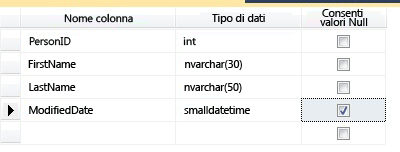
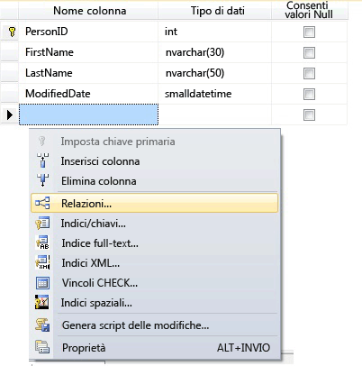
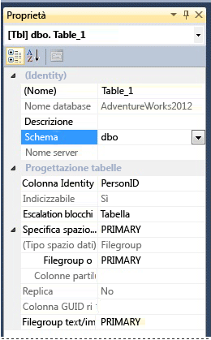

# <a name="create-tables-database-engine"></a>Creare tabelle (motore di database)
[!INCLUDE[tsql-appliesto-ss2016-all-md](../../includes/tsql-appliesto-ss2016-all-md.md)]

  È possibile creare una nuova tabella, assegnarle un nome e aggiungerla a un database esistente usando [!INCLUDE[ssManStudioFull](../../includes/ssmanstudiofull-md.md)] o [!INCLUDE[tsql](../../includes/tsql-md.md)].  
  

  
##  <a name="Permissions"></a> Verificare prima le autorizzazioni.  
Questa attività richiede l'autorizzazione CREATE TABLE per il database e l'autorizzazione ALTER per lo schema in cui viene creata la tabella.  
  
 Se tutte le colonne dell'istruzione CREATE TABLE sono definite come tipo CLR definito dall'utente, è necessario che l'utente sia il proprietario del tipo o disponga dell'autorizzazione REFERENCES.  
  
 Se a una colonna nell'istruzione CREATE TABLE è associata una raccolta di XML Schema, è necessario che l'utente sia il proprietario della raccolta di XML Schema o disponga dell'autorizzazione REFERENCES.  
  
 
## <a name="using-table-designer"></a>Uso di Progettazione tabelle  
  
1.  In SSMS, in **Esplora oggetti**, connettersi all'istanza del [!INCLUDE[ssDE](../../includes/ssde-md.md)] contenente il database da modificare.  
  
2.  In **Esplora oggetti**espandere il nodo **Database** , quindi espandere il database in cui sarà contenuta la nuova tabella.  
  
3.  In Esplora oggetti fare clic con il pulsante destro del mouse sul nodo **Tabelle** del database, quindi su **Nuova tabella**.  
  
4.  Digitare i nomi delle colonne, scegliere i tipi di dati e indicare se sono consentiti i valori Null per ogni colonna come visualizzato nell'illustrazione riportata di seguito:  
  
       
  
5.  Per specificare più proprietà di una colonna, ad esempio i valori di colonna calcolata o Identity, fare clic sulla colonna e nella scheda delle proprietà delle colonne scegliere le proprietà appropriate. Per altre informazioni sulle proprietà delle colonne, vedere [Proprietà delle colonne delle tabelle &#40;SQL Server Management Studio&#41;](../../relational-databases/tables/table-column-properties-sql-server-management-studio.md).  
  
6.  Per specificare una colonna come chiave primaria, fare clic con il pulsante destro del mouse sulla colonna e selezionare **Imposta chiave primaria**. Per altre informazioni, vedere [Create Primary Keys](../../relational-databases/tables/create-primary-keys.md).  
  
7.  Per creare relazioni di chiave esterna, vincoli CHECK o indici, fare clic con il pulsante destro del mouse nel riquadro Progettazione tabelle e selezionare un oggetto nell'elenco, come visualizzato nell'illustrazione riportata di seguito:  
  
       
  
     Per ulteriori informazioni su questi oggetti, vedere [Create Foreign Key Relationships](../../relational-databases/tables/create-foreign-key-relationships.md), [Create Check Constraints](../../relational-databases/tables/create-check-constraints.md) e [Indexes](../../relational-databases/indexes/indexes.md).  
  
8.  Per impostazione predefinita, la tabella è inclusa nello schema **dbo** . Per specificare uno schema diverso per la tabella, fare clic con il pulsante destro del mouse nel riquadro Progettazione tabelle e selezionare **Proprietà** come mostrato nell'illustrazione riportata di seguito. Nell'elenco a discesa **Schema** selezionare lo schema appropriato.  
  
       
  
     Per ulteriori informazioni sugli schemi, vedere [Create a Database Schema](../../relational-databases/security/authentication-access/create-a-database-schema.md).  
  
9. Dal menu **File** scegliere **Salva** *nome tabella*.  
  
10. Nella finestra di dialogo **Scegli nome** digitare un nome per la tabella, quindi fare clic su **OK**.  
  
11. Per visualizzare la nuova tabella, in **Esplora oggetti**espandere il nodo **Tabelle** e premere **F5** per aggiornare l'elenco di oggetti. La nuova tabella viene visualizzata nell'elenco di tabelle.  
  
##  <a name="TsqlProcedure"></a> Uso di Transact-SQL  
  
## <a name="using-query-editor"></a>Uso dell'editor di query  
  
1.  In **Esplora oggetti**connettersi a un'istanza del [!INCLUDE[ssDE](../../includes/ssde-md.md)].  
  
2.  Sulla barra Standard fare clic su **Nuova query**.  
  
3.  Copiare e incollare l'esempio seguente nella finestra delle query e fare clic su **Esegui**.  
  
    ```  
    CREATE TABLE dbo.PurchaseOrderDetail  
    (  
        PurchaseOrderID int NOT NULL  
        ,LineNumber smallint NOT NULL  
        ,ProductID int NULL  
        ,UnitPrice money NULL  
        ,OrderQty smallint NULL  
        ,ReceivedQty float NULL  
        ,RejectedQty float NULL  
        ,DueDate datetime NULL  
    );  
    ```  
  
 Per altri esempi, vedere [CREATE TABLE &#40;Transact-SQL&#41;](../../t-sql/statements/create-table-transact-sql.md).  
  
  
