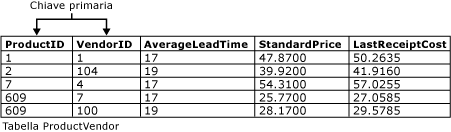

# Vincoli di chiavi primarie ed esterne
[!INCLUDE[tsql-appliesto-ss2016-asdb-xxxx-xxx-md](../../includes/tsql-appliesto-ss2016-asdb-xxxx-xxx-md.md)]

  Le chiavi primarie e le chiavi esterne sono due tipi di vincoli che possono essere utilizzati per applicare l'integrità dei dati nelle tabelle di [!INCLUDE[ssNoVersion](../../includes/ssnoversion-md.md)] . Si tratta di importanti oggetti di database.  
  
 In questo argomento sono contenute le sezioni seguenti.  
  
 [Vincoli di chiave primaria](../../relational-databases/tables/primary-and-foreign-key-constraints.md#PKeys)  
  
 [Foreign Key Constraints](../../relational-databases/tables/primary-and-foreign-key-constraints.md#FKeys)  
  
 [Attività correlate](../../relational-databases/tables/primary-and-foreign-key-constraints.md#Tasks)  
  
##   Vincoli di chiave primaria  
 Una tabella include in genere una colonna o una combinazione di colonne i cui valori identificano in modo univoco ogni riga della tabella. Queste colonne sono denominate chiave primaria e garantiscono l'integrità di entità della tabella. Poiché i vincoli di chiave primaria garantiscono l'univocità dei dati, vengono spesso definiti per la colonna Identity.  
  
 Quando si specifica un vincolo di chiave primaria per una tabella, [!INCLUDE[ssDE](../../includes/ssde-md.md)] assicura l'univocità dei dati creando automaticamente un indice univoco per le colonne chiave primaria. Questo indice consente inoltre di accedere rapidamente ai dati quando si utilizza la chiave primaria nelle query. Se un vincolo di chiave primaria viene definito per più colonne, possono essere presenti valori duplicati nella stessa colonna, ma ogni combinazione di valori di tutte le colonne nella definizione del vincolo di chiave primaria deve essere univoca.  
  
 Le colonne **ProductID** e **VendorID** nella tabella **Purchasing.ProductVendor** costituiscono un vincolo di chiave primaria composto per la tabella, come illustrato nella figura seguente. Ciò assicura che ogni riga nella tabella **ProductVendor** contenga una combinazione univoca di **ProductID** e **VendorID**. e impedisce l'inserimento di righe duplicate.  
  
   
  
-   Una tabella può includere un solo vincolo di chiave primaria.  
  
-   Una chiave primaria non può superare 16 colonne e una lunghezza della chiave totale di 900 byte.  
  
-   Se l'indice viene generato da un vincolo di chiave primaria, nella tabella sarà possibile creare non più di 999 indici non cluster e di 1 indice cluster.  
  
-   Nel caso in cui per un vincolo di chiave primaria non si specifichi CLUSTERED né NONCLUSTERED, verrà utilizzato automaticamente il valore CLUSTERED se nella tabella non sono specificati indici cluster.  
  
-   Tutte le colonne specificate in un vincolo di chiave primaria devono essere definite come NOT NULL. Se non si specifica il supporto di valori Null, per tutte le colonne coinvolte in un vincolo di chiave primaria viene impostato NOT NULL.  
  
-   Se si definisce una chiave primaria in una colonna di tipo CLR definito dall'utente, è necessario che l'implementazione del tipo supporti l'ordinamento binario.  
  
##   Foreign Key Constraints  
 Per chiave esterna si intende una colonna o combinazione di colonne utilizzata per stabilire e applicare un collegamento tra i dati di due tabelle per controllare i dati che possono essere archiviati nella tabella della chiave esterna. In un riferimento a una chiave esterna viene creato un collegamento tra tabelle quando le colonne contenenti il valore della chiave primaria per una tabella vengono utilizzate come riferimento dalle colonne di un'altra tabella. Questa colonna diventa una chiave esterna nella seconda tabella.  
  
 Nella tabella **Sales.SalesOrderHeader** , ad esempio, è incluso un collegamento di chiave esterna alla tabella **Sales.SalesPerson** , in quanto esiste una relazione logica tra gli ordini di vendita e i venditori. La colonna **SalesPersonID** della tabella **SalesOrderHeader** corrisponde alla colonna chiave primaria della tabella **SalesPerson** . La colonna **SalesPersonID** della tabella **SalesOrderHeader** rappresenta la chiave esterna alla tabella **SalesPerson** . Creando questa relazione di chiave esterna, non è possibile inserire un valore per **SalesPersonID** nella tabella **SalesOrderHeader** se non esiste già nella tabella **SalesPerson** .  
  
 Una tabella può fare riferimento a un massimo di 253 altre tabelle e colonne come chiavi esterne (riferimenti in uscita). [!INCLUDE[ssSQL15](../../includes/sssql15-md.md)] incrementa da 253 a 10.000 il limite per il numero di altre tabelle e colonne che possono fare riferimento alle colonne in una singola tabella (riferimenti in ingresso). (richiede almeno il livello di compatibilità 130). All'incremento vengono applicate le seguenti restrizioni:  
  
-   I riferimenti di chiave esterna maggiori di 253 sono supportati solo per le operazioni DELETE DML. Le operazioni UPDATE e MERGE non sono supportate.  
  
-   Una tabella con un riferimento di chiave esterna a se stessa è comunque limitata a 253 riferimenti di chiave esterna.  
  
-   I riferimenti di chiave esterna maggiori di 253 non sono attualmente disponibili per gli indici columnstore, le tabelle ottimizzate per la memoria, Estensione database o tabelle di chiave esterna partizionate.  
  
### Indici nei vincoli di chiave esterna  
 A differenza di quanto avviene per i vincoli di chiave primaria, la creazione di un vincolo di chiave esterna non determina automaticamente la creazione di un indice corrispondente. La creazione manuale di un indice in una chiave esterna, tuttavia, rappresenta spesso un'operazione utile per i motivi seguenti:  
  
-   Le colonne chiave esterna vengono in genere utilizzate nei criteri di join quando i dati provenienti da tabelle correlate vengono riuniti in query confrontando le colonne nel vincolo di chiave esterna di una tabella con le colonne chiave primaria o univoca nell'altra tabella. Un indice consente a [!INCLUDE[ssDE](../../includes/ssde-md.md)] di trovare rapidamente i dati correlati nella tabella della chiave esterna. La creazione di questo indice, tuttavia, non è un requisito necessario. È possibile riunire i dati di due tabelle correlate anche se non è stato definito alcun vincolo di chiave primaria o di chiave esterna tra le tabelle, ma una relazione di chiave esterna tra due tabelle indica che le due tabelle sono state ottimizzate per essere riunite in una query che utilizza le chiavi come criteri.  
  
-   Le modifiche apportate ai vincoli di chiave primaria vengono confrontate con i vincoli di chiave esterna nelle tabelle correlate.  
  
### Integrità referenziale  
 Benché lo scopo primario di un vincolo di chiave esterna consista nel controllare i dati che è possibile archiviare nella tabella della chiave esterna, tale vincolo controlla inoltre le modifiche apportate ai dati nella tabella della chiave primaria. Se, ad esempio, la riga relativa a un venditore viene eliminata dalla tabella **Sales.SalesPerson** e l'ID del venditore viene usato per gli ordini di vendita inclusi nella tabella **Sales.SalesOrderHeader** , viene interrotta l'integrità relazionale tra le due tabelle. Gli ordini di vendita del venditore eliminato risultano isolati (orfani) nella tabella **SalesOrderHeader** e privi di un collegamento ai dati inclusi nella tabella **SalesPerson** .  
  
 Un vincolo di chiave esterna impedisce il verificarsi di tale situazione e applica l'integrità referenziale assicurando che non sia possibile apportare modifiche alla tabella della chiave primaria se tali modifiche annullano il collegamento ai dati della tabella della chiave esterna. Se si tenta di eliminare la riga in una tabella della chiave primaria oppure di modificare un valore della chiave primaria, l'azione avrà esito negativo se il valore della chiave primaria eliminato o modificato corrisponde a un valore nel vincolo di chiave esterna di un'altra tabella. Per modificare o eliminare correttamente una riga in un vincolo di chiave esterna, è necessario innanzitutto modificare o eliminare i dati della chiave esterna nella tabella della chiave esterna e collegare quindi la chiave esterna ad altri dati della chiave primaria.  
  
#### Integrità referenziale di propagazione  
 I vincoli di integrità referenziale di propagazione consentono di definire le operazioni eseguite da [!INCLUDE[ssDE](../../includes/ssde-md.md)] quando un utente tenta di eliminare o aggiornare una chiave alla quale fa riferimento una chiave esterna. È possibile definire le azioni di propagazione seguenti.  
  
 NO ACTION  
 Il [!INCLUDE[ssDE](../../includes/ssde-md.md)] genera un errore e viene eseguito il rollback dell'operazione di eliminazione o di aggiornamento sulla riga nella tabella padre.  
  
 CASCADE  
 Le righe corrispondenti vengono aggiornate o eliminate nella tabella di riferimento quando la riga viene aggiornata o eliminata nella tabella padre. Non è possibile specificare la clausola CASCADE se nella chiave esterna o nella chiave a cui si fa riferimento è presente una colonna **timestamp** . Non è possibile specificare ON DELETE CASCADE per una tabella in cui è presente un trigger INSTEAD OF DELETE. Non è possibile specificare ON UPDATE CASCADE per tabelle in cui sono presenti trigger INSTEAD OF UPDATE.  
  
 SET NULL  
 Tutti i valori che costituiscono la chiave esterna vengono impostati su NULL quando viene aggiornata o eliminata la riga corrispondente nella tabella padre. Per l'esecuzione di questo vincolo, è necessario che le colonne chiave esterna ammettano valori Null. Il vincolo non può essere specificato per tabelle in cui sono presenti trigger INSTEAD OF UPDATE.  
  
 SET DEFAULT  
 Tutti i valori che compongono la chiave esterna vengono impostati sui rispettivi valori predefiniti se viene eliminata o aggiornata la riga corrispondente nella tabella padre. Per l'esecuzione di questo vincolo, è necessario che per tutte le colonne chiave esterna siano definiti valori predefiniti. Se una colonna ammette valori Null e non viene impostato un valore predefinito esplicito, NULL diventa il valore predefinito implicito della colonna. Il vincolo non può essere specificato per tabelle in cui sono presenti trigger INSTEAD OF UPDATE.  
  
 È possibile combinare le azioni CASCADE, SET NULL, SET DEFAULT e NO ACTION in tabelle con relazioni referenziali reciproche. Se [!INCLUDE[ssDE](../../includes/ssde-md.md)] rileva l'azione NO ACTION, l'operazione viene arrestata e viene eseguito il rollback delle azioni CASCADE, SET NULL e SET DEFAULT correlate. Quando un'istruzione DELETE genera una combinazione di azioni CASCADE, SET NULL, SET DEFAULT e NO ACTION, tutte le azioni CASCADE, SET NULL e SET DEFAULT vengono applicate prima che il [!INCLUDE[ssDE](../../includes/ssde-md.md)] verifichi l'esistenza di azioni NO ACTION.  
  
### Trigger e operazioni referenziali di propagazione  
 Le operazioni referenziali di propagazione attivano i trigger AFTER UPDATE o AFTER DELETE nel modo seguente:  
  
-   Vengono eseguite per prime tutte le operazioni referenziali di propagazione determinate direttamente dall'istruzione DELETE o UPDATE originale.  
  
-   Se nelle tabelle interessate sono stati definiti trigger AFTER, tali trigger vengono attivati dopo che sono state eseguite tutte le operazioni di propagazione. L'ordine di attivazione dei trigger è inverso rispetto all'ordine delle operazioni di propagazione. Se in una tabella sono presenti più trigger, tali trigger vengono attivati in ordine casuale a meno che per la tabella non sia stato specificato un primo o un ultimo trigger dedicato. L'ordine viene specificato usando [sp_settriggerorder](../../relational-databases/system-stored-procedures/sp-settriggerorder-transact-sql.md).  
  
-   Se dalla tabella che rappresenta la destinazione diretta di un'azione UPDATE o DELETE vengono originate più catene di propagazione, l'ordine di attivazione dei rispettivi trigger non è specificato. Prima che una catena inizi ad attivare i propri trigger è tuttavia necessario che un'altra catena abbia completato l'attivazione di tutti i relativi trigger.  
  
-   Un trigger AFTER presente nella tabella di destinazione diretta di un'azione UPDATE o DELETE viene attivato indipendentemente dal fatto che influisca o meno su qualsiasi riga. In questo caso, la propagazione non avrà effetti su nessun'altra tabella.  
  
-   Se uno dei trigger precedenti esegue operazioni UPDATE o DELETE su altre tabelle, tali operazioni possono avviare catene di propagazione secondarie che vengono elaborate per un'operazione UPDATE o DELETE alla volta dopo che tutti i trigger di tutte le catene primarie sono stati attivati. È possibile ripetere il processo in modo ricorsivo per le operazioni UPDATE o DELETE successive.  
  
-   L'esecuzione di operazioni CREATE, ALTER, DELETE o di altre operazioni DDL (Data Definition Language) nei trigger può comportare l'attivazione dei trigger DDL e la conseguente esecuzione di operazioni DELETE o UPDATE che avviano catene e trigger di propagazione aggiuntivi.  
  
-   Se in una catena di operazioni referenziali di propagazione si verifica un errore, verrà generato un errore, non verrà attivato alcun trigger AFTER nella catena specifica e verrà eseguito il rollback dell'operazione DELETE o UPDATE che ha creato la catena.  
  
-   Una tabella in cui è presente un trigger INSTEAD OF non può inoltre includere un clausola REFERENCES che specifica un'operazione di propagazione. Un trigger AFTER in una tabella di destinazione di un'operazione di propagazione può tuttavia eseguire un'istruzione INSERT, UPDATE o DELETE su un'altra tabella o vista che attiva un trigger INSTEAD OF definito nell'oggetto specifico.  
  
##   Attività correlate  
 Nella tabella seguente vengono elencate le attività comuni associate a vincoli di chiave primaria e di chiave esterna.  
  
|Attività|Argomento|  
|----------|-----------|  
|Viene descritto come creare una chiave primaria.|[Creazione di chiavi primarie](../../relational-databases/tables/create-primary-keys.md)|  
|Si descrive come eliminare una chiave primaria.|[Eliminazione di chiavi primarie](../../relational-databases/tables/delete-primary-keys.md)|  
|Si descrive come modificare una chiave primaria.|[Modifica di chiavi primarie](../../relational-databases/tables/modify-primary-keys.md)|  
|Si descrive come creare relazioni di chiave esterna|[Creare relazioni di chiave esterna](../../relational-databases/tables/create-foreign-key-relationships.md)|  
|Si descrive come modificare relazioni di chiave esterna.|[Modifica di relazioni di chiave esterna](../../relational-databases/tables/modify-foreign-key-relationships.md)|  
|Si descrive come eliminare relazioni di chiave esterna.|[Eliminazione di relazioni di chiave esterna](../../relational-databases/tables/delete-foreign-key-relationships.md)|  
|Viene descritto come visualizzare le proprietà di chiave esterna.|[Visualizzare Proprietà di chiave esterna](../../relational-databases/tables/view-foreign-key-properties.md)|  
|Viene descritto come disabilitare vincoli di chiave esterna per la replica.|[Disabilitare i vincoli di chiave esterna per la replica](../../relational-databases/tables/disable-foreign-key-constraints-for-replication.md)|  
|Viene descritto come disabilitare un vincolo di chiave esterna durante l'istruzione INSERT o UPDATE.|[Disabilitazione di vincoli di chiave esterna con le istruzioni INSERT e UPDATE](../../relational-databases/tables/disable-foreign-key-constraints-with-insert-and-update-statements.md)|  
  
  
