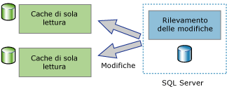

# Informazioni sul rilevamento delle modifiche (SQL Server)
[!INCLUDE[tsql-appliesto-ss2008-asdb-xxxx-xxx-md](../../includes/tsql-appliesto-ss2008-asdb-xxxx-xxx-md.md)]

  Il rilevamento delle modifiche è una soluzione semplice che consente di rilevare in modo efficiente le modifiche per le applicazioni. Per consentire alle applicazioni di eseguire una query per le modifiche apportate ai dati in un database e di accedere alle informazioni correlate, gli sviluppatori di applicazioni dovevano in genere implementare meccanismi di rilevamento delle modifiche personalizzati. La creazione di tali meccanismi era di solito impegnativa e comportava frequentemente l'uso di una combinazione di trigger, colonne **timestamp** , nuove tabelle per archiviare le informazioni di rilevamento e processi di pulizia personalizzati.  
  
 A tipi diversi di applicazioni sono associati requisiti diversi correlati alla quantità di informazioni necessarie relative alle modifiche. Il rilevamento delle modifiche può essere utilizzato nelle applicazioni per fornire risposte alle domande seguenti relative alle modifiche apportate a una tabella utente:  
  
-   Quali righe sono state modificate per una tabella utente?  
  
    -   È necessario sapere solo che una riga è stata modificata. Non è necessario sapere il numero di modifiche apportate alla riga o i valori di qualsiasi modifica intermedia.  
  
    -   Gli ultimi dati possono essere ottenuti direttamente dalla tabella per cui viene eseguito il rilevamento.  
  
-   Una riga è stata modificata?  
  
    -   È necessario sapere che una riga è stata modificata. Le informazioni sulla modifica devono inoltre essere disponibili e devono essere state registrate nel momento in cui la modifica è stata apportata nella stessa transazione.  
  
> [!NOTE]  
>  Se per un'applicazione è necessario conoscere le informazioni relative a tutte le modifiche apportate e i valori intermedi dei dati modificati, potrebbe risultare appropriato utilizzare la funzionalità Change Data Capture anziché il rilevamento delle modifiche. Per altre informazioni, vedere [Informazioni su Change Data Capture &#40;SQL Server&#41;](../../relational-databases/track-changes/about-change-data-capture-sql-server.md).  
  
## Applicazioni di sincronizzazione unidirezionale e bidirezionale  
 Le applicazioni che devono sincronizzare dati con un'istanza del [!INCLUDE[ssDEnoversion](../../includes/ssdenoversion-md.md)] devono poter eseguire query per le modifiche. Il rilevamento delle modifiche può essere utilizzato come base per le applicazioni di sincronizzazione unidirezionale e bidirezionale.  
  
### Applicazioni di sincronizzazione unidirezionale  
 Le applicazioni di sincronizzazione unidirezionale, ad esempio un'applicazione client o un'applicazione di memorizzazione nella cache di livello medio, possono essere compilate in modo che utilizzino il rilevamento delle modifiche. Come illustrato nella figura seguente, per un'applicazione di memorizzazione nella cache è necessario che i dati siano archiviati nel [!INCLUDE[ssDE](../../includes/ssde-md.md)] e siano memorizzati nella cache in altri archivi dati. L'applicazione deve essere in grado di mantenere aggiornata la cache con qualsiasi modifica apportata alle tabelle di database. Non è presente alcuna modifica da passare nuovamente al [!INCLUDE[ssDE](../../includes/ssde-md.md)].  
  
   
  
### Applicazioni di sincronizzazione bidirezionale  
 Anche le applicazioni di sincronizzazione bidirezionale possono essere compilate in modo che utilizzino il rilevamento delle modifiche. In questo scenario i dati contenuti in un'istanza del [!INCLUDE[ssDE](../../includes/ssde-md.md)] sono sincronizzati con uno o più archivi dati. I dati in tali archivi possono essere aggiornati e le modifiche devono essere sincronizzate nuovamente nel [!INCLUDE[ssDE](../../includes/ssde-md.md)].  
  
   
  
 Un valido esempio di applicazione di sincronizzazione bidirezionale è un'applicazione che esegue occasionalmente una connessione. In questo caso un'applicazione client esegue una query e aggiorna un archivio locale. Quando tra un client e un server è disponibile una connessione, l'applicazione si sincronizzerà con un server e i dati fluiscono in entrambe le direzioni.  
  
 Le applicazioni di sincronizzazione bidirezionale devono essere in grado di rilevare i conflitti. Un conflitto potrebbe verificarsi se gli stessi dati sono stati modificati in entrambi gli archivi dati nel periodo di tempo che intercorre tra le sincronizzazioni. Grazie alla possibilità di rilevare conflitti, un'applicazione può garantire che le modifiche non vadano perse.  
  
## Funzionamento del rilevamento delle modifiche  
 Per configurare il rilevamento delle modifiche, è possibile utilizzare istruzioni DDL o [!INCLUDE[ssManStudioFull](../../includes/ssmanstudiofull-md.md)]. Per altre informazioni, vedere [Abilitare e disabilitare il rilevamento delle modifiche &#40;SQL Server&#41;](../../relational-databases/track-changes/enable-and-disable-change-tracking-sql-server.md). Per rilevare le modifiche, è necessario innanzitutto abilitare il rilevamento delle modifiche per il database, quindi abilitarlo per le tabelle desiderate all'interno del database stesso. La definizione della tabella non deve essere modificata in alcun modo e non viene creato alcun trigger.  
  
 Una volta configurato il rilevamento delle modifiche per una tabella, qualsiasi istruzione DML che influisce sulle righe nella tabella causerà la registrazione delle informazioni sul rilevamento delle modifiche per ciascuna riga modificata. Per eseguire query per le righe che sono state modificate e per ottenere informazioni sulle modifiche, è possibile usare le [funzioni di rilevamento delle modifiche](../../relational-databases/system-functions/change-tracking-functions-transact-sql.md).  
  
 I valori della colonna chiave primaria costituiscono le sole informazioni presenti nella tabella con rilevamento registrate con le informazioni relative alle modifiche. Tali valori identificano le righe modificate. Per ottenere i dati più recenti per tali righe, un'applicazione può utilizzare i valori della colonna chiave primaria per creare un join tra la tabella di origine e quella con rilevamento.  
  
 È inoltre possibile utilizzare il rilevamento delle modifiche per ottenere informazioni sulla modifica apportata a ogni riga, ad esempio il tipo di operazione DML che ha provocato la modifica (inserimento, aggiornamento o eliminazione) o le colonne modificate come parte di un'operazione di aggiornamento. 
 
## Pulizia rilevamento modifiche
Le informazioni del rilevamento modifiche per tutte le tabelle (abilitata al rilevamento modifiche) vengono archiviate in un rowstore in memoria. A ogni checkpoint, i dati sul rilevamento delle modifiche associati a ogni tabella abilitata al rilevamento modifiche vengono scaricati dal rowstore in memoria alla tabella interna su disco corrispondente. Durante il checkpoint, dopo lo spostamento delle righe nelle tabelle su disco, il rowstore in memoria viene inoltre ripulito.

Ogni tabella abilitata al rilevamento modifiche ha una tabella su disco interna, usata dalle funzioni di rilevamento modifiche per determinare la versione di modifica e le righe modificate da una specifica versione. Ogni volta che il thread **auto cleanup** si attiva, analizza tutti i database utente nell'istanza di SQL Server allo scopo di identificare i database abilitati al rilevamento modifiche. In base al periodo di memorizzazione impostato per il database, ogni tabella interna su disco viene ripulita dai record scaduti.

Nei Service Pack per [!INCLUDE[ssSQL14](../../includes/sssql14-md.md)] e [!INCLUDE[ssSQL15](../../includes/sssql15-md.md)] è stata aggiunta una stored procedure per la pulizia manuale delle tabelle interne di rilevamento modifiche. Altre informazioni sulla stored procedure sono disponibili nell'articolo [KB173157](https://support.microsoft.com/help/3173157/adds-a-stored-procedure-for-the-manual-cleanup-of-the-change-tracking-side-table-in-sql-server-2014-sp2-or-2016-sp1). 
  
## Vedere anche  
 [Abilitare e disabilitare il rilevamento delle modifiche &#40;SQL Server&#41;](../../relational-databases/track-changes/enable-and-disable-change-tracking-sql-server.md)   
 [Utilizzare il rilevamento delle modifiche &#40;SQL Server&#41;](../../relational-databases/track-changes/work-with-change-tracking-sql-server.md)   
 [Gestire il rilevamento delle modifiche &#40;SQL Server&#41;](../../relational-databases/track-changes/manage-change-tracking-sql-server.md)   
 [Rilevare le modifiche ai dati &#40;SQL Server&#41;](../../relational-databases/track-changes/track-data-changes-sql-server.md)  
  
  
