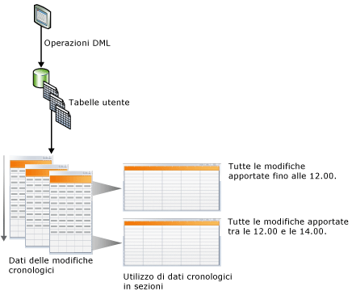
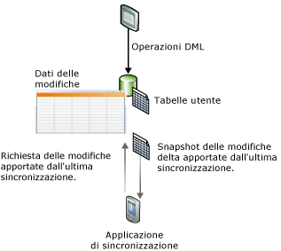

# Rilevare le modifiche ai dati (SQL Server)
[!INCLUDE[tsql-appliesto-ss2008-asdb-xxxx-xxx-md](../../includes/tsql-appliesto-ss2008-asdb-xxxx-xxx-md.md)]
  [!INCLUDE[ssCurrent](../../includes/sscurrent-md.md)] offre due funzionalità che consentono di tener traccia delle modifiche ai dati in un database: [Change Data Capture](#Capture) e [Rilevamento modifiche](#Tracking). Tali funzionalità consentono alle applicazioni di determinare le modifiche DML (operazioni di inserimento, aggiornamento ed eliminazione) apportate alle tabelle utente in un database. Change Data Capture e Rilevamento modifiche possono essere abilitati sullo stesso database, non sono richieste considerazioni speciali. Per le edizioni di [!INCLUDE[ssNoVersion](../../includes/ssnoversion-md.md)] che supportano Change Data Capture e Rilevamento modifiche, vedere [Funzionalità supportate dalle edizioni di SQL Server 2016](~/sql-server/editions-and-supported-features-for-sql-server-2016.md). Il rilevamento delle modifiche è supportato dal [!INCLUDE[ssSDS_md](../../includes/sssds-md.md)].
  
## Vantaggi dall'utilizzo di Change Data Capture o Rilevamento modifiche  
 Un importante requisito per l'efficienza di alcune applicazioni è costituito dalla possibilità di eseguire query relative a dati che sono stati modificati in un database. In genere, per determinare le modifiche apportate ai dati, gli sviluppatori di applicazioni devono implementare un metodo di rilevamento personalizzato utilizzando una combinazione di trigger, colonne di tipo timestamp e tabelle aggiuntive. La creazione di queste applicazioni comporta in genere molte operazioni di implementazione e rende necessari aggiornamenti di schemi, provocando spesso un elevato overhead delle prestazioni.  
  
 L'utilizzo di Change Data Capture o Rilevamento nelle applicazioni per tenere traccia delle modifiche apportate a un database rispetto allo sviluppo di una soluzione personalizzata, presenta i vantaggi indicati di seguito.  
  
-   Riduzione del tempo necessario per lo sviluppo. Poiché la funzionalità è disponibile in [!INCLUDE[ssCurrent](../../includes/sscurrent-md.md)], non è necessario sviluppare una soluzione personalizzata.  
  
-   Modifiche dello schema non necessarie. Non è necessario aggiungere colonne e trigger o creare una tabella laterale in cui tenere traccia delle righe eliminate o in cui archiviare informazioni sul rilevamento delle modifiche se alle tabelle utente non possono essere aggiunte colonne.  
  
-   Meccanismo di pulizia predefinito. La pulizia relativa al rilevamento delle modifiche viene eseguita automaticamente in background. Non è più necessario eseguire una pulizia personalizzata per dati archiviati in una tabella laterale.  
  
-   Le funzioni sono fornite per ottenere informazioni sulle modifiche.  
  
-   Overhead basso per le operazioni DML. Al rilevamento delle modifiche sincrono è sempre associato un livello di overhead. L'utilizzo del rilevamento delle modifiche può consentire la riduzione dell'overhead, che risulterà in genere minore rispetto a quello relativo all'utilizzo di soluzioni alternative, soprattutto soluzioni per cui è necessario usare i trigger.  
  
-   Utilizzo delle transazioni di cui è stato eseguito il commit come base per il rilevamento delle modifiche. L'ordine delle modifiche si basa sull'ora in cui è stato eseguito il commit della transazione. In questo modo è possibile ottenere risultati affidabili quando sono presenti transazioni sovrapposte e con tempi di esecuzione prolungati. Per la gestione di questi scenari, è necessario progettare specificamente soluzioni personalizzate che usano valori **timestamp** .  
  
-   Sono disponibili strumenti standard che possono essere utilizzati per configurare e gestire. [!INCLUDE[ssCurrent](../../includes/sscurrent-md.md)] offre istruzioni DDL standard, [!INCLUDE[ssManStudioFull](../../includes/ssmanstudiofull-md.md)], viste del catalogo e autorizzazioni di sicurezza.  
  
## Differenze tra le funzionalità di Change Data Capture e del rilevamento delle modifiche  
 Nella tabella seguente vengono elencate le differenze tra le funzionalità di Change Data Capture e del rilevamento delle modifiche. Il meccanismo di rilevamento in Change Data Capture prevede un'acquisizione asincrona delle modifiche dal log delle transazioni in modo che le modifiche siano disponibili dopo l'operazione DML. Nel rilevamento delle modifiche il meccanismo prevede la registrazione sincrona di modifiche in linea con le operazioni DML in modo che le informazioni sulle modifiche siano disponibili immediatamente.  
  
|Funzionalità|Change Data Capture|Rilevamento modifiche|  
|-------------|-------------------------|---------------------|  
|**Modifiche rilevate**|||  
|Modifiche DML|Sì|Sì|  
|**Informazioni rilevate**|||  
|Dati cronologici|Sì|no|  
|Modifiche apportate a una colonna|Sì|Sì|  
|Tipo DML|Sì|Sì|  
  
##   Change Data Capture  
 Change Data Capture fornisce informazioni cronologiche sulle modifiche per una tabella utente acquisendo l'esecuzione di modifiche DML e le modifiche effettive apportate ai dati. Le modifiche vengono acquisite utilizzando un processo asincrono che legge il log delle transazioni senza un impatto significativo sul sistema.  
  
 Come illustrato nella figura seguente, le modifiche apportate alle tabelle utente vengono acquisite nella tabella delle modifiche corrispondente. In tali tabelle è disponibile una vista cronologica delle modifiche nel tempo. Le funzioni di [Change Data Capture](../../relational-databases/system-functions/change-data-capture-functions-transact-sql.md) disponibili in [!INCLUDE[ssNoVersion](../../includes/ssnoversion-md.md)] consentono di usare i dati delle modifiche in modo semplice e sistematico.  
  
   
  
### Modello di sicurezza  
 In questa sezione viene descritto il modello di sicurezza di Change Data Capture.  
  
 **Configurazione e amministrazione**  
 Per abilitare o disabilitare la funzionalità Change Data Capture per un database, il chiamante di [sys.sp_cdc_enable_db &#40;Transact-SQL&#41;](../../relational-databases/system-stored-procedures/sys-sp-cdc-enable-db-transact-sql.md) o [sys.sp_cdc_disable_db &#40;Transact-SQL&#41;](../../relational-databases/system-stored-procedures/sys-sp-cdc-disable-db-transact-sql.md) deve essere membro del ruolo predefinito del server **sysadmin**. Per abilitare e disabilitare Change Data Capture a livello di tabella, è necessario che il chiamante di [sys.sp_cdc_enable_table &#40;Transact-SQL&#41;](../../relational-databases/system-stored-procedures/sys-sp-cdc-enable-table-transact-sql.md) e [sys.sp_cdc_disable_table &#40;Transact-SQL&#41;](../../relational-databases/system-stored-procedures/sys-sp-cdc-disable-table-transact-sql.md) sia membro del ruolo sysadmin o del ruolo del database **db_owner**.  
  
 L'uso delle stored procedure per supportare l'amministrazione dei processi Change Data Capture è limitato ai membri del ruolo del server **sysadmin** e del ruolo del database **db_owner** .  
  
 **Enumerazione delle modifiche e query sui metadati**  
 Per accedere ai dati delle modifiche associati a un'istanza di acquisizione, l'utente deve disporre dell'autorizzazione SELECT per l'accesso a tutte le colonne acquisite della tabella di origine associata. Se, inoltre, al momento della creazione dell'istanza di acquisizione viene specificato un ruolo di controllo, il chiamante deve essere anche un membro del ruolo di controllo specificato. Le altre funzioni generali di Change Data Capture per l'accesso ai metadati saranno accessibili a tutti gli utenti del database tramite il ruolo public, sebbene l'accesso ai metadati restituiti venga controllato in genere utilizzando anche l'autorizzazione SELECT per l'accesso alle tabelle di origine sottostanti e tramite l'appartenenza a qualsiasi ruolo di controllo definito.  
  
 **Operazioni DDL nelle tabelle delle modifiche abilitate per Change Data Capture**  
 Quando una tabella è abilitata per Change Data Capture, le operazioni DDL possono essere applicate alla tabella solo da un membro del ruolo predefinito del server **sysadmin**, del **ruolo del database db_owner**o del **ruolo del database db_ddladmin**. Agli utenti che dispongono di autorizzazioni esplicite per eseguire operazioni DDL nella tabella verrà restituito l'errore 22914 se tentano di eseguire tali operazioni.  
  
### Considerazioni sui tipi di dati per Change Data Capture  
 La funzionalità Change Data Capture supporta tutti i tipi di colonna di base. Nella tabella seguente vengono descritti il comportamento e i limiti per numerosi tipi di colonna.  
  
|Tipo di colonna|Modifiche acquisite nelle tabelle delle modifiche|Limitazioni|  
|--------------------|---------------------------------------|-----------------|  
|Colonne di tipo sparse|Sì|Non supporta l'acquisizione delle modifiche quando si utilizza un set di colonne.|  
|Colonne calcolate|no|Le modifiche alle colonne calcolate non vengono rilevate. La colonna verrà visualizzata nella tabella delle modifiche con il tipo appropriato, ma avrà valore NULL.|  
|XML|Sì|Le modifiche a singoli elementi XML non vengono rilevate.|  
|timestamp|Sì|Il tipo di dati nella tabella delle modifiche viene convertito in binario.|  
|Tipi di dati BLOB|Sì|L'immagine precedente della colonna BLOB viene archiviata solo se viene modificata la colonna stessa.|  
  
### Change Data Capture e altre funzionalità di SQL Server  
 In questa sezione viene descritta l'interazione tra Change Data Capture e le funzionalità seguenti:  
  
-   Mirroring del database  
  
-   Replica transazionale  
  
-   Ripristino o collegamento del database  
  
#### Mirroring del database  
 È possibile eseguire il mirroring di un database per il quale la funzionalità Change Data Capture è abilitata. Per assicurarsi che i processi di acquisizione e pulizia vengano eseguiti automaticamente nel database di mirroring, effettuare le operazioni seguenti:  
  
1.  Assicurarsi che l'Agente [!INCLUDE[ssNoVersion](../../includes/ssnoversion-md.md)] sia in esecuzione nel database di mirroring.  
  
2.  Creare i processi di acquisizione e pulizia nel database di mirroring dopo che il database principale ha eseguito il failover sul database di mirroring. Per creare i processi, usare la stored procedure [sys.sp_cdc_add_job &#40;Transact-SQL&#41;](../../relational-databases/system-stored-procedures/sys-sp-cdc-add-job-transact-sql.md).  
  
 Per altre informazioni sul mirroring del database, vedere [Mirroring del Database &#40;SQL Server&#41;](../../database-engine/database-mirroring/database-mirroring-sql-server.md).  
  
#### Replica transazionale  
 Le funzionalità Change Data Capture e replica transazionale possono coesistere nello stesso database, tuttavia il popolamento delle tabelle delle modifiche viene gestito in modo diverso se entrambe le funzionalità sono abilitate. Change Data Capture e la replica transazionale usano sempre la stessa stored procedure, [sp_replcmds](../../relational-databases/system-stored-procedures/sp-replcmds-transact-sql.md), per leggere le modifiche dal log delle transazioni. Quando Change Data Capture è la sola funzionalità abilitata, un processo di [!INCLUDE[ssNoVersion](../../includes/ssnoversion-md.md)] Agent chiama **sp_replcmds**. Quando entrambe le funzionalità sono abilitate nello stesso database, l'agente di lettura log chiama **sp_replcmds**. Questo agente popola sia le tabelle delle modifiche sia le tabelle del database di distribuzione. Per altre informazioni, vedere [Replication Log Reader Agent](../../relational-databases/replication/agents/replication-log-reader-agent.md).  
  
 Si consideri uno scenario in cui la funzionalità Change Data Capture è abilitata nel database [!INCLUDE[ssSampleDBobject](../../includes/sssampledbobject-md.md)] e due tabelle sono abilitate per l'acquisizione. Per popolare le tabelle delle modifiche, il processo di acquisizione chiama **sp_replcmds**. Il database viene abilitato per la replica transazionale e viene creata una pubblicazione. L'agente di lettura log viene creato per il database e il processo di acquisizione viene eliminato. L'agente di lettura log continua ad analizzare il log dall'ultimo numero di sequenza di cui è stato eseguito il commit nella tabella delle modifiche. In questo modo, viene assicurata la coerenza dei dati nelle tabelle delle modifiche. Se la replica transazionale è disabilitata in questo database, l'agente di lettura log viene rimosso e il processo di acquisizione viene ricreato.  
  
> [!NOTE]  
>  Quando l'agente di lettura log viene utilizzato sia per Change Data Capture sia per la replica transazionale, le modifiche replicate vengono innanzitutto scritte nel database di distribuzione. Le modifiche acquisite vengono quindi scritte nelle tabelle delle modifiche. Il commit di entrambe le operazioni viene eseguito contemporaneamente. Se si verifica della latenza durante la scrittura nel database di distribuzione, si verificherà latenza prima che le modifiche vengano visualizzate nelle tabelle delle modifiche.  
  
#### Ripristino o collegamento di un database abilitato per Change Data Capture  
 [!INCLUDE[ssNoVersion](../../includes/ssnoversion-md.md)] viene utilizzata la logica seguente per determinare se la funzionalità Change Data Capture rimane abilitata anche dopo il ripristino o il collegamento di un database:  
  
-   Se un database viene ripristinato nello stesso server con lo stesso nome di database, la funzionalità Change Data Capture rimane abilitata.  
  
-   Se un database viene ripristinato in un altro server, per impostazione predefinita la funzionalità Change Data Capture viene disabilitata e tutti i metadati correlati vengono eliminati.  
  
     Per mantenere abilitata la funzionalità Change Data Capture, usare l'opzione **KEEP_CDC** durante il ripristino del database. Per ulteriori informazioni su questa opzione, vedere [RESTORE](../../t-sql/statements/restore-statements-transact-sql.md).  
  
-   Se un database viene scollegato e collegato allo stesso o a un altro server, la funzionalità Change Data Capture rimane abilitata.  
  
-   Se un database viene collegato o ripristinato con l'opzione **KEEP_CDC** in qualsiasi edizione diversa da Enterprise, l'operazione viene bloccata perché Change Data Capture richiede [!INCLUDE[ssNoVersion](../../includes/ssnoversion-md.md)] Enterprise. Viene visualizzato il messaggio di errore 932:  
  
     `SQL Server cannot load database '%.*ls' because change data capture is enabled. The currently installed edition of SQL Server does not support change data capture. Either disable change data capture in the database by using a supported edition of SQL Server, or upgrade the instance to one that supports change data capture.`  
  
 È possibile usare [sys.sp_cdc_disable_db](../../relational-databases/system-stored-procedures/sys-sp-cdc-disable-db-transact-sql.md) per rimuovere Change Data Capture da un database collegato o ripristinato.  
  
##   Change Tracking  
 Il rilevamento delle modifiche consente di acquisire l'esecuzione di modifiche alle righe di una tabella, ma non di acquisire i dati modificati. In questo modo le applicazioni sono in grado di determinare le righe che sono state modificate con gli ultimi dati delle righe ottenuti direttamente dalle tabelle utente. Di conseguenza, il rilevamento delle modifiche è più limitato nelle richieste relative alla cronologia cui è in grado di rispondere rispetto a Change Data Capture. Per le applicazioni che non richiedono le informazioni cronologiche, tuttavia, l'overhead di archiviazione relativo al rilevamento delle modifiche è notevolmente minore poiché i dati modificati non vengono acquisiti. Per tenere traccia delle modifiche, viene utilizzato un meccanismo di rilevamento sincrono appositamente progettato per consentire un overhead minimo per le operazioni DML.  
  
 Nella figura seguente viene illustrato uno scenario di sincronizzazione per cui sarebbe più vantaggioso utilizzare il rilevamento delle modifiche. In tale scenario un'applicazione richiede tutte le righe della tabella modificate dall'ultima sincronizzazione della tabella e solo i dati della riga correnti. Poiché per tenere traccia delle modifiche viene utilizzato un meccanismo sincrono, un'applicazione può eseguire una sincronizzazione bidirezionale e rilevare qualsiasi conflitto che potrebbe essersi verificato in modo affidabile.  
  
   
  
### Rilevamento delle modifiche e Sync Services for ADO.NET  
 [!INCLUDE[sql_sync_long](../../includes/sql-sync-long-md.md)] consente la sincronizzazione tra database offrendo un'API intuitiva e flessibile che consente di compilare applicazioni per scenari offline e di collaborazione. [!INCLUDE[sql_sync_long](../../includes/sql-sync-long-md.md)] offre un'API per sincronizzare le modifiche, ma non rileva effettivamente le modifiche nel database peer o del server. È possibile creare un sistema di rilevamento delle modifiche personalizzato, ma questa operazione comporta in genere un overhead in termini di complessità e di prestazioni. Per tenere traccia delle modifiche eseguite in un database del server o peer, è consigliabile utilizzare il rilevamento delle modifiche disponibile in [!INCLUDE[ssCurrent](../../includes/sscurrent-md.md)] poiché è semplice da configurare e caratterizzato da un elevato livello di prestazioni.  
  
 Per ulteriori informazioni sul rilevamento delle modifiche e [!INCLUDE[sql_sync_long](../../includes/sql-sync-long-md.md)], utilizzare i collegamenti seguenti:  
  
-   [Informazioni sul rilevamento delle modifiche &#40;SQL Server&#41;](../../relational-databases/track-changes/about-change-tracking-sql-server.md)  
  
     Viene descritto il rilevamento delle modifiche, viene fornita una panoramica di alto livello del funzionamento del rilevamento delle modifiche e viene descritta l'interazione del rilevamento delle modifiche con le altre funzionalità del [!INCLUDE[ssDEnoversion](../../includes/ssdenoversion-md.md)] .  
  
-   [Microsoft Sync Framework Developer Center](http://go.microsoft.com/fwlink/?LinkId=108054)  
  
     Viene fornita la documentazione completa per [!INCLUDE[ssSyncFrameLong](../../includes/sssyncframelong-md.md)] e [!INCLUDE[sql_sync_short](../../includes/sql-sync-short-md.md)]. L'argomento relativo alla procedura per usare il rilevamento delle modifiche di SQL Server, disponibile nella documentazione per [!INCLUDE[sql_sync_short](../../includes/sql-sync-short-md.md)], contiene informazioni dettagliate ed esempi di codice.  
  
## Altre correlate (richieste)  
  
|||  
|-|-|  
|**Attività**|**Argomento**|  
|Fornisce una panoramica di Change Data Capture.|[Informazioni su Change Data Capture &#40;SQL Server&#41;](../../relational-databases/track-changes/about-change-data-capture-sql-server.md)|  
|Descrive come abilitare e disabilitare Change Data Capture in un database o una tabella.|[Abilitare e disabilitare Change Data Capture &#40;SQL Server&#41;](../../relational-databases/track-changes/enable-and-disable-change-data-capture-sql-server.md)|  
|Descrive come amministrare ed eseguire il monitoraggio di Change Data Capture.|[Amministrare e monitorare Change Data Capture &#40;SQL Server&#41;](../../relational-databases/track-changes/administer-and-monitor-change-data-capture-sql-server.md)|  
|Descrive come utilizzare i dati di modifica disponibili agli utenti di Change Data Capture. In questo argomento viene illustrata la convalida dei limiti LSN, le funzioni di query e gli scenari delle funzioni di query.|[Utilizzare i dati delle modifiche &#40;SQL Server&#41;](../../relational-databases/track-changes/work-with-change-data-sql-server.md)|  
|Fornisce una panoramica del rilevamento delle modifiche.|[Informazioni sul rilevamento delle modifiche &#40;SQL Server&#41;](../../relational-databases/track-changes/about-change-tracking-sql-server.md)|  
|Descrive come abilitare e disabilitare il rilevamento delle modifiche in un database o una tabella.|[Abilitare e disabilitare il rilevamento delle modifiche &#40;SQL Server&#41;](../../relational-databases/track-changes/enable-and-disable-change-tracking-sql-server.md)|  
|Descrive come gestire il rilevamento delle modifiche, configurare la sicurezza e determinare gli effetti sull'archiviazione e sulle prestazioni quando si utilizza il rilevamento delle modifiche.|[Gestire il rilevamento delle modifiche &#40;SQL Server&#41;](../../relational-databases/track-changes/manage-change-tracking-sql-server.md)|  
|Descrive come le applicazioni che utilizzano il rilevamento delle modifiche possano ottenere le modifiche registrate, applicare tali modifiche a un altro archivio dati e aggiornare il database di origine. In questo argomento viene inoltre descritto il ruolo svolto dal rilevamento delle modifiche quando si verifica un failover ed è necessario ripristinare un database da un backup.|[Utilizzare il rilevamento delle modifiche &#40;SQL Server&#41;](../../relational-databases/track-changes/work-with-change-tracking-sql-server.md)|  
  
## Vedere anche  
 [Funzioni Change Data Capture &#40;Transact-SQL&#41;](../../relational-databases/system-functions/change-data-capture-functions-transact-sql.md)   
 [Funzioni di rilevamento delle modifiche &#40;Transact-SQL&#41;](../../relational-databases/system-functions/change-tracking-functions-transact-sql.md)   
 [Stored procedure Change Data Capture &#40;Transact-SQL&#41;](../../relational-databases/system-stored-procedures/change-data-capture-stored-procedures-transact-sql.md)   
 [Tabelle Change Data Capture &#40;Transact-SQL&#41;](../../relational-databases/system-tables/change-data-capture-tables-transact-sql.md)   
 [Viste a gestione dinamica correlate a Change Data Capture &#40;Transact-SQL&#41;](http://msdn.microsoft.com/library/2a771d7d-693a-4f56-9227-02cd00e0e200)  
  
  

