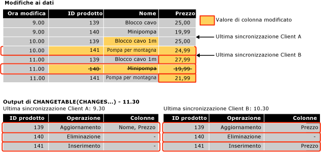

# <a name="work-with-change-tracking-sql-server"></a>Utilizzare il rilevamento delle modifiche (SQL Server)
[!INCLUDE[tsql-appliesto-ss2008-asdb-xxxx-xxx-md](../../includes/tsql-appliesto-ss2008-asdb-xxxx-xxx-md.md)]

  Le applicazioni che utilizzano il rilevamento delle modifiche devono essere in grado di ottenere le modifiche registrate, di applicare tali modifiche a un altro archivio dati e di aggiornare il database di origine. In questo argomento viene descritto come eseguire queste attività e viene illustrato il ruolo svolto dal rilevamento delle modifiche quando si verifica un failover ed è necessario ripristinare un database da un backup.  
  
##  <a name="Obtain"></a> Utilizzo delle funzioni di rilevamento delle modifiche per ottenere le modifiche  
 Viene descritto come utilizzare le funzioni di rilevamento delle modifiche per ottenere le modifiche apportate al database e le informazioni relative.  
  
### <a name="about-the-change-tracking-functions"></a>Informazioni sulle funzioni di rilevamento delle modifiche  
 Per ottenere le modifiche apportate a un database e le relative informazioni, nelle applicazioni è possibile utilizzare le funzioni seguenti:  
  
 CHANGETABLE(CHANGES …)  
 Questa funzione per i set di righe viene utilizzata per eseguire query relative alle informazioni sulle modifiche. La funzione esegue una query sui dati archiviati nelle tabelle per il rilevamento delle modifiche interne e restituisce un set di risultati contenente le chiavi primarie delle righe modificate, insieme ad altre informazioni sulle modifiche, ad esempio l'operazione, le colonne aggiornate e la versione della riga.  
  
 CHANGETABLE(CHANGES ...) accetta l'ultima versione sincronizzata come argomento. L'ultima versione sincronizzata si ottiene utilizzando la variabile `@last_synchronization_version` . La semantica dell'ultima versione sincronizzata è la seguente:  
  
-   Il client chiamante ha ottenuto le modifiche e conosce tutte le modifiche fino all'ultima versione sincronizzata compresa.  
  
-   Tutte le modifiche eseguite dopo l'ultima versione sincronizzata verranno pertanto restituite in CHANGETABLE(CHANGES…).  
  
     Nella figura seguente viene illustrato il modo in cui CHANGETABLE(CHANGES ...) viene utilizzata per ottenere modifiche.  
  
       
  
 Funzione CHANGE_TRACKING_CURRENT_VERSION()  
 Questa funzione viene utilizzata per ottenere la versione corrente che verrà utilizzata alla successiva esecuzione di query sulle modifiche. Tale versione è quella relativa all'ultima transazione di cui è stato eseguito il commit.  
  
 Funzione CHANGE_TRACKING_MIN_VALID_VERSION()  
 Questa funzione viene utilizzata per ottenere la versione minima valida che un client può avere per ottenere risultati validi da CHANGETABLE (). Il client deve controllare l'ultima versione sincronizzata rispetto al valore restituito dalla funzione. Se l'ultima versione sincronizzata è inferiore rispetto a quella restituita dalla funzione, il client non sarà in grado di ottenere risultati validi da CHANGETABLE() e sarà necessario reinizializzare i dati.  
  
### <a name="obtaining-initial-data"></a>Acquisizione dei dati iniziali  
 Prima che un'applicazione sia in grado di ottenere modifiche per la prima volta, è necessario che invii una query per ottenere i dati iniziali e la versione sincronizzata. È necessario che nell'applicazione vengano ottenuti i dati appropriati direttamente dalla tabella, quindi venga utilizzata CHANGE_TRACKING_CURRENT_VERSION() per ottenere la versione iniziale. Tale versione verrà passata a CHANGETABLE(CHANGES ...) la prima volta che le modifiche vengono ottenute.  
  
 Nell'esempio seguente viene illustrato come ottenere la versione di sincronizzazione e il set di dati iniziali.  
  
```sql  
    -- Obtain the current synchronization version. This will be used next time that changes are obtained.  
    SET @synchronization_version = CHANGE_TRACKING_CURRENT_VERSION();  
  
    -- Obtain initial data set.  
    SELECT  
        P.ProductID, P.Name, P.ListPrice  
    FROM  
        SalesLT.Product AS P  
```  
  
### <a name="using-the-change-tracking-functions-to-obtain-changes"></a>Utilizzo delle funzioni di rilevamento delle modifiche per ottenere le modifiche  
 Per ottenere le righe modificate in una tabella e le relative informazioni, utilizzare CHANGETABLE(CHANGES ...). La query seguente, ad esempio, consente di ottenere le modifiche per la tabella `SalesLT.Product` .  
  
```sql  
SELECT  
    CT.ProductID, CT.SYS_CHANGE_OPERATION,  
    CT.SYS_CHANGE_COLUMNS, CT.SYS_CHANGE_CONTEXT  
FROM  
    CHANGETABLE(CHANGES SalesLT.Product, @last_synchronization_version) AS CT  
  
```  
  
 Poiché in un client viene in genere richiesto di ottenere i dati più recenti relativi a una riga anziché le sole chiavi primarie per la riga stessa, verrà creato un join tra i risultati di CHANGETABLE(CHANGES ...) e i dati presenti nella tabella utente. Nella query seguente, ad esempio, viene creato un join con la tabella `SalesLT.Product` per ottenere i valori per le colonne `Name` e `ListPrice` . Si noti l'utilizzo di `OUTER JOIN`, necessario per garantire che le informazioni sulle modifiche vengano restituite per le righe eliminate dalla tabella utente.  
  
```sql  
SELECT  
    CT.ProductID, P.Name, P.ListPrice,  
    CT.SYS_CHANGE_OPERATION, CT.SYS_CHANGE_COLUMNS,  
    CT.SYS_CHANGE_CONTEXT  
FROM  
    SalesLT.Product AS P  
RIGHT OUTER JOIN  
    CHANGETABLE(CHANGES SalesLT.Product, @last_synchronization_version) AS CT  
ON  
    P.ProductID = CT.ProductID  
```  
  
 Per ottenere la versione da utilizzare nella successiva enumerazione delle modifiche, utilizzare CHANGE_TRACKING_CURRENT_VERSION(), come illustrato nell'esempio seguente.  
  
```sql  
SET @synchronization_version = CHANGE_TRACKING_CURRENT_VERSION()  
```  
  
 Quando in un'applicazione vengono ottenute modifiche, è necessario utilizzare sia CHANGETABLE(CHANGES…) che CHANGE_TRACKING_CURRENT_VERSION(), come illustrato nell'esempio seguente.  
  
```sql  
-- Obtain the current synchronization version. This will be used the next time CHANGETABLE(CHANGES...) is called.  
SET @synchronization_version = CHANGE_TRACKING_CURRENT_VERSION();  
  
-- Obtain incremental changes by using the synchronization version obtained the last time the data was synchronized.  
SELECT  
    CT.ProductID, P.Name, P.ListPrice,  
    CT.SYS_CHANGE_OPERATION, CT.SYS_CHANGE_COLUMNS,  
    CT.SYS_CHANGE_CONTEXT  
FROM  
    SalesLT.Product AS P  
RIGHT OUTER JOIN  
    CHANGETABLE(CHANGES SalesLT.Product, @last_synchronization_version) AS CT  
ON  
    P.ProductID = CT.ProductID  
```  
  
### <a name="version-numbers"></a>Numeri di versione  
 Un database in cui è abilitato il rilevamento delle modifiche dispone di un contatore di versione che aumenta in base alle modifiche apportate alle tabelle in cui il rilevamento è attivato. A ciascuna riga modificata è associato un numero di versione. Quando a un'applicazione viene inviata una richiesta per eseguire una query relativa alle modifiche, viene chiamata una funzione che specifica un numero di versione. Tale funzione restituisce informazioni su tutte le modifiche apportate a partire da tale versione. Per alcuni aspetti, la versione del rilevamento delle modifiche è concettualmente analoga al tipo di dati **rowversion** .  
  
### <a name="validating-the-last-synchronized-version"></a>Convalida dell'ultima versione sincronizzata  
 Le informazioni sulle modifiche vengono mantenute per un periodo di tempo limitato, la cui lunghezza viene controllata dal parametro CHANGE_RETENTION che può essere specificato nell'istruzione ALTER DATABASE.  
  
 È necessario tenere presente che il periodo di tempo specificato per CHANGE_RETENTION determina la frequenza con cui per tutte le applicazioni è necessario richiedere le modifiche apportate al database. Se a un'applicazione è associato un valore relativo a *last_synchronization_version* meno recente rispetto a quello della versione sincronizzata valida minima per una tabella, tale applicazione non può eseguire un'enumerazione delle modifiche valida. poiché alcune informazioni sulle modifiche potrebbero essere state eliminate. Affinché in un'applicazione possano essere ottenute le modifiche tramite CHANGETABLE(CHANGES …), è necessario che venga convalidato il valore relativo a *last_synchronization_version* di cui è previsto il passaggio a CHANGETABLE(CHANGES …). Se il valore di *last_synchronization_version* non è valido, è necessario che nell'applicazione vengano reinizializzati tutti i dati.  
  
 Nell'esempio seguente viene illustrato come verificare la validità del valore di `last_synchronization_version` per ogni tabella.  
  
```sql  
-- Check individual table.  
IF (@last_synchronization_version < CHANGE_TRACKING_MIN_VALID_VERSION(  
                                   OBJECT_ID('SalesLT.Product')))  
BEGIN  
  -- Handle invalid version and do not enumerate changes.  
  -- Client must be reinitialized.  
END  
```  
  
 Come illustrato nell'esempio seguente, la validità del valore di `last_synchronization_version` può essere verificata in relazione a tutte le tabelle del database.  
  
```sql  
-- Check all tables with change tracking enabled  
IF EXISTS (  
  SELECT COUNT(*) FROM sys.change_tracking_tables  
  WHERE min_valid_version > @last_synchronization_version )  
BEGIN  
  -- Handle invalid version & do not enumerate changes  
  -- Client must be reinitialized  
END  
```  
  
### <a name="using-column-tracking"></a>Utilizzo del rilevamento a livello di colonna  
 Il rilevamento a livello di colonna consente di ottenere i dati relativi alle sole colonne modificate anziché all'intera riga. Si consideri ad esempio uno scenario in cui in una tabella sono presenti una o più colonne di notevoli dimensioni, ma modificate raramente, e altre colonne che subiscono modifiche frequenti. Senza il rilevamento a livello di colonna, un'applicazione è in grado di rilevare solo che una riga è stata modificata e che è necessario sincronizzare tutti i dati, inclusi quelli presenti nelle colonne di grandi dimensioni. Il rilevamento a livello di colonna consente tuttavia di stabilire se i dati presenti nelle colonne di grandi dimensioni sono stati modificati e di eseguire la sincronizzazione solo in quest'ultimo caso.  
  
 Le informazioni sul rilevamento a livello di colonna vengono visualizzate nella colonna SYS_CHANGE_COLUMNS restituita dalla funzione CHANGETABLE(CHANGES …).  
  
 Il rilevamento a livello di colonna può essere utilizzato in modo che per una colonna cui non sono state apportate modifiche venga restituito il valore NULL. Se la colonna può essere impostata su NULL, è necessario che venga restituita una colonna separata per indicare se la colonna è stata modificata.  
  
 Nell'esempio seguente se la colonna `CT_ThumbnailPhoto` non ha subito modifiche, verrà restituito il valore `NULL` . A tale colonna potrebbe inoltre essere associato il valore `NULL` poiché è stata impostata su `NULL` . È possibile utilizzare la colonna `CT_ThumbNailPhoto_Changed` per determinare se la colonna ha subito modifiche.  
  
```sql  
DECLARE @PhotoColumnId int = COLUMNPROPERTY(  
    OBJECT_ID('SalesLT.Product'),'ThumbNailPhoto', 'ColumnId')  
  
SELECT  
    CT.ProductID, P.Name, P.ListPrice, -- Always obtain values.  
    CASE  
           WHEN CHANGE_TRACKING_IS_COLUMN_IN_MASK(  
                     @PhotoColumnId, CT.SYS_CHANGE_COLUMNS) = 1  
            THEN ThumbNailPhoto  
            ELSE NULL  
      END AS CT_ThumbNailPhoto,  
      CHANGE_TRACKING_IS_COLUMN_IN_MASK(  
                     @PhotoColumnId, CT.SYS_CHANGE_COLUMNS) AS  
                                   CT_ThumbNailPhoto_Changed  
     CT.SYS_CHANGE_OPERATION, CT.SYS_CHANGE_COLUMNS,  
     CT.SYS_CHANGE_CONTEXT  
FROM  
     SalesLT.Product AS P  
INNER JOIN  
     CHANGETABLE(CHANGES SalesLT.Product, @last_synchronization_version) AS CT  
ON  
     P.ProductID = CT.ProductID AND  
     CT.SYS_CHANGE_OPERATION = 'U'  
```  
  
### <a name="obtaining-consistent-and-correct-results"></a>Acquisizione di risultati coerenti e corretti  
 Per ottenere i dati modificati relativi a una tabella, è necessario effettuare più operazioni. È necessario inoltre tenere presente che potrebbero venire restituiti risultati incoerenti o non corretti se non vengono considerati e gestiti problemi specifici.  
  
 Per ottenere le modifiche apportate a una tabella Sales e a una tabella SalesOrders, in un'applicazione è necessario ad esempio effettuare le operazioni seguenti:  
  
1.  Convalidare l'ultima versione sincronizzata utilizzando CHANGE_TRACKING_MIN_VALID_VERSION().  
  
2.  Ottenere la versione che può essere utilizzata per ottenere le modifiche la volta successiva utilizzando CHANGE_TRACKING_CURRENT_VERSION().  
  
3.  Ottenere le modifiche per la tabella Sales utilizzando CHANGETABLE(CHANGES …).  
  
4.  Ottenere le modifiche per la tabella SalesOrders utilizzando CHANGETABLE(CHANGES …).  
  
 Nel database sono in esecuzione due processi che possono influenzare i risultati restituiti dalle operazioni precedenti:  
  
-   Il processo di pulizia viene eseguito in background e rimuove le informazioni sul rilevamento delle modifiche precedenti rispetto al periodo di memorizzazione specificato.  
  
     Il processo di pulizia è un processo eseguito separatamente in background che utilizza il periodo di memorizzazione specificato quando si configura il rilevamento delle modifiche per il database. Quando il processo di pulizia viene eseguito nel periodo di tempo che intercorre tra la convalida dell'ultima versione sincronizzata e la chiamata di funzione CHANGETABLE(CHANGES ...), può verificarsi un problema poiché l'ultima versione sincronizzata valida potrebbe non esserlo più nel momento in cui vengono ottenute le modifiche. È possibile pertanto che vengano restituiti risultati non corretti.  
  
-   Operazioni DML in corso nelle tabelle Sales e SalesOrders, ad esempio le operazioni seguenti:  
  
    -   Esecuzione di modifiche alle tabelle dopo che è stata ottenuta la versione per la volta successiva mediante CHANGE_TRACKING_CURRENT_VERSION(). È pertanto possibile che vengano restituite più modifiche del previsto.  
  
    -   Esecuzione del commit di una transazione nel periodo di tempo che intercorre tra la chiamata di funzione per ottenere le modifiche apportate alla tabella Sales e quella per ottenere le modifiche apportate alla tabella SalesOrders. Ai risultati relativi alla tabella SalesOrder potrebbe pertanto essere associato un valore di chiave esterna che non esiste nella tabella Sales.  
  
 Per risolvere i problemi elencati in precedenza, è consigliabile utilizzare l'isolamento dello snapshot che consente di garantire la coerenza delle informazioni sulle modifiche e di evitare situazioni di race condition correlate all'attività di pulizia eseguita in background. Se non si utilizzano transazioni snapshot, lo sviluppo di un'applicazione che utilizza il rilevamento delle modifiche potrebbe risultare notevolmente più impegnativo.  
  
#### <a name="using-snapshot-isolation"></a>Utilizzo dell'isolamento dello snapshot  
 Il rilevamento delle modifiche è stato progettato per funzionare in modo ottimale con l'isolamento dello snapshot. È necessario che l'isolamento dello snapshot sia abilitato nel database. Tutti i passaggi necessari per ottenere le modifiche devono essere contenuti in una transazione snapshot in modo che tutte le modifiche apportate ai dati durante l'acquisizione delle modifiche stesse non siano visibili alle query eseguite nella transazione snapshot.  
  
 Per ottenere dati all'interno di una transazione snapshot, effettuare le operazioni seguenti:  
  
1.  Impostare il livello di isolamento della transazione sullo snapshot e avviare una transazione.  
  
2.  Convalidare l'ultima versione sincronizzata utilizzando CHANGE_TRACKING_MIN_VALID_VERSION().  
  
3.  Ottenere la versione da utilizzare successivamente tramite CHANGE_TRACKING_CURRENT_VERSION().  
  
4.  Ottenere le modifiche per la tabella Sales utilizzando CHANGETABLE(CHANGES …).  
  
5.  Ottenere le modifiche per la tabella SalesOrders utilizzando CHANGETABLE(CHANGES …).  
  
6.  Eseguire il commit della transazione.  
  
 Poiché tutti i passaggi necessari per ottenere le modifiche sono contenuti in una transazione snapshot, tenere in considerazione quanto segue:  
  
-   Se il processo di pulizia viene eseguito dopo la convalida dell'ultima versione sincronizzata, i risultati restituiti da CHANGETABLE(CHANGES …) saranno ancora validi poiché le operazioni di eliminazione eseguite dal processo di pulizia non saranno visibili all'interno della transazione.  
  
-   Qualsiasi modifica apportata alla tabella Sales o SalesOrders dopo che è stata ottenuta la versione sincronizzata successiva non sarà visibile e le chiamate a CHANGETABLE(CHANGES …) non restituiranno mai modifiche con una versione successiva a quella restituita da CHANGE_TRACKING_CURRENT_VERSION(). Verrà inoltre mantenuta la coerenza tra le tabelle Sales e SalesOrders poiché le transazioni di cui era stato eseguito il commit nel periodo di tempo che intercorre tra le chiamate a CHANGETABLE(CHANGES …) non saranno visibili.  
  
 Nell'esempio seguente viene illustrato il modo in cui l'isolamento dello snapshot viene abilitato per un database.  
  
```sql  
-- The database must be configured to enable snapshot isolation.  
ALTER DATABASE AdventureWorksLT  
    SET ALLOW_SNAPSHOT_ISOLATION ON;  
```  
  
 Una transazione snapshot viene utilizzata nel modo seguente:  
  
```sql  
SET TRANSACTION ISOLATION LEVEL SNAPSHOT;  
BEGIN TRAN  
  -- Verify that version of the previous synchronization is valid.  
  -- Obtain the version to use next time.  
  -- Obtain changes.  
COMMIT TRAN  
```  
  
 Per altre informazioni sulle transazioni snapshot, vedere [SET TRANSACTION ISOLATION LEVEL &#40;Transact-SQL&#41;](../../t-sql/statements/set-transaction-isolation-level-transact-sql.md).  
  
#### <a name="alternatives-to-using-snapshot-isolation"></a>Alternative all'utilizzo dell'isolamento dello snapshot  
 Oltre all'isolamento dello snapshot, è possibile utilizzare metodi alternativi che tuttavia richiedono l'esecuzione di un numero maggiore di operazioni per garantire che tutti i requisiti relativi all'applicazione siano soddisfatti. Per garantire che il valore di *last_synchronization_version* sia valido e che i dati non vengano rimossi dal processo di pulizia prima dell'acquisizione delle modifiche, eseguire le operazioni seguenti:  
  
1.  Verificare il valore di *last_synchronization_version* dopo le chiamate a CHANGETABLE ().  
  
2.  Verificare il valore di *last_synchronization_version* come parte di ogni query per ottenere le modifiche tramite CHANGETABLE().  
  
 È possibile che vengano eseguite modifiche dopo che è stata ottenuta la versione sincronizzata per l'enumerazione successiva. Questa situazione può essere gestita in due modi diversi. L'approccio utilizzato dipende dall'applicazione e dalla modalità di gestione degli effetti collaterali associati a ciascun approccio:  
  
-   Ignorare le modifiche con versione superiore rispetto alla nuova versione sincronizzata.  
  
     In base a questo approccio, verrà ignorata ogni riga nuova o aggiornata creata o aggiornata prima delle nuove versioni sincronizzate, ma aggiornata in seguito. Se è presente una nuova riga, potrebbe verificarsi un problema di integrità referenziale se in un'altra tabella era stata creata una riga che faceva riferimento alla riga ignorata. Se è presente una riga aggiornata, tale riga verrà ignorata e non verrà sincronizzata fino alla volta successiva.  
  
-   Includere tutte le modifiche, anche quelle con versione superiore rispetto alla nuova versione sincronizzata.  
  
     Le righe con versione superiore alla nuova versione sincronizzata verranno ottenute anche alla sincronizzazione successiva. Questa situazione deve essere prevista e gestita dall'applicazione.  
  
 Oltre ai due approcci precedenti, è possibile definirne altri che utilizzino entrambe le opzioni, in base all'operazione. Potrebbe ad esempio essere necessario utilizzare un'applicazione per cui è preferibile ignorare le modifiche più recenti rispetto alla versione sincronizzata successiva in cui la riga è stata creata o eliminata, ma per cui gli aggiornamenti non vengono ignorati.  
  
> [!NOTE]  
>  Poiché la scelta dell'approccio più efficiente per l'applicazione quando si utilizza il rilevamento delle modifiche o qualsiasi meccanismo di rilevamento personalizzato richiede l'esecuzione di un'analisi approfondita, l'utilizzo dell'isolamento dello snapshot è notevolmente più semplice.  
  
##  <a name="Handles"></a> Gestione delle modifiche in un database da parte del rilevamento delle modifiche  
 Alcune applicazioni che utilizzano il rilevamento delle modifiche eseguono la sincronizzazione bidirezionale con un altro archivio dati. Questo significa che le modifiche apportate al database di [!INCLUDE[ssNoVersion](../../includes/ssnoversion-md.md)] vengono aggiornate nell'altro archivio dati, mentre le modifiche apportate all'archivio vengono aggiornate nel database di [!INCLUDE[ssNoVersion](../../includes/ssnoversion-md.md)] .  
  
 Quando aggiorna il database locale in base alle modifiche di un altro archivio dati, un'applicazione deve effettuare le operazioni seguenti:  
  
-   Verificare la presenza di conflitti.  
  
     Un conflitto si verifica quando gli stessi dati vengono modificati contemporaneamente in entrambi gli archivi dati. L'applicazione deve essere in grado di verificare la presenza di un conflitto e di ottenere informazioni sufficienti per consentirne la risoluzione.  
  
-   Archiviare le informazioni sul contesto dell'applicazione.  
  
     L'applicazione archivia i dati che dispongono di informazioni sul rilevamento delle modifiche. Dopo che le modifiche sono state ottenute dal database locale, tali informazioni saranno disponibili con altre informazioni sul rilevamento delle modifiche. Un esempio comune di tali informazioni contestuali è rappresentato da un identificatore per l'archivio dati che costituiva l'origine della modifica.  
  
 Per eseguire le operazioni precedenti, un'applicazione di sincronizzazione può utilizzare le funzioni seguenti:  
  
-   CHANGETABLE(VERSION…)  
  
     Quando un'applicazione apporta modifiche, può utilizzare questa funzione per verificare la presenza di conflitti. La funzione ottiene le informazioni sul rilevamento delle modifiche più recenti per una riga specificata in una tabella con rilevamento. In tali informazioni è inclusa la versione della riga in cui è stata eseguita l'ultima modifica. Questa informazione consente a un'applicazione di determinare se la riga è stata modificata dopo l'ultima sincronizzazione dell'applicazione stessa.  
  
-   WITH CHANGE_TRACKING_CONTEXT  
  
     Un'applicazione può utilizzare questa clausola per archiviare dati relativi al contesto.  
  
### <a name="checking-for-conflicts"></a>Verifica della presenza di conflitti  
 In uno scenario di sincronizzazione bidirezionale l'applicazione client deve determinare se una riga non è stata aggiornata dall'ultima volta in cui l'applicazione ha ottenuto le modifiche.  
  
 Nell'esempio seguente viene illustrato come utilizzare la funzione CHANGETABLE(VERSION ...) per verificare la presenza di conflitti nel modo più efficiente, senza eseguire una query separata. Nell'esempio, `CHANGETABLE(VERSION …)` determina `SYS_CHANGE_VERSION` per la riga specificata da `@product id`. `CHANGETABLE(CHANGES …)` può ottenere le stesse informazioni, ma sarebbe meno efficiente. Se il valore di `SYS_CHANGE_VERSION` per la riga è maggiore del valore di `@last_sync_version`, si verifica un conflitto. In questo caso la riga non verrà aggiornata. Il controllo `ISNULL()` è necessario perché per la riga potrebbero non essere disponibili informazioni sulle modifiche. Nel caso in cui la riga non sia stata aggiornata dal momento in cui è stato abilitato il rilevamento delle modifiche o dal momento in cui le informazioni sulle modifiche sono state eliminate, non sarebbe infatti disponibile alcuna informazione sulle modifiche.  
  
```sql  
-- Assumption: @last_sync_version has been validated.  
  
UPDATE  
    SalesLT.Product  
SET  
    ListPrice = @new_listprice  
FROM  
    SalesLT.Product AS P  
WHERE  
    ProductID = @product_id AND  
    @last_sync_version >= ISNULL (  
        SELECT CT.SYS_CHANGE_VERSION  
        FROM CHANGETABLE(VERSION SalesLT.Product,  
                        (ProductID), (P.ProductID)) AS CT),  
        0)  
```  
  
 Il codice seguente consente di controllare il conteggio delle righe aggiornate e di identificare ulteriori informazioni sul conflitto.  
  
```sql  
-- If the change cannot be made, find out more information.  
IF (@@ROWCOUNT = 0)  
BEGIN  
    -- Obtain the complete change information for the row.  
    SELECT  
        CT.SYS_CHANGE_VERSION, CT.SYS_CHANGE_CREATION_VERSION,  
        CT.SYS_CHANGE_OPERATION, CT.SYS_CHANGE_COLUMNS  
    FROM  
        CHANGETABLE(CHANGES SalesLT.Product, @last_sync_version) AS CT  
    WHERE  
        CT.ProductID = @product_id;  
  
    -- Check CT.SYS_CHANGE_VERSION to verify that it really was a conflict.  
    -- Check CT.SYS_CHANGE_OPERATION to determine the type of conflict:  
    -- update-update or update-delete.  
    -- The row that is specified by @product_id might no longer exist   
    -- if it has been deleted.  
END  
```  
  
### <a name="setting-context-information"></a>Impostazione delle informazioni sul contesto  
 Utilizzando la clausola WITH CHANGE_TRACKING_CONTEXT un'applicazione può archiviare le informazioni sul contesto con le informazioni sulle modifiche. Tali informazioni possono quindi essere ottenute dalla colonna SYS_CHANGE_CONTEXT restituita da CHANGETABLE(CHANGES ...).  
  
 Le informazioni sul contesto vengono utilizzate in genere per identificare l'origine delle modifiche. Se è possibile identificare l'origine della modifica, tali informazioni possono essere utilizzate da un archivio dati per evitare di ottenere modifiche alla successiva sincronizzazione.  
  
```sql  
  -- Try to update the row and check for a conflict.  
  WITH CHANGE_TRACKING_CONTEXT (@source_id)  
  UPDATE  
     SalesLT.Product  
  SET  
      ListPrice = @new_listprice  
  FROM  
      SalesLT.Product AS P  
  WHERE  
     ProductID = @product_id AND  
     @last_sync_version >= ISNULL (  
         (SELECT CT.SYS_CHANGE_VERSION FROM CHANGETABLE(VERSION SalesLT.Product,  
         (ProductID), (P.ProductID)) AS CT),  
         0)  
```  
  
### <a name="ensuring-consistent-and-correct-results"></a>Come garantire risultati coerenti e corretti  
 Al momento della convalida del valore di @last_sync_version, è necessario che in un'applicazione venga considerato il processo di pulizia poiché i dati potrebbero essere stati rimossi i dati dopo la chiamata a CHANGE_TRACKING_MIN_VALID_VERSION (), ma prima che sia stato eseguito l'aggiornamento.  
  
> [!IMPORTANT]  
>  È consigliabile utilizzare l'isolamento dello snapshot e apportare le modifiche all'interno di una transazione snapshot.  
  
```sql  
-- Prerequisite is to ensure ALLOW_SNAPSHOT_ISOLATION is ON for the database.  
  
SET TRANSACTION ISOLATION LEVEL SNAPSHOT;  
BEGIN TRAN  
    -- Verify that last_sync_version is valid.  
    IF (@last_sync_version <  
CHANGE_TRACKING_MIN_VALID_VERSION(OBJECT_ID(‘SalesLT.Product’)))  
    BEGIN  
       RAISERROR (N’Last_sync_version too old’, 16, -1);  
    END  
    ELSE  
    BEGIN  
        -- Try to update the row.  
        -- Check @@ROWCOUNT and check for a conflict.  
    END  
COMMIT TRAN  
```  
  
> [!NOTE]  
>  È possibile che la riga in fase di aggiornamento all'interno della transazione snapshot sia stata aggiornata in un'altra transazione dopo l'avvio della transazione stessa. In questo caso, si verifica un conflitto nell'aggiornamento dell'isolamento dello snapshot e la transazione verrà terminata. Se si verifica questa situazione, riprovare a eseguire l'aggiornamento. In questo modo verrà individuato un conflitto nel rilevamento delle modifiche e nessuna riga verrà modificata.  
  
##  <a name="DataRestore"></a> Rilevamento delle modifiche e ripristino dei dati  
 Le applicazioni che richiedono la sincronizzazione è necessario considerare il caso in cui un database con il rilevamento delle modifiche abilitato viene ripristinato a una versione precedente dei dati. Questa situazione può verificarsi dopo il ripristino di un database da un backup, quando si verifica un failover a un database mirror asincrono o quando si verifica un errore durante l'utilizzo del log shipping. Nel seguente scenario viene illustrato il problema:  
  
1.  Nella tabella T1 è attivato il rilevamento delle modifiche e la versione minima valida della tabella è 50.  
  
2.  Un'applicazione client sincronizza i dati alla versione 100 e ottiene informazioni su tutte le modifiche tra le versioni 50 e 100.  
  
3.  Le modifiche aggiuntive vengono apportate alla tabella T1 dopo la versione 100.  
  
4.  Alla versione 120 si verifica un errore e l'amministratore del database ripristina il database con perdita di dati. Dopo l'operazione di ripristino, la tabella contiene dati fino alla versione 70 e la versione minima sincronizzata è ancora 50.  
  
     Ciò significa che l'archivio dati sincronizzato ha dati che non esistono più nell'archivio dati primario.  
  
5.  T1 viene aggiornato molte volte. La versione corrente viene portata a 130.  
  
6.  L'applicazione client esegue nuovamente la sincronizzazione e fornisce l'ultima versione sincronizzata: 100. Il client convalida il numero, in quanto 100 è maggiore di 50.  
  
     Il client ottiene le modifiche tra la versione 100 e la 130. A questo punto, il client non riconosce che le modifiche tra 70 e 100 non sono come le modifiche precedenti. I dati nel client e nel server non sono sincronizzati.  
  
 Se il database è stato recuperato in un punto successivo alla versione 100, non si verificheranno problemi con la sincronizzazione. Il client e il server sincronizzeranno correttamente i dati durante il successivo intervallo di sincronizzazione.  
  
 Il rilevamento delle modifiche non fornisce il supporto per il recupero dalla perdita di dati. Tuttavia, sono disponibili due opzioni per il rilevamento di questi tipi di problemi di sincronizzazione:  
  
-   Archiviare un ID della versione del database nel server e aggiornare tale valore ogni volta che un database viene recuperato o perde dati. Ciascuna applicazione client archivia l'ID e ciascun client convalida tale ID quando viene eseguita la sincronizzazione dei dati. Se si verifica la perdita di dati, gli ID non corrisponderanno e i client verranno reinizializzati. Se la perdita di dati non si sovrappone all'ultimo limite di date sincronizzato, il client potrebbe essere reinizializzato inutilmente.  
  
-   Quando un client esegue una query per le modifiche, registrare il numero dell'ultima versione sincronizzata per ciascun client nel server. Se si verifica un problema con i dati, i numeri delle ultime versioni sincronizzate non corrispondono. Ciò indica che è necessario eseguire la reinizializzazione.  
  
## <a name="see-also"></a>Vedere anche  
 [Tenere traccia delle modifiche ai dati &#40;SQL Server&#41;](../../relational-databases/track-changes/track-data-changes-sql-server.md)   
 [Informazioni sul rilevamento delle modifiche &#40;SQL Server&#41;](../../relational-databases/track-changes/about-change-tracking-sql-server.md)   
 [Gestire il rilevamento delle modifiche &#40;SQL Server&#41;](../../relational-databases/track-changes/manage-change-tracking-sql-server.md)   
 [Abilitare e disabilitare il rilevamento delle modifiche &#40;SQL Server&#41;](../../relational-databases/track-changes/enable-and-disable-change-tracking-sql-server.md)   
 [CHANGETABLE &#40;Transact-SQL&#41;](../../relational-databases/system-functions/changetable-transact-sql.md)   
 [CHANGE_TRACKING_MIN_VALID_VERSION &#40;Transact-SQL&#41;](../../relational-databases/system-functions/change-tracking-min-valid-version-transact-sql.md)   
 [CHANGE_TRACKING_CURRENT_VERSION &#40;Transact-SQL&#41;](../../relational-databases/system-functions/change-tracking-current-version-transact-sql.md)   
 [WITH CHANGE_TRACKING_CONTEXT &#40;Transact-SQL&#41;](../../relational-databases/system-functions/with-change-tracking-context-transact-sql.md)  
  
  
