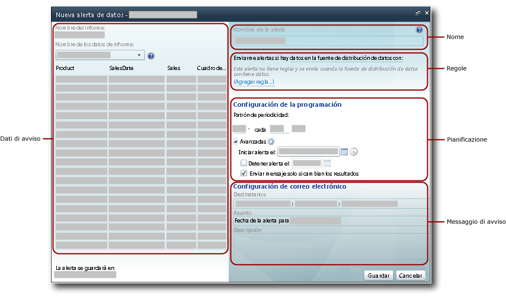

# Finestra di progettazione Avviso dati

[!INCLUDE [ssrs-appliesto](../includes/ssrs-appliesto.md)] [!INCLUDE [ssrs-appliesto-2016](../includes/ssrs-appliesto-2016.md)] [!INCLUDE [ssrs-appliesto-not-2017](../includes/ssrs-appliesto-not-2017.md)] [!INCLUDE[ssrs-appliesto-sharepoint-2013-2016i](../includes/ssrs-appliesto-sharepoint-2013-2016.md)] [!INCLUDE [ssrs-appliesto-not-pbirs](../includes/ssrs-appliesto-not-pbirs.md)]

[!INCLUDE [ssrs-previous-versions](../includes/ssrs-previous-versions.md)]

Le definizioni di avviso dati vengono create e modificate nella finestra di progettazione Avviso dati. Una definizione di avviso è una raccolta di metadati, inclusi i dati del report a cui si è interessati, le regole che i dati del report devono soddisfare per creare istanze di avviso dati e inviare messaggi di avviso dati, i destinatari del messaggio di avviso e così via.  

> [!NOTE]
> L'integrazione di Reporting Services con SharePoint non è più disponibile nelle versioni successive a SQL Server 2016.

 Per creare una definizione di avviso si effettuano diverse attività correlate:  
  
-   Selezionare il report e il feed di dati del report in cui sono inclusi i dati che si desidera utilizzare.  
  
-   Definire le regole e le clausole che comportano l'invio di un avviso. Le regole possono essere semplici oppure complesse, tramite l'utilizzo di più clausole combinate da operatori AND.  
  
-   Definire la frequenza di invio del messaggio di avviso nonché la data e l'ora di avvio e arresto dell'avviso. È possibile inviare messaggi di avviso solamente quando i risultati cambiano.  
  
-   Specificare gli indirizzi di posta elettronica dei destinatari dei messaggi di avviso.  
  
-   Personalizzare la riga **Oggetto** del messaggio di avviso.  
  
-   Fornire una descrizione dell'avviso da includere nel messaggio di avviso.  
  
> [!NOTE]  
>  Poiché la funzionalità relativa agli avvisi dati di [!INCLUDE[ssRSnoversion](../includes/ssrsnoversion-md.md)] è disponibile solo quando si installa [!INCLUDE[ssRSnoversion](../includes/ssrsnoversion-md.md)] in modalità SharePoint, il report per cui si desidera creare un avviso deve essere salvato, distribuito o caricato in una raccolta documenti di SharePoint.  
>   
>  Gli avvisi dati non possono essere creati per report in cui viene utilizzata l'autenticazione integrata di Windows o che richiedono le credenziali. Nei report devono venire utilizzate credenziali archiviate. Per altre informazioni, vedere [Specificare le credenziali e le informazioni sulla connessione per le origini dati del report](../reporting-services/report-data/specify-credential-and-connection-information-for-report-data-sources.md).  
  
 Per aprire la finestra di progettazione Avviso dati, scegliere **Nuovo avviso dati** dal menu **Azioni** sulla barra degli strumenti dei report. Se l'opzione **Nuovo avviso dati** non è visualizzata, il report non è configurato per l'utilizzo di credenziali archiviate. È possibile aggiornare il tipo di credenziali aggiornando l'origine dati del report dalla raccolta di SharePoint.  
  
##   Interfaccia utente della finestra di progettazione Avviso dati  
 L'interfaccia della finestra di progettazione Avviso dati è suddivisa in aree. Sono disponibili l'area in cui si seleziona il feed di dati del report, l'area in cui si creano condizioni semplici o complesse aggiungendo regole alle condizioni e così via. Nella figura seguente sono illustrate le aree della finestra di progettazione Avviso dati.  
  
   
  
  
### Dati di avviso  
 Quando si apre la finestra di progettazione Avviso dati, vengono generati e resi disponibili tutti i feed di dati del report e i nomi dei feed sono inclusi nell'elenco a discesa **Nome dati report** . I feed di dati vengono memorizzati nella cache in memoria durante la creazione della definizione di avviso mentre la tabella, tramite cui vengono visualizzati i dati del feed di dati, viene popolata rapidamente quando si passa tra feed di dati per esplorare i dati del report.  
  
 Il primo passaggio per la creazione di una definizione di avviso dati consiste nel selezionare il feed di dati del report contenente i dati che si desidera monitorare tramite l'avviso. I report possono disporre di zero o più feed di dati. Se un report non dispone di alcun feed di dati, non è possibile creare avvisi per tale report. Un feed di dati può essere generato da qualsiasi area dati, inclusi tutti i tipi di grafici, misuratori, indicatori nonché tabelle, matrici ed elenchi.  
  
 Se il report è con parametri e non vengono visualizzati i dati e le colonne previsti nel feed di dati del report, eseguirlo di nuovo utilizzando i valori dei parametri appropriati. Le colonne e i valori devono essere presenti nel report da includere nel feed di dati.  
  
 A seconda del layout del report, potrebbe non risultare intuitivo il numero di feed di dati inclusi nel report stesso, né quali dati sono stati inclusi in ogni feed di dati. L'estensione per il rendering Atom in [!INCLUDE[ssRSnoversion](../includes/ssrsnoversion-md.md)]genera i feed di dati utilizzati con gli avvisi. L'estensione per il rendering Atom fornisce dati del report come set di righe bidimensionali, ovvero un formato tabulare in cui tutte le colonne dispongono dello stesso numero di righe. Questi set di righe sono il contenuto dei feed di dati. Poiché il layout del report è spesso complesso e con più peer o aree dati annidate, sono necessari più feed di dati per rendere disponibili tutti i dati del report. Per altre informazioni su come vengono generati i feed di dati per i report, vedere [Generazione di feed di dati dai report &#40;Generatore report e SSRS&#41;](../reporting-services/report-builder/generating-data-feeds-from-reports-report-builder-and-ssrs.md) e [Generare i feed di dati da un report &#40;Generatore report e SSRS&#41;](../reporting-services/report-builder/generate-data-feeds-from-a-report-report-builder-and-ssrs.md).  
  
 Quando si sceglie un feed di dati, i dati del feed vengono visualizzati in una tabella con righe e colonne nel riquadro dei dati di avviso della finestra di progettazione Avviso dati. Tramite i metadati dell'origine dati utilizzata dal report o il report stesso vengono specificati i nomi delle colonne e l'elenco dei campi utilizzato per definire le regole nella condizione per i dati viene popolato dal feed di dati. Il feed di dati inoltre fornisce metadati quali i tipi di dati di colonne della tabella tramite cui vengono limitati i valori e gli operatori di confronto utilizzabili con i campi quando si creano le regole.  
  
 Alcuni report dispongono di milioni di righe di dati. Nella tabella vengono mostrate solo le prime 100 righe di dati nel feed.  
  
### Nome dell'avviso  
 Per impostazione predefinita, la definizione di avviso e il report hanno lo stesso nome. È possibile modificare il nome dell'avviso per renderlo più significativo. In questo modo sarà più semplice gestire gli avvisi, determinando quali aggiornare, eliminare e così via.  
  
 È possibile creare più avvisi in un report nonché disporre di più definizioni di avviso con lo stesso nome. Tuttavia si consiglia di utilizzare nomi di avviso univoci in modo da facilitare la differenziazione e la gestione delle definizioni di avviso. L'elenco di tutti gli avvisi creati può essere visualizzato in Gestione avvisi dati. Per altre infomrazioni, vedere [Gestione avvisi dati per gli amministratori di avvisi](../reporting-services/data-alert-manager-for-alerting-administrators.md) e [Gestire gli avvisi dati in Gestione avvisi dati](../reporting-services/manage-my-data-alerts-in-data-alert-manager.md).  
  
### Regole e clausole  
 L'ambito delle modifiche ai dati e delle regole di avviso definisce le modifiche ai dati tramite cui viene attivato l'avviso. L'ambito delle modifiche ai dati può essere uno dei seguenti:  
  
-   **Alcuni dati hanno**: almeno un valore nei dati soddisfa le regole specificate dalla condizione.  
  
-   **Nessun dato ha**: nessun valore nei dati soddisfa le regole specificate dalla condizione.  
  
 Una regola contiene zero, una o più clausole. Più regole vengono combinate tramite l'operatore logico AND. Una regola può includere più clausole combinate dall'operatore OR se nella colonna sono presenti dati di tipo stringa. Di seguito sono illustrate le regole di base che utilizzano una sola clausola, più regole combinate tramite l'operatore AND e più regole con una o più clausole OR.  
  
 **Regole semplici**  
  
-   Fatturato netto **è maggiore di** 100000  
  
-   Data vendite **è successiva a** 1/6/2010  
  
-   Nome società **non è** Contoso  
  
 **Regole combinate dall'operatore AND**  
  
-   Vendite **è maggiore di** 1500,00  
  
     **AND** Unità vendute **è minore di** 500  
  
     Data di restituzione **è precedente a** 1/1/2010  
  
-   Vendite **è maggiore o uguale a** 1500,00  
  
     **AND** Data di restituzione **è successiva a** 1/1/2010  
  
     **AND** Unità vendute **è maggiore di** 500  
  
-   Nome promozione **contiene** Primavera  
  
     **AND** Unità vendute **è maggiore di** 500  
  
     **AND** Resi **è**  0  
  
 **Regole con clausole OR**  
  
-   Cognome **è** Blythe  
  
     **OR**  Petulescu  
  
     **OR**  Martin  
  
-   Data di restituzione **è successiva a** 1/1/2010  
  
     **AND** Territorio vendita **è**  Centro  
  
     **OR**  Sud  
  
     **OR**  Nord  
  
 A seconda del tipo di dati del campo, tramite la finestra di progettazione Avviso dati vengono forniti tipi di confronto diversi. La finestra di progettazione Avviso dati offre tipi di confronto diversi in base al tipo di dati del campo per il quale i valori vengono confrontati. Di seguito sono elencati i tipi di confronto disponibili per i diversi tipi di dati. Il tipo di dati **Boolean** non è supportato nelle regole.  
  
-   I confronti per i dati di tipo datetime sono: **è**, **non è**, **è precedente a**ed **è successiva a**  
  
-   I confronti per i dati di tipo numerico sono: **è**, **non è**, **è minore di**, **è minore o uguale a**, **è maggiore di**ed **è maggiore o uguale a**  
  
-   I confronti per i dati di tipo stringa sono: **è**, **non è**e **contiene**  
  
 Quando si crea una regola, si specifica se usare un valore o un campo nel confronto scegliendo **Modalità immissione valori** o **Modalità selezione campo**. Se si sceglie **Modalità immissione valori**, è necessario fornire un elenco di valori da confrontare. Un confronto che include più clausole OR è molto simile al confronto logico IN in [!INCLUDE[tsql](../includes/tsql-md.md)], che è costituito da un elenco di valori di cui verificare una corrispondenza. Per altre informazioni, vedere [IN &#40;Transact-SQL&#41;](../t-sql/language-elements/in-transact-sql.md).  
  
 Se si sceglie **Modalità selezione campo**, il confronto viene effettuato tra due campi, riga per riga. Affinché il confronto sia valido, i due campi devono disporre di tipi di dati compatibili, ad esempio due campi numerici. Quando si sceglie **Modalità selezione campo**, viene automaticamente visualizzato un elenco di campi.  
  
 È anche possibile creare avvisi dati senza regole. Questo tipo di avviso può essere molto utile. Si consideri uno scenario in cui si desidera ricevere notifiche solo quando il feed di dati del report dispone di dati. Nel feed di dati sono contenute informazioni sul partecipante e il feed è vuoto fino all'annullamento da parte di un partecipante. In questo scenario, si riceverebbe un avviso a partire dal primo annullamento.  
  
 È possibile eliminare singole regole e clausole.  
  
 Le regole e le clausole sono incluse nel messaggio di avviso dati.  
  
### Impostazioni di pianificazione  
 Tramite la pianificazione definita per l'avviso dati viene stabilito il criterio di ricorrenza per l'invio del messaggio di avviso dati, nonché quando avviare e arrestare l'invio dei messaggi di avviso. I criteri prevedono singola occorrenza, minuto, giornaliero e settimanale. Anche se un avviso dispone di una sola pianificazione, utilizzando tali intervalli è possibile creare criteri di ricorrenza complessi in grado di soddisfare la maggior parte delle esigenze aziendali. Di seguito sono riportati esempi di criteri di ricorrenza comuni da utilizzare nelle pianificazioni:  
  
-   **Giornaliera, ogni 10 giorni** : gli avvisi vengono inviati una volta al giorno, ogni 10 giorni.  
  
-   **Settimanale, ogni 2 settimane di lunedì** : gli avvisi vengono inviati solo ogni due settimane di lunedì.  
  
-   **Oraria, ogni 12 ore** : gli avvisi vengono inviati ogni 12 ore.  
  
-   **Minuto, ogni 30 minuti** : gli avvisi vengono inviati ogni 30 minuti.  
  
 Il criterio di ricorrenza consente di specificare quando viene inviato l'avviso. Se le regole vengono soddisfatte durante l'intervallo specificato dal criterio, l'avviso non viene inviato fino alla fine dell'intervallo.  
  
 Se si desidera ricevere un messaggio di avviso dati il prima possibile quando i dati del report soddisfano le regole specificate, è possibile pianificare l'avviso per un'esecuzione frequente. Quando i dati del report non cambiano, si potrebbero ricevere numerosi messaggi ridondanti. Se si desidera ricevere messaggi solo quando i risultati dell'applicazione delle regole cambiano, selezionare l'opzione **Invia un messaggio solo se cambiano i risultati degli avvisi** .  
  
> [!IMPORTANT]  
>  È consigliabile non utilizzare un criterio di ricorrenza con una frequenza maggiore di quella giornaliera, a meno che non vi siano importanti motivi aziendali per farlo. L'elaborazione della definizione di avviso dati in tempo reale non è un scenario supportato. L'elaborazione troppo frequente delle definizioni di avviso dati influisce sulle prestazioni del server di report e sulla distribuzione globale di [!INCLUDE[ssRSnoversion](../includes/ssrsnoversion-md.md)] .  
  
### Impostazioni posta elettronica  
 L'opzione **Destinatario/i** consente di specificare gli indirizzi di posta elettronica dei destinatari dei messaggi di avviso dati. Separare più indirizzi di posta elettronica tramite punti e virgola, analogamente a quanto avviene nei messaggi di posta elettronica di Microsoft Office Outlook. È anche possibile specificare come destinatari gruppi di distribuzione, in modo da poter gestire l'elenco destinatari in modo più semplice ed efficace. Se in SharePoint è possibile determinare l'indirizzo di posta elettronica personale quando si crea una definizione di avviso, tale indirizzo viene aggiunto automaticamente all'elenco di destinatari; in caso contrario, è necessario aggiungerlo in modo esplicito come destinatario.  
  
 L'oggetto predefinito del messaggio di posta elettronica è **Avviso dati per \<nome avviso>**. È possibile modificare l'oggetto in base alle proprie esigenze.  
  
 È anche possibile fornire una descrizione da includere nel messaggio di avviso dati nell'opzione **Descrizione** . L'inserimento di una descrizione, in particolare se vi sono avvisi dati simili, è utile per distinguere rapidamente i messaggi di avviso dati e per comprenderli. Oltre al messaggio di avviso inviato quando i dati del report soddisfano le regole specificate, viene inviato un messaggio di avviso a tutti i destinatari quando si verifica un errore. Per altre informazioni, vedere [Data Alert Messages](../reporting-services/data-alert-messages.md).  
  
 Per altre informazioni sulla modalità di generazione del messaggio di posta elettronica, vedere [Reporting Services Data Alerts](../reporting-services/reporting-services-data-alerts.md).  
  
##   Creare una definizione di avviso dati  
 Se all'utente vengono concesse le autorizzazioni Visualizzazione elementi e Creazione avvisi di SharePoint, potrà creare una definizione di avviso dati per qualsiasi report per il quale dispone dell'autorizzazione per la visualizzazione, a condizione che nel report vengano utilizzate credenziali archiviate o nessuna credenziale. Il report viene eseguito da una raccolta di SharePoint. I dati disponibili per l'utilizzo nella finestra di progettazione Avviso dati provengono dal report. Se il report è con parametri, potrebbe essere necessario eseguirlo usando valori dei parametri diversi per assicurarsi che i dati di interesse vengano visualizzati nel report. Dopo aver aperto il report, scegliere **Nuovo avviso dati** dal menu **Azioni** sulla barra degli strumenti dei report per aprire la finestra di progettazione Avviso dati. Nell'immagine seguente viene illustrato come aprire la finestra di progettazione Avviso dati.  
  
   
  
 Per altre informazioni, vedere [Creare un avviso dati nella finestra di progettazione Avviso dati](../reporting-services/create-a-data-alert-in-data-alert-designer.md).  
  
  
##   Salvare una definizione di avviso dati  
 Tramite la finestra di progettazione Avviso dati viene visualizzato l'URL del sito in cui verrà salvata la definizione di avviso dati. Le definizioni di avviso dati vengono sempre salvate nello stesso sito dei report.  
  
> [!NOTE]  
>  I valori dei parametri scelti per l'esecuzione del report vengono salvati nella definizione di avviso e verranno utilizzati quando il report viene eseguito di nuovo come passaggio nell'elaborazione della definizione di avviso. Per utilizzare valori dei parametri diversi, è necessario creare una nuova definizione di avviso.  
  
 Prima di essere salvata, la definizione di avviso viene convalidata. Per poter salvare la definizione di avviso, è necessario correggere eventuali errori. Per altre informazioni, vedere [Creare un avviso dati nella finestra di progettazione Avviso dati](../reporting-services/create-a-data-alert-in-data-alert-designer.md).  
  
  
##   Modificare una definizione di avviso dati  
 Dopo aver salvato la definizione di avviso dati, è possibile riaprirla e quindi modificarla nella finestra di progettazione Avviso dati. È possibile aggiungere, modificare o eliminare regole e clausole, nonché modificare le impostazioni della pianificazione e di posta elettronica. Se il feed di dati del report utilizzato dall'avviso è cambiato e non vengono più forniti i campi di riferimento delle regole di avviso oppure se i tipi di dati o altri metadati dei campi sono cambiati, la definizione di avviso non è più valida ed è necessario correggerla prima di poterla salvare nuovamente. Se si desidera utilizzare un feed di dati diverso, è necessario creare una nuova definizione di avviso.  
  
 Per modificare una definizione di avviso dati, fare clic con il pulsante destro del mouse su di essa in Gestione avvisi dati, quindi scegliere **Modifica**. Nella figura seguente è illustrato il menu di scelta rapida per un avviso dati in Gestione avvisi dati.  
  
   
  
 Per altre informazioni, vedere [Modificare un avviso dati nella finestra di progettazione di avvisi](../reporting-services/edit-a-data-alert-in-alert-designer.md).  
  
  
##   Attività correlate  
 In questa sezione vengono elencate procedure tramite cui viene illustrata la modalità di creazione e di modifica degli avvisi.  
  
-   [Modificare un avviso dati nella finestra di progettazione di avvisi](../reporting-services/edit-a-data-alert-in-alert-designer.md)  
  
-   [Creare un avviso dati nella finestra di progettazione Avviso dati](../reporting-services/create-a-data-alert-in-data-alert-designer.md)  

## Vedere anche

[Reporting Services Data Alerts](../reporting-services/reporting-services-data-alerts.md)   
[Gestione avvisi dati per gli amministratori di avvisi](../reporting-services/data-alert-manager-for-alerting-administrators.md)  

Altre domande? [Visitare il forum su Reporting Services](http://go.microsoft.com/fwlink/?LinkId=620231)
