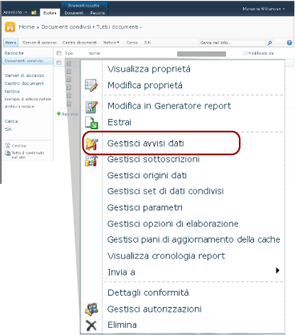

# Gestione avvisi dati per utenti di SharePoint

[!INCLUDE [ssrs-appliesto](../includes/ssrs-appliesto.md)] [!INCLUDE [ssrs-appliesto-2016](../includes/ssrs-appliesto-2016.md)] [!INCLUDE [ssrs-appliesto-not-2017](../includes/ssrs-appliesto-not-2017.md)] [!INCLUDE[ssrs-appliesto-sharepoint-2013-2016i](../includes/ssrs-appliesto-sharepoint-2013-2016.md)] [!INCLUDE [ssrs-appliesto-not-pbirs](../includes/ssrs-appliesto-not-pbirs.md)]

[!INCLUDE [ssrs-previous-versions](../includes/ssrs-previous-versions.md)]

[!INCLUDE[ssRSnoversion](../includes/ssrsnoversion-md.md)] Reporting Services include Gestione avvisi dati, per consentire agli Information Worker di SharePoint di gestire gli avvisi dati. È possibile visualizzare informazioni sugli avvisi creati, eliminare avvisi, aprire definizioni di avviso per la modifica ed eseguire avvisi su richiesta. È possibile scegliere di visualizzare gli avvisi solo per un singolo report o per tutti i report. Nella figura seguente sono illustrate le funzionalità disponibili per gli Information Worker in Gestione avvisi dati.

  

> [!NOTE]
> L'integrazione di Reporting Services con SharePoint non è più disponibile nelle versioni successive a SQL Server 2016.

Quando un sito di SharePoint è abilitato per gli avvisi dati, vengono create e aggiunte al sito due pagine, ovvero MyDataAlerts.aspx e SiteDataAlerts.aspx. MyDataAlerts.aspx rappresenta Gestione avvisi dati per gli Information Worker di SharePoint. Gli Information Worker possono aprire Gestione avvisi dati dal menu di scelta rapida dei report in cui sono stati creati gli avvisi.  

 È inoltre possibile aprire Gestione avvisi dati direttamente utilizzando un URL. Di seguito è illustrata la sintassi dell'URL:  
  
 `http://<site name>/_layouts/ReportServer/MyDataAlerts.aspx`  
  
> [!NOTE]  
>  Prima di poter usare le funzionalità di avviso di [!INCLUDE[ssRSnoversion](../includes/ssrsnoversion-md.md)] , un amministratore deve concedere all'utente le autorizzazioni necessarie. Per informazioni sulle autorizzazioni richieste, vedere [Reporting Services Data Alerts](../reporting-services/reporting-services-data-alerts.md)(Avvisi dati di Reporting Services).  
  
##   Visualizzare le informazioni sugli avvisi dati  
 È possibile visualizzare un elenco degli avvisi dati creati nella finestra di progettazione Avviso dati. Per aprire Gestione avvisi dati, fare clic con il pulsante destro del mouse su un report pubblicato in una raccolta di SharePoint. L'immagine seguente illustra l'opzione **Gestisci avvisi dati** nel menu di scelta rapida del report.  
  
   
  
 In Gestione avvisi dati è inclusa una tabella in cui sono elencati il nome dell'avviso, il nome del report, il nome dell'utente che ha creato la definizione di avviso, il numero di volte in cui il messaggio di avviso è stato inviato, l'ultima esecuzione dell'avviso, l'ultima modifica alla definizione di avviso e lo stato del messaggio di avviso più recente. Se il messaggio di avviso non può essere generato o inviato, nella colonna relativa allo stato sono incluse informazioni sull'errore che consentono di risolvere i problemi relativi all'avviso. Per altre informazioni, vedere [Gestire gli avvisi dati in Gestione avvisi dati](../reporting-services/manage-my-data-alerts-in-data-alert-manager.md).  
  
 Nella tabella seguente sono illustrati i dati di esempio di una tabella di Gestione avvisi dati. Quando si verifica un errore, il messaggio di errore e l'identificatore della voce nel log (un GUID) vengono inclusi nel campo **Stato** nella tabella.  
  
|Nome dell'avviso|Nome del report|Creato da|Avvisi inviati|Ultima esecuzione|Data ultima modifica|Stato|  
|----------------|-----------------|----------------|-----------------|--------------|-------------------|------------|  
|SalesQTR|SalesByTerritoryAndQTR|Lauren Johnson|4|6/12/2011|6/1/2011|L'ultimo avviso è stato eseguito correttamente e l'avviso è stato inviato.|  
|UnitsSold|ProductsSalesByQTR|Lauren Johnson|2|7/1/2011|6/28/2011|L'ultimo avviso è stato eseguito correttamente, tuttavia i dati non sono stati modificati e non è stato inviato alcun avviso.|  
|TopPromotion|PromotionTracking|Lauren Johnson|0||5/23/2011|Avviso creato.|  
  
  
##   Eliminare avvisi dati  
 Le definizioni di avviso dati vengono eliminate da Gestione avvisi dati. Un Information Worker può eliminare le definizioni di avviso create personalmente. Non è possibile eliminare definizioni di avviso create da altri utenti. Per altre informazioni, vedere [Gestire gli avvisi dati in Gestione avvisi dati](../reporting-services/manage-my-data-alerts-in-data-alert-manager.md).  
  
 Quando si elimina una definizione di avviso, questa viene eliminata in modo permanente. Se si desidera solamente sospendere i messaggi di avviso, è necessario modificare il criterio di ricorrenza oppure la data di inizio e di fine nella definizione di avviso. Per altre informazioni, vedere [Modificare un avviso dati nella finestra di progettazione di avvisi](../reporting-services/edit-a-data-alert-in-alert-designer.md).  
  
  
##   Modificare avvisi dati  
 Un Information Worker può aprire le definizioni di avviso da modificare in Gestione avvisi dati. È possibile modificare le definizioni di avviso create personalmente, ma non quelle create da altri utenti. Quando si fa clic con il pulsante destro del mouse su una definizione di avviso e si sceglie **Modifica** , viene visualizzata la finestra di progettazione Avviso dati, in cui è visualizzata la definizione di avviso. Per altre informazioni, vedere [Finestra di progettazione Avviso dati](../reporting-services/data-alert-designer.md) e [Modificare un avviso dati nella finestra di progettazione di avvisi](../reporting-services/edit-a-data-alert-in-alert-designer.md).  
  
  
##   Eseguire avvisi dati  
 In Gestione avvisi dati sono incluse informazioni sull'ultima elaborazione della definizione di avviso da parte del servizio avvisi e sul numero di volte che il messaggio di avviso dati è stato inviato. Potrebbe essere necessario eseguire e inviare il messaggio di avviso immediatamente, anziché attendere per l'ora specificata nella pianificazione. Quando si esegue un avviso da Gestione avvisi dati, la pianificazione degli avvisi viene sovrascritta e l'elaborazione della definizione di avviso inizia entro un periodo compreso tra uno e cinque minuti, a seconda del tempo necessario per eseguire il report e di quanto è occupato il server di report nel momento in cui si sceglie di eseguire l'avviso. Se, tuttavia, è stato specificato che un messaggio deve essere inviato solamente se i risultati cambiano, ma i risultati non sono cambiati, non viene creato né inviato alcun messaggio. Per altre informazioni, vedere [Gestire gli avvisi dati in Gestione avvisi dati](../reporting-services/manage-my-data-alerts-in-data-alert-manager.md).  
  
> [!NOTE]  
>  Dopo avere fatto clic sull'opzione **Esegui**  , sono necessari alcuni secondi per aggiornare il valore della colonna **Stato** in modo da indicare che è in corso l'elaborazione dell'avviso. Se si fa clic sull'opzione **Esegui**  più volte, l'avviso verrà elaborato più volte. Questa operazione provoca un consumo inutile delle risorse del server di report e potrebbe avere un impatto sulle prestazioni del server di report. Per visualizzare informazioni aggiornate sull'avviso, fare clic sul pulsante Aggiorna del Web browser per verificare aggiornamenti di stato e altre informazioni.  
  
  
##   Attività correlate  
 In questa sezione sono elencate procedure tramite cui viene illustrata la gestione degli avvisi e la modifica delle definizioni di avviso.  
  
-   [Gestire gli avvisi dati in Gestione avvisi dati](../reporting-services/manage-my-data-alerts-in-data-alert-manager.md)  
  
-   [Modificare un avviso dati nella finestra di progettazione di avvisi](../reporting-services/edit-a-data-alert-in-alert-designer.md)  

## Vedere anche

[Finestra di progettazione Avviso dati](../reporting-services/data-alert-designer.md)   
[Creare un avviso dati nella finestra di progettazione Avviso dati](../reporting-services/create-a-data-alert-in-data-alert-designer.md)   
[Avvisi dati di Reporting Services](../reporting-services/reporting-services-data-alerts.md)  

Altre domande? [Visitare il forum su Reporting Services](http://go.microsoft.com/fwlink/?LinkId=620231)
