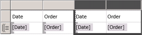
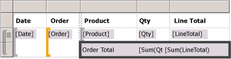
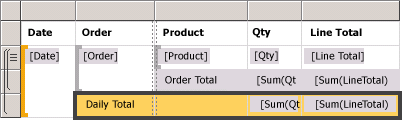
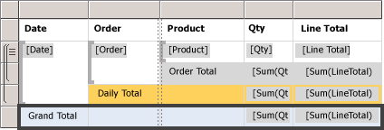
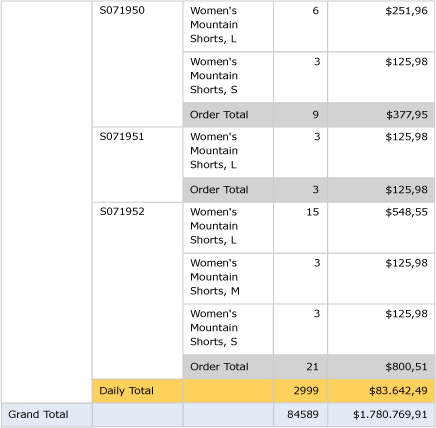

# Lesson 6: Adding Grouping and Totals (Reporting Services)
In questa lezione dell'esercitazione verranno aggiunti raggruppamenti e totali al report di [!INCLUDE[ssRSnoversion](../includes/ssrsnoversion-md.md)] per organizzare e riepilogare i dati.  
  
  
## Per raggruppare i dati di un report  
  
1.  Fare clic sulla scheda **Progettazione** .  
  
2.  Se il riquadro **Gruppi di righe** non è visualizzato, fare clic con il pulsante destro del mouse sull'area di progettazione e selezionare **Visualizza** e quindi scegliere **Raggruppamento**.  
  
3.  Dal riquadro dei **dati del report** trascinare il campo **Date** nel riquadro **Gruppi di righe** . Posizionarlo al di sopra della riga **(Dettagli)**.
  
    L'handle di riga contiene ora una parentesi quadra per mostrare un gruppo. La tabella presenta ora due colonne Date, una su ogni lato di una linea verticale tratteggiata.  
  
      
  
4.  Dal riquadro dei **dati del report** trascinare il campo **Order** nel riquadro **Gruppi di righe** . Posizionarlo al di sotto di Date e al di sopra di **(Dettagli)**.

   
  
    Note that the row handle now has two brackets in it , to show two groups. The table now has two **Order** columns, too.  
  
5.  Eliminare le colonne **Date** e **Order** originali a **destra** della linea doppia. Verranno rimossi i singoli valori dei record in modo da visualizzare solo il valore del gruppo. Selezionare gli handle delle due colonne, fare clic con il pulsante destro del mouse e scegliere **Elimina colonne**.  
  
      
  
6.  Fare clic con il pulsante destro del mouse nella cella contenente l'espressione per il campo `[Date]` e scegliere **Proprietà casella di testo**.  
  
7.  Fare clic su **Numero**, quindi selezionare **Data** nel campo **Categoria**.  
  
8.  Nella casella **Tipo** selezionare **31 Gennaio 2000**.  
  
9.  [!INCLUDE[clickOK](../includes/clickok-md.md)].  
  
10.  Per visualizzare un'anteprima del report, passare alla scheda **Anteprima** . Il risultato dovrebbe essere simile a quanto illustrato nella figura seguente:  
     
  
## Per aggiungere totali a un report  
  
1.  Passare alla Visualizzazione della struttura.  
  
2.  Fare clic con il pulsante destro del mouse sulla cella dell'area dati contenente il campo `[LineTotal]`e fare clic su **Aggiungi totale**.  
  
    Verrà aggiunta una riga con una somma degli importi di tutti gli ordini.  
  
3.  Fare clic con il pulsante destro del mouse sulla cella contenente il campo `[Qty]`e fare clic su **Aggiungi totale**.  
  
    Verrà aggiunta una somma delle quantità di tutti gli ordini alla riga dei totali.  
  
4.  Nella cella vuota a sinistra di `Sum[Qty]`digitare l'etichetta "**Order Total"**.  
  
5.  È possibile aggiungere un colore di sfondo alla riga dei totali. Selezionare le due celle della somma e la cella dell'etichetta.  
  
6.  Nel menu **Formato** selezionare **Colore di sfondo**, fare clic su **Grigio chiaro**e scegliere **OK**.  
  
      
  
## Per aggiungere un totale giornaliero a un report  
  
1.  Fare clic con il pulsante destro del mouse sulla cella **Order** , scegliere **Aggiungi totale**e quindi fare clic su **Dopo**.  
  
    Verrà aggiunta una nuova riga che contiene le somme delle quantità e degli importi di tutti i giorni e l'etichetta "**Total**" nella colonna Order.  
  
2.  Digitare la parola **Daily** prima della parola **Total** nella stessa cella in modo da definire la frase **Daily Total**.  
  
3.  Selezionare la cella **Daily Total** , le due celle **Sum** e la cella vuota compresa tra di esse.  
  
4.  Nel menu **Formato** selezionare **Colore di sfondo**, fare clic su **Arancione**e scegliere **OK**.  
  
      
  
## Per aggiungere un totale complessivo a un report  
  
1.  Fare clic con il pulsante destro del mouse sulla cella Date, scegliere **Aggiungi totale**e quindi fare clic su **Dopo**.  
  
    Verrà aggiunta una nuova riga che contiene le somme delle quantità e degli importi dell'intero report e l'etichetta **Total** nella colonna **Date** .  
  
2.  Digitare la parola **Grand** prima della parola **Total** nella stessa cella in modo da definire la frase **Grand Total**.  
  
3.  Selezionare la cella **Grand Total** , le due celle **Sum** e le celle vuote comprese tra di esse.  
  
4.  Nel menu **Formato** selezionare **Colore di sfondo**, fare clic su **Azzurro**e scegliere **OK**.  
  
      
  
5.  Fare clic su **Anteprima**.  
  
    L'ultima pagina dovrebbe essere simile all'immagine seguente. Nella barra degli strumenti fare clic su Ultima pagina .   
  
      
  
## Per pubblicare il report nel server di report (facoltativo)  
  
1.  Un passaggio facoltativo consiste nel pubblicare il report completato nel server di report in modalità nativa in modo che sia possibile visualizzare il report da Gestione report.  
  
2.  Fare clic sul menu **Progetto** e quindi su **Proprietà tutorial...**  
  
3.  In **TargetServerURL** digitare il nome del server di report in uso, ad esempio   
- `http:/<servername>/reportserver`  
   
- `http://localhost/reportserver` funziona se la progettazione del report viene eseguita nel server di report.  
  
  
4. Si noti che TargetReportFolder è l'esercitazione, il nome del progetto.  Questo è il nome della cartella in cui il report verrà distribuito nei passaggi successivi.  
5. Fare clic su **OK**.  
  
6.  Scegliere **Distribuisci Tutorial** dal menu **Compila**.  
  
    Se viene visualizzato un messaggio simile al seguente nella finestra di output, la distribuzione è stata completata correttamente.  
  
    > ------ Compilazione avviata: Progetto: tutorial, Configurazione: Debug ------  
    > 'Sales Orders.rdl' verrà ignorato. L'elemento è aggiornato.  
    > Compilazione completata -- 0 errori, 0 avvisi  
    > ------ Distribuzione avviata: Progetto: tutorial, Configurazione: Debug ------  
    > Distribuzione in http://[nome server]/reportserver  
    > Distribuzione report '/tutorial/Sales Orders'.  
    > Distribuzione completata -- 0 errori, 0 avvisi  
    > ========== Compilazione: 1 completate o aggiornate, 0 non riuscite, 0 ignorate ==========  
    > ========== Distribuzione: 1 completate, 0 non riuscite, 0 ignorate ==========  
  
    Se viene visualizzato un messaggio di errore simile al seguente, verificare di disporre delle autorizzazione per il server di report e di aver avviato [!INCLUDE[ssBIDevStudio](../includes/ssbidevstudio-md.md)] con privilegi di amministratore.  
  
    > "Le autorizzazioni concesse all'utente 'XXXXXXXX\\&lt;nome utente&gt;' non sono sufficienti per eseguire questa operazione"  
  
7.  Accedere al portale Web con privilegi di amministratore, ad esempio, fare clic con il pulsante destro del mouse sull'icona di Internet Explorer e scegliere **Esegui come amministratore**.  
  
    Individuare l'URL del portale Web [!INCLUDE[ssRSnoversion_md](../includes/ssrsnoversion-md.md)] .   
    **Nota:** l'URL del *portale* è "Reports", non l'URL del *server* di report di "Reportserver".  Ad esempio   
    - `http://<server name>/reports`.  
     - `http://localhost/reports` funziona se la progettazione del report viene eseguita nel server di report.  
  
8.  Passare alla cartella che contiene il report. Il nome predefinito è *tutorial*, il nome del progetto o il nome digitato nel campo TargetReportFolder nelle proprietà del progetto.   
Fare clic sul nome del report **Sales Orders** per visualizzare il report visualizzabile nel browser.  
  
      
 
**Questo passaggio conclude l'esercitazione relativa alla creazione di un report tabella semplice.**  
  
## Vedere anche  
[Filtro, raggruppamento e ordinamento di dati &#40;Generatore report e SSRS&#41;](../reporting-services/report-design/filter-group-and-sort-data-report-builder-and-ssrs.md)  
  
  
  

