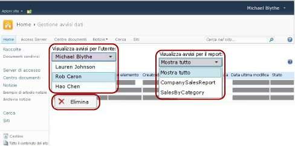

# Gestire tutti gli avvisi dati in un sito di SharePoint con Gestione avvisi dati
  Gli amministratori di avvisi di SharePoint possono visualizzare un elenco degli avvisi dati creati da qualsiasi utente del sito e le informazioni sugli avvisi. Gli amministratori di avvisi possono inoltre eliminare avvisi. Nella figura seguente sono illustrate le funzionalità disponibili per gli amministratori di avvisi in Gestione avvisi dati.  
  
   
  
### Per visualizzare un elenco di avvisi creati da un utente del sito  
  
1.  Passare al sito di SharePoint in cui sono state salvate le definizioni di avviso dati.  
  
2.  Nella home page fare clic su **Azioni sito**.  
  
3.  Scorrere verso la parte inferiore dell'elenco e fare clic su **Impostazioni sito**.  
  
4.  In **Reporting Services** fare clic su **Gestisci avvisi dati**.  
  
5.  Fare clic sulla freccia a discesa dall'elenco **Visualizza avvisi per l'utente** e selezionare l'utente di cui visualizzare gli avvisi.  
  
6.  Fare clic sulla freccia a discesa dell'elenco **Visualizza avvisi per il report** e selezionare un avviso specifico da visualizzare o fare clic su **Mostra tutto** per elencare tutti gli avvisi creati dall'utente selezionato.  
  
     In una tabella sono elencati il nome, il nome del report, il nome dell'utente che ha creato l'avviso dati, il numero di volte che l'avviso dati è stato inviato, l'ultima modifica della definizione di avviso dati e lo stato dell'avviso dati. Se l'avviso dati non può essere generato o inviato, nella colonna relativa allo stato sono incluse informazioni sull'errore che consentono di risolvere il problema.  
  
### Per eliminare una definizione di avviso  
  
-   Fare clic con il pulsante destro del mouse sull'avviso dati da eliminare e quindi fare clic su **Elimina**.  
  
    > [!NOTE]  
    >  Dopo avere eliminato l'avviso, non verranno inviati ulteriori messaggi di avviso. Se tuttavia si esegue una query sul database di avvisi, è possibile trovare ancora la definizione di avviso. Il servizio avvisi consente di eseguire la pulizia in base a una pianificazione e la definizione di avviso verrà eliminata definitivamente alla successiva operazione di pulizia. L'intervallo di pulizia predefinito è impostato su 20 minuti. Questo e altri intervalli di pulizia sono configurabili. Per altre informazioni, vedere [Avvisi dati di Reporting Services](../reporting-services/reporting-services-data-alerts.md).  
  
## Vedere anche  
 [Gestione avvisi dati per gli amministratori di avvisi](../reporting-services/data-alert-manager-for-alerting-administrators.md)   
 [Avvisi dati di Reporting Services](../reporting-services/reporting-services-data-alerts.md)  
  
  