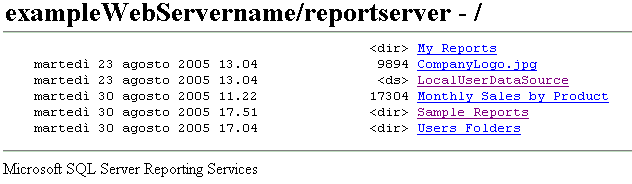

# Ricerca e visualizzazione di report con un browser (Generatore report e SSRS)
  È possibile utilizzare qualsiasi browser supportato per visualizzare un report tramite una connessione diretta a un server di report. A ogni report è associato un indirizzo URL che rimanda a un server di report. È possibile immettere l'indirizzo Web di un report per aprirlo in una finestra del browser indipendentemente da un'applicazione Web. Il report viene aperto in formato HTML e include la barra degli strumenti del report, pertanto è possibile navigare tra le pagine o effettuare ricerche nei valori dei dati all'interno del report. È possibile impostare i parametri nell'URL per nascondere la barra degli strumenti o selezionare il formato di output del report.  
  
 È consigliabile aprire un report tramite l'indirizzo Web se si desidera visualizzare un report ma non gestirlo. Non è infatti possibile accedere alle pagine delle proprietà di un elemento o alle pagine di definizione della sottoscrizione. Per tali attività è necessario utilizzare Gestione report o un sito di SharePoint.  
  
 Se non si conosce l'indirizzo Web di un report, è possibile utilizzare l'indirizzo Web del server di report e quindi esplorare la gerarchia delle cartelle del server di report per selezionare il report che si desidera visualizzare. Nella figura seguente viene illustrata una gerarchia di cartelle visualizzata in una finestra del browser.  
  
   
Cartelle visualizzate in un browser  
  
> [!NOTE]  
>  Se si accede a un report tramite un dispositivo palmare, per aprire il report sarà necessario utilizzare un browser. Gestione report non è supportato nei dispositivi palmari.  
  
 Per ulteriori informazioni sui tipi di browser che è possibile utilizzare, vedere "Tipi di browser supportati da Reporting Services" nella [documentazione relativa a Reporting Services](http://go.microsoft.com/fwlink/?linkid=121312) inclusa nella documentazione online di SQL Server.  
  
> [!NOTE]  
>  [!INCLUDE[ssRBRDDup](../../includes/ssrbrddup-md.md)]  
  
## Navigazione delle cartelle del server di report in un browser  
 È possibile utilizzare un browser per navigare tra le cartelle di un server di report ed eseguire report. I report e gli elementi vengono visualizzati come collegamenti nella gerarchia di cartelle. È possibile fare clic sui collegamenti per aprire report, risorse o cartelle oppure visualizzare il contenuto di un'origine dei dati condivisa. La navigazione della gerarchia di cartelle può risultare utile se non si conosce l'URL di un report. È possibile specificare l'indirizzo Web del server di report per aprire una connessione tramite browser in corrispondenza del nodo radice della gerarchia di cartelle e quindi fare clic sui collegamenti delle cartelle per navigare nella gerarchia.  
  
 Quando si accede a una directory virtuale del server di report, è possibile visualizzare solo le cartelle, i report e gli elementi caricati per i quali si dispone delle autorizzazioni di accesso. Nell'interfaccia utente vengono visualizzate solo la gerarchia di cartelle e alcune informazioni di base quali la data di creazione o di modifica, le dimensioni del file e il tipo di elemento per i singoli elementi:  
  
-   Un collegamento senza nessun altro indicatore rappresenta un report o un modello.  
  
-   Il tag \<ds> indica un'origine dati condivisa.  
  
-   Il tag \<dir> indica una cartella.  
  
-   Un'estensione del nome file rappresenta una risorsa. L'estensione identifica il tipo MIME della risorsa. Ad esempio, l'estensione jpg indica un'immagine in formato JPEG.  
  
## Digitazione dell'URL di un report  
 [!INCLUDE[ssRSnoversion](../../includes/ssrsnoversion-md.md)] è supportato l'accesso tramite URL a elementi specifici disponibili in un server di report. URL deve includere il percorso completo del report e i comandi per eseguire il rendering del report. Se il report include parametri, è inoltre necessario specificare eventuali valori richiesti per aprire il report. Se per un report si digita un URL che comprende spazi nel percorso, valori di parametro o un'estensione per il rendering, è necessario includere caratteri codificati nell'URL per ottenere il risultato desiderato. Nell'esempio riportato di seguito viene illustrato l'URL di un report che include la codifica per gli spazi nel nome del percorso, parametri e un'estensione per il rendering:  
  
 `http://<Webservername>/reportserver?/<reportfolder>/employee+sales+summary&ReportYear=2004&ReportMonth=06&EmpID=24&rs:Command=Render&rs:Format=HTML4.0`  
  
 Il limite massimo per un URL in Internet Explorer è 2.083 caratteri. Per ulteriori informazioni, vedere [Lunghezza massima degli URL in Internet Explorer](http://support.microsoft.com/kb/208427).  
  
 Per ulteriori informazioni sull'accesso a un report tramite un URL, incluse le informazioni sulla sintassi dell'URL, vedere "Accesso con URL" nella [documentazione relativa a Reporting Services](http://go.microsoft.com/fwlink/?linkid=121312) all'interno della documentazione online di SQL Server.  
  
  
