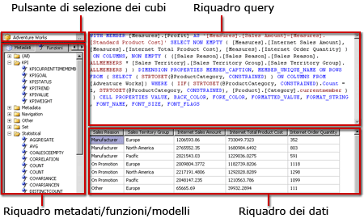

# Interfaccia utente di Progettazione query MDX di Analysis Services
  [!INCLUDE[ssRSnoversion](../../includes/ssrsnoversion-md.md)] sono disponibili finestre Progettazione query con interfaccia grafica per la compilazione di query MDX (Multidimensional Expression) e query DMX (Data Mining Expression) per un'origine dati di [!INCLUDE[ssASnoversion](../../includes/ssasnoversion-md.md)] . In questo argomento viene descritto Progettazione query MDX. Per altre informazioni sulla finestra Progettazione query DMX, vedere [Tipo di connessione di Analysis Services per DMX &#40;SSRS&#41;](../../reporting-services/report-data/analysis-services-connection-type-for-dmx-ssrs.md).  
  
 Nella finestra Progettazione query con interfaccia grafica MDX sono disponibili due modalità: progettazione e query. In ogni modalità è disponibile un riquadro dei metadati dal quale è possibile trascinare membri dei cubi selezionati per compilare una query MDX che recupera dati quando il report viene elaborato.  
  
> [!IMPORTANT]  
>  Gli utenti accedono alle origini dati quando creano ed eseguono query. È necessario concedere autorizzazioni minime per le origini dati, ad esempio autorizzazioni di sola lettura.  
  
> [!NOTE]  
>  L'importazione di una query con estensione mdx da un file non è supportata.  
  
## Progettazione query MDX in modalità progettazione  
 Quando si modifica una query MDX per un set di dati del report, la finestra Progettazione query MDX con interfaccia grafica verrà aperta in modalità progettazione.  
  
 Nella figura seguente vengono etichettati i riquadri per la modalità progettazione.  
  
   
  
 Nella tabella seguente vengono elencati i riquadri disponibili in questa modalità:  
  
|Riquadro|Funzione|  
|----------|--------------|  
|Pulsante Seleziona cubo (**...**)|Consente di visualizzare il cubo attualmente selezionato.|  
|Riquadro dei metadati|Consente di visualizzare un elenco gerarchico di misure, indicatori di prestazioni chiave (KPI) e dimensioni definiti sul cubo selezionato.|  
|Riquadro Membri calcolati|Consente di visualizzare i membri calcolati attualmente definiti disponibili per l'utilizzo nella query.|  
|Riquadro Filtro|Consente di scegliere dimensioni e gerarchie correlate per filtrare i dati a livello di origine e limitare i dati restituiti al report.|  
|Riquadro Dati|Consente di visualizzare le intestazioni di colonna per il set di risultati quando si trascinano gli elementi dal riquadro metadati e dal riquadro Membri calcolati. Consente di aggiornare automaticamente il set di risultati se viene selezionato il pulsante **Esecuzione automatica** . .|  
  
 È possibile trascinare dimensioni, misure e indicatori di prestazioni chiave (KPI) dal riquadro metadati e membri calcolati dal riquadro Membro calcolato nel riquadro Dati. Nel riquadro Filtro è possibile selezionare dimensioni e gerarchie correlate e impostare espressioni di filtro per limitare i dati disponibili per la query. Se il **esecuzione automatica** () interruttore nella barra degli strumenti è selezionata, la finestra Progettazione query viene eseguita la query ogni volta che si trascina un oggetto metadati nel riquadro dei dati. È possibile eseguire manualmente la query utilizzando il **eseguire** () sulla barra degli strumenti.  
  
 Quando si crea una query MDX in questa modalità, le seguenti proprietà aggiuntive vengono incluse automaticamente nella query:  
  
 **Proprietà membro** MEMBER_CAPTION, MEMBER_UNIQUE_NAME  
  
 **Proprietà cella** VALUE, BACK_COLOR, FORE_COLOR, FORMATTED_VALUE, FORMAT_STRING, FONT_NAME, FONT_SIZE, FONT_FLAGS  
  
 Per specificare le proprietà aggiuntive personalizzate, è necessario modificare manualmente la query MDX in modalità query.  
  
### Barra degli strumenti di Progettazione query MDX in modalità progettazione  
 I pulsanti della barra degli strumenti di Progettazione query consentono di progettare query MDX utilizzando l'interfaccia grafica. Nella tabella seguente vengono elencati i pulsanti con le relative funzioni.  
  
|Pulsante|Description|  
|------------|-----------------|  
|**Modifica come testo**|Non abilitato per questo tipo di origine dati.|  
|**Importa**|Consente di importare una query esistente da un file di definizione di report (con estensione rdl) nel file system. Per altre informazioni, vedere [Set di dati condivisi e incorporati del report &#40;Generatore report e SSRS&#41;](../../reporting-services/report-data/report-embedded-datasets-and-shared-datasets-report-builder-and-ssrs.md).|  
||Consente di passare al tipo di comando MDX.|  
||Consente di passare al tipo di comando DMX.|  
||Consente di aggiornare i metadati dall'origine dati.|  
||Consente di visualizzare la finestra di dialogo **Generatore membri calcolati** ,|  
||Consente di visualizzare o nascondere le celle vuote nel riquadro Dati. Questa operazione equivale a utilizzare la clausola NON EMPTY in MDX.|  
||Consente di eseguire automaticamente la query e di visualizzarne i risultati ogni volta che viene apportata una modifica. I risultati verranno visualizzati nel riquadro Dati.|  
||Consente di visualizzare le aggregazioni nel riquadro Dati.|  
||Consente di eliminare dalla query la colonna selezionata nel riquadro Dati.|  
||Consente di visualizzare la finestra di dialogo **Parametri query** . Quando si specificano valori per un parametro di query, viene creato automaticamente un parametro di report con lo stesso nome. Il valore del parametro di query viene impostato su un'espressione che fa riferimento al parametro di report.|  
||Consente di preparare la query.|  
||Consente di eseguire la query di e visualizzare i risultati nel riquadro Dati.|  
||Consente di annullare la query.|  
||Consente di passare dalla modalità progettazione alla modalità query e viceversa.|  
  
## Progettazione query MDX in modalità query  
 Per modificare la finestra Progettazione query con interfaccia grafica attivando la modalità **Query** , fare clic sul pulsante **Modalità progettazione** sulla barra degli strumenti.  
  
 Nella figura seguente vengono etichettati i riquadri per la modalità query.  
  
   
  
 Nella tabella seguente vengono elencati i riquadri disponibili in questa modalità:  
  
|Riquadro|Funzione|  
|----------|--------------|  
|Pulsante Seleziona cubo (**...**)|Consente di visualizzare il cubo attualmente selezionato.|  
|Riquadro Metadati/Funzioni/Modelli|Consente di visualizzare un elenco gerarchico di misure, indicatori di prestazioni chiave (KPI) e dimensioni definiti sul cubo selezionato.|  
|Riquadro query|Consente di visualizzare il testo della query.|  
|Riquadro Risultati|Consente di visualizzare i risultati dell'esecuzione della query.|  
  
 Nel riquadro Metadati vengono visualizzate le schede **Metadati**, **Funzioni**e **Modelli**. Dalla scheda **Metadati** è possibile trascinare dimensioni, gerarchie, indicatori di prestazioni chiave (KPI) e misure nel riquadro Query MDX. Dalla scheda **Funzioni** è possibile trascinare funzioni nel riquadro Query MDX. Dalla scheda **Modelli** è possibile aggiungere modelli MDX al riquadro Query MDX. Quando si esegue la query, nel riquadro Risultati verranno visualizzati i risultati per la query MDX.  
  
 È possibile estendere la query MDX predefinita generata in modalità progettazione per includere proprietà del membro e della cella aggiuntive. Quando si esegue la query, questi valori non vengono visualizzati nel set di risultati, ma vengono passati nuovamente a [!INCLUDE[ssRSnoversion](../../includes/ssrsnoversion-md.md)] ed è possibile usarli in un report. Per altre informazioni, vedere [Proprietà di campo estese per un database di Analysis Services &#40;SSRS&#41;](../../reporting-services/report-data/extended-field-properties-for-an-analysis-services-database-ssrs.md).  
  
### Barra degli strumenti della finestra Progettazione query con interfaccia grafica in modalità query  
 I pulsanti della barra degli strumenti di Progettazione query consentono di progettare query MDX utilizzando l'interfaccia grafica.  
  
 I pulsanti della barra degli strumenti sono identici in modalità progettazione e in modalità query, ma i pulsanti seguenti non sono abilitati in modalità query:  
  
-   **Modifica come testo**  
  
-   **Aggiungi membro calcolato** ()  
  
-   **Mostra celle vuote** ()  
  
-   **Esecuzione automatica** ()  
  
-   **Mostra aggregazioni** ()  
  
## Vedere anche  
 [Definizione dei parametri in Progettazione Query MDX per Analysis Services &#40; Generatore report e SSRS &#41;](../../reporting-services/report-data/define-parameters-in-the-mdx-query-designer-for-analysis-services.md)   
 [Creare un set di dati condiviso o set di dati incorporato &#40; Generatore report e SSRS &#41;](../../reporting-services/report-data/create-a-shared-dataset-or-embedded-dataset-report-builder-and-ssrs.md)   
 [Tipo di connessione di Analysis Services per DMX &#40; SSRS &#41;](../../reporting-services/report-data/analysis-services-connection-type-for-dmx-ssrs.md)   
 [File di configurazione RSReportDesigner](../../reporting-services/report-server/rsreportdesigner-configuration-file.md)   
 [Tipo di connessione di Analysis Services per MDX &#40; SSRS &#41;](../../reporting-services/report-data/analysis-services-connection-type-for-mdx-ssrs.md)  
  
  
