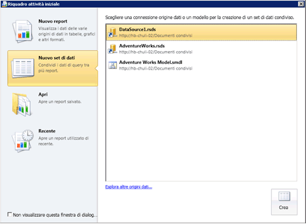

# Creare un set di dati condiviso o un set di dati incorporato (Generatore report e SSRS)
È possibile usare i set di dati incorporati in un singolo report [!INCLUDE[ssRSnoversion_md](../../includes/ssrsnoversion-md.md)] . I set di dati condivisi in un server di report possono essere ustati da più report, sia per dispositivi mobili che impaginati. Per creare un set di dati, è necessaria un'origine dati incorporata o condivisa.  
  
 Usare **Generatore report** per eseguire le operazioni seguenti:  
  
1.  Creare un set di dati condiviso nella visualizzazione di progettazione del set di dati. Nei set di dati condivisi devono essere usate origini dati condivise pubblicate.  
  
2.   Creare un set di dati incorporato nella visualizzazione di progettazione report.  
  
3.   Salvare il set di dati direttamente nel server di report o nel sito di SharePoint.  
  
 Usare **Progettazione report** in [!INCLUDE[ssBIDevStudioFull](../../includes/ssbidevstudiofull-md.md)] per eseguire le operazioni seguenti:  
  
1.  Creare un set di dati condiviso in Esplora soluzioni. Nei set di dati condivisi devono essere usate origini dati della cartella Origini dati condivise in Esplora soluzioni.  
  
2.  Creare un set di dati incorporato nel riquadro dei dati del report.  
  
3.  Facoltativamente, distribuire i set di dati condivisi e l'origine dati condivisa con il report. Per ogni tipo di elemento, usare Proprietà progetto per specificare i percorsi alle cartelle nel server di report o nel sito di SharePoint.  
  
 Per altre informazioni, vedere [Set di dati condivisi e incorporati del report &#40;Generatore report e SSRS&#41;](../../reporting-services/report-data/report-embedded-datasets-and-shared-datasets-report-builder-and-ssrs.md).  
  
> [!NOTE]  
>  [!INCLUDE[ssRBRDDup](../../includes/ssrbrddup-md.md)]  
  
## Per aprire Generatore report e creare un set di dati condiviso  
  
1.  Aprire Generatore report. Viene visualizzato il riquadro **Nuovo report o set di dati** , come illustrato nella figura seguente:  
  
       
  
    > [!NOTE]  
    >  Se il riquadro **Nuovo report o set di dati** non viene visualizzato, dal pulsante Generatore report fare clic su **Nuovo**.  
  
2.  Nel riquadro sinistro, sotto **Crea un set di dati**, fare clic su **Set di dati condiviso**.  
  
3.  Nel riquadro destro fare clic su **Sfoglia** per selezionare un'origine dati condivisa dal server di report, quindi fare clic su **Crea**. Viene visualizzata la finestra Progettazione query associata all'origine dati condivisa.  
  
4.  In Progettazione query specificare i campi da includere nel set di dati.  
  
5.  Scegliere **Esegui** (**!**) per eseguire la query.  
  
6.  Sul pulsante **Generatore report** fare clic su **Salva** o su **Salva con nome** per salvare il set di dati condiviso nel server di report.  
  
7.  Per uscire da Generatore report fare clic su **Generatore report**, quindi su **Esci da Generatore report**. Per usare report, fare clic su **Generatore report**, quindi su **Nuovo** o **Apri**.  
  
## Per impostare opzioni del parametro query  
  
1.  Aprire Generatore report.  
  
2.  Fare clic su **Apri**.  
  
3.  Selezionare il server di report e scegliere la cartella per l'origine dati condivisa.  
  
4.  In **Elementi di tipo**fare clic su Set di dati (*.rsd) nell'elenco a discesa.  
  
5.  Selezionare il set di dati condiviso, quindi fare clic su **Apri**. Viene visualizzata la finestra Progettazione query associata.  
  
6.  Sulla barra multifunzione fare clic su **Proprietà set di dati**.  
  
7.  Fare clic su **Parametri**. In questa pagina impostare un valore predefinito su una costante o un'espressione e contrassegnare il parametro come di sola lettura, che ammette valori Null, o **Ometti dalla query**. Per altre informazioni, vedere [Parametri report (Generatore report e Progettazione report)](../../reporting-services/report-design/report-parameters-report-builder-and-report-designer.md).  
  
8.  [!INCLUDE[clickOK](../../includes/clickok-md.md)]  

  
## Per creare un set di dati da un database relazionale di SQL Server  
  
1.  Nel riquadro dei dati del report fare clic con il pulsante destro del mouse sul nome dell'origine dati, quindi scegliere **Aggiungi set di dati**. Viene visualizzata la pagina **Query** della finestra di dialogo **Proprietà set di dati** .  
  
2.  In **Nome**digitare un nome per il set di dati oppure accettare quello predefinito.  
  
    > [!NOTE]  
    >  Il nome del set di dati viene usato internamente nell'ambito del report. Per maggiore chiarezza, è consigliabile scegliere per il set di dati un nome che descriva i dati restituiti dalla query.  
  
3.  In **Origine dati**individuare e selezionare il nome di un'origine dati condivisa o fare clic su **Nuova** per creare una nuova origine dati incorporata.  
  
4.  Selezionare un'opzione per **Tipo di query** . Le opzioni variano a seconda del tipo di origine dati.  
  
    -   Selezionare **Text** per creare una query basata sul linguaggio di query dell'origine dei dati.  
  
    -   Selezionare **TableDirect** per restituire tutti i campi di una tabella di un database relazionale.  
  
    -   Selezionare **StoredProcedure** per eseguire una stored procedure in base al nome.  
  
5.  In **Query**digitare il nome della query, della stored procedure o della tabella. In alternativa, fare clic su **Progettazione query** per aprire la finestra Progettazione query con interfaccia grafica o basata su testo oppure su **Importa** per importare la query da un report esistente.  
  
     In alcuni casi, la raccolta di campi specificata dalla query può essere determinata solo eseguendo la query nell'origine dati. Una stored procedure, ad esempio, può restituire un set variabile di campi nel set di risultati. Fare clic su **Aggiorna campi** per eseguire la query nell'origine dati e recuperare i nomi di campo necessari per popolare la raccolta di campi del set di dati nel riquadro dei dati del report. La raccolta di campi viene visualizzata sotto il nodo del set di dati dopo avere chiuso la finestra di dialogo **Proprietà set di dati** .  
  
6.  Nella casella **Timeout**digitare per quanti secondi il server di report deve attendere una risposta dal database. Il valore predefinito è 0 secondi. Quando il valore di timeout è 0 secondi, alla query non viene applicato alcun timeout.  
  
7.  [!INCLUDE[clickOK](../../includes/clickok-md.md)]  
  
     Il set di dati e la relativa raccolta di campi verranno visualizzati nel riquadro dei dati del report sotto il nodo dell'origine dati.  
  
## Vedere anche  
 [Set di dati condivisi e incorporati del report &#40;Generatore report e SSRS&#41;](../../reporting-services/report-data/report-embedded-datasets-and-shared-datasets-report-builder-and-ssrs.md)   
 [Raccolta di campi del set di dati &#40;Generatore report e SSRS&#41;](../../reporting-services/report-data/dataset-fields-collection-report-builder-and-ssrs.md)   
 [Set di dati del report &#40;SSRS&#41;](../../reporting-services/report-data/report-datasets-ssrs.md)   
 [Connessioni dati, origini dati e stringhe di connessione &#40;Generatore report e SSRS&#41;](http://msdn.microsoft.com/library/7e103637-4371-43d7-821c-d269c2cc1b34)   
 [Set di dati condivisi e incorporati &#40;Generatore report e SSRS&#41;](../../reporting-services/report-data/embedded-and-shared-datasets-report-builder-and-ssrs.md)  
  
  

