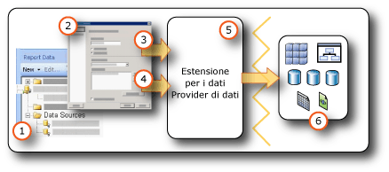

# <a name="data-connections-data-sources-and-connection-strings-report-builder-and-ssrs"></a>Connessioni dati, origini dati e stringhe di connessione in Generatore report e SSRS

[!INCLUDE [ssrs-appliesto](../../includes/ssrs-appliesto.md)] [!INCLUDE [ssrs-appliesto-2016-and-later](../../includes/ssrs-appliesto-2016-and-later.md)] [!INCLUDE[ssrs-appliesto-pbirsi](../../includes/ssrs-appliesto-pbirs.md)] [!INCLUDE[ssrs-appliesto-sharepoint-2013-2016i](../../includes/ssrs-appliesto-sharepoint-2013-2016.md)]

[!INCLUDE [ssrs-previous-versions](../../includes/ssrs-previous-versions.md)]

  Per includere i dati in report impaginati di [!INCLUDE[ssRBnoversion](../../includes/ssrbnoversion-md.md)] e  [!INCLUDE[ssRSnoversion](../../includes/ssrsnoversion-md.md)] , è necessario creare prima le *origini dati* e i *set di dati*. Questo argomento illustra il tipo di origini dati, come creare le origini dati e informazioni importanti relative alle credenziali delle origini dati. Un'origine dati include il tipo di origine dati, le informazioni di connessione e il tipo di credenziali da usare. Esistono due tipi di origini dati, ovvero incorporate e condivise. Un'origine dati incorporata viene definita nel report e viene utilizzata solo dal report specifico, mentre un'origine dati condivisa viene definita indipendentemente da un report e può essere utilizzata da più report. Per ulteriori informazioni, vedere [incorporata e set di dati condivisi &#40; Generatore report e SSRS &#41; ](../../reporting-services/report-data/embedded-and-shared-datasets-report-builder-and-ssrs.md).  

> [!NOTE]  
>  [!INCLUDE[ssRBRDDup](../../includes/ssrbrddup-md.md)]
  
##  <a name="bkmk_data_sources"></a> Origini dati incorporate e condivise  
 Le origini dati condivise sono utili quando si usano spesso le stesse origini dati. Si consiglia di usare le origini dati condivise il più possibile. Rendono i report e l'accesso ai report più facile da gestire, offrono una maggiore protezione dei report e delle origini dati usate. Se è necessaria un'origine dati condivisa, chiedere all'amministratore di sistema di creare una.  
  
 Una connessione a un'origine dati incorporata è una connessione dati salvata nella definizione del report. Le informazioni di connessione a un'origine dati incorporata possono essere usate solo dal report che la contiene. Per definire e gestire le origini dati incorporate, usare la finestra di dialogo **Proprietà origine dati** .  
  
 La differenza tra le origini dati incorporate e quelle condivise dipende dalle diverse modalità di creazione, archiviazione e gestione.  
  
-   In Progettazione report creare origini dati incorporate o condivise come parte di un progetto di [!INCLUDE[ssBIDevStudioFull](../../includes/ssbidevstudiofull-md.md)] . È possibile controllare se utilizzarle in locale per l'anteprima o distribuirle come parte del progetto in un server di report o in un sito di SharePoint. È possibile utilizzare estensioni per i dati personalizzate installate nel computer e nel server di report o nel sito di SharePoint dove vengono distribuiti i report.  
  
     Gli amministratori di sistema possono installare e configurare estensioni per l'elaborazione dati e provider di dati .NET Framework aggiuntivi. Per altre informazioni, vedere [Estensioni per l'elaborazione dati e provider di dati .NET Framework &#40;SSRS&#41;](../../reporting-services/report-data/data-processing-extensions-and-net-framework-data-providers-ssrs.md).  
  
     Gli sviluppatori possono usare l'API <xref:Microsoft.ReportingServices.DataProcessing> per creare estensioni per l'elaborazione dati che supportino ulteriori tipi di origine dati.  
  
-   In [!INCLUDE[ssRBnoversion](../../includes/ssrbnoversion-md.md)]accedere a un server di report o a un sito di SharePoint e selezionare le origini dati condivise oppure creare origini dati incorporate nel report. Non è possibile creare un'origine dati condivisa in [!INCLUDE[ssRBnoversion](../../includes/ssrbnoversion-md.md)], né usare estensioni per i dati personalizzate in [!INCLUDE[ssRBnoversion](../../includes/ssrbnoversion-md.md)].  
  
 La tabella seguente riepiloga le differenze fra le origini dati incorporate e quelle condivise.  
  
|Description|Origine dati<br /><br /> origine dati|Condivisa<br /><br /> origine dati|  
|-----------------|------------------------------|----------------------------|  
|La connessione dati è incorporata nella definizione del report.|||  
|Il puntatore alla connessione dati nel server di report è incorporato nella definizione del report.|||  
|Gestita nel server di report|||  
|Richiesta per i set di dati condivisi|||  
|Richiesta per i componenti|||  
  
##  <a name="bkmk_DataConnections"></a> Estensioni per i dati predefinite  
 Le estensioni per i dati predefinite in [!INCLUDE[ssRSnoversion](../../includes/ssrsnoversion-md.md)] includono i tipi di connessioni dati seguenti:  
  
-   Database SQL di Microsoft SQL Server e Microsoft Azure
  
-   Microsoft SQL Server Analysis Services  
  
-   Elenco Microsoft SharePoint  
  
-   [!INCLUDE[ssSDSFull](../../includes/sssdsfull-md.md)]  
  
-   Microsoft SQL Server Parallel Data Warehouse  
  
-   OLE DB  
  
-   Oracle  
  
-   SAP NetWeaver BI  
  
-   Hyperion Essbase  
  
-   Teradata  
  
-   XML  
  
-   ODBC  
  
-   Microsoft BI Semantic Model per Power View: in un sito di SharePoint configurato per una raccolta [!INCLUDE[ssGemini](../../includes/ssgemini-md.md)] e [!INCLUDE[ssCrescent](../../includes/sscrescent-md.md)], questo tipo di origine dati è disponibile. Questo tipo di origine dati viene usato solo per le presentazioni [!INCLUDE[ssCrescent](../../includes/sscrescent-md.md)] . Per altre informazioni, vedere il video relativo alla [creazione di modelli tabulari BI Semantic perfetti per Power View](http://technet.microsoft.com/video/building-the-perfect-bi-semantic-tabular-models-for-power-view.aspx).  
  
 Per un elenco completo di origini dati e versioni supportate da [!INCLUDE[ssRSnoversion](../../includes/ssrsnoversion-md.md)], vedere [Origini dati supportate da Reporting Services &#40;SSRS&#41;](../../reporting-services/report-data/data-sources-supported-by-reporting-services-ssrs.md).  
  
## <a name="data-in-includessrbnoversionincludesssrbnoversion-mdmd"></a>Dati in [!INCLUDE[ssRBnoversion](../../includes/ssrbnoversion-md.md)]  
   
  
1.  **Origini dati nel riquadro dei dati del report** Un'origine dati viene visualizzata nel riquadro dei dati del report in seguito alla creazione di un'origine dati incorporata o all'aggiunta di un'origine dati condivisa.  
  
2.  **Finestra di dialogo Connessione** Usare la finestra di dialogo Connessione per compilare o incollare una stringa di connessione.  
  
3.  **Informazioni sulla connessione dati** La stringa di connessione viene passata all'estensione per i dati.  
  
4.  **Credenziali** Le credenziali vengono gestite separatamente dalla stringa di connessione.  
  
5.  **Estensioni dati/provider di dati** La connessione ai dati può avvenire attraverso più livelli di accesso ai dati.  
  
6.  **Origini dati esterne** È possibile recuperare dati da database relazionali, database multidimensionali, elenchi SharePoint, servizi Web o modelli di report.  
  
##  <a name="bkmk_connection_examples"></a> Esempi comuni di stringhe di connessione  
 Le stringhe di connessione sono la rappresentazione di testo delle proprietà di connessione per un provider di dati. Nella tabella seguente sono elencati esempi di stringhe di connessione per diversi tipi di connessione dati.  
 
 > [!NOTE]  
>  Un'altra risorsa per ottenere esempi di stringhe di connessione è[ConnectionStrings.com](http://www.connectionstrings.com/) . 
  
|**Data source**|**Esempio**|**Description**|  
|---------------------|-----------------|---------------------|  
|Database SQL Server sul server locale|`data source="(local)";initial catalog=AdventureWorks`|Impostare il tipo di origine dati su **Microsoft SQL Server**. Per altre informazioni, vedere [Tipo di connessione SQL Server &#40;SSRS&#41;](../../reporting-services/report-data/sql-server-connection-type-ssrs.md).|  
|Istanza di SQL Server<br /><br /> database|`Data Source=localhost\MSSQL13.<InstanceName>; Initial Catalog=AdventureWorks`|Impostare il tipo di origine dati su **Microsoft SQL Server**.|  
|Database SQL Server Express|`Data Source=localhost\MSSQL13.SQLEXPRESS; Initial Catalog=AdventureWorks`|Impostare il tipo di origine dati su **Microsoft SQL Server**.|  
|Database SQL di Azure|`Data Source=<host>;Initial Catalog=AdventureWorks; Encrypt=True`|Impostare il tipo di origine dati su **Database SQL di Microsoft Azure**. Per altre informazioni, vedere [Tipo di connessione SQL Azure &#40;SSRS&#41;](../../reporting-services/report-data/sql-azure-connection-type-ssrs.md).|  
|SQL Server Parallel Data Warehouse|`HOST=<IP address>;database= AdventureWorks; port=<port>`|Impostare il tipo di origine dati su **Microsoft SQL Server Parallel Data Warehouse**. Per altre informazioni, vedere [Tipo di connessione SQL Server Parallel Data Warehouse &#40;SSRS&#41;](../../reporting-services/report-data/sql-server-parallel-data-warehouse-connection-type-ssrs.md).|  
|Database Analysis Services sul server locale|`data source=localhost;initial catalog=Adventure Works DW`|Impostare il tipo di origine dati su **Microsoft SQL Server Analysis Services**. Per ulteriori informazioni, vedere [tipo di connessione di Analysis Services per MDX &#40; SSRS &#41; ](../../reporting-services/report-data/analysis-services-connection-type-for-mdx-ssrs.md) o [tipo di connessione di Analysis Services per DMX &#40; SSRS &#41; ](../../reporting-services/report-data/analysis-services-connection-type-for-dmx-ssrs.md).|  
|Database modello tabulare di Analysis Services con la prospettiva Sales|`Data source=<servername>;initial catalog= Adventure Works DW;cube='Sales’`|Impostare il tipo di origine dati su **Microsoft SQL Server Analysis Services**. Specificare il nome della prospettiva nell'impostazione cube=. Per altre informazioni, vedere [Prospettive &#40;SSAS tabulare&#41;](../../analysis-services/tabular-models/perspectives-ssas-tabular.md).|  
|Origine dati del modello di report su un server di report configurato in modalità nativa|`Server=http://myreportservername/reportserver; datasource=/models/Adventure Works`|Specificare l'URL del server di report o della raccolta documenti e il percorso di un modello pubblicato nello spazio dei nomi della cartella del server di report o della raccolta documenti. Per ulteriori informazioni, vedere [connessione del modello di Report &#40; SSRS &#41; ](../../reporting-services/report-data/report-model-connection-ssrs.md).|  
|Origine dati del modello di report su un server di report configurato in modalità integrata SharePoint|`Server=http://server; datasource=http://server/site/documents/models/Adventure Works.smdl`|Specificare l'URL del server di report o della raccolta documenti e il percorso di un modello pubblicato nello spazio dei nomi della cartella del server di report o della raccolta documenti.|  
|[!INCLUDE[ssNoVersion](../../includes/ssnoversion-md.md)] Server [!INCLUDE[ssASnoversion](../../includes/ssasnoversion-md.md)] 2000|`provider=MSOLAP.2;data source=<remote server name>;initial catalog=FoodMart 2000`|Impostare il tipo di origine dati sul **Provider Microsoft OLE DB per OLAP Services 8.0**.<br /><br /> È possibile ottenere una connessione più veloce alle origini dati di [!INCLUDE[ssNoVersion](../../includes/ssnoversion-md.md)] 2000 [!INCLUDE[ssASnoversion](../../includes/ssasnoversion-md.md)] impostando la proprietà **ConnectTo** su **8.0**. Per impostare questa proprietà, usare la finestra di dialogo **Proprietà connessione** nella scheda **Proprietà avanzate** .|  
|Server Oracle|`data source=myserver`|Impostare il tipo di origine dati su **Oracle**. È necessario installare gli strumenti client Oracle nel computer di Progettazione report e nel server di report. Per altre informazioni, vedere [Tipo di connessione Oracle &#40;SSRS&#41;](../../reporting-services/report-data/oracle-connection-type-ssrs.md).|  
|Origine dati SAP NetWeaver BI|`DataSource=http://mySAPNetWeaverBIServer:8000/sap/bw/xml/soap/xmla`|Impostare il tipo di origine dati su **SAP NetWeaver BI**. Per altre informazioni, vedere [Tipo di connessione SAP NetWeaver BI &#40;SSRS&#41;](../../reporting-services/report-data/sap-netweaver-bi-connection-type-ssrs.md).|  
|Origine dati Hyperion Essbase|`Data Source=http://localhost:13080/aps/XMLA; Initial Catalog=Sample`|Impostare il tipo di origine dati su **Hyperion Essbase**. Per altre informazioni, vedere [Tipo di connessione Hyperion Essbase &#40;SSRS&#41;](../../reporting-services/report-data/hyperion-essbase-connection-type-ssrs.md).|  
|Origine dati Teradata|`data source=`\<NNN >. \<NNN >. \<NNN >. \<NNN >`;`|Impostare il tipo di origine dati su **Teradata**. La stringa di connessione è un indirizzo IP (Internet Protocol) nel formato in quattro campi, ognuno dei quali può contenere da una a tre cifre. Per ulteriori informazioni, vedere [tipo di connessione Teradata &#40; SSRS &#41; ](../../reporting-services/report-data/teradata-connection-type-ssrs.md).|  
|Origine dati Teradata|`Database=`*\<database name>* `; data source=` *\<NN*N*>.\< NNN >. \<NNN>. \<N*NN*>*`;Use X Views=False;Restrict to Default Database=True`|Impostare il tipo di origine dati su **Teradata**, analogamente all'esempio precedente. Utilizzare solo il database predefinito specificato nel tag Database e non individuare automaticamente le relazioni dei dati.|  
|Origine dati XML, servizio Web|`data source=http://adventure-works.com/results.aspx`|Impostare il tipo di origine dati su **XML**. La stringa di connessione è un URL per un servizio Web che supporta Web Services Definition Language (WSDL). Per ulteriori informazioni, vedere [tipo di connessione XML &#40; SSRS &#41; ](../../reporting-services/report-data/xml-connection-type-ssrs.md).|  
|Origine dati XML, documento XML|`http://localhost/XML/Customers.xml`|Impostare il tipo di origine dati su **XML**. La stringa di connessione è un URL per il documento XML.|  
|Origine dati XML, documento XML incorporato|*Vuoto*|Impostare il tipo di origine dati su **XML**. I dati XML vengono incorporati nella definizione del report.|  
|Elenco SharePoint|`data source=http://MySharePointWeb/MySharePointSite/`|Impostare il tipo di origine dati su **Elenco SharePoint**.|  
  
 Se non è possibile connettersi a un server di report usando **localhost**, verificare che il protocollo di rete per TCP/IP sia abilitato. Per altre informazioni, vedere [Configure Client Protocols](../../database-engine/configure-windows/configure-client-protocols.md).  
  
 Per altre informazioni sulle configurazioni necessarie per connettersi a questi tipi di origini dati, vedere l'argomento specifico relativo alla connessione dati in [Aggiungere dati da origini dati esterne &#40;SSRS&#41;](../../reporting-services/report-data/add-data-from-external-data-sources-ssrs.md) o [Origini dati supportate da Reporting Services &#40;SSRS&#41;](../../reporting-services/report-data/data-sources-supported-by-reporting-services-ssrs.md).  
  
##  <a name="bkmk_special_password_characters"></a> Caratteri speciali in una password  
 Se si configura l'origine dei dati ODBC o SQL per la richiesta di una password o l'inclusione della password nella stringa di connessione e un utente immette la password con caratteri speciali quali segni di punteggiatura, è possibile che alcuni driver dell'origine dei dati sottostante non convalidino i caratteri speciali. In tal caso, quando si elabora il report verrà visualizzato un messaggio che indica che la password non è valida. Se la modifica della password è complessa, è possibile rivolgersi all'amministratore del database per fare in modo che vengano archiviate sul server le credenziali appropriate come parte del nome di un'origine dei dati (DSN) ODBC del sistema. Per altre informazioni, vedere "OdbcConnection.ConnectionString" nella documentazione di [!INCLUDE[dnprdnshort](../../includes/dnprdnshort-md.md)] SDK.  
  
##  <a name="bkmk_Expressions_in_connection_strings"></a> Stringhe di connessione basate su espressioni  
 Le stringhe di connessione basate su espressioni vengono valutate in fase di esecuzione. È ad esempio possibile specificare l'origine dati come parametro, includere il riferimento del parametro nella stringa di connessione e consentire all'utente di scegliere un'origine dati per il report. Si supponga ad esempio che una società multinazionale abbia server dei dati in diversi paesi. Con una stringa di connessione basata su un'espressione, un utente che esegue un report relativo alle vendite può selezionare un'origine dei dati per un determinato paese prima dell'esecuzione del report.  
  
 Nell'esempio seguente viene illustrato l'utilizzo di un'espressione di origine dati in una stringa di connessione di [!INCLUDE[ssNoVersion](../../includes/ssnoversion-md.md)] . Nell'esempio si presuppone che sia stato creato un parametro di report denominato `ServerName`:  
  
```  
="data source=" & Parameters!ServerName.Value & ";initial catalog=AdventureWorks"  
```  
  
 Le espressioni delle origini dati vengono elaborate in fase di esecuzione oppure quando si visualizza l'anteprima di un report. L'espressione deve essere scritta in [!INCLUDE[vbprvb](../../includes/vbprvb-md.md)]. Utilizzare le linee guida seguenti per definire un'espressione di origine dati:  
  
-   Progettare il report utilizzando una stringa di connessione statica. Un stringa di connessione statica fa riferimento a una stringa di connessione che non viene impostata tramite un'espressione. Una stringa di connessione statica viene definita, ad esempio, quando si esegue la procedura per la creazione di un'origine dei dati in base al report o condivisa. L'utilizzo di una stringa di connessione statica consente all'utente di connettersi all'origine dei dati in Progettazione report per ottenere i risultati della query necessari per la creazione del report.  
  
-   Quando si definisce la connessione all'origine dei dati, non utilizzare un'origine dei dati condivisa. Non è possibile utilizzare un'espressione di origine dati in un'origine dati condivisa. È necessario definire un'origine dati incorporata per il report.  
  
-   Specificare le credenziali separatamente rispetto alla stringa di connessione. È possibile utilizzare credenziali archiviate, credenziali fornite dall'utente o sicurezza integrata.  
  
-   Aggiungere un parametro del report per specificare un'origine dei dati. Per i valori dei parametri è possibile specificare un elenco statico dei valori disponibili, in questo caso le origini dei dati che possono essere utilizzate per il report, oppure definire una query che recupera un elenco di origini dei dati in fase di esecuzione.  
  
-   Assicurarsi che l'elenco delle origini dei dati condivida lo stesso schema di database. Ogni progettazione di report inizia dalle informazioni relative allo schema. Se non c'è corrispondenza tra lo schema utilizzato per definire il report e lo schema effettivamente utilizzato dal report in fase di esecuzione, il report potrebbe non essere eseguito.  
  
-   Prima della pubblicazione del report, sostituire la stringa di connessione statica con un'espressione. Attendere di aver completato la progettazione del report prima di eseguire questa operazione. Dopo aver utilizzato un'espressione, non è possibile eseguire la query in Progettazione report. L'elenco dei campi del riquadro dei dati del report e l'elenco Parametri, inoltre, non verranno aggiornati automaticamente.  

## <a name="next-steps"></a>Passaggi successivi

[Creare, modificare ed eliminare origini dati condivise](../../reporting-services/report-data/create-modify-and-delete-shared-data-sources-ssrs.md)   
[Creare e modificare origini dati incorporate](../../reporting-services/report-data/create-and-modify-embedded-data-sources.md)   
[Impostare le proprietà di distribuzione](../../reporting-services/tools/set-deployment-properties-reporting-services.md)   
[Specificare le credenziali e le informazioni sulla connessione per le origini dati del report](../../reporting-services/report-data/specify-credential-and-connection-information-for-report-data-sources.md)  

Altre domande? [Visitare il forum su Reporting Services](http://go.microsoft.com/fwlink/?LinkId=620231)
