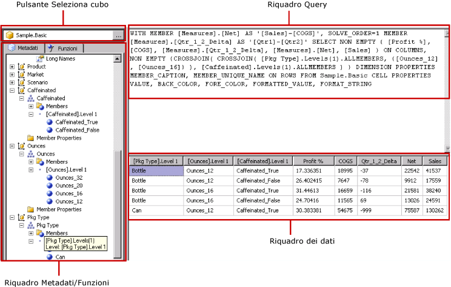

# Interfaccia utente di Progettazione query Hyperion Essbase
  In [!INCLUDE[ssRSnoversion](../../includes/ssrsnoversion-md.md)] è disponibile una finestra Progettazione query con interfaccia grafica per la compilazione di query MDX (Multidimensional Expression) per un'origine dati [!INCLUDE[extEssbase](../../includes/extessbase-md.md)]. Nella finestra Progettazione query con interfaccia grafica MDX sono disponibili due modalità: progettazione e query. In ogni modalità è disponibile un riquadro Metadati dal quale è possibile trascinare membri da un cubo selezionato nell'origine dei dati per compilare una query MDX che recuperi dati quando il report viene elaborato.  
  
> [!IMPORTANT]  
>  Gli utenti accedono alle origini dati quando creano ed eseguono query. È necessario concedere autorizzazioni minime per le origini dati, ad esempio autorizzazioni di sola lettura.  
  
 Per altre informazioni sull'uso di un'origine dati multidimensionale [!INCLUDE[extEssbase](../../includes/extessbase-md.md)], vedere [Tipo di connessione Hyperion Essbase &#40;SSRS&#41;](../../reporting-services/report-data/hyperion-essbase-connection-type-ssrs.md).  
  
 In questa sezione vengono descritti i pulsanti della barra degli strumenti e i riquadri di Progettazione query per ogni modalità della finestra Progettazione query con interfaccia grafica.  
  
## Finestra Progettazione query con interfaccia grafica in modalità progettazione  
 Quando si modifica una query MDX per un set di dati che utilizza un'origine dei dati [!INCLUDE[extEssbase](../../includes/extessbase-md.md)] , la finestra Progettazione query con interfaccia grafica verrà aperta in modalità progettazione.  
  
 Nella figura seguente vengono etichettati i riquadri per la modalità progettazione.  
  
   
  
 Nella tabella seguente vengono elencati i riquadri disponibili in questa modalità.  
  
|Riquadro|Funzione|  
|----------|--------------|  
|Pulsante Seleziona cubo|Consente di visualizzare il cubo attualmente selezionato.|  
|Riquadro dei metadati|Consente di visualizzare un elenco gerarchico di cubi.|  
|Riquadro Membri calcolati|Consente di visualizzare i membri calcolati attualmente definiti disponibili per l'utilizzo nella query.|  
|Riquadro Filtro|Consente di visualizzare i filtri da applicare nella query.|  
|Riquadro Dati|Consente di visualizzare i risultati dell'esecuzione della query.|  
  
 È possibile trascinare dimensioni e misure dal riquadro dei metadati e membri calcolati dal riquadro dei membri calcolati nel riquadro Dati. Se il pulsante Mostra/Nascondi **Esecuzione automatica** sulla barra degli strumenti è attivo, Progettazione query esegue la query ogni volta che si trascina un oggetto nel riquadro Dati. Se **Esecuzione automatica** non è attivo, Progettazione query non esegue la query quando il riquadro Dati viene modificato. È possibile eseguire manualmente la query utilizzando il pulsante **Esegui** sulla barra degli strumenti.  
  
 Nel riquadro Filtro è possibile selezionare i valori delle dimensioni per limitare i dati recuperati dall'origine dei dati. I valori definiti nel filtro della modalità progettazione vengono riportati nella clausola Where MDX in modalità query.  
  
### Barra degli strumenti della finestra Progettazione query con interfaccia grafica in modalità progettazione  
 I pulsanti della barra degli strumenti di Progettazione query consentono di progettare query MDX utilizzando l'interfaccia grafica. Nella tabella seguente vengono illustrati i pulsanti e ne vengono descritte le funzioni.  
  
|Pulsante|Description|  
|------------|-----------------|  
|**Modifica come testo**|Consente di passare dalla finestra Progettazione query basata su testo alla finestra Progettazione query con interfaccia grafica e viceversa. Non è disponibile per questo tipo di origine dati.|  
|**Importa**|Consente di importare una query esistente da un file di definizione di report (con estensione rdl) nel file system. Per altre informazioni, vedere [Set di dati condivisi e incorporati del report &#40;Generatore report e SSRS&#41;](../../reporting-services/report-data/report-embedded-datasets-and-shared-datasets-report-builder-and-ssrs.md).|  
||Consente di aggiornare i metadati dall'origine dati.|  
||Consente di visualizzare la finestra di dialogo **Generatore membri calcolati** , utilizzabile per creare o modificare espressioni per un membro calcolato, tra cui l'impostazione della proprietà **Solve Order** .|  
||Consente di visualizzare o nascondere le celle vuote nel riquadro Dati. Questa operazione equivale a utilizzare la clausola NON EMPTY in MDX.|  
||Consente di eseguire automaticamente la query e visualizza il risultato a ogni modifica, ad esempio, quando viene eliminata una colonna nel riquadro Dati. I risultati verranno visualizzati nel riquadro Dati.|  
||Consente di eliminare l'elemento selezionato dalla query. Utilizzare questo pulsante per eliminare righe selezionate nel riquadro Filtro.|  
||Consente di eseguire la query di e visualizzare i risultati nel riquadro Dati.|  
||Consente di annullare la query.|  
||Consente di passare dalla modalità progettazione alla modalità query e viceversa.|  
  
## Finestra Progettazione query con interfaccia grafica in modalità query  
 Per modificare l'interfaccia grafica della finestra Progettazione query con interfaccia grafica attivando la modalità query, fare clic sul pulsante Mostra/Nascondi **Modalità progettazione** sulla barra degli strumenti. Nella figura seguente vengono illustrati i componenti di Progettazione query in modalità query.  
  
   
  
 Nella tabella seguente viene descritta la funzione di ogni riquadro.  
  
|Riquadro|Funzione|  
|----------|--------------|  
|Pulsante Seleziona cubo|Consente di visualizzare il cubo attualmente selezionato.|  
|Riquadro Metadati/Funzioni|Consente di visualizzare una finestra a schede che mostra un elenco dei metadati o delle funzioni utilizzabili per compilare il testo della query.|  
|Riquadro query|Consente di visualizzare il testo della query corrente.|  
|Riquadro Risultati|Consente di visualizzare i risultati della query.|  
  
 Nel riquadro dei metadati è possibile trascinare misure e dimensioni dalla scheda **Metadati** nel riquadro Query MDX. È possibile trascinare funzioni dalla scheda **Funzioni** nel riquadro Query MDX. Quando si esegue la query, nel riquadro Risultati verranno visualizzati i risultati per la query MDX corrente.  
  
### Barra degli strumenti della finestra Progettazione query con interfaccia grafica in modalità query  
 I pulsanti della barra degli strumenti di Progettazione query consentono di progettare query MDX utilizzando l'interfaccia grafica. I pulsanti della barra degli strumenti sono identici in modalità progettazione e in modalità query, ma i pulsanti seguenti non sono abilitati in modalità query:  
  
-   **Modifica come testo**  
  
-   **Aggiungi membro calcolato** ()  
  
-   **Mostra celle vuote** ()  
  
-   **Esecuzione automatica** ()  
  
## Vedere anche  
 [Creare un set di dati condiviso o set di dati incorporato &#40; Generatore report e SSRS &#41;](../../reporting-services/report-data/create-a-shared-dataset-or-embedded-dataset-report-builder-and-ssrs.md)   
 [File di configurazione RSReportDesigner](../../reporting-services/report-server/rsreportdesigner-configuration-file.md)  
  
  

