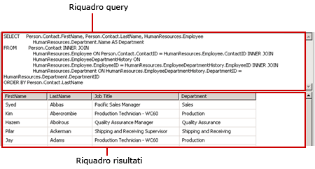
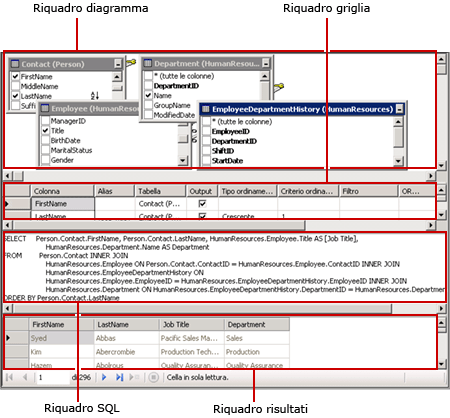
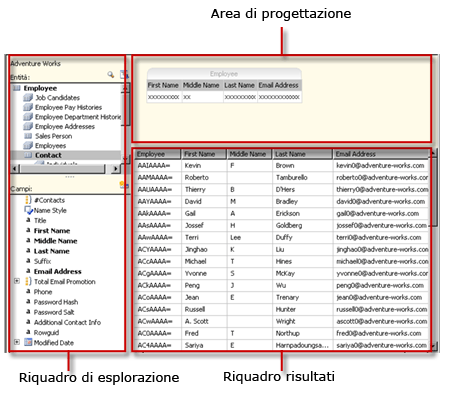
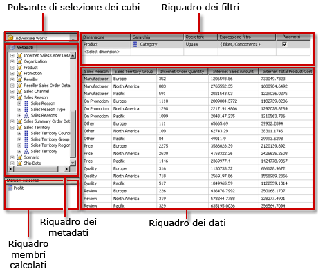
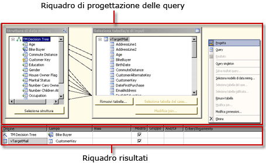
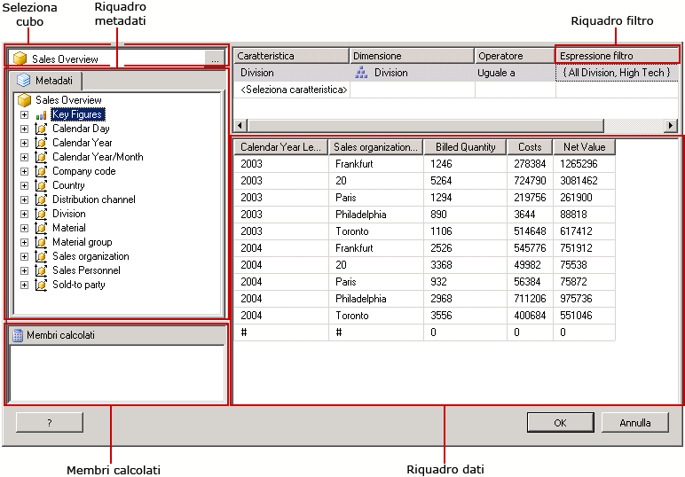
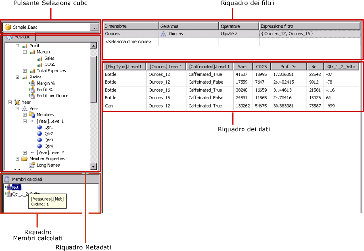

# Strumenti di progettazione query (SSRS)
  [!INCLUDE[ssRSnoversion](../../includes/ssrsnoversion-md.md)] include svariati strumenti per la progettazione di query che è possibile usare per creare query sui set di dati in Progettazione report. Alcuni strumenti di progettazione query offrono modalità alternative che consentono di scegliere se lavorare in modalità visiva o direttamente nel linguaggio query. In questo argomento si illustrano tutti gli strumenti disponibili e si descrivono i tipi di origine dei dati supportati da ognuno di essi. Vengono quindi descritti gli strumenti seguenti:  
  
-   [Finestra Progettazione query basata su testo](#Textbased)  
  
-   [Finestra Progettazione query con interfaccia grafica](#Graphical)  
  
-   [Progettazione query modelli di report](#Model)  
  
-   [Progettazione query MDX](#MDX)  
  
-   [Progettazione query DMX](#DMX)  
  
-   [Progettazione query SapNetWeaver BI](#SAPBW)  
  
-   [Progettazione query Hyperion Essbase [Reporting Services]](#Hyperion)  
  
 Quando si usa un modello di progetto Server report o una procedura guidata Server report, tutti gli strumenti di progettazione query vengono eseguiti nell'ambiente di progettazione dati di [!INCLUDE[ssBIDevStudioFull](../../includes/ssbidevstudiofull-md.md)] . Per altre informazioni sugli strumenti di progettazione query, vedere [Strumenti di progettazione query in Reporting Services](http://msdn.microsoft.com/library/07efd3f1-804f-45f7-b62a-3e727a3d9835).  
  
 La disponibilità di un particolare strumento di progettazione query dipende dal tipo di origine dei dati utilizzato.  
  
 I tipi di origine dati disponibili nel report sono determinati dalle estensioni per i dati di [!INCLUDE[ssRSnoversion](../../includes/ssrsnoversion-md.md)] installate nel client o nel server di report. Per altre informazioni, vedere [File di configurazione RSReportDesigner](../../reporting-services/report-server/rsreportdesigner-configuration-file.md) e [File di configurazione RsReportServer.config](../../reporting-services/report-server/rsreportserver-config-configuration-file.md).  
  
 Un'estensione per l'elaborazione dati e la relativa finestra Progettazione query possono presentare differenze per quanto riguarda il supporto delle origini dati nei modi seguenti:  
  
-   **In base al tipo di finestra Progettazione query** Ad esempio, un'origine dati [!INCLUDE[ssNoVersion](../../includes/ssnoversion-md.md)] supporta entrambi i tipi di progettazione, con interfaccia grafica e basata su testo.  
  
-   **In base alla differenza nel linguaggio di query.** Un linguaggio di query come [!INCLUDE[tsql](../../includes/tsql-md.md)] , ad esempio, può presentare differenze nella sintassi a seconda del tipo di origine dati, mentre la sintassi dei linguaggi [!INCLUDE[msCoName](../../includes/msconame-md.md)] [!INCLUDE[tsql](../../includes/tsql-md.md)] e Oracle SQL presenta alcune differenze in un comando di query.  
  
-   **In base al supporto per la parte indicante lo schema di un nome di oggetto di database.** Se un'origine dei dati prevede l'utilizzo degli schemi negli identificatori di oggetto di database, è necessario specificare il nome dello schema nella query per gli eventuali nomi che non utilizzano lo schema predefinito. Ad esempio, `SELECT FirstName, LastName FROM [Person].[Person]`.  
  
-   **In base al supporto per i parametri di query.** Il supporto dei parametri varia a seconda del provider di dati. Alcuni provider di dati supportano i parametri denominati, ad esempio `SELECT Col1, Col2 FROM Table WHERE <parameter identifier><parameter name> = <value>`. Altri supportano invece i parametri senza nome, ad esempio `SELECT Col1, Col2 FROM Table WHERE <column name> = ?`. L'identificatore di parametro può variare a seconda del provider di dati. In [!INCLUDE[ssNoVersion](../../includes/ssnoversion-md.md)] viene ad esempio usato il simbolo @, mentre in Oracle vengono usati due punti (:). Alcuni provider di dati non supportano parametri.  
  
-   **In base alla possibilità di importare query.** Per un'origine dati [!INCLUDE[ssNoVersion](../../includes/ssnoversion-md.md)] è ad esempio possibile importare una query da un file di definizione di report (con estensione rdl) o da un file sql.  
  
##   Finestra Progettazione query basata su testo  
 La finestra Progettazione query basata su testo è lo strumento di compilazione di query predefinito per la maggior parte delle origini dati relazionali supportate, incluse [!INCLUDE[msCoName](../../includes/msconame-md.md)] [!INCLUDE[ssNoVersion](../../includes/ssnoversion-md.md)], Oracle, Teradata, OLE DB, XML e ODBC. A differenza della finestra Progettazione query con interfaccia grafica, questo strumento non consente di convalidare la sintassi delle query durante la fase di progettazione. Nella figura seguente viene illustrato lo strumento Progettazione query basata su testo.  
  
   
  
 È consigliabile utilizzare la finestra Progettazione query basata su testo per creare query complesse, impiegare stored procedure, eseguire query sui dati XML e scrivere query dinamiche. A seconda dell'origine dei dati, è possibile attivare/disattivare il pulsante **Modifica come testo** sulla barra degli strumenti per passare dalla finestra Progettazione query con interfaccia grafica alla finestra Progettazione query basata su testo e viceversa. Per altre informazioni, vedere [Interfaccia utente di Progettazione query basata su testo](http://msdn.microsoft.com/library/44b7c664-03aa-494e-a484-052b318e810c).  
  
##   Finestra Progettazione query con interfaccia grafica  
 La finestra Progettazione query con interfaccia grafica viene usata per creare o modificare query [!INCLUDE[tsql](../../includes/tsql-md.md)] eseguite su un database relazionale. Questo strumento di progettazione delle query viene utilizzato in diversi prodotti di [!INCLUDE[msCoName](../../includes/msconame-md.md)] e in altri componenti di [!INCLUDE[ssNoVersion](../../includes/ssnoversion-md.md)] . A seconda del tipo di origine dei dati, esso supporta le modalità Text, StoredProcedure e TableDirect. Nella figura seguente viene illustrata la finestra Progettazione query con interfaccia grafica.  
  
   
  
 È possibile fare clic sul pulsante **Modifica come testo** sulla barra degli strumenti per passare dalla finestra Progettazione query con interfaccia grafica alla finestra Progettazione query basata su testo e viceversa. Per altre informazioni, vedere [Interfaccia utente della finestra Progettazione query con interfaccia grafica](../../reporting-services/report-data/graphical-query-designer-user-interface.md).  
  
##   Progettazione query modelli di report  
 Lo strumento Progettazione query modelli di report viene utilizzato per creare o modificare query eseguite su un modello di report SMDL pubblicato in un server di report. I report eseguiti sulla base di modelli supportano l'esplorazione dei dati click-through. La query determina il percorso di questa esplorazione in fase di esecuzione. Nella figura seguente viene illustrato lo strumento Progettazione query modelli di report.  
  
   
  
 Per utilizzare Progettazione query modelli di report, è necessario definire un'origine dei dati che punti a un modello pubblicato. Quando si definisce un set di dati per l'origine dei dati, è possibile aprire la query del set di dati nella finestra Progettazione query modelli di report. La finestra Progettazione query modelli di report può essere utilizzata in modalità grafica o basata su testo. È possibile fare clic sul pulsante **Modifica come testo** sulla barra degli strumenti per passare dalla finestra Progettazione query con interfaccia grafica alla finestra Progettazione query basata su testo e viceversa. Per altre informazioni, vedere [Interfaccia utente della finestra Progettazione query del modello di report](../../reporting-services/report-data/report-model-query-designer-user-interface.md).  
  
##   Progettazione query MDX  
 La finestra Progettazione query MDX (Multidimensional Expression) consente di creare o modificare query eseguite su un'origine dati di [!INCLUDE[ssASnoversion](../../includes/ssasnoversion-md.md)] con cubi multidimensionali. Nella figura seguente viene illustrato lo strumento Progettazione query MDX dopo che la query e il filtro sono stati definiti.  
  
   
  
 Per utilizzare questa finestra, è necessario definire un'origine dei dati che contenga un cubo di Analysis Services valido ed elaborato. Quando si definisce un set di dati per l'origine dei dati, è possibile aprire la query nella finestra Progettazione query MDX. Se necessario, utilizzare i pulsanti MDX e DMX sulla barra degli strumenti per passare dalla modalità MDX a DMX e viceversa. Per altre informazioni, vedere [Interfaccia utente di Progettazione query MDX di Analysis Services](../../reporting-services/report-data/analysis-services-mdx-query-designer-user-interface.md).  
  
##   Progettazione query DMX  
 La finestra Progettazione query DMX (Data Mining Prediction Expression) consente di creare o modificare query in esecuzione su un'origine dati di [!INCLUDE[ssASnoversion](../../includes/ssasnoversion-md.md)] con modelli di data mining. Nella figura seguente viene illustrato lo strumento Progettazione query DMX dopo che il modello e le tabelle di input sono state selezionate.  
  
   
  
 Per utilizzare la Progettazione query DMX, è necessario definire un'origine dei dati che includa un modello di data mining valido e disponibile. Quando si definisce un set di dati per l'origine dei dati, è possibile aprire la query nella finestra Progettazione query DMX. Se necessario, utilizzare i pulsanti MDX e DMX sulla barra degli strumenti per passare dalla modalità MDX a DMX e viceversa. Dopo aver selezionato il modello, è possibile creare query di stima di data mining che forniscano dati a un report. Per altre informazioni, vedere [Interfaccia utente di Progettazione query DMX di Analysis Services](../../reporting-services/report-data/analysis-services-dmx-query-designer-user-interface.md).  
  
##   Progettazione query Sap NetWeaver BI  
 La finestra Progettazione query [!INCLUDE[SAP_DPE_BW_1](../../includes/sap-dpe-bw-1-md.md)] consente di recuperare dati da un database di [!INCLUDE[SAP_DPE_BW_1](../../includes/sap-dpe-bw-1-md.md)] . Per usarla, è necessario disporre di un'origine dei dati di [!INCLUDE[SAP_DPE_BW_1](../../includes/sap-dpe-bw-1-md.md)] che includa almeno una query InfoCube, MultiProvider o Web definita. Nella figura seguente viene illustrato lo strumento Progettazione query [!INCLUDE[SAP_DPE_BW_1](../../includes/sap-dpe-bw-1-md.md)] . Per altre informazioni, vedere [Interfaccia utente di Progettazione query SAP NetWeaver BI](../../reporting-services/report-data/sap-netweaver-bi-query-designer-user-interface.md).  
  
   
  
##   Progettazione query Hyperion Essbase [Reporting Services]  
 Progettazione query [!INCLUDE[extEssbase](../../includes/extessbase-md.md)] consente di recuperare dati da un database e applicazioni di [!INCLUDE[extEssbase](../../includes/extessbase-md.md)] . Nella figura seguente viene illustrato lo strumento Progettazione query [!INCLUDE[extEssbase](../../includes/extessbase-md.md)] .  
  
   
  
 Per utilizzarla, è necessario disporre di un'origine dei dati di [!INCLUDE[extEssbase](../../includes/extessbase-md.md)] che disponga di almeno un database.  
  
 Per altre informazioni, vedere [Interfaccia utente di Progettazione query Hyperion Essbase](../../reporting-services/report-data/hyperion-essbase-query-designer-user-interface.md).  
  
## Vedere anche  
 [Strumenti di Reporting Services](../../reporting-services/tools/reporting-services-tools.md)   
 [Set di dati del report &#40;SSRS&#41;](../../reporting-services/report-data/report-datasets-ssrs.md)   
 [Connessioni dati, origini dati e stringhe di connessione &#40;Generatore report e SSRS&#41;](../../reporting-services/report-data/data-connections-data-sources-and-connection-strings-report-builder-and-ssrs.md)   
 [Esercitazioni su Reporting Services &#40;SSRS&#41;](../../reporting-services/reporting-services-tutorials-ssrs.md)   
 [Origini dei dati supportate da Reporting Services &#40;SSRS&#41;](../../reporting-services/report-data/data-sources-supported-by-reporting-services-ssrs.md)   
 [Creare un'origine dati incorporata o condivisa &#40;SSRS&#41;](http://msdn.microsoft.com/library/b111a8d0-a60d-4c8b-b00a-51644b19c34b)  
  
  
